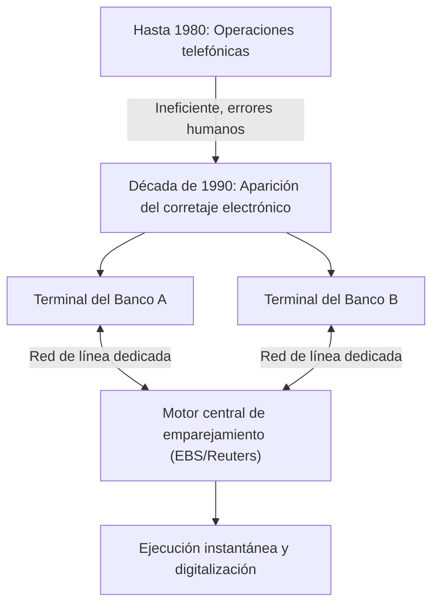

## 1. El nacimiento de un mercado financiero gigante

El FX (Foreign Exchange: mercado de divisas) es un producto financiero ampliamente popularizado incluso entre los inversores individuales, pero su base, el "mercado de divisas", tiene características fundamentalmente diferentes a las del mercado de valores.
No existe una bolsa de valores específica (como la Bolsa de Tokio o la de Nueva York), sino que es un mercado de red gigante "Over-The-Counter (OTC: mercado extrabursátil)" donde los bancos e instituciones financieras de todo el mundo compran y venden divisas directamente a través de redes informáticas.

El volumen de operaciones diario supera los 7 billones de dólares, y este mercado, que cuenta con la mayor liquidez del mundo, ¿cómo se formó y cómo ha sido transformado por la tecnología?

## 2. Historia: El colapso del sistema de Bretton Woods y la transición al sistema de tipos de cambio flotantes

El origen del mercado de FX moderno se encuentra en la gran transformación del sistema financiero internacional en la década de 1970.

Después de la Segunda Guerra Mundial, la economía global mantuvo su estabilidad gracias al "sistema de Bretton Woods (sistema de tipos de cambio fijos)", que utilizaba el dólar estadounidense como moneda de referencia y garantizaba el intercambio entre el dólar y el oro. Era la época de 1 dólar = 360 yenes.
Sin embargo, en 1971, el presidente estadounidense Nixon anunció de forma sorpresiva la suspensión de la convertibilidad del dólar en oro (el Nixon Shock). Esto provocó el colapso del sistema de tipos de cambio fijos y la transición a un "**sistema de tipos de cambio flotantes**", donde el valor de las monedas de cada país cambia momento a momento según la oferta y la demanda del mercado.

Con la fluctuación de los precios de las divisas (tipos de cambio), las empresas comerciales se vieron obligadas a evitar (cubrir) el riesgo de fluctuación cambiaria y, al mismo tiempo, se activaron las transacciones especulativas que buscaban obtener ganancias "comprando barato y vendiendo caro". Este fue el comienzo del mercado de divisas moderno.

## 3. La intervención de la tecnología: La aparición del corretaje electrónico

Hasta la década de 1980, las operaciones de divisas se realizaban principalmente por "teléfono". Era un mundo extremadamente analógico y humano, donde los operadores sostenían varios teléfonos a la vez y gritaban las tasas en voz alta mientras buscaban contrapartes comerciales.

Lo que cambió drásticamente este mundo fue el "**sistema de corretaje electrónico (como EBS y Reuters Matching)**" que apareció a principios de la década de 1990.

Las terminales bancarias de todo el mundo se conectaron mediante redes de líneas dedicadas y los tipos de cambio comenzaron a mostrarse en tiempo real en las pantallas. En lugar de hacer llamadas telefónicas, los operadores ahora podían ejecutar operaciones de millones de dólares al instante con solo presionar un teclado.
Esto aumentó drásticamente la transparencia del mercado y redujo de forma radical los costos de transacción (spread: la diferencia entre el precio de compra y el de venta).

## 4. La revolución de Internet y la entrada de los inversores individuales (FX minorista)

A finales de la década de 1990, con la popularización de Internet, aparecieron nuevos participantes en el mercado de divisas: nosotros, los inversores individuales.

Hasta entonces, el mercado de divisas era un mundo cerrado y exclusivo para profesionales conocido como el mercado interbancario (mercado entre bancos), y la unidad mínima de transacción era normalmente de 1 millón de dólares.
Sin embargo, las empresas de corretaje en línea comenzaron el negocio del "FX minorista", donde las grandes transacciones del mercado interbancario se dividían en partes más pequeñas y se ofrecían a los particulares a través de Internet. Además, mediante el uso de un mecanismo de "margen (apalancamiento)", se hizo posible realizar grandes transacciones incluso con una pequeña cantidad de fondos.

En Japón, con la revisión de la Ley de Control de Divisas en 1998, las transacciones de FX para particulares se liberalizaron por completo, y los inversores individuales japoneses, conocidos como "Mrs. Watanabe", crecieron hasta convertirse en una presencia enorme que no podía ser ignorada en el mercado mundial de FX.

## 5. El trading algorítmico y el auge del HFT (Trading de Alta Frecuencia)

A partir de la década de 2000, la digitalización de los mercados financieros entró en una nueva dimensión. Hubo un cambio de las transacciones basadas en la discreción humana (intuición y experiencia) al "**trading algorítmico (trading automatizado)**", donde los programas informáticos toman automáticamente las decisiones de compra y venta.

Dentro del trading algorítmico, el que ha llevado la velocidad al límite es el "**HFT (High Frequency Trading: Trading de Alta Frecuencia)**".

A los operadores de HFT no les importan en absoluto los fundamentos corporativos ni las tendencias económicas a largo plazo. Lo que buscan son las "distorsiones de precios (arbitraje)" que ocurren entre varios mercados durante apenas unos pocos milisegundos (milésimas de segundo).

* **Colocation (Ventaja de ubicación)**: Lo que decide el éxito o el fracaso del HFT es el retraso en la comunicación (latencia). Para ellos, que incluso sienten que la velocidad de la luz a través de los cables de fibra óptica es lenta, colocan directamente (colocation) sus propios servidores dentro del centro de datos donde se encuentran los servidores de la bolsa de valores. Al acortar la longitud física del cable incluso en unos pocos metros, buscan entregar sus órdenes 1 microsegundo (una millonésima de segundo) más rápido que otras empresas.
* **Procesamiento de hardware mediante FPGA**: Dado que el procesamiento con CPU normales y programas de software sigue siendo demasiado lento, incluso se ha introducido la tecnología de grabar los algoritmos de trading directamente en los circuitos de chips semiconductores personalizados llamados FPGA (Field Programmable Gate Array) para procesar las órdenes a nivel de hardware.

## 6. Flash Crash: Los nuevos riesgos creados por la tecnología

Si bien el trading algorítmico tiene el mérito de haber proporcionado liquidez masiva (contrapartes comerciales) al mercado y haber minimizado los spreads, también ha traído consigo un efecto secundario aterrador. Se trata del "**Flash Crash (Caída repentina)**".

Cuando ocurre alguna orden anormal o una noticia inesperada en el mercado, innumerables IA y algoritmos determinan simultáneamente que existe un "peligro" y, a una velocidad de milisegundos, inundan el mercado con órdenes de venta o retiran la liquidez. En los últimos años, ha ocurrido repetidas veces el fenómeno en el que el tipo de cambio se desploma en cuestión de minutos, sin dejar tiempo para que los operadores humanos entiendan la situación, para luego recuperarse rápidamente como si nada hubiera pasado.

## 7. Resumen

La historia del FX es la historia misma de la evolución de la tecnología, donde los protagonistas han cambiado de lo analógico a lo digital, y de los humanos a las máquinas.
Comenzó con la decisión política del colapso del sistema de Bretton Woods, seguido de la integración de los mercados mediante redes electrónicas, la participación de los individuos a través de Internet y, finalmente, la era del trading ultrarrápido impulsado por algoritmos.

En la actualidad, ha evolucionado hasta la etapa en que la IA, que utiliza el aprendizaje profundo (deep learning) y el procesamiento del lenguaje natural, analiza instantáneamente artículos de noticias y declaraciones de los presidentes de los bancos centrales para ejecutar operaciones.
El mercado de divisas, donde se mueven enormes cantidades de riqueza, continuará siendo la vanguardia de la competencia tecnológica de la humanidad, donde la informática de última generación y la ingeniería financiera colisionan de frente.
