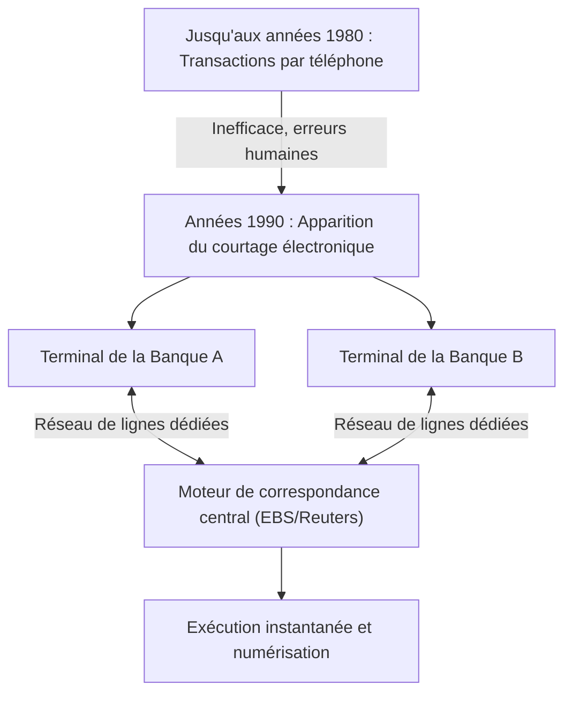

## 1. La naissance d'un marché financier gigantesque

Le FX (Foreign Exchange : marché des changes ou Forex) est un produit financier largement répandu même parmi les investisseurs particuliers au Japon, mais le « marché des changes » qui lui sert de base possède des caractéristiques fondamentalement différentes du marché boursier.
Il n'existe pas de bourse spécifique (comme la Bourse de Tokyo ou la Bourse de New York). C'est un gigantesque marché en réseau « de gré à gré » (OTC : Over The Counter) où les banques et les institutions financières du monde entier achètent et vendent des devises directement via des réseaux informatiques.

Avec un volume de transactions quotidien dépassant les 7 000 milliards de dollars et bénéficiant de la plus grande liquidité au monde, comment ce marché s'est-il formé et comment a-t-il été transformé par la technologie ?

## 2. Histoire : L'effondrement du système de Bretton Woods et la transition vers les taux de change flottants

L'origine du marché FX moderne réside dans le grand bouleversement du système financier international des années 1970.

Après la Seconde Guerre mondiale, l'économie mondiale était stabilisée par le « système de Bretton Woods (système de taux de change fixe) », qui reposait sur le dollar américain comme monnaie de réserve et garantissait la convertibilité du dollar en or. C'était l'époque où 1 dollar valait 360 yens.
Cependant, en 1971, le président américain Nixon a annoncé à la surprise générale la suspension de la convertibilité du dollar en or (le choc Nixon). En conséquence, le système de taux de change fixe s'est effondré et la valeur des devises de chaque pays a basculé vers un « **système de taux de change flottant** », où elle fluctue constamment en fonction de l'offre et de la demande du marché.

Avec la fluctuation du prix des devises (taux de change), les entreprises commerciales ont été contraintes de se couvrir (hedging) contre le risque de change, tandis que les transactions spéculatives visant à réaliser des bénéfices en « achetant bas et vendant haut » se sont intensifiées. C'est ainsi que s'est ouvert le marché des changes moderne.

## 3. L'intervention de la technologie : L'avènement du courtage électronique

Jusqu'aux années 1980, les transactions de change s'effectuaient principalement par « téléphone ». C'était un monde extrêmement analogique et humain, où les courtiers tenaient plusieurs combinés à la fois et criaient les taux à voix haute pour trouver des contreparties.

Ce monde a été radicalement transformé par l'apparition, au début des années 1990, des « **systèmes de courtage électronique (comme EBS et Reuters Matching)** ».

Les terminaux des banques du monde entier ont été connectés via des réseaux de lignes dédiées, et les taux de change ont commencé à s'afficher en temps réel sur les écrans. Au lieu de passer des appels téléphoniques, les courtiers ont pu conclure des transactions de plusieurs millions de dollars instantanément, simplement en tapant sur un clavier.
Grâce à cela, la transparence du marché a considérablement augmenté et les coûts de transaction (le spread : la différence entre le prix d'achat et le prix de vente) se sont drastiquement réduits.

## 4. La révolution Internet et l'entrée des investisseurs particuliers (Retail FX)

À la fin des années 1990, avec la démocratisation d'Internet, de nouveaux acteurs sont apparus sur le marché du FX : nous, les investisseurs particuliers.

Auparavant, le marché des changes était un monde fermé réservé aux professionnels, appelé marché interbancaire, où l'unité de transaction minimale était généralement de 1 million de dollars (environ 100 millions de yens).
Cependant, les sociétés de courtage en ligne ont commencé à proposer des activités de « Retail FX », divisant les transactions à grande échelle du marché interbancaire en plus petites parts pour les offrir aux particuliers via Internet. De plus, l'utilisation du mécanisme de « marge (effet de levier) » a permis de réaliser des transactions importantes avec un faible capital.

Au Japon, la révision de la loi sur les changes en 1998 a complètement libéralisé les transactions FX pour les particuliers, et la classe des investisseurs particuliers japonais, surnommée « Mrs. Watanabe », est devenue une présence massive incontournable sur le marché mondial du FX.

## 5. L'essor du trading algorithmique et du HFT (Trading Haute Fréquence)

À partir des années 2000, l'informatisation des marchés financiers a franchi une nouvelle étape. Il s'agit du passage de transactions basées sur le jugement humain (intuition et expérience) au « **trading algorithmique (trading automatisé)** », où des programmes informatiques prennent automatiquement les décisions d'achat et de vente.

Parmi le trading algorithmique, celui qui pousse la vitesse à son paroxysme est le « **HFT (High Frequency Trading : Trading Haute Fréquence)** ».

Les sociétés de HFT ne se soucient absolument pas des fondamentaux des entreprises ou des tendances économiques à long terme. Ce qu'elles visent, ce sont les « distorsions de prix (arbitrage) » qui se produisent entre plusieurs marchés pendant seulement quelques millisecondes (millièmes de seconde).

* **Colocation (L'avantage de l'emplacement)** : Ce qui détermine la victoire ou la défaite dans le HFT, c'est la latence (le délai de communication). Trouvant même la vitesse de la lumière à travers les fibres optiques trop lente, ils placent directement leurs propres serveurs (colocation) dans les centres de données où sont hébergés les serveurs des bourses. C'est pour réduire la longueur physique des câbles, ne serait-ce que de quelques mètres, afin de faire parvenir les ordres 1 microseconde (un millionième de seconde) plus tôt que leurs concurrents.
* **Traitement matériel par FPGA** : Même le traitement par des processeurs (CPU) classiques et des programmes logiciels étant trop lent, des technologies sont déployées pour graver les algorithmes de trading directement dans les circuits d'une puce semi-conductrice sur mesure appelée FPGA (Field Programmable Gate Array), afin de traiter les ordres au niveau matériel.

## 6. Flash Crash : Les nouveaux risques engendrés par la technologie

Si le trading algorithmique a eu le mérite d'apporter une liquidité massive au marché et de minimiser les spreads, il a également entraîné de redoutables effets secondaires. Il s'agit du « **Flash Crash (krach instantané)** ».

Lorsqu'un ordre anormal ou une nouvelle inattendue survient sur le marché, d'innombrables IA et algorithmes jugent simultanément que c'est « dangereux » et déversent des ordres de vente ou retirent des liquidités à une vitesse de l'ordre de la milliseconde. Le phénomène où les taux de change s'effondrent de plusieurs yens en quelques minutes avant que les courtiers humains n'aient le temps d'évaluer la situation, pour ensuite rebondir rapidement comme si de rien n'était, s'est produit à plusieurs reprises ces dernières années.

## 7. Résumé

L'histoire du FX est l'histoire même de l'évolution technologique, passant de l'analogique au numérique et de l'homme à la machine.
Elle a commencé par la décision politique de l'effondrement du système de Bretton Woods, a conduit à l'intégration des marchés via les réseaux électroniques, à l'entrée des particuliers grâce à Internet, et à l'ère du trading ultra-rapide par des algorithmes.

Aujourd'hui, l'IA utilisant l'apprentissage profond (Deep Learning) et le traitement du langage naturel a évolué au point de lire instantanément les articles d'actualité et les discours des gouverneurs des banques centrales pour effectuer des transactions.
Le marché des changes, où des fortunes colossales sont en mouvement, continuera probablement d'être à la pointe de la compétition technologique humaine, où s'affrontent les dernières avancées de l'informatique et de l'ingénierie financière.
