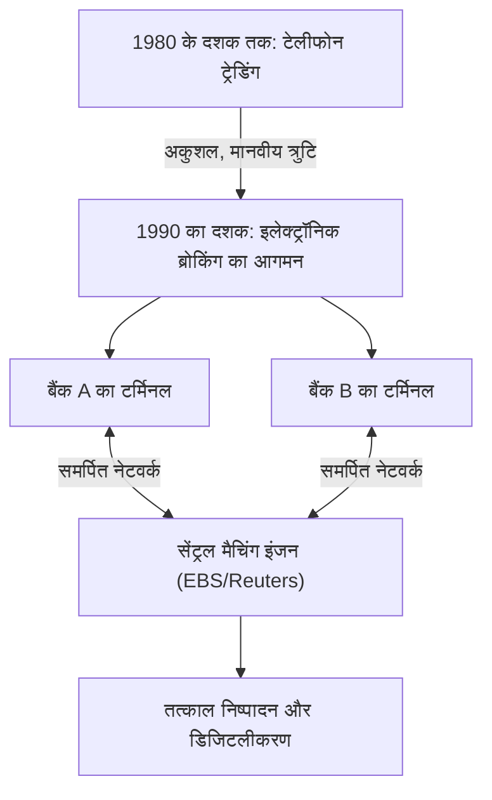

## 1. एक विशाल वित्तीय बाजार का जन्म

FX (Foreign Exchange: विदेशी मुद्रा व्यापार) एक वित्तीय उत्पाद है जिसका जापान में भी व्यक्तिगत निवेशकों द्वारा व्यापक रूप से उपयोग किया जाता है, लेकिन "विदेशी मुद्रा बाजार" जो इसकी नींव है, शेयर बाजार से मौलिक रूप से अलग विशेषताएं रखता है।
कोई विशिष्ट एक्सचेंज (जैसे टोक्यो स्टॉक एक्सचेंज या न्यूयॉर्क स्टॉक एक्सचेंज) नहीं है, बल्कि यह एक "ओवर-द-काउंटर (OTC)" विशाल नेटवर्क बाजार है जहां दुनिया भर के बैंक और वित्तीय संस्थान सीधे कंप्यूटर नेटवर्क के माध्यम से मुद्राएं खरीदते और बेचते हैं।

प्रति दिन लगभग 7 ट्रिलियन डॉलर (लगभग 1000 ट्रिलियन येन) के ट्रेडिंग वॉल्यूम और दुनिया में सबसे अधिक तरलता (liquidity) के साथ, यह बाजार कैसे बना और तकनीक ने इसे कैसे बदल दिया?

## 2. इतिहास: ब्रेटन वुड्स प्रणाली का पतन और फ्लोटिंग एक्सचेंज दर प्रणाली में संक्रमण

आधुनिक FX बाजार की उत्पत्ति 1970 के दशक में अंतर्राष्ट्रीय वित्तीय प्रणाली में हुए बड़े बदलाव में है।

द्वितीय विश्व युद्ध के बाद, विश्व अर्थव्यवस्था ने अमेरिकी डॉलर को अपनी आरक्षित मुद्रा के रूप में इस्तेमाल किया और "ब्रेटन वुड्स प्रणाली (निश्चित विनिमय दर प्रणाली)" द्वारा स्थिरता बनाए रखी गई, जिसने डॉलर और सोने के विनिमय की गारंटी दी। यह 1 डॉलर = 360 येन का युग था।
हालाँकि, 1971 में, अमेरिकी राष्ट्रपति निक्सन ने अचानक डॉलर और सोने के विनिमय को निलंबित करने की घोषणा की (निक्सन शॉक)। इसके परिणामस्वरूप, निश्चित विनिमय दर प्रणाली ढह गई, और मुद्राओं का मूल्य " **फ्लोटिंग एक्सचेंज दर प्रणाली (Floating exchange rate system)** " में बदल गया, जो बाजार की आपूर्ति और मांग के अनुसार पल-पल बदलता है।

मुद्राओं की कीमतों (विनिमय दरों) में उतार-चढ़ाव शुरू होने के साथ, ट्रेडिंग कंपनियों को विनिमय दर के उतार-चढ़ाव के जोखिमों से बचने (हेजिंग) की आवश्यकता का सामना करना पड़ा, और साथ ही, "सस्ते में खरीदने और महंगे में बेचने" से लाभ कमाने के उद्देश्य से सट्टा व्यापार सक्रिय हो गया। यह आधुनिक विदेशी मुद्रा बाजार की शुरुआत थी।

## 3. तकनीकी हस्तक्षेप: इलेक्ट्रॉनिक ब्रोकिंग का आगमन

1980 के दशक तक, विदेशी मुद्रा व्यापार मुख्य रूप से "टेलीफोन" पर किया जाता था। यह एक बेहद एनालॉग और मानवीय दुनिया थी जहाँ डीलर कई रिसीवर पकड़ते थे और ज़ोर से रेट चिल्लाते हुए ट्रेडिंग पार्टनर ढूँढते थे।

इस दुनिया को नाटकीय रूप से " **इलेक्ट्रॉनिक ब्रोकिंग सिस्टम (जैसे EBS और Reuters Matching)** " ने बदल दिया जो 1990 के दशक की शुरुआत में दिखाई दिया।

दुनिया भर के बैंकों के टर्मिनल एक समर्पित लाइन नेटवर्क से जुड़ गए, जिससे विनिमय दरें स्क्रीन पर वास्तविक समय (real-time) में प्रदर्शित होने लगीं। टेलीफोन कॉल करने के बजाय, डीलर अब केवल कीबोर्ड पर टैप करके तुरंत लाखों डॉलर का व्यापार निष्पादित कर सकते थे।
इससे बाजार की पारदर्शिता में उल्लेखनीय वृद्धि हुई और ट्रेडिंग लागत (स्प्रेड: खरीद और बिक्री मूल्य के बीच का अंतर) में भारी कमी आई।

## 4. इंटरनेट क्रांति और खुदरा निवेशकों (Retail FX) का प्रवेश

1990 के दशक के उत्तरार्ध में, इंटरनेट के प्रसार के साथ, FX बाजार में नए प्रतिभागी सामने आए। ये हम, व्यक्तिगत निवेशक थे।

उस समय तक, विदेशी मुद्रा बाजार पेशेवरों तक सीमित एक बंद दुनिया थी जिसे इंटरबैंक बाजार (बैंकों के बीच का बाजार) कहा जाता था, और ट्रेडिंग की न्यूनतम इकाई आमतौर पर 1 मिलियन डॉलर (लगभग 100 मिलियन येन) या अधिक थी।
हालाँकि, ऑनलाइन ब्रोकरेज फर्मों ने "रिटेल FX" व्यवसाय शुरू किया, जहाँ उन्होंने इंटरबैंक बाजार में बड़े ट्रेडों को छोटे-छोटे टुकड़ों में बाँटा और इंटरनेट के माध्यम से व्यक्तियों को पेश किया। इसके अलावा, "मार्जिन (लिवरेज)" की प्रणाली का उपयोग करके थोड़ी मात्रा में धन के साथ भी बड़े ट्रेड करना संभव हो गया।

जापान में, 1998 में विदेशी मुद्रा और विदेश व्यापार अधिनियम (Foreign Exchange and Foreign Trade Act) के संशोधन के साथ व्यक्तिगत FX ट्रेडिंग पूरी तरह से उदार हो गई, और "मिसेज वातानाबे" नामक जापानी व्यक्तिगत निवेशक वैश्विक FX बाजार में एक विशाल और महत्वपूर्ण उपस्थिति के रूप में उभरे।

## 5. एल्गोरिथम ट्रेडिंग और HFT (हाई-फ्रीक्वेंसी ट्रेडिंग) का उदय

2000 के दशक के बाद से, वित्तीय बाजारों के आईटी-करण ने एक नया आयाम लिया है। यह मानव विवेक (अंतर्ज्ञान और अनुभव) पर आधारित ट्रेडिंग से " **एल्गोरिथम ट्रेडिंग (स्वचालित ट्रेडिंग)** " की ओर एक बदलाव है, जहां कंप्यूटर प्रोग्राम स्वचालित रूप से खरीदने और बेचने के निर्णय लेते हैं।

एल्गोरिथम ट्रेडिंग के बीच, " **HFT (हाई-फ्रीक्वेंसी ट्रेडिंग)** " ने गति को अपनी सीमा तक धकेल दिया।

HFT कंपनियां कंपनियों के मूल सिद्धांतों या दीर्घकालिक आर्थिक रुझानों की बिल्कुल परवाह नहीं करती हैं। वे केवल "मूल्य विसंगतियों (आर्बिट्रेज)" का लक्ष्य रखते हैं जो कई बाजारों के बीच केवल कुछ मिलीसेकंड (एक सेकंड का हजारवां हिस्सा) के लिए होती हैं।

* **कोलोकेशन (Colocation - स्थान का लाभ)**: HFT की सफलता या विफलता संचार विलंब (लेटेंसी) द्वारा निर्धारित की जाती है। उनके लिए ऑप्टिकल फाइबर से गुजरने वाले प्रकाश की गति भी धीमी लगती है, इसलिए वे सीधे अपने सर्वर को उसी डेटा सेंटर (कोलोकेशन) में रखते हैं जहाँ एक्सचेंज का सर्वर स्थित होता है। ऐसा भौतिक केबल की लंबाई को कुछ मीटर कम करने के लिए किया जाता है ताकि ऑर्डर अन्य कंपनियों की तुलना में 1 माइक्रोसेकंड (एक सेकंड का दस लाखवां हिस्सा) तेजी से पहुंचाए जा सकें।
* **FPGA के साथ हार्डवेयर प्रोसेसिंग**: चूंकि सामान्य CPU और सॉफ्टवेयर प्रोग्राम का उपयोग करके प्रोसेसिंग भी बहुत धीमी होती है, ट्रेडिंग एल्गोरिदम को सीधे कस्टम सेमीकंडक्टर चिप्स (custom semiconductor chips) के सर्किट में बर्न किया जाता है जिसे FPGA (Field Programmable Gate Array) कहा जाता है। हार्डवेयर स्तर पर ऑर्डर प्रोसेस करने की तकनीक तक लागू की जाती है।

## 6. फ्लैश क्रैश: तकनीक से उत्पन्न नए जोखिम

एल्गोरिथम ट्रेडिंग ने बाजार को भारी मात्रा में तरलता (liquidity) प्रदान की है और स्प्रेड (spreads) को कम किया है, लेकिन इसके भयानक दुष्प्रभाव भी हुए हैं। यह है " **फ्लैश क्रैश (Flash Crash - क्षणिक भारी गिरावट)** "।

जब बाजार में कोई असामान्य ऑर्डर या अप्रत्याशित समाचार होता है, तो अनगिनत AI और एल्गोरिदम एक ही समय में इसे "खतरनाक" मानते हैं, और मिलीसेकंड की गति पर सेल ऑर्डर देते हैं या तरलता वापस लेते हैं। हाल के वर्षों में कई बार ऐसी घटनाएं हुई हैं जहां मानव डीलरों के पास स्थिति को समझने का समय भी नहीं होता है, विनिमय दर कुछ ही मिनटों में कई येन गिर जाती है, और फिर ऐसे तेजी से ठीक हो जाती है जैसे कि कुछ हुआ ही न重ही न हो।

## 7. निष्कर्ष

FX का इतिहास प्रौद्योगिकी विकास का इतिहास है, जिसमें मुख्य भूमिका एनालॉग से डिजिटल और मानव से मशीन में बदल गई है।
इसकी शुरुआत ब्रेटन वुड्स प्रणाली के पतन के राजनीतिक निर्णय के साथ हुई, और फिर इसने इलेक्ट्रॉनिक नेटवर्क के माध्यम से बाजार एकीकरण, इंटरनेट के माध्यम से व्यक्तिगत भागीदारी, और एल्गोरिदम का उपयोग करके अति-उच्च गति वाले व्यापार के युग को देखा।

आज, डीप लर्निंग और प्राकृतिक भाषा प्रसंस्करण (NLP) का उपयोग करने वाले AI इतने विकसित हो गए हैं कि वे तुरंत समाचार लेखों और केंद्रीय बैंक के गवर्नरों के बयानों को पढ़कर व्यापार कर सकते हैं।
विदेशी मुद्रा बाजार, जहां भारी मात्रा में संपत्ति चलती है, मानव तकनीकी प्रतिस्पर्धा में सबसे आगे बना रहेगा, जहां नवीनतम कंप्यूटर विज्ञान और वित्तीय इंजीनियरिंग भविष्य में भी टकराते रहेंगे。
