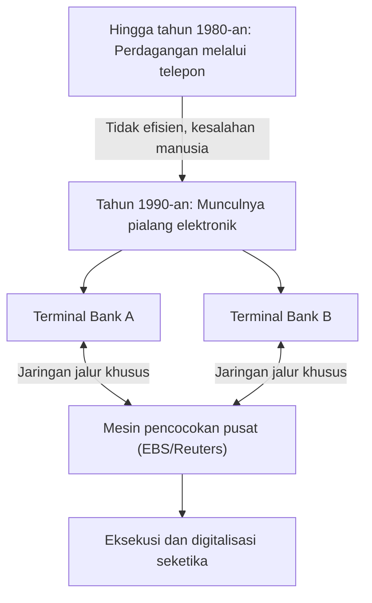

## 1. Lahirnya Pasar Keuangan Raksasa

FX (Foreign Exchange: Perdagangan Margin Valuta Asing) adalah instrumen keuangan yang tersebar luas bahkan di kalangan investor ritel di Jepang, tetapi "pasar valuta asing" yang menjadi fondasinya memiliki karakteristik yang pada dasarnya berbeda dari pasar saham.
Tidak ada bursa pertukaran tertentu (seperti Bursa Efek Tokyo atau Bursa Efek New York), melainkan ini adalah pasar jaringan raksasa "Over-The-Counter (OTC: perdagangan di luar bursa)" di mana bank dan lembaga keuangan di seluruh dunia secara langsung membeli dan menjual mata uang melalui jaringan komputer.

Dengan volume perdagangan harian yang melebihi sekitar 7 triliun dolar (sekitar 1.000 triliun yen), bagaimana pasar yang menawarkan likuiditas terbesar di dunia ini terbentuk, dan bagaimana perkembangannya diubah oleh teknologi?

## 2. Sejarah: Runtuhnya Sistem Bretton Woods dan Transisi ke Sistem Nilai Tukar Mengambang

Titik awal pasar FX modern terletak pada transformasi besar sistem keuangan internasional pada tahun 1970-an.

Setelah Perang Dunia II, ekonomi global mempertahankan stabilitas melalui "sistem Bretton Woods (sistem nilai tukar tetap)", yang menjadikan dolar AS sebagai mata uang cadangan dan menjamin pertukaran dolar dengan emas. Ini adalah era di mana 1 dolar = 360 yen.
Namun, pada tahun 1971, Presiden AS Nixon secara mengejutkan mengumumkan penangguhan pertukaran dolar dengan emas (Guncangan Nixon). Akibatnya, sistem nilai tukar tetap runtuh, dan nilai mata uang masing-masing negara beralih ke "**sistem nilai tukar mengambang**" yang berubah dari waktu ke waktu tergantung pada penawaran dan permintaan pasar.

Karena harga mata uang (nilai tukar) mulai berfluktuasi, perusahaan perdagangan terpaksa menghindari (melindung nilai) risiko fluktuasi nilai tukar, dan pada saat yang sama, perdagangan spekulatif yang bertujuan untuk mendapat untung dengan "membeli pada harga rendah dan menjual pada harga tinggi" menjadi aktif. Inilah awal dari pasar valuta asing modern.

## 3. Intervensi Teknologi: Munculnya Pialang Elektronik

Hingga tahun 1980-an, perdagangan valuta asing terutama dilakukan melalui "telepon". Ini adalah dunia yang sangat analog dan sangat manusiawi, di mana para dealer memegang banyak gagang telepon, meneriakkan nilai tukar dengan suara keras, dan mencari rekan transaksi.

Hal yang secara drastis mengubah dunia ini adalah munculnya "**sistem pialang elektronik (seperti EBS dan Reuters Matching)**" pada awal tahun 1990-an.

Terminal-terminal bank di seluruh dunia terhubung oleh jaringan jalur khusus, dan nilai tukar mulai ditampilkan di layar secara real-time. Alih-alih menelepon, para dealer dapat langsung menyelesaikan transaksi senilai jutaan dolar hanya dengan mengetik di keyboard.
Akibatnya, transparansi pasar meningkat secara dramatis, dan biaya transaksi (spread: selisih antara harga beli dan harga jual) menyusut secara drastis.

## 4. Revolusi Internet dan Masuknya Investor Ritel (FX Ritel)

Pada akhir 1990-an, dengan meluasnya penggunaan internet, peserta baru muncul di pasar FX. Mereka adalah kita, para investor ritel.

Sebelumnya, pasar valuta asing adalah dunia tertutup khusus profesional yang disebut pasar antarbank, dan sudah menjadi hal yang lumrah jika unit perdagangan minimum adalah 1 juta dolar (sekitar 100 juta yen) atau lebih.
Namun, perusahaan sekuritas online mulai membagi transaksi besar di pasar antarbank menjadi lebih kecil dan meluncurkan bisnis "FX ritel" untuk ditawarkan kepada individu melalui internet. Selain itu, dengan menggunakan mekanisme "margin (leverage)", menjadi mungkin untuk melakukan transaksi besar dengan jumlah dana yang kecil.

Di Jepang, perdagangan FX individu sepenuhnya diliberalisasi oleh revisi Undang-Undang Valuta Asing pada tahun 1998, dan kelompok investor ritel Jepang yang dikenal sebagai "Mrs. Watanabe" tumbuh menjadi eksistensi raksasa yang tidak dapat diabaikan di pasar FX global.

## 5. Munculnya Trading Algoritme dan HFT (High-Frequency Trading)

Sejak tahun 2000-an dan seterusnya, TI dalam pasar keuangan telah memasuki dimensi baru. Ini adalah pergeseran dari perdagangan berdasarkan kebijaksanaan manusia (intuisi dan pengalaman) menjadi "**trading algoritme (perdagangan otomatis)**" di mana program komputer secara otomatis membuat keputusan jual dan beli.

Di antara trading algoritme, ada hal yang mengejar kecepatan hingga batas maksimal yang disebut "**HFT (High-Frequency Trading: Perdagangan Frekuensi Tinggi)**".

Pedagang HFT tidak peduli dengan fundamental perusahaan atau tren ekonomi jangka panjang. Apa yang mereka tuju adalah "distorsi harga (arbitrase)" yang terjadi di antara beberapa pasar hanya selama beberapa milidetik (seperseribu detik).

* **Kolokasi (Keunggulan Lokasi)**: Apa yang membedakan kemenangan atau kekalahan dalam HFT adalah keterlambatan komunikasi (latensi). Merasa bahwa bahkan kecepatan cahaya yang melewati serat optik terlalu lambat, mereka menempatkan server mereka sendiri secara langsung (kolokasi) di dalam pusat data tempat server bursa berada. Dengan memperpendek panjang kabel fisik meskipun hanya beberapa meter, mereka dapat mengirimkan pesanan 1 mikrodetik (sepersejuta detik) lebih cepat daripada perusahaan lain.
* **Pemrosesan Perangkat Keras melalui FPGA**: Karena pemrosesan oleh CPU dan program perangkat lunak biasa dianggap terlalu lambat, teknologi bahkan telah diperkenalkan di mana algoritme perdagangan dibakar ke dalam sirkuit chip semikonduktor kustom yang disebut FPGA (Field Programmable Gate Array) untuk memproses pesanan di tingkat perangkat keras.

## 6. Flash Crash: Risiko Baru yang Dihasilkan oleh Teknologi

Sementara trading algoritme dianggap berjasa menyediakan sejumlah besar likuiditas (rekan transaksi) ke pasar dan meminimalkan spread, hal itu juga membawa efek samping yang mengerikan. Itulah "**Flash Crash (Kehancuran Singkat)**".

Ketika pesanan abnormal atau berita tak terduga muncul di pasar, AI dan algoritme yang tak terhitung jumlahnya secara serempak menilainya sebagai "bahaya", membanjiri pasar dengan pesanan jual, atau menarik likuiditas pada kecepatan milidetik. Tanpa memberikan waktu kepada dealer manusia untuk memahami situasinya, nilai tukar bisa anjlok beberapa yen dalam hitungan menit, dan kemudian pulih dengan cepat seolah tidak terjadi apa-apa, sebuah fenomena yang telah berulang kali terjadi dalam beberapa tahun terakhir.

## 7. Kesimpulan

Sejarah FX merupakan sejarah evolusi teknologi itu sendiri, di mana peran utama telah beralih dari analog ke digital, dan dari manusia ke mesin.
Berawal dari keputusan politik runtuhnya sistem Bretton Woods, hal tersebut mengarah pada integrasi pasar oleh jaringan elektronik, masuknya individu melalui internet, dan era perdagangan berkecepatan sangat tinggi oleh algoritme.

Saat ini, AI yang menggunakan pemelajaran mendalam (deep learning) dan pemrosesan bahasa alami (NLP) telah berevolusi ke tahap di mana mereka dapat langsung membaca dan memahami artikel berita atau pernyataan gubernur bank sentral untuk melakukan perdagangan.
Pasar valuta asing, tempat di mana kekayaan dalam jumlah besar berputar, akan terus menjadi garis depan kompetisi teknologi umat manusia, di mana ilmu komputer terbaru dan rekayasa keuangan saling berbenturan di masa depan.
