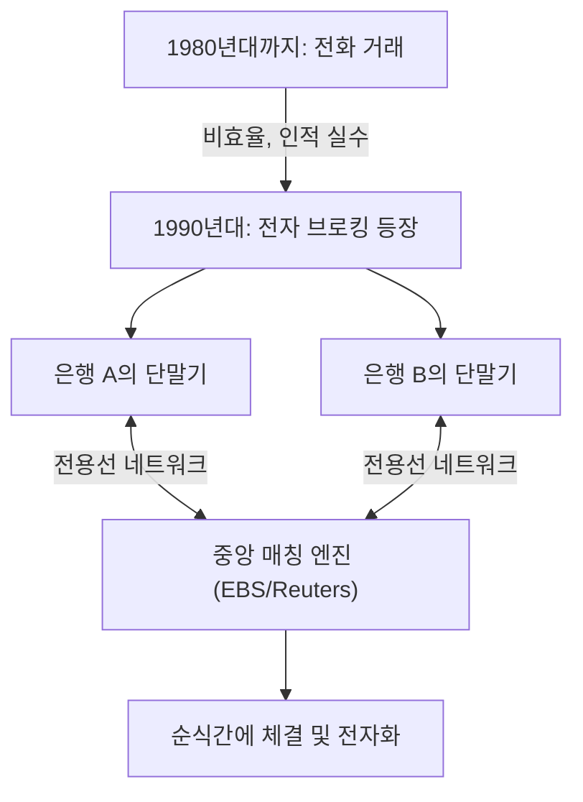

## 1. 거대한 금융시장의 탄생

FX(Foreign Exchange: 외국환증거금거래)는 일본에서도 개인투자자에게 널리 보급된 금융상품이지만, 그 기반이 되는 '외환시장'은 주식시장과는 근본적으로 다른 특징을 가지고 있습니다.
특정한 거래소(도쿄증권거래소나 뉴욕증권거래소 등)가 존재하지 않으며, 전 세계의 은행과 금융기관이 컴퓨터 네트워크를 통해 직접 통화를 매매하는 '오버 더 카운터(OTC: 장외거래)' 형태의 거대한 네트워크 시장입니다.

하루 거래액은 약 7조 달러(약 1000조 엔)를 넘으며, 세계 최대의 유동성을 자랑하는 이 시장은 어떻게 형성되었고, 그리고 기술을 통해 어떻게 변모해 왔을까요.

## 2. 역사: 브레턴우즈 체제의 붕괴와 변동환율제로의 이행

현대 FX 시장의 원점은 1970년대 국제 금융 시스템의 대전환에 있습니다.

제2차 세계대전 이후, 세계 경제는 미국의 달러를 기축으로 삼고, 달러와 금의 교환을 보증하는 '브레턴우즈 체제(고정환율제)'를 통해 안정을 유지하고 있었습니다. 1달러=360엔이던 시대입니다.
하지만 1971년, 미국의 닉슨 대통령이 달러와 금의 교환 정지를 전격적으로 발표합니다(닉슨 쇼크). 이로 인해 고정환율제는 붕괴하고, 각국 통화의 가치는 시장의 수요와 공급에 따라 시시각각 변화하는 ' **변동환율제** '로 이행했습니다.

통화의 가격(환율)이 변동하게 되면서, 무역 기업들은 환차손 위험을 회피(헤지)해야 할 필요성에 직면했고, 동시에 '싸게 사서 비싸게 파는' 방식으로 이익을 노리는 투기적인 거래가 활발해졌습니다. 이것이 현대 외환시장의 막을 올리게 된 계기입니다.

## 3. 기술의 개입: 전자 브로킹의 등장

1980년대까지 외환 거래는 주로 '전화'로 이루어졌습니다. 딜러들이 수화기를 여러 개 쥐고, 큰 소리로 환율을 외치며 거래 상대를 찾는, 매우 아날로그적이고 인간적인 세계였습니다.

이 세계를 극적으로 바꾼 것이 1990년대 초반에 등장한 ' **전자 브로킹 시스템(EBS나 Reuters Matching 등)** '입니다.

전 세계 은행의 단말기가 전용선 네트워크로 연결되어, 화면에 환율이 실시간으로 표시되기 시작했습니다. 딜러는 전화를 거는 대신, 키보드를 두드리는 것만으로 순식간에 수백만 달러의 거래를 성사시킬 수 있게 되었습니다.
이로 인해 시장의 투명성이 비약적으로 높아졌고, 거래 비용(스프레드: 매수 호가와 매도 호가의 차이)은 극적으로 축소되었습니다.

## 4. 인터넷 혁명과 개인투자자(리테일 FX)의 진입

1990년대 후반, 인터넷의 보급으로 인해 FX 시장에 새로운 참가자가 나타났습니다. 바로 우리 같은 개인투자자입니다.

그때까지 외환시장은 인터뱅크 시장(은행 간 시장)이라 불리는 전문가 한정의 폐쇄적인 세계였으며, 거래의 최소 단위도 100만 달러(약 1억 엔) 이상이 당연했습니다.
하지만 온라인 증권사가 인터뱅크 시장의 대량 거래를 소액으로 분할하여, 인터넷을 통해 개인에게 제공하는 '리테일 FX' 비즈니스를 시작했습니다. 나아가 '증거금(레버리지)'이라는 구조를 활용하여 소액의 자금으로도 큰 거래가 가능해졌습니다.

일본에서는 1998년 외환법 개정에 따라 개인의 FX 거래가 완전히 자유화되었고, '미세스 와타나베'라 불리는 일본의 개인투자자층이 세계 FX 시장에서 무시할 수 없는 거대한 존재로 성장했습니다.

## 5. 알고리즘 트레이딩과 HFT(고빈도 매매)의 대두

2000년대 이후, 금융시장의 IT화는 한 차원 더 높은 단계로 진입합니다. 인간의 재량(직감이나 경험)에 의한 거래에서, 컴퓨터 프로그램이 자동으로 매매 판단을 내리는 ' **알고리즘 트레이딩(자동 매매)** '으로의 전환입니다.

알고리즘 트레이딩 중에서도 극한까지 속도를 추구한 것이 ' **HFT(High Frequency Trading: 고빈도 매매)** '입니다.

HFT 업체들은 기업의 펀더멘털이나 장기적인 경제 동향은 전혀 신경 쓰지 않습니다. 그들이 노리는 것은 여러 시장 사이에 발생하는 불과 몇 밀리초(1000분의 1초) 동안만 나타나는 '가격의 왜곡(차익 거래)'입니다.

* **콜로케이션(장소의 우위성)** : HFT의 승패를 가르는 것은 통신의 지연(레이턴시)입니다. 광섬유 속을 통과하는 빛의 속도조차 느리다고 느끼는 그들은, 거래소의 서버가 놓여 있는 데이터센터 안에 자사의 서버를 직접 배치(콜로케이션)합니다. 물리적인 케이블의 길이를 몇 미터라도 줄임으로써 타사보다 1마이크로초(100만분의 1초)라도 빨리 주문을 전달하기 위해서입니다.
* **FPGA를 통한 하드웨어 처리** : 일반적인 CPU와 소프트웨어 프로그램에 의한 처리조차 느리기 때문에, FPGA(Field Programmable Gate Array)라 불리는 커스텀 반도체 칩의 회로 자체에 거래 알고리즘을 새겨 넣어 하드웨어 수준에서 주문을 처리하는 기술까지 도입되고 있습니다.

## 6. 플래시 크래시: 기술이 낳은 새로운 위험

알고리즘 트레이딩은 시장에 대량의 유동성(거래 상대)을 제공하고 스프레드를 극소화했다는 공로가 있는 반면, 무서운 부작용도 가져왔습니다. 그것이 바로 ' **플래시 크래시(순간적인 대폭락)** '입니다.

시장에 어떤 비정상적인 주문이나 예기치 못한 뉴스가 발생했을 때, 무수한 AI나 알고리즘이 일제히 '위험'으로 판단하여 밀리초 단위의 속도로 매도 주문을 쏟아내거나 유동성을 거두어들입니다. 인간 딜러가 상황을 파악할 틈도 없이, 단 몇 분 만에 환율이 몇 엔이나 폭락하고 다시 아무 일 없었다는 듯이 급회복하는 현상이 최근 여러 차례 발생하고 있습니다.

## 7. 요약

FX의 역사는 아날로그에서 디지털로, 인간에서 기계로 주역이 교체되어 온 기술 진화의 역사 그 자체입니다.
브레턴우즈 체제의 붕괴라는 정치적 결정에서 시작되어, 전자 네트워크에 의한 시장 통합, 인터넷에 의한 개인의 진입, 그리고 알고리즘에 의한 초고속 거래의 시대로 이르렀습니다.

현재는 딥러닝과 자연어 처리(NLP)를 이용한 AI가 뉴스 기사나 중앙은행 총재의 발언을 순식간에 해독하여 거래를 수행하는 단계까지 진화하고 있습니다.
거대한 부가 움직이는 외환시장은 앞으로도 최신 컴퓨터 과학과 금융 공학이 격돌하는 인류 기술 경쟁의 최전선으로 남을 것입니다.
