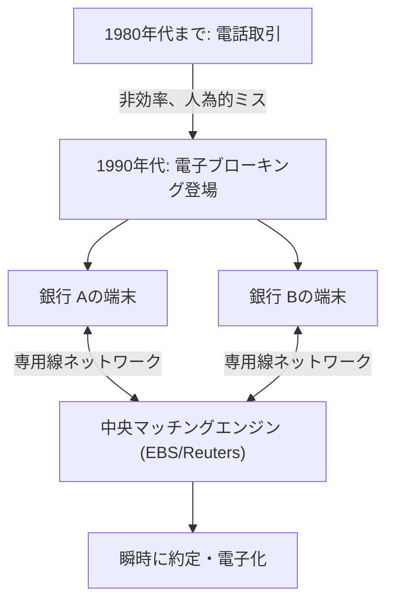

## 1. 巨大な金融市場の誕生

FX（Foreign Exchange：外国為替証拠金取引）は、日本でも個人投資家に広く普及している金融商品ですが、その基盤となる「外国為替市場」は株式市場とは根本的に異なる特徴を持っています。
特定の取引所（東京証券取引所やニューヨーク証券取引所など）が存在せず、世界中の銀行や金融機関がコンピュータネットワークを通じて直接通貨を売買する「オーバー・ザ・カウンター（OTC：店頭取引）」の巨大ネットワーク市場なのです。

1日の取引高は約7兆ドル（約1000兆円）を超え、世界最大の流動性を誇るこの市場は、いかにして形成され、そしてテクノロジーによってどのように変貌を遂げたのでしょうか。

## 2. 歴史：ブレトンウッズ体制の崩壊と変動相場制への移行

現代のFX市場の原点は、1970年代の国際金融システムの大転換にあります。

第二次世界大戦後、世界経済はアメリカのドルを基軸とし、ドルと金の交換を保証する「ブレトンウッズ体制（固定相場制）」によって安定を保っていました。1ドル＝360円という時代です。
しかし、1971年、アメリカのニクソン大統領がドルと金の交換停止を電撃的に発表します（ニクソン・ショック）。これにより固定相場制は崩壊し、各国の通貨の価値は市場の需要と供給によって時々刻々と変化する「**変動相場制**」へと移行しました。

通貨の価格（為替レート）が変動するようになったことで、貿易企業は為替変動リスクを回避（ヘッジ）する必要に迫られ、同時に「安く買って高く売る」ことで利益を狙う投機的な取引が活発化しました。これが現代の外国為替市場の幕開けです。

## 3. テクノロジーの介入：電子ブローキングの登場

1980年代まで、為替取引は主に「電話」で行われていました。ディーラーたちが受話器を何本も握りしめ、大声でレートを叫びながら取引相手を探すという、極めてアナログで人間臭い世界でした。

この世界を劇的に変えたのが、1990年代初頭に登場した「**電子ブローキングシステム（EBSやReuters Matchingなど）**」です。

世界中の銀行の端末が専用線ネットワークで結ばれ、画面上に為替レートがリアルタイムで表示されるようになりました。ディーラーは電話をかける代わりに、キーボードを叩くだけで瞬時に数百万ドルの取引を成立させることができるようになったのです。
これにより、市場の透明性が飛躍的に高まり、取引コスト（スプレッド：買値と売値の差）は劇的に縮小しました。

## 4. インターネット革命と個人投資家（リテールFX）の参入

1990年代後半、インターネットの普及により、FX市場に新たな参加者が現れました。私たち個人投資家です。

それまで、為替市場はインターバンク市場（銀行間市場）と呼ばれるプロ限定の閉鎖的な世界で、取引の最低単位も100万ドル（約1億円）以上が当たり前でした。
しかし、オンライン証券会社がインターバンク市場の大口取引を小口に分割し、インターネットを通じて個人に提供する「リテールFX」ビジネスを開始しました。さらに「証拠金（レバレッジ）」という仕組みを用いることで、少額の資金でも大きな取引が可能になりました。

日本では1998年の外為法改正によって個人のFX取引が完全に自由化され、「ミセス・ワタナベ」と呼ばれる日本の個人投資家層が世界のFX市場において無視できない巨大な存在へと成長しました。

## 5. アルゴリズムトレードとHFT（高頻度取引）の台頭

2000年代以降、金融市場のIT化はさらなる次元へと突入します。人間の裁量（直感や経験）による取引から、コンピュータプログラムが自動で売買判断を下す「**アルゴリズムトレード（自動売買）**」へのシフトです。

アルゴリズムトレードの中でも、極限までスピードを追求したのが「**HFT（High Frequency Trading：高頻度取引）**」です。

HFT業者は、企業のファンダメンタルズや長期的な経済動向は一切気にしません。彼らが狙うのは、複数の市場間に生じるわずか数ミリ秒（1000分の1秒）の間だけ発生する「価格の歪み（アービトラージ）」です。

* **コロケーション（場所の優位性）**: HFTの勝敗を分けるのは、通信の遅延（レイテンシ）です。光ファイバーの中を通る光の速度すら遅く感じる彼らは、取引所のサーバーが置かれているデータセンターの中に、自社のサーバーを直接配置（コロケーション）します。物理的なケーブルの長さを数メートルでも短くすることで、他社よりも1マイクロ秒（100万分の1秒）早く注文を届けるためです。
* **FPGAによるハードウェア処理**: 通常のCPUとソフトウェアプログラムによる処理すら遅いため、FPGA（Field Programmable Gate Array）と呼ばれるカスタム半導体チップの回路自体に取引アルゴリズムを焼き付け、ハードウェアレベルで注文を処理する技術まで投入されています。

## 6. フラッシュ・クラッシュ：テクノロジーが生んだ新たなリスク

アルゴリズムトレードは市場に大量の流動性（取引相手）を提供し、スプレッドを極小化したという功績がある一方で、恐ろしい副作用ももたらしました。それが「**フラッシュ・クラッシュ（瞬間的な大暴落）**」です。

市場で何らかの異常な注文や予期せぬニュースが発生したとき、無数のAIやアルゴリズムが一斉に「危険」と判断し、ミリ秒単位のスピードで売り注文を浴びせたり、流動性を引き上げたりします。人間のディーラーが状況を把握する暇もなく、数分間で為替レートが数円も暴落し、また何事もなかったかのように急回復するという現象が、近年何度も発生しています。

## 7. まとめ

FXの歴史は、アナログからデジタルへ、人間から機械へと主役が交代してきたテクノロジー進化の歴史そのものです。
ブレトンウッズ体制の崩壊という政治的決定から始まり、電子ネットワークによる市場の統合、インターネットによる個人の参入、そしてアルゴリズムによる超高速取引の時代へと至りました。

現在では、深層学習（ディープラーニング）や自然言語処理を用いたAIが、ニュース記事や中央銀行総裁の発言を瞬時に読み解いて取引を行う段階にまで進化しています。
巨大な富が動く為替市場は、今後も最新のコンピュータサイエンスと金融工学が激突する、人類のテクノロジー競争の最前線であり続けるでしょう。