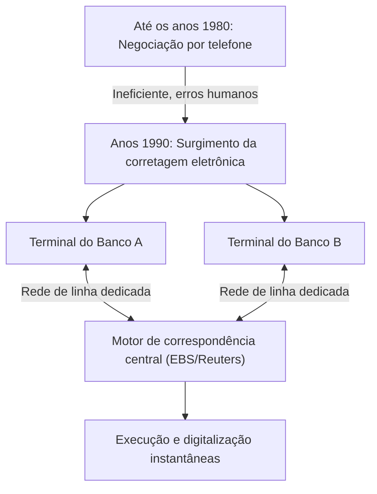

## 1. O Nascimento de um Mercado Financeiro Gigante

O FX (Foreign Exchange: negociação de margem de câmbio) é um produto financeiro amplamente adotado por investidores de varejo no Japão e no mundo, mas o "mercado de câmbio" subjacente possui características fundamentalmente diferentes do mercado de ações.
Não existe uma bolsa de valores específica (como a Bolsa de Valores de Tóquio ou a de Nova York). Em vez disso, é um gigantesco mercado de rede "Over-The-Counter (OTC)", onde bancos e instituições financeiras em todo o mundo compram e vendem moedas diretamente através de redes de computadores.

Com um volume de negociação diário superior a 7 trilhões de dólares, ostentando a maior liquidez do mundo, como esse mercado foi formado e como a tecnologia o transformou?

## 2. História: O Colapso do Sistema de Bretton Woods e a Transição para Taxas de Câmbio Flutuantes

As origens do moderno mercado FX residem em uma grande mudança no sistema financeiro internacional na década de 1970.

Após a Segunda Guerra Mundial, a economia global foi mantida estável pelo "Sistema de Bretton Woods (taxas de câmbio fixas)", que baseava-se no dólar americano e garantia a conversão entre o dólar e o ouro. Era a era de 1 dólar = 360 ienes.
No entanto, em 1971, o presidente dos EUA, Nixon, anunciou repentinamente a suspensão da conversibilidade do dólar em ouro (o Choque Nixon). Como resultado, o sistema de taxas de câmbio fixas entrou em colapso e o valor das moedas de cada país fez a transição para um sistema de "**taxas de câmbio flutuantes**", mudando de momento a momento de acordo com a oferta e a demanda do mercado.

À medida que os preços das moedas (taxas de câmbio) começaram a flutuar, as empresas comerciais foram forçadas a evitar os riscos de flutuação cambial (fazer hedge) e, ao mesmo tempo, as negociações especulativas visando lucros ao "comprar na baixa e vender na alta" tornaram-se ativas. Este foi o início do mercado de câmbio moderno.

## 3. A Intervenção da Tecnologia: O Surgimento da Corretagem Eletrônica

Até a década de 1980, as negociações de câmbio eram realizadas principalmente por "telefone". Era um mundo extremamente analógico e humano, onde os negociadores seguravam vários telefones, gritando taxas enquanto procuravam contrapartes.

Este mundo foi drasticamente alterado pelos "**sistemas de corretagem eletrônica (como EBS e Reuters Matching)**" introduzidos no início dos anos 1990.

Os terminais bancários em todo o mundo foram conectados por meio de redes de linha dedicada, e as taxas de câmbio começaram a ser exibidas nas telas em tempo real. Em vez de fazer ligações telefônicas, os negociadores podiam concluir negócios de milhões de dólares instantaneamente, apenas digitando em um teclado.
Isso aumentou drasticamente a transparência do mercado e reduziu consideravelmente os custos de negociação (spread: a diferença entre os preços de compra e venda).

## 4. A Revolução da Internet e a Entrada de Investidores de Varejo (FX de Varejo)

No final da década de 1990, com a disseminação da internet, novos participantes surgiram no mercado FX: nós, os investidores de varejo.

Até então, o mercado de câmbio era um mundo fechado, limitado a profissionais, conhecido como mercado interbancário (mercado entre bancos), onde uma unidade de negociação mínima de 1 milhão de dólares (cerca de 100 milhões de ienes) era o padrão.
No entanto, as corretoras online dividiram as grandes negociações do mercado interbancário em pequenas porções e lançaram negócios de "FX de Varejo", oferecendo-as a pessoas físicas pela internet. Além disso, ao utilizar um sistema chamado "margem (alavancagem)", grandes negócios tornaram-se possíveis mesmo com uma pequena quantidade de fundos.

No Japão, a negociação FX para indivíduos foi totalmente liberalizada pela revisão da Lei Cambial em 1998, e o grupo de investidores de varejo japoneses, frequentemente referido como "Sra. Watanabe", cresceu e se tornou uma presença imensa que não pode ser ignorada no mercado FX global.

## 5. A Ascensão do Trading Algorítmico e do HFT (Trading de Alta Frequência)

A partir dos anos 2000, a informatização dos mercados financeiros entrou em uma nova dimensão. Houve uma mudança da negociação discricionária humana (baseada na intuição e experiência) para o "**trading algorítmico (negociação automatizada)**", onde programas de computador tomam decisões de compra e venda automaticamente.

Mesmo entre os tradings algorítmicos, o "**HFT (High Frequency Trading: Trading de Alta Frequência)**" busca a velocidade máxima.

As empresas de HFT não se importam com os fundamentos corporativos ou com as tendências econômicas de longo prazo. O alvo deles é a "distorção de preços (arbitragem)" que ocorre entre vários mercados por apenas alguns milissegundos (um milésimo de segundo).

* **Colocation (Vantagem de localização)**: O fator decisivo para a vitória ou derrota no HFT é o atraso de comunicação (latência). Achando até mesmo a velocidade da luz através de cabos de fibra óptica muito lenta, eles colocam seus próprios servidores diretamente (colocation) nos data centers onde os servidores das bolsas de valores estão localizados. Isso ocorre porque, ao encurtar o comprimento físico do cabo mesmo que em alguns metros, eles podem entregar ordens 1 microssegundo (um milionésimo de segundo) mais rápido que seus concorrentes.
* **Processamento de hardware via FPGA**: Como até mesmo o processamento usando uma CPU normal e programas de software é muito lento, tecnologias são implantadas para codificar algoritmos de negociação nos próprios circuitos de chips semicondutores personalizados chamados FPGAs (Field Programmable Gate Arrays), processando ordens em nível de hardware.

## 6. Flash Crash: O Novo Risco Criado pela Tecnologia

O trading algorítmico tem o mérito de fornecer liquidez massiva ao mercado (como contraparte) e minimizar os spreads, mas também trouxe efeitos colaterais terríveis. Este é o "**flash crash (queda monumental instantânea)**".

Quando ocorre alguma ordem anormal ou uma notícia inesperada no mercado, inúmeras IAs e algoritmos decidem simultaneamente que há "perigo", inundando o mercado com ordens de venda ou retirando a liquidez na velocidade de milissegundos. Sem tempo para os negociadores humanos entenderem a situação, as taxas de câmbio despencam drasticamente em poucos minutos e, de repente, recuperam-se como se nada tivesse acontecido — um fenômeno que ocorreu várias vezes nos últimos anos.

## 7. Conclusão

A história do FX é, em si mesma, a história da evolução tecnológica, onde os atores principais mudaram do analógico para o digital e dos humanos para as máquinas.
Tudo começou com a decisão política do colapso do sistema de Bretton Woods, levando à integração do mercado por redes eletrônicas, à entrada de indivíduos por meio da internet e, por fim, à era da negociação de velocidade ultra-alta por algoritmos.

Hoje, a IA usando aprendizado profundo (deep learning) e processamento de linguagem natural avançou ao ponto de interpretar instantaneamente artigos de notícias e comentários de governadores de bancos centrais para realizar negociações.
O mercado de câmbio, onde enormes fortunas se movem, sem dúvida continuará sendo a vanguarda da corrida tecnológica da humanidade, onde as mais recentes ciências da computação e engenharia financeira colidem.
