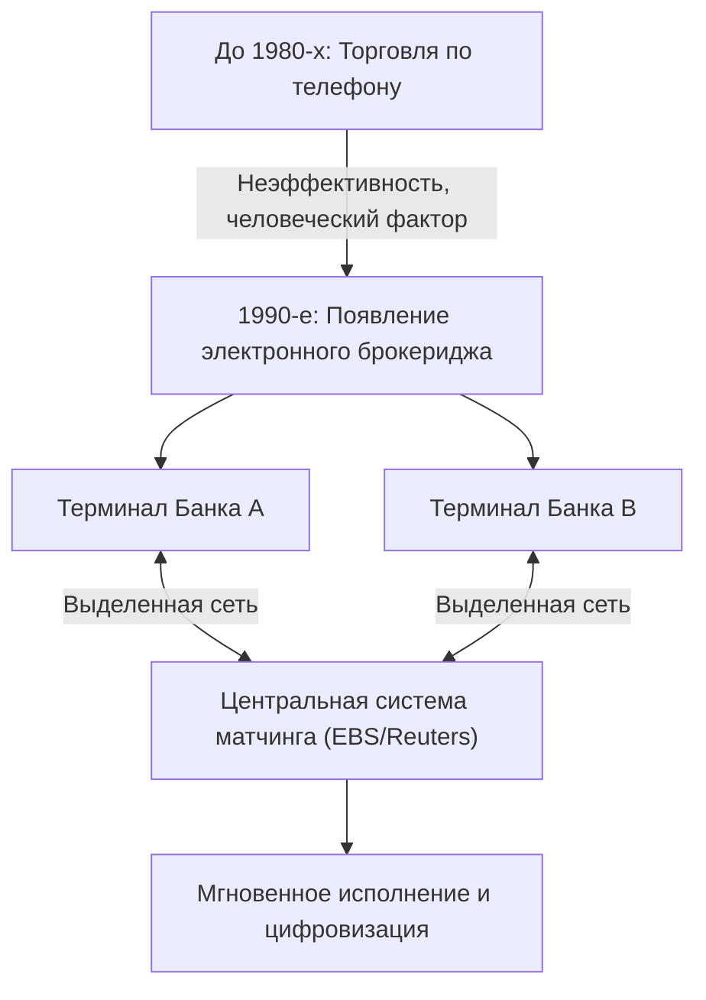

## 1. Рождение гигантского финансового рынка

FX (Foreign Exchange: маржинальная торговля иностранной валютой) — это финансовый продукт, который широко популярен среди индивидуальных инвесторов, но лежащий в его основе «валютный рынок» имеет принципиально иные характеристики, нежели фондовый рынок.
Не существует конкретной биржи (такой как Токийская или Нью-Йоркская фондовые биржи), это гигантский сетевой рынок "внебиржевой торговли" (OTC: Over-The-Counter), где банки и финансовые учреждения со всего мира покупают и продают валюту напрямую через компьютерные сети.

Дневной объем торгов превышает 7 триллионов долларов, и этот рынок может похвастаться самой высокой ликвидностью в мире. Как он сформировался и как технологии его изменили?

## 2. История: Крах Бреттон-Вудской системы и переход к плавающему валютному курсу

Истоки современного рынка FX лежат в масштабной трансформации международной финансовой системы в 1970-х годах.

После Второй мировой войны стабильность мировой экономики поддерживалась «Бреттон-Вудской системой» (системой фиксированных валютных курсов), основанной на долларе США и гарантирующей обмен доллара на золото. Это была эпоха, когда 1 доллар равнялся 360 иенам.
Однако в 1971 году президент США Никсон внезапно объявил о прекращении обмена доллара на золото (Шок Никсона). Это привело к краху системы фиксированных валютных курсов и переходу к «**плавающему валютному курсу**», при котором стоимость валюты каждой страны меняется ежесекундно в зависимости от рыночного спроса и предложения.

Поскольку цены на валюту (обменные курсы) стали колебаться, торговым компаниям пришлось хеджировать риски колебаний валютных курсов, и в то же время активизировалась спекулятивная торговля с целью получения прибыли за счет «покупки дешево и продажи дорого». Это стало началом современного валютного рынка.

## 3. Вмешательство технологий: Появление электронного брокериджа

Вплоть до 1980-х годов торговля иностранной валютой в основном велась по «телефону». Это был крайне аналоговый и человечный мир, где дилеры держали в руках сразу несколько телефонных трубок и громко выкрикивали курсы, подыскивая себе контрагента.

Этот мир кардинально изменился в начале 1990-х годов с появлением «**электронных брокерских систем (таких как EBS и Reuters Matching)**».

Терминалы банков по всему миру были соединены выделенными сетями, и обменные курсы стали отображаться на экранах в режиме реального времени. Вместо того чтобы звонить по телефону, дилеры теперь могли мгновенно совершать сделки на миллионы долларов, просто нажимая на клавиши клавиатуры.
В результате прозрачность рынка резко возросла, а транзакционные издержки (спреды: разница между ценой покупки и продажи) кардинально сократились.

## 4. Интернет-революция и выход индивидуальных инвесторов (ритейл FX)

В конце 1990-х годов, с распространением интернета, на рынке FX появились новые участники. Это мы, индивидуальные инвесторы.

До этого валютный рынок был закрытым миром исключительно для профессионалов, называемым межбанковским рынком (рынком между банками), где минимальная сумма сделки обычно составляла от 1 миллиона долларов и выше.
Однако онлайн-брокеры начали бизнес «ритейл FX», разделив крупные сделки межбанковского рынка на более мелкие и предлагая их частным лицам через интернет. Кроме того, благодаря использованию механизма «маржи (кредитного плеча)», стало возможным совершать крупные сделки даже с небольшим капиталом.

В Японии в 1998 году благодаря пересмотру Закона о валютном контроле была полностью либерализована торговля FX для частных лиц, и слой японских индивидуальных инвесторов, известный как «Миссис Ватанабэ», вырос до огромных масштабов, став силой, с которой нельзя не считаться на мировом рынке FX.

## 5. Алгоритмический трейдинг и расцвет HFT (высокочастотной торговли)

С начала 2000-х годов цифровизация финансовых рынков вышла на новый уровень. Произошел переход от торговли, основанной на человеческом усмотрении (интуиции и опыте), к «**алгоритмическому трейдингу (автоматизированной торговле)**», где компьютерные программы автоматически принимают решения о покупке и продаже.

Среди алгоритмического трейдинга максимальной скорости достиг «**HFT (High Frequency Trading: высокочастотная торговля)**».

HFT-компании совершенно не интересуются фундаментальными показателями компаний или долгосрочными экономическими тенденциями. Они нацелены на «искажения цен (арбитраж)», которые возникают между различными рынками всего на несколько миллисекунд (тысячных долей секунды).

* **Колокация (преимущество в расположении)**: Что определяет победителя в HFT, так это задержка связи (латентность). Для них даже скорость света в оптоволокне кажется медленной, поэтому они размещают свои серверы непосредственно внутри дата-центров, где находятся серверы бирж (колокация). Цель состоит в том, чтобы укоротить физическую длину кабелей даже на несколько метров, чтобы доставить свои заявки на 1 микросекунду (миллионную долю секунды) быстрее, чем конкуренты.
* **Аппаратная обработка с помощью FPGA**: Поскольку даже обычные процессоры (CPU) и программная обработка работают слишком медленно, они используют пользовательские полупроводниковые чипы, называемые FPGA (Field Programmable Gate Array), записывая торговые алгоритмы непосредственно в их схемы и внедряя технологию обработки заявок на аппаратном уровне.

## 6. Flash Crash: Новые риски, порожденные технологиями

Хотя алгоритмический трейдинг и обеспечил рынки огромной ликвидностью (контрагентами) и минимизировал спреды, он также привел к пугающим побочным эффектам. Это «**Flash Crash (мгновенный обвал)**».

Когда на рынке появляются какие-либо аномальные заявки или неожиданные новости, бесчисленные ИИ и алгоритмы одновременно распознают это как «опасность» и на миллисекундных скоростях обрушивают шквал ордеров на продажу или изымают ликвидность. У дилеров-людей нет даже времени оценить ситуацию, поскольку за считанные минуты обменные курсы падают, а затем так же стремительно восстанавливаются, как будто ничего не произошло. В последние годы такие явления происходили неоднократно.

## 7. Заключение

История FX — это, по сути, история эволюции технологий, где главные роли переходили от аналога к цифре и от человека к машине.
Все началось с политического решения об отказе от Бреттон-Вудской системы, за которым последовали интеграция рынков через электронные сети, выход частных лиц благодаря интернету и, наконец, эпоха сверхскоростной торговли с помощью алгоритмов.

В настоящее время искусственный интеллект, использующий глубокое обучение (Deep Learning) и обработку естественного языка, достиг той стадии, когда он способен мгновенно анализировать новостные статьи и заявления глав центральных банков для совершения сделок.
Валютный рынок, на котором вращаются огромные богатства, и в будущем останется передовым рубежом технологической конкуренции человечества, где сталкиваются новейшие достижения компьютерных наук и финансовой инженерии.
