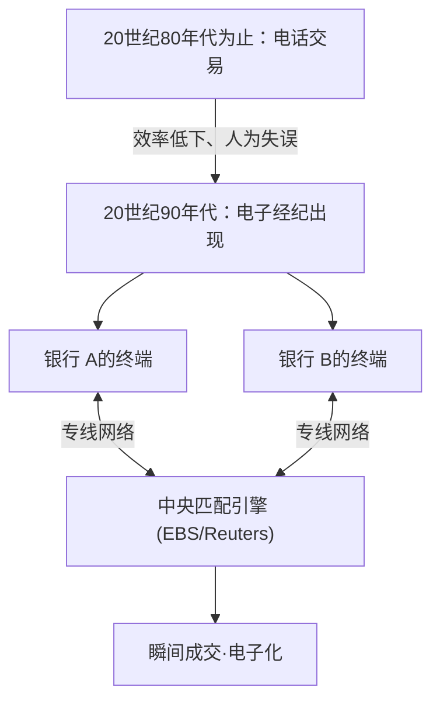

## 1. 巨大金融市场的诞生

FX（Foreign Exchange：外汇保证金交易）是一种在日本也广泛普及的金融产品，但作为其基础的“外汇市场”与股票市场有着根本不同的特征。
它不存在特定的交易所（如东京证券交易所或纽约证券交易所等），而是世界各地的银行和金融机构通过计算机网络直接买卖货币的“场外交易（OTC：Over-the-Counter）”的巨大网络市场。

这个单日交易额超过7万亿美元（约1000万亿日元）、拥有世界最大流动性的市场，是如何形成的，又是如何被技术改变的呢？

## 2. 历史：布雷顿森林体系的崩溃与浮动汇率制的过渡

现代外汇市场的起点，在于20世纪70年代国际金融体系的大转变。

第二次世界大战后，世界经济以美元为基准，通过保证美元与黄金兑换的“布雷顿森林体系（固定汇率制）”维持稳定。那是一个1美元兑换360日元的时代。
然而，1971年，美国总统尼克松突然宣布停止美元与黄金的兑换（尼克松冲击）。由此固定汇率制崩溃，各国货币的价值过渡到了由市场供需关系随时变化的 **浮动汇率制** 。

由于货币价格（汇率）开始波动，贸易企业被迫规避（对冲）汇率波动风险，同时通过“低买高卖”来谋求利润的投机性交易也变得活跃起来。这就是现代外汇市场的开端。

## 3. 技术的介入：电子经纪的出现

直到20世纪80年代，外汇交易主要通过“电话”进行。交易员们紧握着好几个话筒，大声喊着汇率寻找交易对手，这是一个极其模拟化且充满人情味的世界。

极大地改变了这个世界的是，20世纪90年代初出现的 **电子经纪系统（如EBS和Reuters Matching等）** 。

世界各地银行的终端通过专线网络连接起来，屏幕上开始实时显示汇率。交易员们不再需要打电话，只需敲击键盘就能在瞬间完成数百万美元的交易。
这使得市场的透明度实现了飞跃性的提高，交易成本（点差：买入价与卖出价之差）也急剧缩小。

## 4. 互联网革命与个人投资者（零售外汇）的参与

20世纪90年代后半期，随着互联网的普及，外汇市场迎来了新的参与者。那就是我们个人投资者。

在那之前，外汇市场是一个被称为银行间市场的、仅限专业人士参与的封闭世界，最低交易单位通常也是100万美元（约1亿日元）以上。
然而，在线证券公司将银行间市场的大额交易分割成小额，并开始通过互联网向个人提供“零售外汇（Retail FX）”业务。此外，通过利用“保证金（杠杆）”机制，使得使用少量资金进行大规模交易成为可能。

在日本，由于1998年《外汇法》的修改，个人的外汇交易完全自由化，被称为“渡边太太”的日本个人投资者群体在世界外汇市场中成长为不可忽视的巨大存在。

## 5. 算法交易与HFT（高频交易）的崛起

2000年代以后，金融市场的IT化进入了一个新的维度。从基于人类主观判断（直觉和经验）的交易，转变为由计算机程序自动做出买卖判断的 **算法交易（自动买卖）** 。

在算法交易中，追求极致速度的就是 **HFT（High Frequency Trading：高频交易）** 。

HFT交易商完全不关心企业的基本面或长期的经济动向。他们的目标是多个市场之间在仅仅几毫秒（千分之一秒）内产生的“价格扭曲（套利）”。

* **主机托管（位置优势）**: 决定HFT胜负的是通信延迟（Latency）。他们甚至觉得在光纤中传播的光速都太慢，于是将自己的服务器直接安置（主机托管）在交易所服务器所在的数据中心内。这是为了将物理线缆的长度缩短哪怕几米，从而比其他公司早1微秒（百万分之一秒）将订单送达。
* **通过FPGA进行硬件处理**: 由于普通的CPU和软件程序处理起来依然太慢，他们甚至投入了将交易算法直接烧录到被称为FPGA（现场可编程逻辑门阵列）的定制半导体芯片的电路本身中，以在硬件级别处理订单的技术。

## 6. 闪崩：技术带来的新风险

虽然算法交易为市场提供了大量的流动性（交易对手），并做出了使点差极小化的贡献，但另一方面，它也带来了可怕的副作用。那就是 **闪崩（瞬间大暴跌）** 。

当市场中出现某种异常订单或意外新闻时，无数的AI和算法会一致判断为“危险”，并以毫秒级的速度抛出卖单，或者撤回流动性。人类交易员根本没有时间去把握状况，汇率在几分钟内暴跌数日元，然后又像什么都没发生过一样迅速恢复的现象，在近年来已多次发生。

## 7. 总结

外汇的历史，正是从模拟到数字、从人类到机器交替成为主角的技术进化史本身。
它始于布雷顿森林体系崩溃这一政治决定，经历了通过电子网络实现的资源整合、互联网带来的个人参与，最终迈向了基于算法的超高速交易时代。

现在，使用深度学习（Deep Learning）和自然语言处理的AI，已经进化到了可以瞬间解读新闻报道和央行行长发言并进行交易的阶段。
这个有巨大财富流动的外汇市场，今后也将继续作为最新的计算机科学与金融工程激烈碰撞的人类科技竞争的最前线。
