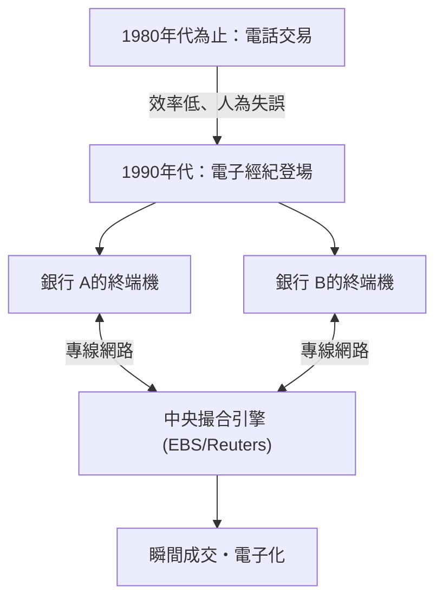

## 1. 巨大金融市場的誕生

FX（Foreign Exchange：外匯保證金交易）是在日本也廣受個人投資者普及的金融商品，但作為其基礎的「外匯市場」具有與股票市場根本上不同的特徵。
這是一個不存在特定交易所（如東京證券交易所或紐約證券交易所等），而是由世界各地的銀行及金融機構透過電腦網路直接進行貨幣買賣的「店頭交易（OTC：Over-The-Counter）」巨大網路市場。

每日交易量超過約 7 兆美元（約 1000 兆日圓），這個擁有世界最大流動性的市場，究竟是如何形成的？又是如何因科技而產生蛻變的呢？

## 2. 歷史：布雷頓森林體系的崩潰與過渡至浮動匯率制

現代 FX 市場的起點，在於 1970 年代國際金融體系的巨大轉變。

第二次世界大戰後，世界經濟以美國的美元為基準，並透過保證美元與黃金兌換的「布雷頓森林體系（固定匯率制）」來維持穩定。那是一個 1 美元 = 360 日圓的時代。
然而，在 1971 年，美國總統尼克森閃電宣布停止美元與黃金的兌換（尼克森震撼）。由此固定匯率制崩潰，各國貨幣的價值過渡到了會根據市場供需狀況每分每秒產生變化的「 **浮動匯率制** 」。

隨著貨幣價格（匯率）開始波動，貿易企業被迫需要規避（對沖）匯率波動風險，同時旨在透過「低買高賣」獲利的投機性交易也變得活躍起來。這就是現代外匯市場的開端。

## 3. 科技的介入：電子經紀的登場

直到 1980 年代為止，外匯交易主要透過「電話」進行。交易員們緊握著好幾支話筒，大聲喊著匯率並尋找交易對手，這是一個極度類比且充滿人情味的世界。

徹底改變這個世界的，是 1990 年代初期登場的「 **電子經紀系統（EBS 與 Reuters Matching 等）** 」。

世界各國銀行的終端機透過專線網路連接，畫面上開始即時顯示匯率。交易員只需敲擊鍵盤，就能瞬間完成數百萬美元的交易，取代了打電話的方式。
由此，市場透明度飛躍性地提高，交易成本（點差：買價與賣價的差額）也急遽縮小。

## 4. 網際網路革命與個人投資者（零售 FX）的參與

1990 年代後半，隨著網際網路的普及，FX 市場出現了新的參與者。那就是我們個人投資者。

在那之前，外匯市場是一個被稱為銀行間市場的專業限定封閉世界，最低交易單位通常也是 100 萬美元（約 1 億日圓）以上。
然而，線上證券公司將銀行間市場的大額交易分割成小額，並開始了透過網際網路提供給個人的「零售 FX」業務。此外，透過運用「保證金（槓桿）」機制，即使是少額資金也能進行大額交易。

在日本，1998 年的外匯法修改使得個人 FX 交易完全自由化，被稱為「渡邊太太（Mrs. Watanabe）」的日本個人投資者群體，在全球 FX 市場中成長為不可忽視的龐大存在。

## 5. 演算法交易與 HFT（高頻交易）的崛起

2000 年代以後，金融市場的 IT 化邁入了一個全新的維度。從依賴人類裁量（直覺與經驗）的交易，轉向由電腦程式自動做出買賣判斷的「 **演算法交易（自動買賣）** 」。

在演算法交易中，將速度追求到極致的便是「 **HFT（High Frequency Trading：高頻交易）** 」。

HFT 業者完全不在乎企業的基本面或長期的經濟動向。他們瞄準的是，在多個市場之間僅產生於幾毫秒（千分之一秒）內的「價格扭曲（套利）」。

* **主機代管（位置優勢）** ：決定 HFT 勝負的關鍵在於通訊延遲（Latency）。對於甚至覺得在光纖中傳輸的光速都很慢的他們來說，會將自家的伺服器直接配置（主機代管）在放置交易所伺服器的資料中心內。這是為了將實體纜線的長度縮短幾公尺，以便能比其他公司快 1 微秒（百萬分之一秒）將委託送達。
* **使用 FPGA 進行硬體處理** ：由於使用一般 CPU 與軟體程式的處理速度仍然太慢，因此投入了將交易演算法直接燒錄在被稱為 FPGA（Field Programmable Gate Array）的客製化半導體晶片電路中，並在硬體層級處理委託的技術。

## 6. 閃電崩盤：科技產生的新風險

演算法交易雖然為市場提供了大量的流動性（交易對手）並極小化了點差，但另一方面也帶來了可怕的副作用。那就是「 **閃電崩盤（瞬間大暴跌）** 」。

當市場中出現某種異常委託或意料之外的新聞時，無數的 AI 或演算法會同時判斷為「危險」，並以毫秒為單位的速度湧入賣單，或是抽走流動性。人類交易員根本來不及掌握狀況，匯率就在幾分鐘內暴跌好幾日圓，隨後又像什麼事都沒發生過一樣急遽反彈的現象，在近年來已發生過多次。

## 7. 總結

FX 的歷史，正是一部從類比到數位、從人類到機器的科技演進史。
從布雷頓森林體系崩潰的政治決定開始，經歷了電子網路整合市場、網際網路帶來個人參與，最終邁向演算法進行超高速交易的時代。

現在，使用深度學習（Deep Learning）或自然語言處理的 AI，已經進化到能夠瞬間解讀新聞報導或央行總裁發言並進行交易的階段。
牽動著巨大財富的外匯市場，今後也將繼續作為最新電腦科學與金融工程相互激烈碰撞的人類科技競爭最前線吧。
