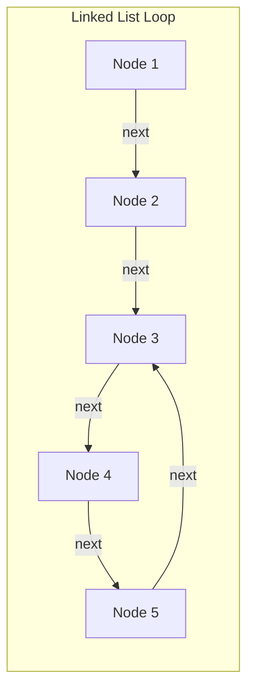
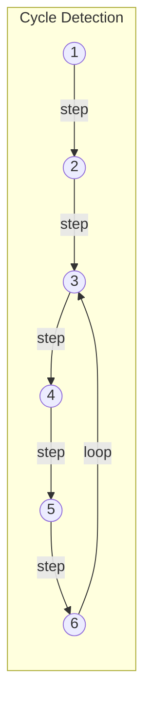
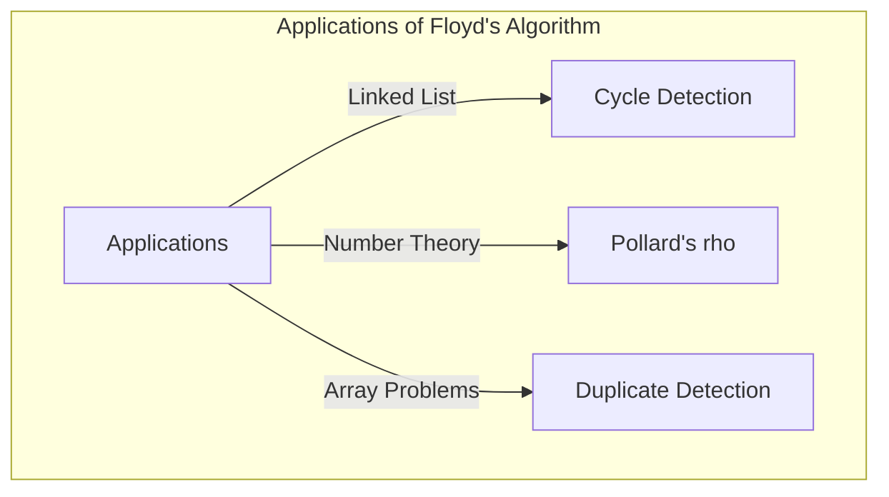

## مقدمة

في علوم الكمبيوتر، من المهم جداً اكتشاف ما إذا كانت هناك "حلقة (دورة)" غير متوقعة في بنية البيانات لمنع الحلقات اللانهائية. واحدة من أكثر الطرق أناقة لحل هذه المشكلة هي **خوارزمية كشف الحلقات لروبرت فلويد** (Floyd's cycle-finding algorithm).

تعرف هذه الخوارزمية أيضاً على نطاق واسع باسم **خوارزمية الأرنب والسلحفاة** (Tortoise and Hare Algorithm) لأنها تستخدم مؤشرين بسرعات مختلفة (يطلق عليهما مجازاً "الأرنب" و"السلحفاة").

في هذه المقالة، سنشرح بالتفصيل كيفية عمل هذه الخوارزمية، والخلفية الرياضية لها، بالإضافة إلى أمثلة تنفيذ محددة باستخدام C++ و [Rust](https://kenji.blog/ar/p/webassembly-wasm-current-future/).

## ما هو كشف الحلقات؟

في القوائم المرتبطة أحادية الاتجاه (Singly Linked List) أو الرسوم البيانية لانتقال الحالة، عندما تتتبع العقد بدءاً من عقدة معينة وتصل مرة أخرى إلى عقدة قمت بزيارتها سابقاً، يسمى هذا الهيكل **حلقة (دورة)**.

على سبيل المثال، لنفكر في القائمة المرتبطة التالية:



في هذه القائمة، العقدة التي تلي Node 5 هي Node 3، مما يشكل حلقة: 3 ← 4 ← 5 ← 3. في برنامج يتبع العقد ببساطة بالترتيب، سيقع في هذه الحلقة ويتسبب في حلقة لانهائية.

إحدى الطرق للتعامل مع هذا هي تسجيل العقد التي تمت زيارتها في مجموعة تجزئة (مثل `std::unordered_set`). ومع ذلك، تتطلب هذه الطريقة مساحة ذاكرة إضافية $O(N)$ تتناسب مع عدد العقد. **خوارزمية كشف الحلقات لفلويد** قادرة على اكتشاف الحلقة في وقت $O(N)$ مع تقليل مساحة الذاكرة إلى $O(1)$.

## كيفية عمل خوارزمية الأرنب والسلحفاة

فكرة الخوارزمية بديهية جداً. تخيل عدائين يركضان على نفس المضمار بسرعات مختلفة. إذا كان المضمار في خط مستقيم، فإن العداء السريع سيبتعد عن العداء البطيء. ولكن إذا كان المضمار يحتوي على مسار دائري (حلقة)، فإن العداء السريع سيتأخر في النهاية دورة كاملة عن العداء البطيء، وسيلحق به من الخلف.

على وجه التحديد، نستخدم المؤشرين التاليين:

1. **السلحفاة (Tortoise)**: تتقدم عقدة واحدة في كل خطوة.
2. **الأرنب (Hare)**: يتقدم عقدتين في كل خطوة.

دعهما يبدآن في نفس الوقت، وإذا وصل الأرنب إلى النهاية (`null`)، فلن يكون هناك حلقة. إذا كان هناك حلقة، فسيشير الأرنب والسلحفاة بالتأكيد إلى نفس العقدة في مرحلة ما.

### توضيح العمليات

دعونا نفكر في رسم بياني يحتوي على حلقة كما يلي:



ستكون حركات المؤشر في كل خطوة كما يلي:
(※ السلحفاة = $T$، الأرنب = $H$)

- **Step 0**: $T=1$, $H=1$
- **Step 1**: $T=2$, $H=3$
- **Step 2**: $T=3$, $H=5$
- **Step 3**: $T=4$, $H=3$
- **Step 4**: $T=5$, $H=5$ (هنا يتطابقان، تم اكتشاف حلقة!)

## الإثبات الرياضي وتحديد نقطة بداية الحلقة

سنستخدم الصيغ الرياضية لإثبات أن الخوارزمية ستؤدي بالتأكيد إلى اصطدام، وكيفية تحديد نقطة بداية (تقاطع) الحلقة.

لنفترض أن المسافة من بداية القائمة إلى نقطة بداية الحلقة هي $x$.
والمسافة من نقطة بداية الحلقة إلى النقطة التي اصطدم فيها المؤشران هي $y$.
والمسافة من نقطة الاصطدام إلى نقطة بداية الحلقة مرة أخرى هي $z$.
لذلك، الطول الإجمالي للحلقة هو $C = y + z$.

عندما تصطدم السلحفاة والأرنب، تكون مسافات حركتيهما كما يلي:

- مسافة حركة السلحفاة: $d_T = x + y$
- مسافة حركة الأرنب: $d_H = x + y + kC$ ($k$ هو عدد المرات التي دار فيها الأرنب حول الحلقة)

نظراً لأن الأرنب يتحرك بضعف سرعة السلحفاة، فإن المعادلة التالية تتحقق:

$$ 2 \cdot d_T = d_H $$
$$ 2(x + y) = x + y + kC $$
$$ x + y = kC $$
$$ x = kC - y $$

هنا، بما أن $C = y + z$:
$$ x = k(y + z) - y $$
$$ x = (k - 1)(y + z) + z $$
$$ x = (k - 1)C + z $$

هذه المعادلة $x = (k - 1)C + z$ لها معنى مهم جداً.
هنا $k - 1$ هو عدد صحيح أكبر من أو يساوي $0$.
يشير هذا إلى أن "المسافة $x$ من بداية القائمة إلى نقطة بداية الحلقة" تساوي "المسافة المتبقية $z$ من نقطة الاصطدام إلى نقطة بداية الحلقة"، مضافاً إليها مضاعف صحيح لطول الحلقة $C$ وهو ($(k-1)C$).

بعبارة أخرى، مباشرة بعد حدوث الاصطدام، **إذا أعدت أحد المؤشرات إلى بداية القائمة وتركت الآخر في نقطة الاصطدام، وقمت بتحريك كلاهما خطوة واحدة في كل مرة، فسيتقابلان بالتأكيد في نقطة بداية الحلقة**. والسبب في ذلك هو أنه بينما يتقدم المؤشر الذي بدأ من البداية مسافة $x$ للوصول إلى نقطة بداية الحلقة، فإن المؤشر الذي بدأ من نقطة الاصطدام يتقدم مسافة $z$ للوصول إلى نقطة بداية الحلقة، وبعد ذلك يدور حول الحلقة $(k-1)$ مرات. ونتيجة لذلك، سيصل كلاهما إلى نقطة بداية الحلقة في نفس الوقت بالضبط ويلتقيان.

## التنفيذ باستخدام الكود

الآن، دعونا نطبق النظرية المذكورة أعلاه في C++ و [Rust](https://kenji.blog/ar/p/webassembly-wasm-current-future/).

### التنفيذ بلغة C++

هذا هو تنفيذ بنية عقدة القائمة أحادية الاتجاه، ووظيفة اكتشاف الحلقة، ووظيفة إيجاد عقدة بداية الحلقة.

```cpp
#include <iostream>

// تعريف عقدة القائمة
struct ListNode {
    int val;
    ListNode *next;
    ListNode(int x) : val(x), next(nullptr) {}
};

class Solution {
public:
    // تحديد ما إذا كانت هناك حلقة أم لا
    bool hasCycle(ListNode *head) {
        if (!head || !head->next) return false;
        
        ListNode *slow = head;
        ListNode *fast = head;
        
        while (fast != nullptr && fast->next != nullptr) {
            slow = slow->next;          // تتقدم السلحفاة خطوة واحدة
            fast = fast->next->next;    // يتقدم الأرنب خطوتين
            
            if (slow == fast) {
                return true; // إذا اصطدما، فهناك حلقة
            }
        }
        
        return false; // إذا وصل الأرنب إلى النهاية، فلا توجد حلقة
    }

    // إرجاع عقدة نقطة بداية الحلقة
    ListNode *detectCycle(ListNode *head) {
        if (!head || !head->next) return nullptr;
        
        ListNode *slow = head;
        ListNode *fast = head;
        bool cycleExists = false;
        
        while (fast != nullptr && fast->next != nullptr) {
            slow = slow->next;
            fast = fast->next->next;
            
            if (slow == fast) {
                cycleExists = true;
                break;
            }
        }
        
        if (!cycleExists) return nullptr;
        
        // إعادة أحدهما (هنا slow) إلى البداية
        slow = head;
        
        // تحريك كليهما خطوة واحدة، والمكان الذي يلتقيان فيه هو بداية الحلقة
        while (slow != fast) {
            slow = slow->next;
            fast = fast->next;
        }
        
        return slow;
    }
};

int main() {
    // بناء 1 -> 2 -> 3 -> 4 -> 5 -> 3 (حلقة)
    ListNode* head = new ListNode(1);
    head->next = new ListNode(2);
    head->next = new ListNode(3);
    head->next = new ListNode(4);
    head->next = new ListNode(5);
    head->next->next->next->next->next = head->next->next; // 5 -> 3
    
    Solution sol;
    if (sol.hasCycle(head)) {
        std::cout << "Cycle detected!" << std::endl;
        ListNode* start = sol.detectCycle(head);
        if (start) {
            std::cout << "Cycle starts at node with value: " << start->val << std::endl;
        }
    } else {
        std::cout << "No cycle." << std::endl;
    }
    
    // تحرير الذاكرة لا يمكن باستخدام delete البسيط لوجود حلقة (يجب منع الحلقة اللانهائية)
    // في الأصل، يجب معالجة الأمر عن طريق إزالة الحلقة قبل الـ delete.
    return 0;
}
```

### التنفيذ بلغة [Rust](https://kenji.blog/ar/p/webassembly-wasm-current-future/)

في حالة [Rust](https://kenji.blog/ar/p/programming-languages-history-paradigm-evolution/)، غالباً ما يصبح تنفيذ القوائم المرتبطة معقداً بسبب قواعد الملكية والاستعارة، لذلك من الشائع نمذجة المشكلة كمرجع فهرس على مصفوفة (أو `Vec`)، وهو أمر شائع في البرمجة التنافسية.
هنا نوضح مثال تنفيذ يستخدم مصفوفة تحتفظ بـ "الفهرس التالي" بدلاً من "المؤشر التالي".

```rust
// نعتبر المصفوفة التي تحتوي على الفهرس للوجهة التالية بمثابة قائمة مرتبطة افتراضية
// مثال: arr[i] هي العقدة التالية.
fn has_cycle(arr: &Vec<usize>, start_idx: usize) -> bool {
    if arr.is_empty() {
        return false;
    }
    
    let mut slow = start_idx;
    let mut fast = start_idx;
    
    loop {
        // تحريك السلحفاة خطوة
        if slow >= arr.len() { break; }
        slow = arr[slow];
        
        // تحريك الأرنب خطوتين
        if fast >= arr.len() { break; }
        fast = arr[fast];
        if fast >= arr.len() { break; }
        fast = arr[fast];
        
        // التحقق من الاصطدام
        if slow == fast {
            return true;
        }
    }
    
    false
}

fn detect_cycle_start(arr: &Vec<usize>, start_idx: usize) -> Option<usize> {
    if arr.is_empty() {
        return None;
    }
    
    let mut slow = start_idx;
    let mut fast = start_idx;
    let mut has_cycle = false;
    
    loop {
        if slow >= arr.len() || fast >= arr.len() || arr[fast] >= arr.len() {
            break;
        }
        slow = arr[slow];
        fast = arr[arr[fast]];
        
        if slow == fast {
            has_cycle = true;
            break;
        }
    }
    
    if !has_cycle {
        return None;
    }
    
    // إعادة السلحفاة إلى نقطة البداية
    slow = start_idx;
    
    // تحريك خطوة بخطوة
    while slow != fast {
        slow = arr[slow];
        fast = arr[fast];
    }
    
    Some(slow)
}

fn main() {
    // رسم بياني للانتقال باستخدام الفهارس:
    // 0 -> 1 -> 2 -> 3 -> 4 -> 2 (حلقة تبدأ من 2)
    // إذا كانت القيمة خارج النطاق (مثال: usize::MAX) تعتبر كنهاية، لكننا هنا نبني مساراً بحلقة.
    let graph = vec![1, 2, 3, 4, 2];
    
    if has_cycle(&graph, 0) {
        println!("Cycle detected!");
        if let Some(start) = detect_cycle_start(&graph, 0) {
            println!("Cycle starts at index: {}", start);
        }
    } else {
        println!("No cycle.");
    }
}
```

## تحليل التعقيد

تتمتع هذه الخوارزمية بخصائص أداء ممتازة جداً.

- **التعقيد الزمني (Time Complexity)**: $O(N)$
  يتحرك الأرنب لعدد أقصاه $N$ من الخطوات حتى يدخل الحلقة، وبعد دخول الحلقة، يتحرك لعدد أقصاه طول الحلقة $C$ من الخطوات حتى يلحق بالسلحفاة. وبما أن $C \le N$، فإن إجمالي عدد الخطوات يظل في الوقت الخطي.
- **التعقيد الفضائي (Space Complexity)**: $O(1)$
  نظراً لعدم وجود حاجة لتذكر العقد التي تمت زيارتها باستخدام مجموعة تجزئة وما إلى ذلك، ويكفي فقط الاحتفاظ بمتغيرين للمؤشرات، فإن استخدام الذاكرة الإضافية يصبح مساحة ثابتة.

## أمثلة أخرى على التطبيقات

لا يقتصر تطبيق خوارزمية اكتشاف الحلقات لفلويد على اكتشاف الحلقات في القوائم المرتبطة فحسب، بل يتم تطبيقها في خوارزميات مختلفة.

1. **طريقة تحليل العوامل الأولية $\rho$ (رو) لبولارد (Pollard's rho algorithm)**:
   وهي خوارزمية فعالة للعثور على العوامل الأولية للأرقام المركبة الكبيرة عن طريق الاستفادة من دخول تسلسل مخرجات مولد الأرقام العشوائية في حلقة. إنها خوارزمية قوية لتحليل العوامل الأولية تستخدم أيضاً في مجال التشفير.
2. **اكتشاف الأرقام المتكررة (Find the Duplicate Number)**:
   على سبيل المثال، افترض أن هناك مصفوفة تحتوي على عدد عناصر $N+1$، وقيمة كل عنصر في نطاق من $1$ إلى $N$. وفقاً لمبدأ جحر الحمام (Pigeonhole principle)، يتكرر رقم واحد على الأقل. من خلال التعامل مع العناصر الموجودة في المصفوفة كـ "مؤشرات إلى الفهرس التالي"، يمكن تطبيق ذلك على طريقة للعثور على التكرارات كنقطة بداية للحلقة، مع الحفاظ على مساحة المصفوفة عند $O(1)$. تظهر هذه المشكلة بشكل متكرر في مقابلات البرمجة الشهيرة مثل LeetCode.
   على وجه التحديد، عند إعطاء المصفوفة `nums`، يتم تعريف انتقال الحالة كـ `next_node = nums[current_node]`. وجود قيم مكررة يعني وجود انتقالات من عدة فهارس مختلفة إلى نفس القيمة (أي نفس العقدة التالية)، وهذا يشكل مدخل الحلقة. لذلك، من خلال تطبيق خوارزمية الأرنب والسلحفاة كما هي، يمكنك تحديد القيمة المكررة (نقطة بداية الحلقة) بتعقيد زمني $O(N)$ وتعقيد فضائي $O(1)$.



## ملخص

في هذه المقالة، قمنا بشرح **خوارزمية كشف الحلقات لروبرت فلويد** (خوارزمية الأرنب والسلحفاة).
على الرغم من أنها فكرة بسيطة تتمثل في تشغيل مؤشرين بسرعات مختلفة، إلا أنها طريقة أنيقة تتيح اكتشاف الحلقات وتحديد نقطة البداية بتعقيد زمني $O(N)$ ومساحة $O(1)$.
من خلال فهم الأساس الرياضي، أعتقد أنه أصبح من الواضح لماذا يمكن العثور على نقطة البداية عن طريق إعادة مؤشر واحد إلى البداية بعد الاصطدام وتحريكه بنفس السرعة.

في تنفيذ هياكل البيانات والبرمجة التنافسية، تعتبر هذه الخوارزمية سلاحاً قوياً جداً. يرجى تجربتها وتنفيذها بنفسك باستخدام C++ أو [Rust](https://kenji.blog/ar/p/webassembly-wasm-current-future/).
