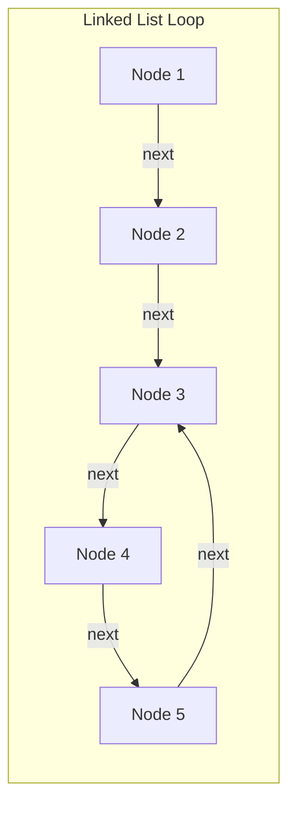
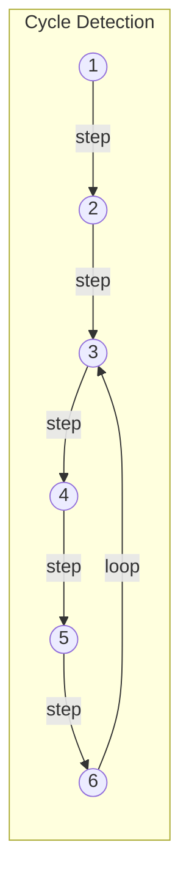
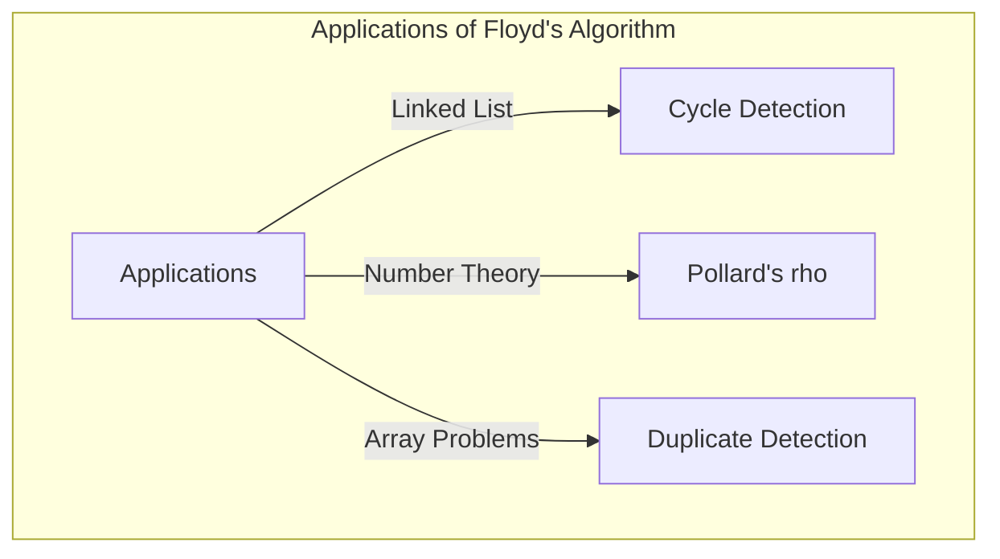

## Einleitung

In der Informatik ist die Erkennung, ob eine Datenstruktur unerwartete "Zyklen" (Schleifen) enthält, von entscheidender Bedeutung, beispielsweise um Endlosschleifen zu vermeiden. Eine der elegantesten Methoden zur Lösung dieses Problems ist **Floyds Algorithmus zur Zykluserkennung** (Floyd's cycle-finding algorithm).

Da dieser Algorithmus zwei Zeiger mit unterschiedlichen Geschwindigkeiten (die oft pseudomäßig "Hase" und "Igel" genannt werden) verwendet, ist er auch weithin als **Hase-und-Igel-Algorithmus** (Tortoise and Hare Algorithm) bekannt.

In diesem Artikel werden wir die Funktionsweise dieses Algorithmus, seinen mathematischen Hintergrund sowie konkrete Implementierungsbeispiele in C++ und [Rust](https://kenji.blog/de/p/webassembly-wasm-current-future/) im Detail erläutern.

## Was ist Zykluserkennung?

Wenn man in einer einfach verketteten Liste (Singly Linked List) oder einem [Zustand](https://kenji.blog/de/p/state-management-history-redux-context-recoil-zustand/)sübergangsgraphen von einem bestimmten Knoten aus navigiert und dabei wieder zu einem zuvor besuchten Knoten gelangt, nennt man diese Struktur einen **Zyklus**.

Betrachten wir zum Beispiel die folgende verkettete Liste:



In dieser Liste folgt auf Node 5 wieder Node 3, wodurch eine Schleife von 3 → 4 → 5 → 3 entsteht. Ein Programm, das einfach nur sequenziell durchläuft, würde in diese Schleife geraten und eine Endlosschleife verursachen.

Eine Methode, um damit umzugehen, besteht darin, die besuchten Knoten in einem Hash-Set (wie `std::unordered_set`) zu speichern. Diese Methode erfordert jedoch einen zusätzlichen Speicherplatz von $O(N)$, proportional zur Anzahl der Knoten. **Floyds Algorithmus zur Zykluserkennung** ermöglicht es, Zyklen in $O(N)$-Zeit zu erkennen, während der Speicherplatz auf $O(1)$ begrenzt wird.

## Die Funktionsweise des Hase-und-Igel-Algorithmus

Die Idee hinter dem Algorithmus ist sehr intuitiv. Stellen Sie sich zwei Läufer vor, die auf derselben Strecke mit unterschiedlichen Geschwindigkeiten laufen. Wenn die Strecke gerade ist, wird der schnelle Läufer den langsamen Läufer immer weiter hinter sich lassen. Wenn die Strecke jedoch einen Rundkurs (Zyklus) enthält, wird der schnelle Läufer den langsamen Läufer irgendwann "überrunden" und ihn von hinten einholen.

Konkret werden die folgenden zwei Zeiger verwendet:

1. **Igel (Tortoise)**: Rückt bei jedem Schritt um einen Knoten vor.
2. **Hase (Hare)**: Rückt bei jedem Schritt um zwei Knoten vor.

Beide starten gleichzeitig. Wenn der Hase das Ende (`null`) erreicht, gibt es keinen Zyklus. Wenn es einen Zyklus gibt, werden Hase und Igel an einem bestimmten Punkt unweigerlich auf denselben Knoten zeigen.

### Veranschaulichung der Funktionsweise

Betrachten wir einen Graphen mit einem Zyklus wie den folgenden:



Die Bewegung der Zeiger pro Schritt sieht folgendermaßen aus:
(* Igel = $T$, Hase = $H$)

- **Step 0**: $T=1$, $H=1$
- **Step 1**: $T=2$, $H=3$
- **Step 2**: $T=3$, $H=5$
- **Step 3**: $T=4$, $H=3$
- **Step 4**: $T=5$, $H=5$ (Hier stimmen sie überein, Zyklus erkannt!)

## Mathematischer Beweis und Identifizierung des Zyklusanfangs

Wir werden mathematisch beweisen, dass der Algorithmus immer eine Kollision verursacht, und erklären, wie der Startpunkt des Zyklus (der Kreuzungspunkt) identifiziert werden kann.

Sei $x$ die Entfernung vom Start der Liste bis zum Startpunkt des Zyklus.
Sei $y$ die Entfernung vom Startpunkt des Zyklus bis zum Kollisionspunkt der beiden Zeiger.
Sei $z$ die Entfernung vom Kollisionspunkt zurück zum Startpunkt des Zyklus.
Somit ist die Gesamtlänge des Zyklus $C = y + z$.

Wenn Igel und Hase kollidieren, sind ihre jeweiligen zurückgelegten Entfernungen:

- Entfernung des Igels: $d_T = x + y$
- Entfernung des Hasen: $d_H = x + y + kC$ ($k$ ist die Anzahl der Runden, die der Hase im Zyklus gelaufen ist)

Da sich der Hase doppelt so schnell wie der Igel bewegt, gilt die folgende Gleichung:

$$ 2 \cdot d_T = d_H $$
$$ 2(x + y) = x + y + kC $$
$$ x + y = kC $$
$$ x = kC - y $$

Da $C = y + z$, gilt:
$$ x = k(y + z) - y $$
$$ x = (k - 1)(y + z) + z $$
$$ x = (k - 1)C + z $$

Diese Gleichung $x = (k - 1)C + z$ hat eine sehr wichtige Bedeutung.
Hier ist $k - 1$ eine ganze Zahl größer oder gleich $0$.
Sie zeigt, dass "die Entfernung $x$ vom Start der Liste zum Startpunkt des Zyklus" gleich "der verbleibenden Entfernung $z$ vom Kollisionspunkt zum Startpunkt des Zyklus" zuzüglich eines ganzzahligen Vielfachen der Zykluslänge $C$ ($(k-1)C$) ist.

Das heißt: **Wenn man direkt nach der Kollision einen Zeiger an den Start der Liste zurücksetzt und den anderen am Kollisionspunkt belässt, und dann beide jeweils um einen Schritt vorrücken lässt, werden sie sich unweigerlich am Startpunkt des Zyklus treffen.** Der Grund dafür ist, dass während der Zeiger vom Startpunkt die Distanz $x$ zurücklegt, um den Zyklusanfang zu erreichen, der Zeiger vom Kollisionspunkt die Distanz $z$ zurücklegt, um den Zyklusanfang zu erreichen, und danach den Zyklus $(k-1)$ Mal umrundet. Infolgedessen erreichen beide exakt zur gleichen Zeit den Startpunkt des Zyklus und treffen sich dort.

## Implementierung per Code

Lassen Sie uns nun die obige Theorie in C++ und [Rust](https://kenji.blog/de/p/webassembly-wasm-current-future/) implementieren.

### Implementierung in C++

Dies ist die Implementierung der Knotenstruktur einer einfach verketteten Liste, der Funktion zur Erkennung eines Zyklus und der Funktion zur Ermittlung des Startpunktes des Zyklus.

```cpp
#include <iostream>

// Definition des Listenknotens
struct ListNode {
    int val;
    ListNode *next;
    ListNode(int x) : val(x), next(nullptr) {}
};

class Solution {
public:
    // Überprüft, ob ein Zyklus existiert
    bool hasCycle(ListNode *head) {
        if (!head || !head->next) return false;
        
        ListNode *slow = head;
        ListNode *fast = head;
        
        while (fast != nullptr && fast->next != nullptr) {
            slow = slow->next;          // Igel rückt 1 Schritt vor
            fast = fast->next->next;    // Hase rückt 2 Schritte vor
            
            if (slow == fast) {
                return true; // Zyklus vorhanden, falls Kollision
            }
        }
        
        return false; // Kein Zyklus, falls Hase das Ziel erreicht
    }

    // Gibt den Knoten am Startpunkt des Zyklus zurück
    ListNode *detectCycle(ListNode *head) {
        if (!head || !head->next) return nullptr;
        
        ListNode *slow = head;
        ListNode *fast = head;
        bool cycleExists = false;
        
        while (fast != nullptr && fast->next != nullptr) {
            slow = slow->next;
            fast = fast->next->next;
            
            if (slow == fast) {
                cycleExists = true;
                break;
            }
        }
        
        if (!cycleExists) return nullptr;
        
        // Einen von beiden (hier slow) an den Anfang zurücksetzen
        slow = head;
        
        // Beide jeweils um 1 Schritt vorrücken lassen; der Treffpunkt ist der Startpunkt des Zyklus
        while (slow != fast) {
            slow = slow->next;
            fast = fast->next;
        }
        
        return slow;
    }
};

int main() {
    // Aufbau von 1 -> 2 -> 3 -> 4 -> 5 -> 3 (Zyklus)
    ListNode* head = new ListNode(1);
    head->next = new ListNode(2);
    head->next = new ListNode(3);
    head->next = new ListNode(4);
    head->next = new ListNode(5);
    head->next->next->next->next->next = head->next->next; // 5 -> 3
    
    Solution sol;
    if (sol.hasCycle(head)) {
        std::cout << "Cycle detected!" << std::endl;
        ListNode* start = sol.detectCycle(head);
        if (start) {
            std::cout << "Cycle starts at node with value: " << start->val << std::endl;
        }
    } else {
        std::cout << "No cycle." << std::endl;
    }
    
    // Die Speicherfreigabe kann wegen des Zyklus nicht einfach per delete erfolgen (Endlosschleifen-Prävention nötig)
    // Eigentlich sollte der Zyklus aufgelöst werden, bevor gelöscht wird.
    return 0;
}
```

### Implementierung in [Rust](https://kenji.blog/de/p/webassembly-wasm-current-future/)

In [Rust](https://kenji.blog/de/p/programming-languages-history-paradigm-evolution/) wird die Implementierung verketteter Listen aufgrund der Eigentums- und Ausleihregeln (Ownership & Borrowing) tendenziell komplex. Beim wettbewerbsorientierten Programmieren (Competitive Programming) ist es daher üblich, sie als Index-Referenzproblem auf Arrays (oder `Vec`) zu modellieren.
Hier zeigen wir ein Implementierungsbeispiel unter Verwendung eines Arrays, das den "nächsten Index" anstelle eines "Zeigers auf den nächsten Knoten" speichert.

```rust
// Ein Array, das den Index des nächsten Ziels enthält, wird als virtuelle verkettete Liste betrachtet
// Beispiel: arr[i] ist der nächste Knoten.
fn has_cycle(arr: &Vec<usize>, start_idx: usize) -> bool {
    if arr.is_empty() {
        return false;
    }
    
    let mut slow = start_idx;
    let mut fast = start_idx;
    
    loop {
        // Igel um 1 Schritt vorrücken lassen
        if slow >= arr.len() { break; }
        slow = arr[slow];
        
        // Hase um 2 Schritte vorrücken lassen
        if fast >= arr.len() { break; }
        fast = arr[fast];
        if fast >= arr.len() { break; }
        fast = arr[fast];
        
        // Kollisionserkennung
        if slow == fast {
            return true;
        }
    }
    
    false
}

fn detect_cycle_start(arr: &Vec<usize>, start_idx: usize) -> Option<usize> {
    if arr.is_empty() {
        return None;
    }
    
    let mut slow = start_idx;
    let mut fast = start_idx;
    let mut has_cycle = false;
    
    loop {
        if slow >= arr.len() || fast >= arr.len() || arr[fast] >= arr.len() {
            break;
        }
        slow = arr[slow];
        fast = arr[arr[fast]];
        
        if slow == fast {
            has_cycle = true;
            break;
        }
    }
    
    if !has_cycle {
        return None;
    }
    
    // Igel zum Startpunkt zurücksetzen
    slow = start_idx;
    
    // Um 1 Schritt vorrücken lassen
    while slow != fast {
        slow = arr[slow];
        fast = arr[fast];
    }
    
    Some(slow)
}

fn main() {
    // Übergangsgraph durch Indizes:
    // 0 -> 1 -> 2 -> 3 -> 4 -> 2 (Ein Zyklus, der bei 2 beginnt)
    // Wenn der Wert außerhalb des Bereichs liegt (z. B. usize::MAX), markiert dies das Ende, aber dieses Mal konstruieren wir einen Zyklus.
    let graph = vec![1, 2, 3, 4, 2];
    
    if has_cycle(&graph, 0) {
        println!("Cycle detected!");
        if let Some(start) = detect_cycle_start(&graph, 0) {
            println!("Cycle starts at index: {}", start);
        }
    } else {
        println!("No cycle.");
    }
}
```

## Komplexitätsanalyse

Dieser Algorithmus besitzt hervorragende Leistungseigenschaften.

- **Zeitkomplexität**: $O(N)$
  Der Hase bewegt sich maximal $N$ Schritte, bis er in den Zyklus eintritt, und nachdem er in den Zyklus eingetreten ist, bewegt er sich maximal um die Zykluslänge $C$ Schritte, bevor er den Igel einholt. Da $C \le N$, bleibt die Gesamtzahl der Schritte in linearer Zeit.
- **Speicherkomplexität**: $O(1)$
  Da besuchte Knoten nicht in einem Hash-Set oder ähnlichem gespeichert werden müssen und lediglich zwei Zeigervariablen gepflegt werden, bleibt der zusätzliche Speicherbedarf konstant.

## Weitere Anwendungsbeispiele

Floyds Algorithmus zur Zykluserkennung wird nicht nur für das Erkennen von Zyklen in verketteten Listen eingesetzt, sondern findet auch in verschiedenen anderen Algorithmen Anwendung.

1. **Pollards Rho-Methode ($\rho$) zur Primfaktorzerlegung**:
   Dies ist ein Algorithmus, der effizient die Primfaktoren riesiger zusammengesetzter Zahlen findet, indem er ausnutzt, dass die Ausgabesequenz eines Zufallszahlengenerators in einen Zyklus eintritt. Es ist ein leistungsstarker Algorithmus zur Primfaktorzerlegung, der auch in der Kryptographie verwendet wird.
2. **Erkennung doppelter Zahlen (Find the Duplicate Number)**:
   Angenommen, es gibt ein Array mit $N+1$ Elementen, deren Werte im Bereich von $1$ bis $N$ liegen. Nach dem Schubfachprinzip muss mindestens eine Zahl doppelt vorhanden sein. Indem man die Elemente im Array als "Zeiger auf den nächsten Index" behandelt, kann diese Methode angewendet werden, um das doppelte Element als Startpunkt des Zyklus zu finden, während der Arrayspeicher auf $O(1)$ gehalten wird. Dies ist ein häufiges Problem bei bekannten Programmierinterviews (z. B. LeetCode).
   Konkret, gegeben sei das Array `nums`. Der [Zustand](https://kenji.blog/de/p/state-management-history-redux-context-recoil-zustand/)sübergang wird definiert als `next_node = nums[current_node]`. Das Vorhandensein eines doppelten Wertes bedeutet, dass es Übergänge von mehreren verschiedenen Indizes zu demselben Wert (also demselben nächsten Knoten) gibt, was den Eingang zu einem Zyklus bildet. Indem man den Hase-und-Igel-Algorithmus direkt anwendet, kann man somit den doppelten Wert (den Startpunkt des Zyklus) mit einer Zeitkomplexität von $O(N)$ und einer Speicherkomplexität von $O(1)$ identifizieren.



## Fazit

In diesem Artikel haben wir **Floyds Algorithmus zur Zykluserkennung** (Hase-und-Igel-Algorithmus) erläutert.
Trotz der einfachen Idee, zwei Zeiger mit unterschiedlichen Geschwindigkeiten laufen zu lassen, ist dies eine elegante Methode, die die Erkennung von Zyklen und die Identifizierung ihres Startpunkts in $O(N)$-Zeit und $O(1)$-Speicherplatz ermöglicht.
Durch das Verständnis der mathematischen Hintergründe dürfte deutlich geworden sein, warum man den Startpunkt finden kann, indem man nach der Kollision einen Zeiger an den Anfang zurücksetzt und beide mit derselben Geschwindigkeit fortbewegt.

Bei der Implementierung von Datenstrukturen und beim wettbewerbsorientierten Programmieren ist dieser Algorithmus ein äußerst mächtiges Werkzeug. Bitte probieren Sie ihn aus und implementieren Sie ihn selbst in C++ oder [Rust](https://kenji.blog/de/p/webassembly-wasm-current-future/).
