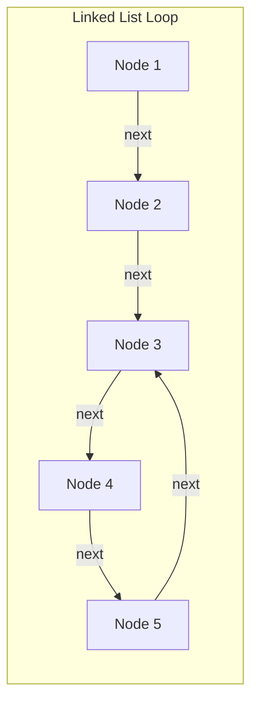
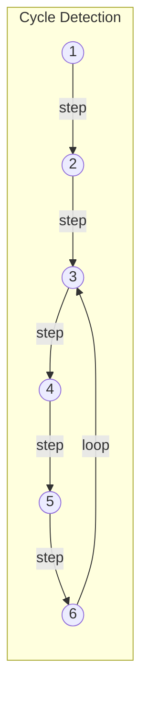
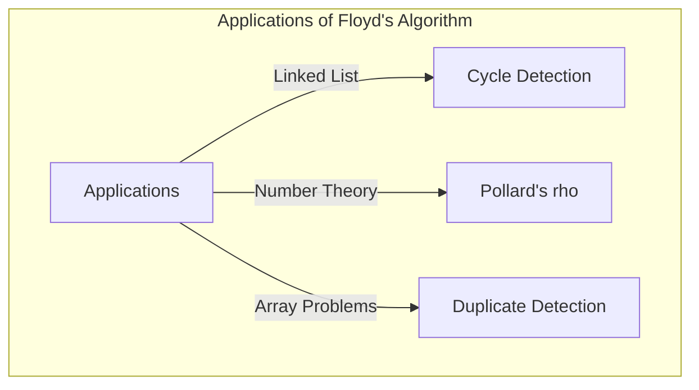

## Introduction

In computer science, it is extremely important to detect whether unexpected "cycles" exist within data structures to prevent infinite loops. One of the most elegant methods to solve this problem is **Floyd's cycle-finding algorithm**.

Since this algorithm uses two pointers moving at different speeds (often pseudo-named "Hare" and "Tortoise"), it is also widely known as the **Tortoise and Hare Algorithm**.

In this article, we will explain in detail the mechanism of this algorithm, its mathematical background, and concrete implementation examples using C++ and [Rust](https://kenji.blog/en/p/webassembly-wasm-current-future/).

## What is Cycle Detection?

In a Singly Linked List or a state transition graph, a structure where tracing from a certain node eventually brings you back to a previously visited node is called a **cycle**.

For example, consider the following linked list.



In this list, the node following Node 5 is Node 3, forming a loop: 3 → 4 → 5 → 3. A program that simply traverses in order will get stuck in this loop, causing an infinite loop.

One way to deal with this is to record the visited nodes in a hash set (such as `std::unordered_set`). However, this method requires additional memory space of $O(N)$ proportional to the number of nodes. **Floyd's cycle-finding algorithm** can detect cycles in $O(N)$ time while keeping the memory space to $O(1)$.

## Mechanism of the Tortoise and Hare Algorithm

The idea of the algorithm is very intuitive. Imagine two runners running at different speeds on the same track. If the track is a straight line, the faster runner will only pull away from the slower one. However, if the track contains a lap course (cycle), the faster runner will eventually lap the slower runner and catch up from behind.

Specifically, it uses the following two pointers:

1. **Tortoise**: Advances to the next node 1 step at a time.
2. **Hare**: Advances to the next node 2 steps at a time.

Both are started simultaneously, and if the Hare reaches the end (`null`), there is no cycle. If a cycle exists, the Hare and the Tortoise will inevitably point to the same node at some point.

### Diagram of the Operation

Consider a graph with a cycle like the following.



The movement of the pointers per step is as follows:
(* Tortoise = $T$, Hare = $H$)

- **Step 0**: $T=1$, $H=1$
- **Step 1**: $T=2$, $H=3$
- **Step 2**: $T=3$, $H=5$
- **Step 3**: $T=4$, $H=3$
- **Step 4**: $T=5$, $H=5$ (Match here, cycle detected!)

## Mathematical Proof and Identifying the Start of the Cycle

We will prove using formulas that the algorithm will always collide, and how to identify the starting point (intersection) of the cycle.

Let the distance from the start of the list to the start of the cycle be $x$.
Let the distance from the start of the cycle to the point where the two pointers collided be $y$.
Let the distance from the point of collision back to the start of the cycle be $z$.
Therefore, the total length of the cycle is $C = y + z$.

When the Tortoise and the Hare collide, their respective travel distances are as follows:

- Tortoise's travel distance: $d_T = x + y$
- Hare's travel distance: $d_H = x + y + kC$ (where $k$ is the number of times the Hare has completed the cycle)

Since the Hare is moving twice as fast as the Tortoise, the following equation holds:

$$ 2 \cdot d_T = d_H $$
$$ 2(x + y) = x + y + kC $$
$$ x + y = kC $$
$$ x = kC - y $$

Here, since $C = y + z$:
$$ x = k(y + z) - y $$
$$ x = (k - 1)(y + z) + z $$
$$ x = (k - 1)C + z $$

This formula $x = (k - 1)C + z$ holds a very important meaning.
Here, $k - 1$ is an integer of $0$ or greater.
This shows that "the distance $x$ from the start of the list to the start of the cycle" is equal to "the remaining distance $z$ from the collision point to the start of the cycle" plus an integer multiple of the cycle length $C$ ($(k-1)C$).

In other words, **immediately after a collision occurs, if one pointer is returned to the start of the list and the other is left at the collision point, and both are advanced one step at a time, they are guaranteed to meet at the start of the cycle**. This is proven because while the pointer starting from the beginning travels distance $x$ to reach the start of the cycle, the pointer starting from the collision point travels distance $z$ to reach the start of the cycle, and then loops the cycle $(k-1)$ times. As a result, they both reach the start of the cycle at exactly the same timing and merge.

## Implementation in Code

Now, let's implement the above theory in C++ and [Rust](https://kenji.blog/en/p/webassembly-wasm-current-future/).

### Implementation in C++

This is an implementation of a singly linked list node structure, a function to detect whether a cycle exists, and a function to find the starting point of the cycle.

```cpp
#include <iostream>

// List node definition
struct ListNode {
    int val;
    ListNode *next;
    ListNode(int x) : val(x), next(nullptr) {}
};

class Solution {
public:
    // Determine if a cycle exists
    bool hasCycle(ListNode *head) {
        if (!head || !head->next) return false;
        
        ListNode *slow = head;
        ListNode *fast = head;
        
        while (fast != nullptr && fast->next != nullptr) {
            slow = slow->next;          // Tortoise moves 1 step
            fast = fast->next->next;    // Hare moves 2 steps
            
            if (slow == fast) {
                return true; // Cycle exists if they collide
            }
        }
        
        return false; // No cycle if hare reaches the end
    }

    // Return the node where the cycle begins
    ListNode *detectCycle(ListNode *head) {
        if (!head || !head->next) return nullptr;
        
        ListNode *slow = head;
        ListNode *fast = head;
        bool cycleExists = false;
        
        while (fast != nullptr && fast->next != nullptr) {
            slow = slow->next;
            fast = fast->next->next;
            
            if (slow == fast) {
                cycleExists = true;
                break;
            }
        }
        
        if (!cycleExists) return nullptr;
        
        // Move one of them (slow in this case) back to the start
        slow = head;
        
        // Move both 1 step at a time; where they meet is the start of the cycle
        while (slow != fast) {
            slow = slow->next;
            fast = fast->next;
        }
        
        return slow;
    }
};

int main() {
    // Construct 1 -> 2 -> 3 -> 4 -> 5 -> 3 (cycle)
    ListNode* head = new ListNode(1);
    head->next = new ListNode(2);
    head->next = new ListNode(3);
    head->next = new ListNode(4);
    head->next = new ListNode(5);
    head->next->next->next->next->next = head->next->next; // 5 -> 3
    
    Solution sol;
    if (sol.hasCycle(head)) {
        std::cout << "Cycle detected!" << std::endl;
        ListNode* start = sol.detectCycle(head);
        if (start) {
            std::cout << "Cycle starts at node with value: " << start->val << std::endl;
        }
    } else {
        std::cout << "No cycle." << std::endl;
    }
    
    // Memory deallocation cannot be done with simple delete due to cycle (infinite loop prevention needed)
    // Normally, you would need to resolve the cycle before deleting.
    return 0;
}
```

### Implementation in [Rust](https://kenji.blog/en/p/webassembly-wasm-current-future/)

In [Rust](https://kenji.blog/en/p/programming-languages-history-paradigm-evolution/), the rules of ownership and borrowing tend to make the implementation of linked lists complicated, but modeling it as an index reference problem on an array (or `Vec`) is common in competitive programming.
Here, we show an example of implementation using an array that holds the "next index" instead of a "pointer to the next".

```rust
// Treat an array holding indices of the next destination as a virtual linked list
// Example: arr[i] is the next node.
fn has_cycle(arr: &Vec<usize>, start_idx: usize) -> bool {
    if arr.is_empty() {
        return false;
    }
    
    let mut slow = start_idx;
    let mut fast = start_idx;
    
    loop {
        // Move tortoise 1 step
        if slow >= arr.len() { break; }
        slow = arr[slow];
        
        // Move hare 2 steps
        if fast >= arr.len() { break; }
        fast = arr[fast];
        if fast >= arr.len() { break; }
        fast = arr[fast];
        
        // 衝突判定
        if slow == fast {
            return true;
        }
    }
    
    false
}

fn detect_cycle_start(arr: &Vec<usize>, start_idx: usize) -> Option<usize> {
    if arr.is_empty() {
        return None;
    }
    
    let mut slow = start_idx;
    let mut fast = start_idx;
    let mut has_cycle = false;
    
    loop {
        if slow >= arr.len() || fast >= arr.len() || arr[fast] >= arr.len() {
            break;
        }
        slow = arr[slow];
        fast = arr[arr[fast]];
        
        if slow == fast {
            has_cycle = true;
            break;
        }
    }
    
    if !has_cycle {
        return None;
    }
    
    // Move tortoise back to the start
    slow = start_idx;
    
    // Move 1 step at a time
    while slow != fast {
        slow = arr[slow];
        fast = arr[fast];
    }
    
    Some(slow)
}

fn main() {
    // Transition graph by index:
    // 0 -> 1 -> 2 -> 3 -> 4 -> 2 (cycle starting from 2)
    // If value is out of bounds (e.g. usize::MAX) treat as end, but this time construct with a cycle.
    let graph = vec![1, 2, 3, 4, 2];
    
    if has_cycle(&graph, 0) {
        println!("Cycle detected!");
        if let Some(start) = detect_cycle_start(&graph, 0) {
            println!("Cycle starts at index: {}", start);
        }
    } else {
        println!("No cycle.");
    }
}
```

## Complexity Analysis

This algorithm has very excellent performance characteristics.

- **Time Complexity**: $O(N)$
  The Hare moves at most $N$ steps before entering the cycle, and after entering the cycle, it moves at most cycle length $C$ steps before catching up with the Tortoise. Since $C \le N$, the total number of steps is linear.
- **Space Complexity**: $O(1)$
  Since there is no need to memorize visited nodes with a hash set and it is sufficient to maintain just two pointer variables, the additional memory usage is constant space.

## Other Applications

Floyd's cycle-finding algorithm is applied to various algorithms, not just simple cycle detection in linked lists.

1. **Pollard's $\rho$ (rho) algorithm**:
   An algorithm that efficiently finds prime factors of large composite numbers by taking advantage of the fact that the output sequence of a random number generator enters a cycle. It is a powerful prime factorization algorithm also used in the field of cryptography.
2. **Find the Duplicate Number**:
   For example, suppose you have an array with $N+1$ elements, and the value of each element is in the range from $1$ to $N$. According to the pigeonhole principle, at least one number is duplicated. By treating the elements in the array as "pointers to the next index", it can be applied to a method of finding the duplicate element as the starting point of a cycle, while keeping the array space at $O(1)$. It frequently appears in famous coding interview problems such as LeetCode.
   Specifically, when the array `nums` is given, the state transition is defined as `next_node = nums[current_node]`. The existence of a duplicate value means that there are transitions from multiple different indices to the same value (that is, the same next node), which forms the entrance to the cycle. Therefore, by applying the Tortoise and Hare algorithm as is, you can identify the duplicate value (the start of the cycle) with a time complexity of $O(N)$ and a space complexity of $O(1)$.



## Conclusion

In this article, we explained **Robert Floyd's cycle-finding algorithm** (Tortoise and Hare Algorithm).
It is an elegant method that enables cycle detection and start point identification in $O(N)$ time and $O(1)$ space, despite being a simple idea of running two pointers at different speeds.
By understanding the mathematical backing, it should have become clear why returning one pointer to the beginning after a collision and moving it at the same speed allows you to find the starting point.

In data structure implementations and competitive programming, this algorithm serves as a very powerful weapon. By all means, try implementing it in C++ or [Rust](https://kenji.blog/en/p/webassembly-wasm-current-future/) yourself.
