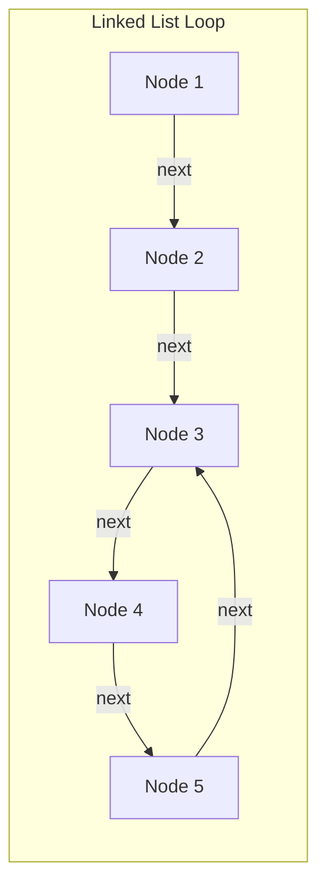
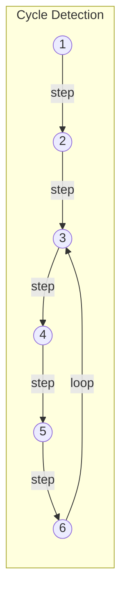
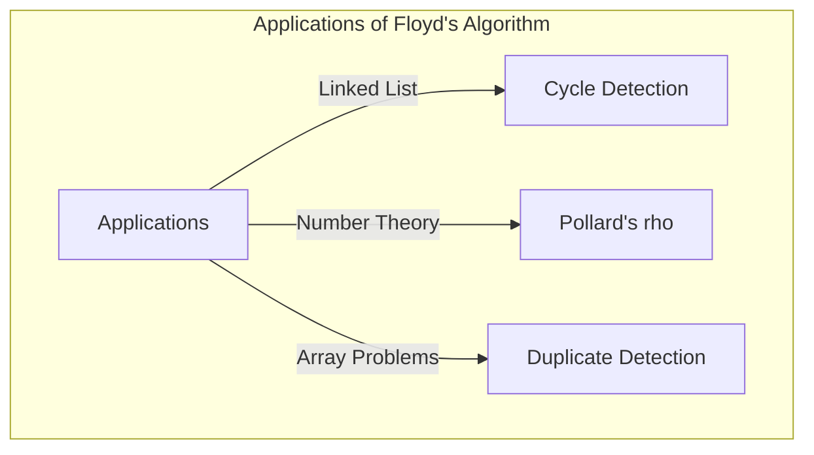

## Introducción

En ciencias de la computación, es extremadamente importante detectar si una estructura de datos contiene "ciclos" inesperados para evitar, entre otras cosas, bucles infinitos. Uno de los métodos más elegantes para resolver este problema es el **Algoritmo de detección de ciclos de Floyd** (Floyd's cycle-finding algorithm).

Este algoritmo utiliza dos punteros que se mueven a diferentes velocidades (a menudo llamados seudónimamente "liebre" y "tortuga"), por lo que también es ampliamente conocido como el **Algoritmo de la liebre y la tortuga** (Tortoise and Hare Algorithm).

En este artículo, explicaremos en detalle desde el funcionamiento de este algoritmo hasta su contexto matemático, pasando por ejemplos concretos de implementación en C++ y [Rust](https://kenji.blog/es/p/webassembly-wasm-current-future/).

## ¿Qué es la detección de ciclos?

En una lista enlazada simple (Singly Linked List) o en un grafo de transición de estados, cuando al seguir los nodos se llega de nuevo a un nodo visitado anteriormente, a esta estructura se le llama **ciclo**.

Por ejemplo, consideremos la siguiente lista enlazada.



En esta lista, después del Node 5 viene el Node 3, formando un bucle de 3 → 4 → 5 → 3. Un programa que simplemente la recorra en orden caería en este bucle y provocaría un bucle infinito.

Una forma de solucionar esto es registrar los nodos visitados en un conjunto hash (como `std::unordered_set`). Sin embargo, este método requiere un espacio de memoria adicional de $O(N)$ proporcional al número de nodos. El **Algoritmo de detección de ciclos de Floyd** permite detectar el ciclo en un tiempo de $O(N)$ manteniendo el espacio de memoria en $O(1)$.

## Cómo funciona el algoritmo de la liebre y la tortuga

La idea del algoritmo es muy intuitiva. Imagina a dos corredores corriendo en la misma pista a diferentes velocidades. Si la pista es recta, el corredor rápido dejará atrás al lento. Sin embargo, si la pista contiene un circuito (ciclo), el corredor rápido eventualmente le sacará una "vuelta de ventaja" al corredor lento y lo alcanzará por detrás.

Específicamente, se utilizan los siguientes dos punteros:

1. **Tortuga (Tortoise)**: Avanza un nodo por cada paso.
2. **Liebre (Hare)**: Avanza dos nodos por cada paso.

Haciendo que ambos comiencen al mismo tiempo, si la liebre llega al final (`null`), significa que no hay ciclo. Si existe un ciclo, en algún momento la liebre y la tortuga apuntarán obligatoriamente al mismo nodo.

### Diagrama de funcionamiento

Consideremos un grafo con el siguiente ciclo.



El movimiento de los punteros en cada paso será el siguiente.
(* Tortuga = $T$, Liebre = $H$)

- **Step 0**: $T=1$, $H=1$
- **Step 1**: $T=2$, $H=3$
- **Step 2**: $T=3$, $H=5$
- **Step 3**: $T=4$, $H=3$
- **Step 4**: $T=5$, $H=5$ (¡Aquí coinciden, ciclo detectado!)

## Demostración matemática e identificación del punto de inicio del ciclo

Utilizaremos fórmulas para demostrar que el algoritmo siempre provoca una colisión y cómo identificar el punto de inicio del ciclo (la intersección).

Sea $x$ la distancia desde el inicio de la lista hasta el punto de inicio del ciclo.
Sea $y$ la distancia desde el punto de inicio del ciclo hasta el punto donde colisionan los dos punteros.
Sea $z$ la distancia desde el punto de colisión hasta volver al punto de inicio del ciclo.
Por lo tanto, la longitud total del ciclo es $C = y + z$.

Cuando la tortuga y la liebre colisionan, la distancia recorrida por cada una es la siguiente:

- Distancia de la tortuga: $d_T = x + y$
- Distancia de la liebre: $d_H = x + y + kC$ (donde $k$ es el número de vueltas que dio la liebre al ciclo)

Dado que la liebre se mueve al doble de velocidad que la tortuga, se cumple la siguiente ecuación:

$$ 2 \cdot d_T = d_H $$
$$ 2(x + y) = x + y + kC $$
$$ x + y = kC $$
$$ x = kC - y $$

Como $C = y + z$, tenemos:
$$ x = k(y + z) - y $$
$$ x = (k - 1)(y + z) + z $$
$$ x = (k - 1)C + z $$

Esta ecuación $x = (k - 1)C + z$ tiene un significado muy importante.
Aquí, $k - 1$ es un número entero mayor o igual a $0$.
Esto indica que "la distancia $x$ desde el principio de la lista hasta el punto de inicio del ciclo" es igual a "la distancia restante $z$ desde el punto de colisión hasta el punto de inicio del ciclo" más un múltiplo entero de la longitud del ciclo $C$ ($(k-1)C$).

En otras palabras, inmediatamente después de la colisión, **si devolvemos uno de los punteros al principio de la lista y dejamos el otro en el punto de colisión, y luego los avanzamos ambos de a un paso a la vez, se encontrarán inevitablemente en el punto de inicio del ciclo**. Esto se debe a que, mientras el puntero que comenzó desde el principio avanza la distancia $x$ para llegar al inicio del ciclo, el puntero que comenzó desde la colisión avanza la distancia $z$ para llegar al inicio del ciclo, y luego da $(k-1)$ vueltas al ciclo. Como resultado, ambos llegarán al punto de inicio del ciclo exactamente al mismo tiempo y se encontrarán.

## Implementación mediante código

Ahora implementemos la teoría anterior en C++ y [Rust](https://kenji.blog/es/p/webassembly-wasm-current-future/).

### Implementación en C++

Aquí está la implementación de la estructura del nodo de una lista enlazada simple, la función para detectar si existe un ciclo y la función para encontrar el punto de inicio del ciclo.

```cpp
#include <iostream>

// Definición de un nodo de la lista
struct ListNode {
    int val;
    ListNode *next;
    ListNode(int x) : val(x), next(nullptr) {}
};

class Solution {
public:
    // Determina si existe un ciclo
    bool hasCycle(ListNode *head) {
        if (!head || !head->next) return false;
        
        ListNode *slow = head;
        ListNode *fast = head;
        
        while (fast != nullptr && fast->next != nullptr) {
            slow = slow->next;          // La tortuga avanza 1 paso
            fast = fast->next->next;    // La liebre avanza 2 pasos
            
            if (slow == fast) {
                return true; // Si colisionan, hay ciclo
            }
        }
        
        return false; // Si la liebre llega al final, no hay ciclo
    }

    // Devuelve el nodo donde comienza el ciclo
    ListNode *detectCycle(ListNode *head) {
        if (!head || !head->next) return nullptr;
        
        ListNode *slow = head;
        ListNode *fast = head;
        bool cycleExists = false;
        
        while (fast != nullptr && fast->next != nullptr) {
            slow = slow->next;
            fast = fast->next->next;
            
            if (slow == fast) {
                cycleExists = true;
                break;
            }
        }
        
        if (!cycleExists) return nullptr;
        
        // Devolvemos uno de los punteros (aquí 'slow') al principio
        slow = head;
        
        // Los avanzamos de a 1 paso, donde se encuentren es el inicio del ciclo
        while (slow != fast) {
            slow = slow->next;
            fast = fast->next;
        }
        
        return slow;
    }
};

int main() {
    // Construcción de: 1 -> 2 -> 3 -> 4 -> 5 -> 3 (ciclo)
    ListNode* head = new ListNode(1);
    head->next = new ListNode(2);
    head->next = new ListNode(3);
    head->next = new ListNode(4);
    head->next = new ListNode(5);
    head->next->next->next->next->next = head->next->next; // 5 -> 3
    
    Solution sol;
    if (sol.hasCycle(head)) {
        std::cout << "Cycle detected!" << std::endl;
        ListNode* start = sol.detectCycle(head);
        if (start) {
            std::cout << "Cycle starts at node with value: " << start->val << std::endl;
        }
    } else {
        std::cout << "No cycle." << std::endl;
    }
    
    // Para liberar la memoria no basta con 'delete' debido al ciclo (se requiere prevenir el bucle infinito)
    // Normalmente sería necesario romper el ciclo antes de hacer 'delete'.
    return 0;
}
```

### Implementación en [Rust](https://kenji.blog/es/p/webassembly-wasm-current-future/)

En el caso de Rust, debido a las reglas de propiedad (ownership) y préstamo (borrowing), la implementación de listas enlazadas tiende a ser compleja, por lo que en la programación competitiva es común modelar esto como un problema de referencias de índices en un arreglo (o `Vec`).
Aquí mostraremos un ejemplo de implementación utilizando un arreglo que mantiene el "índice siguiente" en lugar del "puntero al siguiente".

```rust
// Consideramos un arreglo que contiene los índices de destino como una lista enlazada virtual
// Ejemplo: arr[i] es el siguiente nodo.
fn has_cycle(arr: &Vec<usize>, start_idx: usize) -> bool {
    if arr.is_empty() {
        return false;
    }
    
    let mut slow = start_idx;
    let mut fast = start_idx;
    
    loop {
        // La tortuga avanza 1 paso
        if slow >= arr.len() { break; }
        slow = arr[slow];
        
        // La liebre avanza 2 pasos
        if fast >= arr.len() { break; }
        fast = arr[fast];
        if fast >= arr.len() { break; }
        fast = arr[fast];
        
        // Detección de colisión
        if slow == fast {
            return true;
        }
    }
    
    false
}

fn detect_cycle_start(arr: &Vec<usize>, start_idx: usize) -> Option<usize> {
    if arr.is_empty() {
        return None;
    }
    
    let mut slow = start_idx;
    let mut fast = start_idx;
    let mut has_cycle = false;
    
    loop {
        if slow >= arr.len() || fast >= arr.len() || arr[fast] >= arr.len() {
            break;
        }
        slow = arr[slow];
        fast = arr[arr[fast]];
        
        if slow == fast {
            has_cycle = true;
            break;
        }
    }
    
    if !has_cycle {
        return None;
    }
    
    // La tortuga regresa al punto de inicio
    slow = start_idx;
    
    // Avanzan 1 paso a la vez
    while slow != fast {
        slow = arr[slow];
        fast = arr[fast];
    }
    
    Some(slow)
}

fn main() {
    // Grafo de transición por índices:
    // 0 -> 1 -> 2 -> 3 -> 4 -> 2 (ciclo que comienza en 2)
    // Si el valor está fuera de rango (ej. usize::MAX) se considera el final, pero aquí construimos un ciclo.
    let graph = vec![1, 2, 3, 4, 2];
    
    if has_cycle(&graph, 0) {
        println!("Cycle detected!");
        if let Some(start) = detect_cycle_start(&graph, 0) {
            println!("Cycle starts at index: {}", start);
        }
    } else {
        println!("No cycle.");
    }
}
```

## Análisis de complejidad

Este algoritmo tiene unas características de rendimiento excelentes.

- **Complejidad de tiempo**: $O(N)$
  La liebre se mueve un máximo de $N$ pasos hasta entrar al ciclo, y una vez en el ciclo, se mueve un máximo de longitud del ciclo $C$ pasos hasta alcanzar a la tortuga. Puesto que $C \le N$, el número total de pasos se mantiene en tiempo lineal.
- **Complejidad de espacio**: $O(1)$
  No es necesario recordar los nodos visitados utilizando un conjunto hash, basta con mantener únicamente dos variables de puntero, por lo que la memoria adicional requerida es de espacio constante.

## Otros ejemplos de aplicación

El algoritmo de detección de ciclos de Floyd no se utiliza únicamente para detectar ciclos en listas enlazadas, sino que se aplica a diversos algoritmos.

1. **Algoritmo $\rho$ (rho) de Pollard para la factorización**:
   Es un algoritmo que encuentra eficientemente los factores primos de números compuestos enormes aprovechando que la secuencia de salida de un generador de números aleatorios entra en un ciclo. Es un poderoso algoritmo de factorización utilizado también en el campo de la criptografía.
2. **Detección de números duplicados (Find the Duplicate Number)**:
   Por ejemplo, supongamos que hay un arreglo con $N+1$ elementos, donde el valor de cada elemento está en el rango de $1$ a $N$. Según el principio del palomar, al menos un número está duplicado. Al tratar los elementos del arreglo como "punteros al siguiente índice", se puede aplicar a la técnica de encontrar la duplicación de elementos como el punto de inicio de un ciclo, manteniendo el espacio del arreglo en $O(1)$. Este es un problema de entrevista de programación muy común en plataformas como LeetCode.
   Específicamente, dado un arreglo `nums`, se define la transición de estados como `next_node = nums[current_node]`. La existencia de un valor duplicado significa que hay transiciones al mismo valor (es decir, el mismo nodo siguiente) desde múltiples índices diferentes, lo que forma la entrada al ciclo. Por lo tanto, al aplicar el algoritmo de la liebre y la tortuga tal cual, se puede identificar el valor duplicado (punto de inicio del ciclo) con una complejidad de tiempo de $O(N)$ y de espacio de $O(1)$.



## Conclusión

En este artículo, hemos explicado el **Algoritmo de detección de ciclos de Floyd** (Algoritmo de la liebre y la tortuga).
Es un método elegante que, partiendo de la sencilla idea de hacer correr dos punteros a diferentes velocidades, permite detectar ciclos e identificar el punto de inicio con un tiempo de $O(N)$ y un espacio de $O(1)$.
Al comprender su fundamento matemático, queda claro por qué al regresar un puntero al principio tras la colisión y hacerlos avanzar a la misma velocidad se puede encontrar el inicio.

En la implementación de estructuras de datos y en la programación competitiva, este algoritmo se convierte en un arma muy poderosa. Te animamos a que intentes implementarlo por ti mismo en C++ o [Rust](https://kenji.blog/es/p/webassembly-wasm-current-future/).
