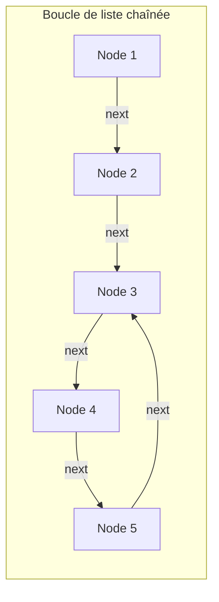
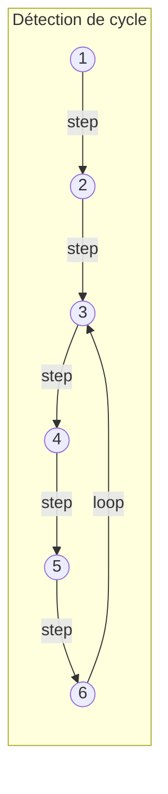
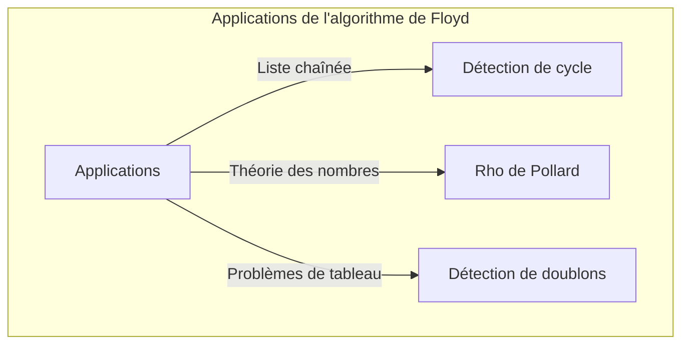

## Introduction

En informatique, il est extrêmement important de détecter la présence d'un éventuel « cycle » inattendu dans une structure de données afin d'éviter les boucles infinies. L'une des méthodes les plus élégantes pour résoudre ce problème est l'**algorithme de détection de cycle de Robert Floyd** (Floyd's cycle-finding algorithm).

Cet algorithme utilise deux pointeurs qui se déplacent à des vitesses différentes (souvent appelés le « lièvre » et la « tortue ») et est donc largement connu sous le nom d'**algorithme du lièvre et de la tortue** (Tortoise and Hare Algorithm).

Cet article explique en détail le fonctionnement de cet algorithme, ses fondements mathématiques, ainsi que des exemples concrets d'implémentation en C++ et en [Rust](https://kenji.blog/fr/p/webassembly-wasm-current-future/).

## Qu'est-ce que la détection de cycle ?

Dans une liste chaînée simple (Singly Linked List) ou un graphe de transition d'états, si l'on parcourt les nœuds à partir d'un certain point et que l'on atteint de nouveau un nœud déjà visité, cette structure forme ce qu'on appelle un **cycle**.

Prenons l'exemple de la liste chaînée ci-dessous.



Dans cette liste, le nœud qui suit Node 5 est Node 3, formant ainsi une boucle : 3 → 4 → 5 → 3. Un programme qui se contenterait de parcourir séquentiellement cette liste s'enliserait dans cette boucle, provoquant une boucle infinie.

Une façon de résoudre ce problème serait d'enregistrer les nœuds visités dans un ensemble de hachage (par exemple, `std::unordered_set`). Cependant, cette méthode nécessite un espace mémoire supplémentaire de $O(N)$, proportionnel au nombre de nœuds. L'**algorithme de détection de cycle de Floyd** permet, lui, de détecter un cycle en un temps de $O(N)$ tout en maintenant l'espace mémoire à $O(1)$.

## Le fonctionnement de l'algorithme du lièvre et de la tortue

L'idée de l'algorithme est très intuitive. Imaginez deux coureurs sur la même piste qui courent à des vitesses différentes. Si la piste est une ligne droite, le coureur rapide laissera le coureur lent derrière lui. En revanche, si la piste comporte un circuit fermé (un cycle), le coureur rapide finira par avoir « un tour d'avance » et rattrapera le coureur lent par derrière.

Plus précisément, on utilise les deux pointeurs suivants :

1. **La tortue (Tortoise)** : Avance d'un nœud à chaque étape.
2. **Le lièvre (Hare)** : Avance de deux nœuds à chaque étape.

Si on les fait démarrer en même temps, et que le lièvre atteint la fin (`null`), il n'y a pas de cycle. S'il existe un cycle, le lièvre et la tortue finiront inévitablement par pointer sur le même nœud à un moment donné.

### Schéma du fonctionnement

Considérons le graphe suivant avec un cycle.



Le déplacement des pointeurs à chaque étape se déroule ainsi :
(* Tortue = $T$, Lièvre = $H$)

- **Étape 0** : $T=1$, $H=1$
- **Étape 1** : $T=2$, $H=3$
- **Étape 2** : $T=3$, $H=5$
- **Étape 3** : $T=4$, $H=3$
- **Étape 4** : $T=5$, $H=5$ (Ici ils coïncident, cycle détecté !)

## Preuve mathématique et détermination du point de départ du cycle

Nous allons prouver mathématiquement que l'algorithme provoque inévitablement une collision, et expliquer comment déterminer le point de départ du cycle (l'intersection).

Soit $x$ la distance entre le début de la liste et le point de départ du cycle.
Soit $y$ la distance entre le point de départ du cycle et le point où les deux pointeurs entrent en collision.
Soit $z$ la distance du point de collision pour revenir au point de départ du cycle.
Par conséquent, la longueur totale du cycle est $C = y + z$.

Lorsque la tortue et le lièvre entrent en collision, leurs distances parcourues sont les suivantes :

- Distance de la tortue : $d_T = x + y$
- Distance du lièvre : $d_H = x + y + kC$ ($k$ étant le nombre de tours de cycle effectués par le lièvre)

Puisque le lièvre se déplace deux fois plus vite que la tortue, l'équation suivante est vérifiée :

$$ 2 \cdot d_T = d_H $$
$$ 2(x + y) = x + y + kC $$
$$ x + y = kC $$
$$ x = kC - y $$

Sachant que $C = y + z$, on a :
$$ x = k(y + z) - y $$
$$ x = (k - 1)(y + z) + z $$
$$ x = (k - 1)C + z $$

Cette équation $x = (k - 1)C + z$ a une signification très importante.
Ici, $k - 1$ est un entier positif ou nul.
Elle indique que « la distance $x$ du début de la liste au point de départ du cycle » est égale à « la distance restante $z$ du point de collision au point de départ du cycle », plus un multiple entier de la longueur du cycle $C$ (soit $(k-1)C$).

En d'autres termes, juste après la collision, **si vous replacez un pointeur au début de la liste, et laissez l'autre au point de collision, puis que vous avancez les deux pointeurs d'un seul pas à la fois, ils se rencontreront obligatoirement au point de départ du cycle**. Pourquoi ? Parce que pendant que le pointeur partant du début parcourt la distance $x$ pour atteindre le point de départ du cycle, le pointeur partant du point de collision parcourt la distance $z$ pour y arriver, et fait ensuite $(k-1)$ tours complets de cycle. En fin de compte, ils arrivent exactement au même moment au point de départ du cycle et se rejoignent.

## Implémentation du code

Implémentons maintenant la théorie ci-dessus en C++ et en [Rust](https://kenji.blog/fr/p/webassembly-wasm-current-future/).

### Implémentation en C++

Voici la structure du nœud d'une liste chaînée simple, ainsi que la fonction permettant de détecter s'il y a un cycle, et celle pour trouver le nœud de départ du cycle.

```cpp
#include <iostream>

// Définition du nœud de la liste
struct ListNode {
    int val;
    ListNode *next;
    ListNode(int x) : val(x), next(nullptr) {}
};

class Solution {
public:
    // Déterminer s'il existe un cycle
    bool hasCycle(ListNode *head) {
        if (!head || !head->next) return false;
        
        ListNode *slow = head;
        ListNode *fast = head;
        
        while (fast != nullptr && fast->next != nullptr) {
            slow = slow->next;          // La tortue avance d'1 pas
            fast = fast->next->next;    // Le lièvre avance de 2 pas
            
            if (slow == fast) {
                return true; // Si collision, il y a un cycle
            }
        }
        
        return false; // Si le lièvre atteint la ligne d'arrivée, pas de cycle
    }

    // Renvoie le nœud du point de départ du cycle
    ListNode *detectCycle(ListNode *head) {
        if (!head || !head->next) return nullptr;
        
        ListNode *slow = head;
        ListNode *fast = head;
        bool cycleExists = false;
        
        while (fast != nullptr && fast->next != nullptr) {
            slow = slow->next;
            fast = fast->next->next;
            
            if (slow == fast) {
                cycleExists = true;
                break;
            }
        }
        
        if (!cycleExists) return nullptr;
        
        // On ramène un des deux (ici 'slow') au début
        slow = head;
        
        // On avance les deux d'1 pas à la fois, le lieu de rencontre est le point de départ du cycle
        while (slow != fast) {
            slow = slow->next;
            fast = fast->next;
        }
        
        return slow;
    }
};

int main() {
    // Construction de 1 -> 2 -> 3 -> 4 -> 5 -> 3 (cycle)
    ListNode* head = new ListNode(1);
    head->next = new ListNode(2);
    head->next = new ListNode(3);
    head->next = new ListNode(4);
    head->next = new ListNode(5);
    head->next->next->next->next->next = head->next->next; // 5 -> 3
    
    Solution sol;
    if (sol.hasCycle(head)) {
        std::cout << "Cycle detected!" << std::endl;
        ListNode* start = sol.detectCycle(head);
        if (start) {
            std::cout << "Cycle starts at node with value: " << start->val << std::endl;
        }
    } else {
        std::cout << "No cycle." << std::endl;
    }
    
    // À cause du cycle, une simple suppression (delete) entraînerait une boucle infinie
    // En théorie, il faudrait briser le cycle avant de supprimer la mémoire.
    return 0;
}
```

### Implémentation en [Rust](https://kenji.blog/fr/p/webassembly-wasm-current-future/)

En [Rust](https://kenji.blog/fr/p/programming-languages-history-paradigm-evolution/), les règles de possession (ownership) et d'emprunt (borrowing) rendent souvent l'implémentation de listes chaînées complexe. Cependant, il est fréquent en programmation compétitive de modéliser cela comme un problème de référence d'indices sur un tableau (ou `Vec`).
Voici un exemple d'implémentation utilisant un tableau dont les valeurs représentent l'« indice suivant » plutôt qu'un pointeur vers le nœud suivant.

```rust
// On considère qu'un tableau dont chaque élément contient l'indice suivant est une liste chaînée virtuelle
// Exemple: arr[i] est le nœud suivant.
fn has_cycle(arr: &Vec<usize>, start_idx: usize) -> bool {
    if arr.is_empty() {
        return false;
    }
    
    let mut slow = start_idx;
    let mut fast = start_idx;
    
    loop {
        // La tortue avance d'1 pas
        if slow >= arr.len() { break; }
        slow = arr[slow];
        
        // Le lièvre avance de 2 pas
        if fast >= arr.len() { break; }
        fast = arr[fast];
        if fast >= arr.len() { break; }
        fast = arr[fast];
        
        // Détection de collision
        if slow == fast {
            return true;
        }
    }
    
    false
}

fn detect_cycle_start(arr: &Vec<usize>, start_idx: usize) -> Option<usize> {
    if arr.is_empty() {
        return None;
    }
    
    let mut slow = start_idx;
    let mut fast = start_idx;
    let mut has_cycle = false;
    
    loop {
        if slow >= arr.len() || fast >= arr.len() || arr[fast] >= arr.len() {
            break;
        }
        slow = arr[slow];
        fast = arr[arr[fast]];
        
        if slow == fast {
            has_cycle = true;
            break;
        }
    }
    
    if !has_cycle {
        return None;
    }
    
    // On ramène la tortue au point de départ
    slow = start_idx;
    
    // On avance d'un pas à la fois
    while slow != fast {
        slow = arr[slow];
        fast = arr[fast];
    }
    
    Some(slow)
}

fn main() {
    // Graphe de transitions par indices :
    // 0 -> 1 -> 2 -> 3 -> 4 -> 2 (Cycle commençant à 2)
    // Si la valeur est hors limite (ex: usize::MAX), c'est la fin, mais ici on construit avec un cycle.
    let graph = vec![1, 2, 3, 4, 2];
    
    if has_cycle(&graph, 0) {
        println!("Cycle detected!");
        if let Some(start) = detect_cycle_start(&graph, 0) {
            println!("Cycle starts at index: {}", start);
        }
    } else {
        println!("No cycle.");
    }
}
```

## Analyse de la complexité

Cet algorithme présente de très bonnes caractéristiques de performance.

- **Complexité temporelle** : $O(N)$
  Le lièvre se déplace au maximum de $N$ étapes avant d'entrer dans le cycle, et une fois dans le cycle, il effectue au maximum $C$ (la longueur du cycle) étapes avant de rattraper la tortue. Comme $C \le N$, le nombre total d'étapes reste en temps linéaire.
- **Complexité spatiale** : $O(1)$
  Il n'est pas nécessaire de stocker les nœuds visités dans une structure comme un ensemble de hachage. Seuls deux pointeurs doivent être maintenus, ce qui limite l'utilisation de mémoire supplémentaire à un espace constant.

## Autres applications

L'algorithme de détection de cycle de Floyd ne se limite pas aux listes chaînées, mais est également appliqué à d'autres algorithmes.

1. **L'algorithme de factorisation rho ($\rho$) de Pollard** :
   C'est un algorithme pour trouver efficacement les facteurs premiers d'un grand nombre composite, en exploitant le fait que la séquence de sortie d'un générateur de nombres aléatoires finit par entrer dans un cycle. Il s'agit d'un puissant algorithme de factorisation, très utilisé en cryptographie.
2. **Détection du nombre dupliqué (Find the Duplicate Number)** :
   Supposons par exemple qu'il existe un tableau de taille $N+1$ dont les éléments sont compris entre $1$ et $N$. D'après le principe des tiroirs de Dirichlet (ou principe des pigeons), au moins un nombre est dupliqué en double. En considérant les éléments du tableau comme des « pointeurs vers l'indice suivant », on peut conserver une complexité spatiale de $O(1)$ et détecter le doublon en cherchant le point de départ du cycle. C'est un exercice fréquent dans les entretiens de programmation sur LeetCode, etc.
   Concrètement, si on a un tableau `nums`, la transition d'état est définie par `next_node = nums[current_node]`. La présence d'une valeur dupliquée signifie qu'il y a des transitions menant à la même valeur (donc au même nœud suivant) à partir d'indices différents, formant l'entrée du cycle. Ainsi, en appliquant directement l'algorithme du lièvre et de la tortue, on peut déterminer la valeur dupliquée (le point de départ du cycle) avec une complexité temporelle $O(N)$ et spatiale $O(1)$.



## Résumé

Dans cet article, nous avons expliqué l'**Algorithme de détection de cycle de Robert Floyd** (Algorithme du lièvre et de la tortue).
C'est une méthode élégante qui permet la détection d'un cycle et l'identification de son point de départ en un temps $O(N)$ et avec un espace $O(1)$, grâce à l'idée simple de faire courir deux pointeurs à des vitesses différentes.
La démonstration mathématique permet de comprendre clairement pourquoi en replaçant un pointeur au début après la collision, et en les faisant avancer à la même vitesse, on peut trouver le point de départ.

Lors de la mise en œuvre de structures de données et lors de la programmation compétitive, cet algorithme est une arme très puissante. N'hésitez pas à vous exercer à l'implémenter en C++ ou en [Rust](https://kenji.blog/fr/p/webassembly-wasm-current-future/).
