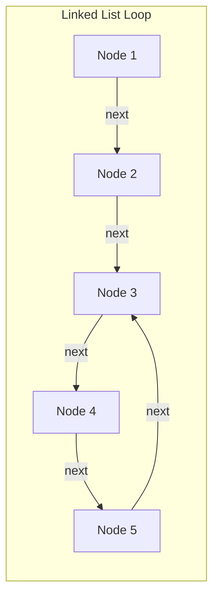
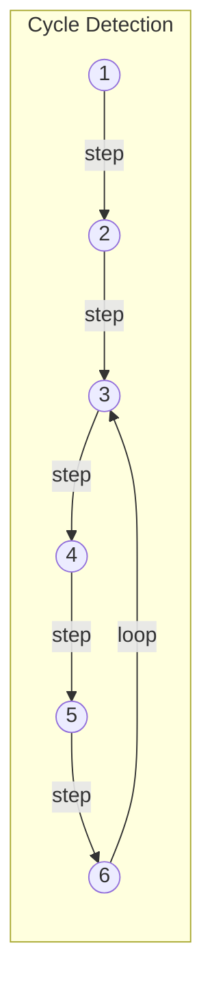
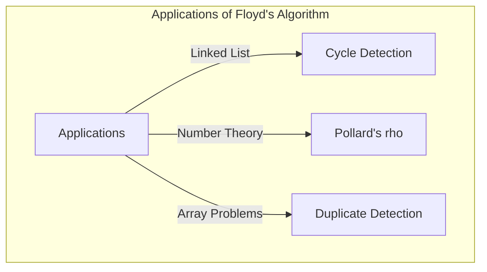

## परिचय

कंप्यूटर विज्ञान में, यह पता लगाना बहुत महत्वपूर्ण है कि क्या डेटा संरचनाओं में कोई अप्रत्याशित "चक्र (साइकिल)" मौजूद है, ताकि अनंत लूप से बचा जा सके। इस समस्या को हल करने के लिए सबसे शानदार तरीकों में से एक **रॉबर्ट फ्लॉयड का साइकिल-फाइंडिंग एल्गोरिदम** (Floyd's cycle-finding algorithm) है।

इस एल्गोरिदम को **कछुआ और खरगोश एल्गोरिदम** (Tortoise and Hare Algorithm) के रूप में भी जाना जाता है क्योंकि यह दो पॉइंटर्स का उपयोग करता है जो अलग-अलग गति (जिन्हें छद्म रूप से "खरगोश" और "कछुआ" कहा जाता है) से चलते हैं।

इस लेख में, हम इस एल्गोरिदम के तंत्र से लेकर इसके गणितीय पृष्ठभूमि, और C++ तथा [Rust](https://kenji.blog/hi/p/webassembly-wasm-current-future/) के उपयोग से विशिष्ट कार्यान्वयन उदाहरणों तक सब कुछ विस्तार से बताएंगे।

## चक्र (साइकिल) का पता लगाना क्या है?

सिंगली लिंक्ड लिस्ट (Singly Linked List) या स्टेट ट्रांज़िशन ग्राफ़ में, यदि आप एक नोड से दूसरे नोड पर जाते हैं और एक ऐसी संरचना में पहुँच जाते हैं जहाँ आप पहले देखे गए नोड पर फिर से पहुँच जाते हैं, तो इसे **चक्र (साइकिल)** कहा जाता है।

उदाहरण के लिए, निम्नलिखित लिंक्ड लिस्ट पर विचार करें।



इस सूची में, Node 5 के बाद Node 3 आता है, जिससे 3 → 4 → 5 → 3 का एक लूप बनता है। जो प्रोग्राम केवल क्रम में चलता है वह इस लूप में फंस जाएगा और अनंत लूप का कारण बनेगा।

इससे निपटने का एक तरीका यह है कि देखे गए नोड्स को हैश सेट (जैसे `std::unordered_set`) में रिकॉर्ड किया जाए। हालाँकि, इस विधि के लिए $O(N)$ की अतिरिक्त मेमोरी स्पेस की आवश्यकता होती है, जो नोड्स की संख्या के समानुपाती होती है। **फ्लॉयड का साइकिल-फाइंडिंग एल्गोरिदम** मेमोरी स्पेस को $O(1)$ तक सीमित रखते हुए $O(N)$ समय में साइकिल का पता लगा सकता है।

## कछुआ और खरगोश एल्गोरिदम कैसे काम करता है

एल्गोरिदम का विचार बहुत सहज है। एक ही ट्रैक पर अलग-अलग गति से दौड़ने वाले दो धावकों की कल्पना करें। यदि ट्रैक एक सीधी रेखा है, तो तेज़ धावक धीमे धावक को पीछे छोड़ देगा। हालाँकि, यदि ट्रैक में एक सर्किट (चक्र) शामिल है, तो तेज़ धावक अंततः धीमे धावक को एक "लैप" से पीछे छोड़ देगा और पीछे से उसके पास आ जाएगा।

विशेष रूप से, निम्नलिखित दो पॉइंटर्स का उपयोग किया जाता है।

1. **कछुआ (Tortoise)** : प्रति चरण 1 नोड आगे बढ़ता है।
2. **खरगोश (Hare)** : प्रति चरण 2 नोड आगे बढ़ता है।

दोनों एक ही समय में शुरू होते हैं, और यदि खरगोश अंत (`null`) तक पहुँच जाता है, तो कोई चक्र मौजूद नहीं है। यदि कोई चक्र मौजूद है, तो खरगोश और कछुआ निश्चित रूप से किसी बिंदु पर एक ही नोड को इंगित करेंगे।

### क्रिया का चित्रण

आइए निम्नलिखित जैसे चक्र वाले ग्राफ पर विचार करें।



प्रत्येक चरण के लिए पॉइंटर्स की गति इस प्रकार है।
(※ कछुआ = $T$, खरगोश = $H$)

- **Step 0**: $T=1$, $H=1$
- **Step 1**: $T=2$, $H=3$
- **Step 2**: $T=3$, $H=5$
- **Step 3**: $T=4$, $H=3$
- **Step 4**: $T=5$, $H=5$ (यहाँ मेल खाता है, चक्र का पता चला!)

## गणितीय प्रमाण और चक्र की शुरुआत की पहचान करना

आइए गणितीय सूत्रों का उपयोग करके साबित करें कि एल्गोरिदम हमेशा टकराएगा और हम यह कैसे पता लगा सकते हैं कि चक्र कहाँ से शुरू होता है (प्रतिच्छेदन)।

मान लें कि सूची की शुरुआत से चक्र की शुरुआत तक की दूरी $x$ है।
चक्र की शुरुआत से उस बिंदु तक की दूरी जहां दो पॉइंटर्स टकराते हैं, उसे $y$ मान लें।
टकराव के बिंदु से चक्र की शुरुआत में लौटने की दूरी $z$ मान लें।
इसलिए, चक्र की कुल लंबाई $C = y + z$ है।

जब कछुआ और खरगोश टकराते हैं, तो उनकी संबंधित यात्रा की दूरियां इस प्रकार होती हैं:

- कछुए द्वारा तय की गई दूरी: $d_T = x + y$
- खरगोश द्वारा तय की गई दूरी: $d_H = x + y + kC$ ($k$ खरगोश द्वारा चक्र के चारों ओर लगाए गए चक्करों की संख्या है)

चूंकि खरगोश कछुए से दोगुनी गति से चलता है, इसलिए निम्नलिखित समीकरण सत्य है।

$$ 2 \cdot d_T = d_H $$
$$ 2(x + y) = x + y + kC $$
$$ x + y = kC $$
$$ x = kC - y $$

यहाँ, चूंकि $C = y + z$ है,
$$ x = k(y + z) - y $$
$$ x = (k - 1)(y + z) + z $$
$$ x = (k - 1)C + z $$

यह समीकरण $x = (k - 1)C + z$ बहुत महत्वपूर्ण अर्थ रखता है।
जहाँ $k - 1$, $0$ या उससे बड़ा पूर्णांक है।
यह दर्शाता है कि "सूची की शुरुआत से चक्र की शुरुआत तक की दूरी $x$" "टकराव के बिंदु से चक्र की शुरुआत तक की शेष दूरी $z$" के बराबर है, जिसमें चक्र की लंबाई $C$ का एक पूर्णांक गुणक ($(k-1)C$) जोड़ा गया है।

दूसरे शब्दों में, इसके तुरंत बाद टकराव होता है, **यदि आप एक पॉइंटर को सूची की शुरुआत में वापस कर देते हैं और दूसरे पॉइंटर को टकराव बिंदु पर छोड़ देते हैं, और दोनों को एक-एक कदम आगे बढ़ाते हैं, तो वे निश्चित रूप से चक्र के आरंभिक बिंदु पर मिलेंगे**। ऐसा इसलिए है क्योंकि शुरुआत से शुरू होने वाले पॉइंटर को दूरी $x$ तय करके चक्र के शुरुआती बिंदु तक पहुंचने में जो समय लगता है, उसी दौरान टकराव बिंदु से शुरू होने वाला पॉइंटर दूरी $z$ तय करेगा और चक्र के शुरुआती बिंदु पर पहुंचेगा, और फिर चक्र के चारों ओर $(k-1)$ चक्कर लगाएगा। परिणामस्वरूप, दोनों ठीक एक ही समय में चक्र के शुरुआती बिंदु पर पहुंचेंगे और मिल जाएंगे।

## कोड कार्यान्वयन

अब, आइए C++ और [Rust](https://kenji.blog/hi/p/webassembly-wasm-current-future/) में उपरोक्त सिद्धांत को लागू करें।

### C++ कार्यान्वयन

यहाँ सिंगली लिंक्ड लिस्ट के लिए एक नोड स्ट्रक्चर, साइकिल की जाँच करने वाला फ़ंक्शन, और साइकिल का शुरुआती नोड खोजने वाले फ़ंक्शन का कार्यान्वयन दिया गया है।

```cpp
#include <iostream>

// सूची नोड परिभाषा
struct ListNode {
    int val;
    ListNode *next;
    ListNode(int x) : val(x), next(nullptr) {}
};

class Solution {
public:
    // जांचें कि क्या कोई चक्र मौजूद है
    bool hasCycle(ListNode *head) {
        if (!head || !head->next) return false;
        
        ListNode *slow = head;
        ListNode *fast = head;
        
        while (fast != nullptr && fast->next != nullptr) {
            slow = slow->next;          // कछुआ 1 कदम आगे बढ़ता है
            fast = fast->next->next;    // खरगोश 2 कदम आगे बढ़ता है
            
            if (slow == fast) {
                return true; // यदि वे टकराते हैं तो चक्र मौजूद है
            }
        }
        
        return false; // यदि खरगोश लक्ष्य तक पहुंचता है, तो कोई चक्र नहीं है
    }

    // चक्र के शुरुआती बिंदु का नोड वापस करें
    ListNode *detectCycle(ListNode *head) {
        if (!head || !head->next) return nullptr;
        
        ListNode *slow = head;
        ListNode *fast = head;
        bool cycleExists = false;
        
        while (fast != nullptr && fast->next != nullptr) {
            slow = slow->next;
            fast = fast->next->next;
            
            if (slow == fast) {
                cycleExists = true;
                break;
            }
        }
        
        if (!cycleExists) return nullptr;
        
        // एक को (यहाँ slow) शुरुआत में वापस करें
        slow = head;
        
        // दोनों को एक-एक कदम आगे बढ़ाएं, जहां वे मिलते हैं वह चक्र का शुरुआती बिंदु है
        while (slow != fast) {
            slow = slow->next;
            fast = fast->next;
        }
        
        return slow;
    }
};

int main() {
    // 1 -> 2 -> 3 -> 4 -> 5 -> 3 (साइकिल) का निर्माण
    ListNode* head = new ListNode(1);
    head->next = new ListNode(2);
    head->next = new ListNode(3);
    head->next = new ListNode(4);
    head->next = new ListNode(5);
    head->next->next->next->next->next = head->next->next; // 5 -> 3
    
    Solution sol;
    if (sol.hasCycle(head)) {
        std::cout << "Cycle detected!" << std::endl;
        ListNode* start = sol.detectCycle(head);
        if (start) {
            std::cout << "Cycle starts at node with value: " << start->val << std::endl;
        }
    } else {
        std::cout << "No cycle." << std::endl;
    }
    
    // चूंकि एक चक्र है, हम इसे केवल delete नहीं कर सकते (अनंत लूप से बचना चाहिए)
    // मूल रूप से, delete करने से पहले चक्र को तोड़ने की आवश्यकता होती है।
    return 0;
}
```

### [Rust](https://kenji.blog/hi/p/webassembly-wasm-current-future/) कार्यान्वयन

Rust में, स्वामित्व (ownership) और उधार (borrowing) के नियमों के कारण लिंक्ड लिस्ट का कार्यान्वयन जटिल हो जाता है, लेकिन प्रतिस्पर्धी प्रोग्रामिंग आदि में इसे सरणी (या `Vec`) पर इंडेक्स संदर्भ समस्या के रूप में मॉडल करना आम है।
यहाँ एक कार्यान्वयन उदाहरण दिया गया है जो "अगले पॉइंटर" के बजाय "अगला इंडेक्स" रखने वाली सरणी का उपयोग करता है।

```rust
// मान लें कि अगले इंडेक्स की एक सरणी एक आभासी लिंक्ड लिस्ट है
// उदाहरण: arr[i] अगला नोड है।
fn has_cycle(arr: &Vec<usize>, start_idx: usize) -> bool {
    if arr.is_empty() {
        return false;
    }
    
    let mut slow = start_idx;
    let mut fast = start_idx;
    
    loop {
        // कछुए को 1 कदम आगे बढ़ाएं
        if slow >= arr.len() { break; }
        slow = arr[slow];
        
        // खरगोश को 2 कदम आगे बढ़ाएं
        if fast >= arr.len() { break; }
        fast = arr[fast];
        if fast >= arr.len() { break; }
        fast = arr[fast];
        
        // टकराव का पता लगाना
        if slow == fast {
            return true;
        }
    }
    
    false
}

fn detect_cycle_start(arr: &Vec<usize>, start_idx: usize) -> Option<usize> {
    if arr.is_empty() {
        return None;
    }
    
    let mut slow = start_idx;
    let mut fast = start_idx;
    let mut has_cycle = false;
    
    loop {
        if slow >= arr.len() || fast >= arr.len() || arr[fast] >= arr.len() {
            break;
        }
        slow = arr[slow];
        fast = arr[arr[fast]];
        
        if slow == fast {
            has_cycle = true;
            break;
        }
    }
    
    if !has_cycle {
        return None;
    }
    
    // कछुए को शुरुआती बिंदु पर लौटाएं
    slow = start_idx;
    
    // एक-एक कदम आगे बढ़ाएं
    while slow != fast {
        slow = arr[slow];
        fast = arr[fast];
    }
    
    Some(slow)
}

fn main() {
    // इंडेक्स द्वारा ट्रांज़िशन ग्राफ़:
    // 0 -> 1 -> 2 -> 3 -> 4 -> 2 (2 से शुरू होने वाला चक्र)
    // यदि मान सीमा से बाहर है (जैसे usize::MAX), तो यह अंत है, लेकिन इस बार हम एक चक्र बना रहे हैं।
    let graph = vec![1, 2, 3, 4, 2];
    
    if has_cycle(&graph, 0) {
        println!("Cycle detected!");
        if let Some(start) = detect_cycle_start(&graph, 0) {
            println!("Cycle starts at index: {}", start);
        }
    } else {
        println!("No cycle.");
    }
}
```

## जटिलता विश्लेषण (Complexity Analysis)

इस एल्गोरिदम में बहुत अच्छे प्रदर्शन लक्षण हैं।

- **समय जटिलता**: $O(N)$
  खरगोश चक्र में प्रवेश करने तक अधिकतम $N$ कदम चलता है, और चक्र में प्रवेश करने के बाद, वह कछुए के पास पहुंचने तक अधिकतम $C$ (चक्र की लंबाई) कदम चलता है। चूँकि $C \le N$, कुल चरणों की संख्या रैखिक समय के भीतर रहती है।
- **स्थान जटिलता**: $O(1)$
  देखे गए नोड्स को हैश सेट आदि में याद रखने की कोई आवश्यकता नहीं है, और केवल दो पॉइंटर चर बनाए रखना पर्याप्त है, इसलिए अतिरिक्त मेमोरी का उपयोग निरंतर स्थान (constant space) है।

## अन्य अनुप्रयोग

फ्लॉयड के साइकिल-फाइंडिंग एल्गोरिदम को केवल लिंक्ड लिस्ट में साइकिल का पता लगाने के अलावा, विभिन्न एल्गोरिदम पर लागू किया गया है।

1. **पोलार्ड की $\rho$ (rho) फैक्टराइजेशन विधि**:
   यह एक एल्गोरिदम है जो एक बड़ी समग्र संख्या के अभाज्य कारकों (prime factors) को कुशलतापूर्वक ढूंढता है, इस तथ्य का उपयोग करते हुए कि यादृच्छिक संख्या जनरेटर का आउटपुट अनुक्रम एक चक्र में प्रवेश करता है। यह एक शक्तिशाली फैक्टराइजेशन एल्गोरिदम है जिसका उपयोग क्रिप्टोग्राफी के क्षेत्र में भी किया जाता है।
2. **डुप्लिकेट संख्या ढूँढना (Find the Duplicate Number)**:
   उदाहरण के लिए, मान लें कि आपके पास $N+1$ तत्वों के साथ एक सरणी है, और प्रत्येक तत्व का मान $1$ से $N$ की सीमा में है। पिजनहोल सिद्धांत (Pigeonhole principle) के अनुसार, कम से कम एक संख्या डुप्लिकेट है। सरणी में तत्वों को "अगले इंडेक्स के पॉइंटर्स" के रूप में मानकर, इसे डुप्लिकेट तत्वों को एक चक्र के शुरुआती बिंदु के रूप में खोजने की विधि पर लागू किया जा सकता है, जबकि सरणी स्थान को $O(1)$ पर रखा जाता है। यह LeetCode जैसी प्रसिद्ध कोडिंग साक्षात्कार समस्याओं में भी अक्सर प्रकट होता है।
   विशेष रूप से, जब सरणी `nums` दी जाती है, तो राज्य संक्रमण को `next_node = nums[current_node]` के रूप में परिभाषित किया जाता है। एक डुप्लिकेट मान के अस्तित्व का मतलब है कि कई अलग-अलग इंडेक्स से एक ही मान (यानी वही अगला नोड) में संक्रमण मौजूद है, जो एक चक्र का प्रवेश द्वार बनाता है। इसलिए, कछुआ और खरगोश एल्गोरिदम को सीधे लागू करके, आप $O(N)$ समय जटिलता और $O(1)$ स्थान जटिलता के साथ डुप्लिकेट मान (चक्र की शुरुआत) को इंगित कर सकते हैं।



## निष्कर्ष

इस लेख में, हमने **रॉबर्ट फ्लॉयड का साइकिल-फाइंडिंग एल्गोरिदम** (कछुआ और खरगोश एल्गोरिदम) समझाया।
यद्यपि यह अलग-अलग गति पर दो पॉइंटर्स चलाने का एक सरल विचार है, यह एक शानदार तरीका है जो $O(N)$ समय और $O(1)$ स्थान में चक्र का पता लगाने और शुरुआती बिंदु की पहचान को सक्षम बनाता है।
गणितीय समर्थन को समझकर, यह स्पष्ट हो गया होगा कि टकराव के बाद एक पॉइंटर को शुरुआत में वापस करने और उसे उसी गति से आगे बढ़ाने से शुरुआती बिंदु का पता क्यों चल सकता है।

डेटा संरचनाओं को लागू करते समय या प्रतिस्पर्धी प्रोग्रामिंग में यह एल्गोरिदम एक बहुत शक्तिशाली उपकरण हो सकता है। इसे स्वयं आज़माएँ और इसे C++ या [Rust](https://kenji.blog/hi/p/webassembly-wasm-current-future/) में लागू करें।
