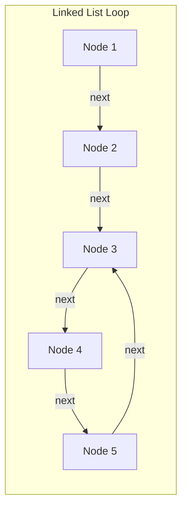
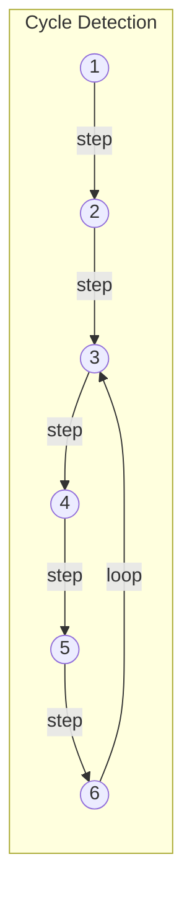
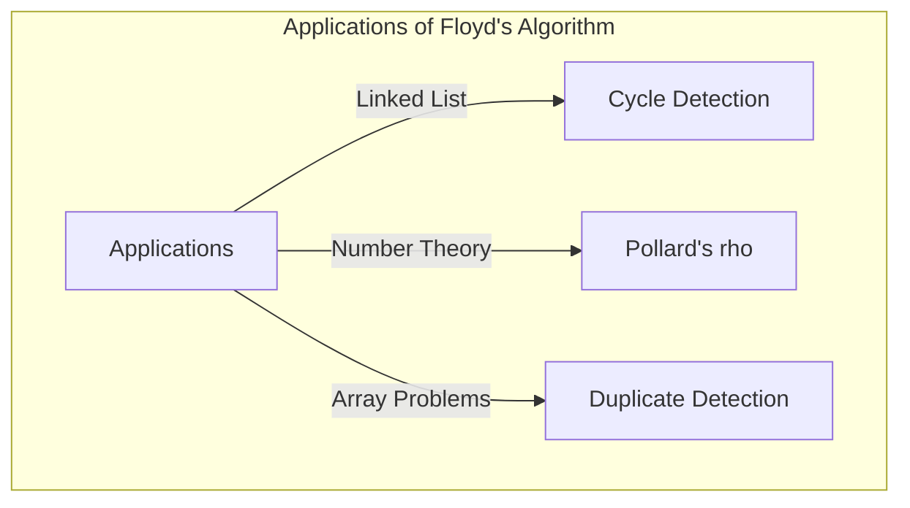

## Pendahuluan

Dalam ilmu komputer, mendeteksi apakah ada "siklus" (putaran) tak terduga yang terkandung dalam struktur data sangatlah penting, misalnya untuk mencegah loop tak terbatas (infinite loop). Salah satu metode paling elegan untuk memecahkan masalah ini adalah **Algoritma Deteksi Siklus Robert Floyd** (Floyd's cycle-finding algorithm).

Algoritma ini sering disebut juga sebagai **Algoritma Kura-kura dan Kelinci** (Tortoise and Hare Algorithm) karena menggunakan dua penunjuk (pointer) dengan kecepatan yang berbeda (sering kali dianalogikan sebagai "kelinci" dan "kura-kura").

Dalam artikel ini, kita akan membahas secara detail mulai dari cara kerja algoritma ini, latar belakang matematisnya, hingga contoh implementasi konkret menggunakan C++ dan [Rust](https://kenji.blog/id/p/webassembly-wasm-current-future/).

## Apa itu Deteksi Siklus?

Dalam senarai berantai tunggal (Singly Linked List) atau graf transisi status, struktur di mana saat kita menelusuri dari suatu node lalu kembali lagi ke node yang telah dikunjungi sebelumnya disebut dengan **siklus** (cycle).

Sebagai contoh, mari kita pertimbangkan linked list berikut:



Dalam list ini, setelah Node 5 adalah Node 3, sehingga terbentuk loop 3 → 4 → 5 → 3. Dalam program yang sekadar menelusuri urutannya saja, akan terjebak dalam loop ini dan menyebabkan infinite loop.

Salah satu cara untuk mengatasinya adalah dengan merekam node yang telah dikunjungi ke dalam sebuah hash set (seperti `std::unordered_set`). Namun, metode ini membutuhkan ruang memori tambahan sebesar $O(N)$ yang sebanding dengan jumlah node. **Algoritma Deteksi Siklus Floyd** memungkinkan kita mendeteksi siklus dalam waktu $O(N)$ sambil menekan penggunaan memori pada $O(1)$.

## Cara Kerja Algoritma Kura-kura dan Kelinci

Ide algoritma ini sangat intuitif. Bayangkan dua pelari berlari di lintasan yang sama dengan kecepatan berbeda. Jika lintasannya lurus, pelari yang cepat akan terus meninggalkan pelari yang lambat. Namun, jika lintasannya memiliki sirkuit putaran (siklus), pelari yang cepat pada akhirnya akan "melewati satu putaran penuh" (overlapping) dari pelari yang lambat, dan menyusulnya dari belakang.

Secara khusus, kita menggunakan dua pointer berikut:

1. **Kura-kura (Tortoise)**: Maju ke 1 node berikutnya pada setiap langkah.
2. **Kelinci (Hare)**: Maju ke 2 node berikutnya pada setiap langkah.

Keduanya dimulai secara bersamaan, dan jika Kelinci mencapai ujung (`null`), berarti tidak ada siklus. Jika terdapat siklus, Kelinci dan Kura-kura pasti akan menunjuk pada node yang sama di suatu titik tertentu.

### Ilustrasi Pergerakan

Mari kita pertimbangkan graf dengan siklus berikut:



Perpindahan pointer pada setiap langkah adalah sebagai berikut:
(※ Kura-kura = $T$, Kelinci = $H$)

- **Step 0**: $T=1$, $H=1$
- **Step 1**: $T=2$, $H=3$
- **Step 2**: $T=3$, $H=5$
- **Step 3**: $T=4$, $H=3$
- **Step 4**: $T=5$, $H=5$ (Di sini mereka bertemu, siklus terdeteksi!)

## Bukti Matematis dan Penentuan Titik Awal Siklus

Kita akan membuktikan menggunakan persamaan matematis bahwa algoritma ini pasti akan mengalami tumbukan (bertemu) dan bagaimana menemukan titik awal siklus (titik persimpangan).

Misalkan jarak dari titik awal list ke titik awal siklus adalah $x$.
Misalkan jarak dari titik awal siklus ke titik di mana kedua pointer bertumbukan adalah $y$.
Misalkan jarak dari titik tumbukan hingga kembali ke titik awal siklus adalah $z$.
Oleh karena itu, panjang total siklus adalah $C = y + z$.

Saat Kura-kura dan Kelinci bertumbukan, jarak yang ditempuh masing-masing adalah:

- Jarak tempuh Kura-kura: $d_T = x + y$
- Jarak tempuh Kelinci: $d_H = x + y + kC$ ($k$ adalah jumlah putaran yang dilakukan Kelinci pada siklus)

Karena Kelinci bergerak dua kali lebih cepat dari Kura-kura, maka persamaan berikut berlaku:

$$ 2 \cdot d_T = d_H $$
$$ 2(x + y) = x + y + kC $$
$$ x + y = kC $$
$$ x = kC - y $$

Karena $C = y + z$, maka:
$$ x = k(y + z) - y $$
$$ x = (k - 1)(y + z) + z $$
$$ x = (k - 1)C + z $$

Persamaan $x = (k - 1)C + z$ ini memiliki arti yang sangat penting.
Di sini $k - 1$ adalah bilangan bulat $0$ atau lebih.
Hal ini menunjukkan bahwa "jarak $x$ dari awal list ke titik awal siklus" sama dengan "sisa jarak $z$ dari titik tumbukan ke titik awal siklus" ditambah kelipatan bulat dari panjang siklus $C$ ($(k-1)C$).

Artinya, segera setelah tumbukan terjadi, **jika kita mengembalikan salah satu pointer ke awal list dan membiarkan pointer lainnya di titik tumbukan, lalu keduanya melangkah 1 langkah secara bersamaan, mereka pasti akan bertemu tepat di titik awal siklus**. Hal ini terbukti karena ketika pointer dari titik awal berjalan sejauh $x$ untuk mencapai titik awal siklus, pointer dari titik tumbukan akan berjalan sejauh $z$ untuk mencapai titik awal siklus dan kemudian berputar $(k-1)$ kali di siklus. Hasilnya, keduanya mencapai titik awal siklus pada saat yang bersamaan dan bertemu.

## Implementasi dengan Kode

Mari kita terapkan teori di atas ke dalam implementasi C++ dan [Rust](https://kenji.blog/id/p/webassembly-wasm-current-future/).

### Implementasi dengan C++

Berikut adalah implementasi struktur node untuk list berantai tunggal, fungsi untuk mendeteksi siklus, dan fungsi untuk menemukan titik awal siklus.

```cpp
#include <iostream>

// Definisi node list
struct ListNode {
    int val;
    ListNode *next;
    ListNode(int x) : val(x), next(nullptr) {}
};

class Solution {
public:
    // Menentukan apakah ada siklus
    bool hasCycle(ListNode *head) {
        if (!head || !head->next) return false;
        
        ListNode *slow = head;
        ListNode *fast = head;
        
        while (fast != nullptr && fast->next != nullptr) {
            slow = slow->next;          // Kura-kura melangkah 1 langkah
            fast = fast->next->next;    // Kelinci melangkah 2 langkah
            
            if (slow == fast) {
                return true; // Jika bertumbukan berarti ada siklus
            }
        }
        
        return false; // Jika Kelinci mencapai ujung, tidak ada siklus
    }

    // Mengembalikan node di titik awal siklus
    ListNode *detectCycle(ListNode *head) {
        if (!head || !head->next) return nullptr;
        
        ListNode *slow = head;
        ListNode *fast = head;
        bool cycleExists = false;
        
        while (fast != nullptr && fast->next != nullptr) {
            slow = slow->next;
            fast = fast->next->next;
            
            if (slow == fast) {
                cycleExists = true;
                break;
            }
        }
        
        if (!cycleExists) return nullptr;
        
        // Kembalikan salah satu (di sini slow) ke awal
        slow = head;
        
        // Keduanya melangkah 1 langkah; tempat bertemu adalah titik awal siklus
        while (slow != fast) {
            slow = slow->next;
            fast = fast->next;
        }
        
        return slow;
    }
};

int main() {
    // Membangun 1 -> 2 -> 3 -> 4 -> 5 -> 3(siklus)
    ListNode* head = new ListNode(1);
    head->next = new ListNode(2);
    head->next = new ListNode(3);
    head->next = new ListNode(4);
    head->next = new ListNode(5);
    head->next->next->next->next->next = head->next->next; // 5 -> 3
    
    Solution sol;
    if (sol.hasCycle(head)) {
        std::cout << "Cycle detected!" << std::endl;
        ListNode* start = sol.detectCycle(head);
        if (start) {
            std::cout << "Cycle starts at node with value: " << start->val << std::endl;
        }
    } else {
        std::cout << "No cycle." << std::endl;
    }
    
    // Pembebasan memori tidak dapat dilakukan dengan delete sederhana karena ada siklus (perlu mencegah infinite loop)
    // Sebenarnya diperlukan pemrosesan seperti memutus siklus terlebih dahulu sebelum delete.
    return 0;
}
```

### Implementasi dengan [Rust](https://kenji.blog/id/p/webassembly-wasm-current-future/)

Dalam kasus [Rust](https://kenji.blog/id/p/programming-languages-history-paradigm-evolution/), implementasi linked list cenderung rumit karena aturan kepemilikan (ownership) dan peminjaman (borrowing). Oleh karena itu, pada pemrograman kompetitif dsb, biasanya masalah dimodelkan sebagai referensi indeks pada array (atau `Vec`).
Di sini kami tunjukkan contoh implementasi menggunakan array di mana "pointer ke berikutnya" diganti dengan penyimpanan "indeks berikutnya".

```rust
// Array yang menyimpan indeks tujuan berikutnya dianggap sebagai linked list virtual
// Contoh: arr[i] adalah node berikutnya.
fn has_cycle(arr: &Vec<usize>, start_idx: usize) -> bool {
    if arr.is_empty() {
        return false;
    }
    
    let mut slow = start_idx;
    let mut fast = start_idx;
    
    loop {
        // Kura-kura maju 1 langkah
        if slow >= arr.len() { break; }
        slow = arr[slow];
        
        // Kelinci maju 2 langkah
        if fast >= arr.len() { break; }
        fast = arr[fast];
        if fast >= arr.len() { break; }
        fast = arr[fast];
        
        // Pengecekan tumbukan
        if slow == fast {
            return true;
        }
    }
    
    false
}

fn detect_cycle_start(arr: &Vec<usize>, start_idx: usize) -> Option<usize> {
    if arr.is_empty() {
        return None;
    }
    
    let mut slow = start_idx;
    let mut fast = start_idx;
    let mut has_cycle = false;
    
    loop {
        if slow >= arr.len() || fast >= arr.len() || arr[fast] >= arr.len() {
            break;
        }
        slow = arr[slow];
        fast = arr[arr[fast]];
        
        if slow == fast {
            has_cycle = true;
            break;
        }
    }
    
    if !has_cycle {
        return None;
    }
    
    // Kembalikan Kura-kura ke titik awal
    slow = start_idx;
    
    // Maju 1 langkah demi 1 langkah
    while slow != fast {
        slow = arr[slow];
        fast = arr[fast];
    }
    
    Some(slow)
}

fn main() {
    // Graf transisi berbasis indeks:
    // 0 -> 1 -> 2 -> 3 -> 4 -> 2 (siklus yang dimulai dari 2)
    // Jika nilai berada di luar jangkauan (contoh: usize::MAX), maka dianggap akhir, tapi kali ini kita buat yang memiliki siklus.
    let graph = vec![1, 2, 3, 4, 2];
    
    if has_cycle(&graph, 0) {
        println!("Cycle detected!");
        if let Some(start) = detect_cycle_start(&graph, 0) {
            println!("Cycle starts at index: {}", start);
        }
    } else {
        println!("No cycle.");
    }
}
```

## Analisis Kompleksitas

Algoritma ini memiliki karakteristik performa yang sangat baik.

- **Kompleksitas Waktu**: $O(N)$
  Kelinci berpindah hingga maksimum $N$ langkah untuk memasuki siklus, dan setelah masuk siklus, akan butuh maksimum $C$ langkah untuk menyusul Kura-kura (di mana $C$ adalah panjang siklus). Karena $C \le N$, jumlah total langkah berada dalam waktu linier.
- **Kompleksitas Ruang**: $O(1)$
  Tidak perlu mengingat node yang dikunjungi menggunakan hash set dan sebagainya, cukup menyimpan 2 variabel pointer, sehingga penggunaan memori tambahannya adalah ruang konstan.

## Contoh Aplikasi Lainnya

Algoritma Deteksi Siklus Floyd bukan hanya untuk mendeteksi siklus dalam linked list, melainkan juga diterapkan dalam berbagai algoritma lain.

1. **Faktorisasi prima $\rho$ (rho) dari Pollard**:
   Algoritma untuk menemukan faktor prima dari angka komposit yang sangat besar secara efisien, dengan memanfaatkan fakta bahwa deret keluaran generator angka acak memasuki siklus. Ini adalah algoritma faktorisasi prima yang sangat kuat yang juga digunakan di bidang kriptografi.
2. **Mendeteksi angka yang berulang (Find the Duplicate Number)**:
   Misalnya terdapat array berukuran $N+1$ dengan nilai tiap elemen dari rentang $1$ hingga $N$. Menurut prinsip Sarang Merpati (Pigeonhole principle), pasti ada setidaknya satu angka yang berulang. Dengan memperlakukan elemen array sebagai "pointer ke indeks berikutnya", kita bisa mendeteksi elemen berulang sebagai titik awal dari siklus dan menjaga ruang array tetap $O(1)$. Ini sering muncul sebagai soal wawancara coding populer di LeetCode.
   Secara khusus, dengan array `nums`, kita dapat mendefinisikan transisi state sebagai `next_node = nums[current_node]`. Fakta adanya nilai yang berulang mengimplikasikan adanya transisi dari indeks-indeks yang berbeda ke nilai yang sama (artinya node yang dituju sama), sehingga membentuk pintu masuk ke siklus. Oleh karena itu, kita dapat langsung menerapkan algoritma Kura-kura dan Kelinci untuk menentukan nilai berulang tersebut (titik awal siklus) dengan kompleksitas waktu $O(N)$ dan ruang $O(1)$.



## Kesimpulan

Dalam artikel ini, kita telah membahas **Algoritma Deteksi Siklus Robert Floyd** (Algoritma Kura-kura dan Kelinci).
Ini adalah metode elegan yang memungkinkan deteksi siklus serta penentuan titik awal siklus dalam waktu $O(N)$ dan memori $O(1)$ dengan pemikiran sederhana menjalankan dua pointer yang memiliki kecepatan berbeda.
Dengan memahami dasar matematisnya, kami harap Anda dapat memahami dengan jelas alasan mengapa setelah tumbukan, dengan mengembalikan satu pointer ke titik awal dan memajukan keduanya dengan kecepatan yang sama, mereka akan menemukan titik awal siklus.

Dalam implementasi struktur data dan pemrograman kompetitif, algoritma ini menjadi alat yang sangat kuat. Silakan coba mengimplementasikannya secara mandiri menggunakan C++ atau [Rust](https://kenji.blog/id/p/webassembly-wasm-current-future/).
