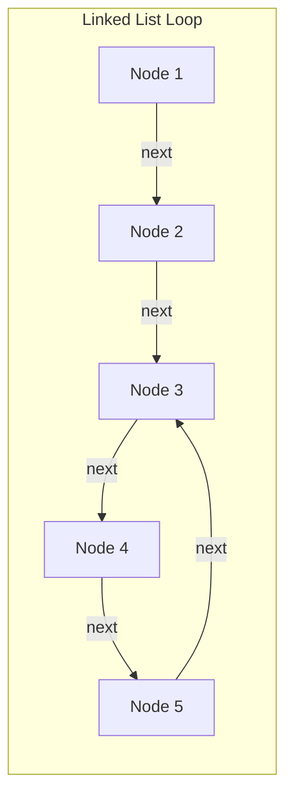
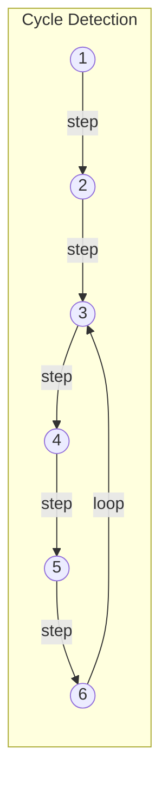
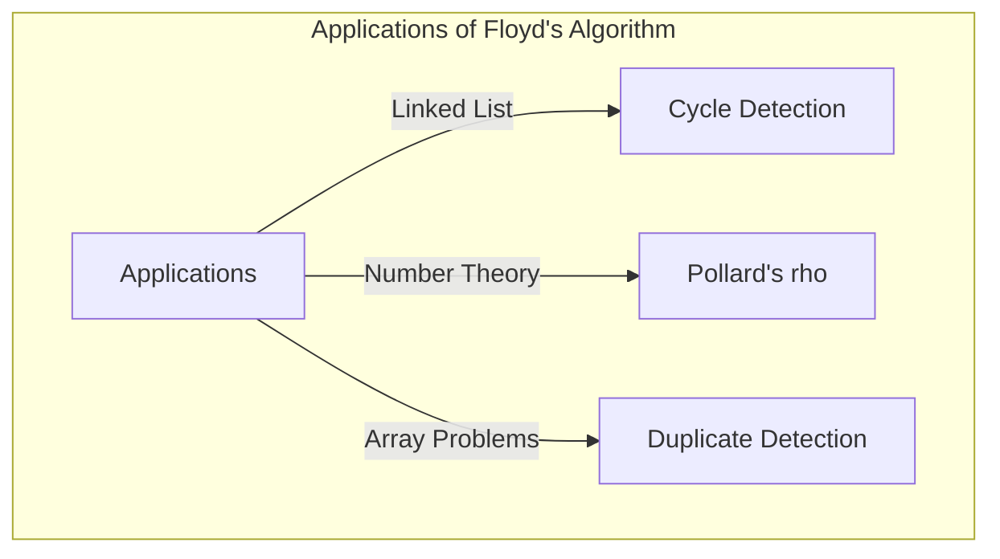

## 시작하며

컴퓨터 사이언스에서 데이터 구조 안에 예기치 않은 '순환(사이클)'이 포함되어 있지 않은지 검출하는 것은 무한 루프를 방지하기 위해 매우 중요합니다. 이 문제를 해결하기 위한 가장 우아한 기법 중 하나가 ** 로버트 플로이드의 순환 검출법 ** (Floyd's cycle-finding algorithm)입니다.

이 알고리즘은 속도가 다른 두 개의 포인터(유사적으로 '토끼'와 '거북이'로 불리는 경우가 많음)를 사용하기 때문에 ** 토끼와 거북이 알고리즘 ** (Tortoise and Hare Algorithm)으로도 널리 알려져 있습니다.

본 기사에서는 이 알고리즘의 구조부터 수학적 배경, 그리고 C++과 Rust에 의한 구체적인 구현 예시까지 자세히 해설합니다.

## 순환 검출이란 무엇인가?

단방향 연결 리스트(Singly Linked List)나 상태 전이 그래프에서 어떤 노드부터 따라갔을 때 이전에 방문했던 노드에 다시 도달해 버리는 구조를 ** 순환(사이클) ** 이라고 부릅니다.

예를 들어, 다음과 같은 연결 리스트를 생각해 봅시다.



이 리스트에서는 Node 5의 다음이 Node 3으로 되어 있어 3 → 4 → 5 → 3이라는 루프가 형성되어 있습니다. 단순히 순서대로 따라가기만 하는 프로그램에서는 이 루프에 빠져 무한 루프를 일으키게 됩니다.

이에 대처하기 위한 한 가지 방법은 방문한 노드를 해시 세트(`std::unordered_set` 등)에 기록해 나가는 것입니다. 그러나 이 방법에서는 노드 수에 비례하는 $O(N)$ 의 추가 메모리 공간이 필요하게 됩니다. 메모리 공간을 $O(1)$ 로 억제하면서 $O(N)$ 의 시간에 순환을 검출할 수 있는 것이 ** 플로이드의 순환 검출법 ** 입니다.

## 토끼와 거북이 알고리즘의 구조

알고리즘의 아이디어는 매우 직관적입니다. 같은 트랙을 다른 속도로 달리는 두 명의 러너를 상상해 보세요. 만약 트랙이 일직선이라면 빠른 러너는 느린 러너를 따돌리기만 할 것입니다. 하지만 트랙에 주회 코스(사이클)가 포함되어 있다면, 빠른 러너는 언젠가 느린 러너를 '한 바퀴 차이'로 뒤처지게 만들어 뒤에서 따라잡게 될 것입니다.

구체적으로는 다음 두 개의 포인터를 사용합니다.

1. ** 거북이(Tortoise) ** : 1스텝에 1개 앞의 노드로 나아간다.
2. ** 토끼(Hare) ** : 1스텝에 2개 앞의 노드로 나아간다.

양쪽을 동시에 출발시켜 토끼가 끝(`null`)에 도달하면 사이클은 존재하지 않습니다. 만약 사이클이 존재하면 반드시 어느 시점에서 토끼와 거북이가 같은 노드를 가리키게 됩니다.

### 동작 도해

다음과 같은 사이클을 가지는 그래프로 생각해 봅니다.



스텝별 포인터의 이동은 다음과 같이 됩니다.
(※ 거북이 = $T$, 토끼 = $H$)

- **Step 0**: $T=1$, $H=1$
- **Step 1**: $T=2$, $H=3$
- **Step 2**: $T=3$, $H=5$
- **Step 3**: $T=4$, $H=3$
- **Step 4**: $T=5$, $H=5$ (여기서 일치, 사이클 검출!)

## 수학적 증명과 사이클의 시작점 특정

알고리즘이 반드시 충돌한다는 것, 그리고 사이클의 시작 지점(교차점)을 특정하는 방법을 수식을 사용하여 증명합니다.

리스트의 시작점에서 사이클의 시작 지점까지의 거리를 $x$ 라고 합니다.
사이클의 시작 지점에서 2개의 포인터가 충돌한 지점까지의 거리를 $y$ 라고 합니다.
충돌한 지점에서 다시 사이클의 시작 지점으로 돌아올 때까지의 거리를 $z$ 라고 합니다.
따라서 사이클의 전체 길이는 $C = y + z$ 가 됩니다.

거북이와 토끼가 충돌했을 때 각각의 이동 거리는 다음과 같습니다.

- 거북이의 이동 거리: $d_T = x + y$
- 토끼의 이동 거리: $d_H = x + y + kC$ ($k$ 는 토끼가 사이클을 돈 횟수)

토끼는 거북이의 2배 속도로 이동하고 있으므로 다음 등식이 성립합니다.

$$ 2 \cdot d_T = d_H $$
$$ 2(x + y) = x + y + kC $$
$$ x + y = kC $$
$$ x = kC - y $$

여기서 $C = y + z$ 이므로,
$$ x = k(y + z) - y $$
$$ x = (k - 1)(y + z) + z $$
$$ x = (k - 1)C + z $$

이 식 $x = (k - 1)C + z$ 는 매우 중요한 의미를 갖습니다.
여기서 $k - 1$ 은 $0$ 이상의 정수입니다.
이것은 '리스트의 첫머리에서 사이클의 시작 지점까지의 거리 $x$'가 '충돌 지점에서 사이클의 시작 지점까지의 남은 거리 $z$'에 사이클 길이 $C$ 의 정수배($(k-1)C$)를 더한 것과 같다는 것을 나타냅니다.

즉, 충돌이 일어난 직후 ** 1개의 포인터를 리스트의 시작점으로 되돌리고, 다른 1개의 포인터를 충돌 지점에 남겨둔 채 양쪽을 1스텝씩 전진시키면 반드시 사이클의 시작 지점에서 만나게 된다는 것 ** 이 증명됩니다. 왜냐하면 시작점에서 출발한 포인터가 거리 $x$ 를 나아가 사이클 시작점에 도달하는 동안, 충돌 지점에서 출발한 포인터는 거리 $z$ 를 나아가 사이클 시작점에 도달하고 그 후 사이클을 $(k-1)$ 바퀴 돌기 때문입니다. 결과적으로 양자는 정확히 같은 타이밍에 사이클 시작 지점에 도달하여 합류하게 됩니다.

## 코드를 통한 구현

그러면 위의 이론을 C++과 Rust로 구현해 보겠습니다.

### C++ 구현

단방향 리스트의 노드 구조체와 순환을 검출하는 함수, 그리고 사이클의 시작점을 찾는 함수의 구현입니다.

```cpp
#include <iostream>

// 리스트의 노드 정의
struct ListNode {
    int val;
    ListNode *next;
    ListNode(int x) : val(x), next(nullptr) {}
};

class Solution {
public:
    // 순환이 존재하는지 여부를 판정한다
    bool hasCycle(ListNode *head) {
        if (!head || !head->next) return false;
        
        ListNode *slow = head;
        ListNode *fast = head;
        
        while (fast != nullptr && fast->next != nullptr) {
            slow = slow->next;          // 거북이는 1보 전진
            fast = fast->next->next;    // 토끼는 2보 전진
            
            if (slow == fast) {
                return true; // 충돌하면 순환 있음
            }
        }
        
        return false; // 토끼가 골에 도달하면 순환 없음
    }

    // 사이클의 시작 지점 노드를 반환한다
    ListNode *detectCycle(ListNode *head) {
        if (!head || !head->next) return nullptr;
        
        ListNode *slow = head;
        ListNode *fast = head;
        bool cycleExists = false;
        
        while (fast != nullptr && fast->next != nullptr) {
            slow = slow->next;
            fast = fast->next->next;
            
            if (slow == fast) {
                cycleExists = true;
                break;
            }
        }
        
        if (!cycleExists) return nullptr;
        
        // 어느 한쪽(여기서는 slow)을 첫머리로 되돌린다
        slow = head;
        
        // 양쪽을 1보씩 전진시켜 만난 장소가 사이클의 시작 지점
        while (slow != fast) {
            slow = slow->next;
            fast = fast->next;
        }
        
        return slow;
    }
};

int main() {
    // 1 -> 2 -> 3 -> 4 -> 5 -> 3(사이클) 의 구축
    ListNode* head = new ListNode(1);
    head->next = new ListNode(2);
    head->next = new ListNode(3);
    head->next = new ListNode(4);
    head->next = new ListNode(5);
    head->next->next->next->next->next = head->next->next; // 5 -> 3
    
    Solution sol;
    if (sol.hasCycle(head)) {
        std::cout << "Cycle detected!" << std::endl;
        ListNode* start = sol.detectCycle(head);
        if (start) {
            std::cout << "Cycle starts at node with value: " << start->val << std::endl;
        }
    } else {
        std::cout << "No cycle." << std::endl;
    }
    
    // 메모리 해제는 사이클이 있으므로 단순한 delete로는 불가(무한 루프 방지 필요)
    // 본래는 사이클을 해소한 후 delete 하는 등의 처리가 필요합니다.
    return 0;
}
```

### Rust 구현

Rust의 경우 소유권과 대여 규칙에 의해 연결 리스트의 구현이 복잡해지기 쉽지만, 배열(또는 `Vec`) 상의 인덱스 참조 문제로 모델링하는 것이 경기 프로그래밍 등에서는 일반적입니다.
여기서는 '다음으로의 포인터' 대신 '다음 인덱스'를 유지하는 배열을 사용한 구현 예시를 나타냅니다.

```rust
// 다음으로 이동할 목적지의 인덱스를 가지는 배열을 가상의 연결 리스트로 간주한다
// 예: arr[i] 가 다음 노드.
fn has_cycle(arr: &Vec<usize>, start_idx: usize) -> bool {
    if arr.is_empty() {
        return false;
    }
    
    let mut slow = start_idx;
    let mut fast = start_idx;
    
    loop {
        // 거북이를 1보 전진시킨다
        if slow >= arr.len() { break; }
        slow = arr[slow];
        
        // 토끼를 2보 전진시킨다
        if fast >= arr.len() { break; }
        fast = arr[fast];
        if fast >= arr.len() { break; }
        fast = arr[fast];
        
        // 충돌 판정
        if slow == fast {
            return true;
        }
    }
    
    false
}

fn detect_cycle_start(arr: &Vec<usize>, start_idx: usize) -> Option<usize> {
    if arr.is_empty() {
        return None;
    }
    
    let mut slow = start_idx;
    let mut fast = start_idx;
    let mut has_cycle = false;
    
    loop {
        if slow >= arr.len() || fast >= arr.len() || arr[fast] >= arr.len() {
            break;
        }
        slow = arr[slow];
        fast = arr[arr[fast]];
        
        if slow == fast {
            has_cycle = true;
            break;
        }
    }
    
    if !has_cycle {
        return None;
    }
    
    // 거북이를 시작 지점으로 되돌린다
    slow = start_idx;
    
    // 1보씩 전진시킨다
    while slow != fast {
        slow = arr[slow];
        fast = arr[fast];
    }
    
    Some(slow)
}

fn main() {
    // 인덱스에 의한 전이 그래프:
    // 0 -> 1 -> 2 -> 3 -> 4 -> 2 (2부터 시작하는 사이클)
    // 값이 범위 밖(예: usize::MAX)이면 끝으로 하지만, 이번에는 사이클 있음을 구축.
    let graph = vec![1, 2, 3, 4, 2];
    
    if has_cycle(&graph, 0) {
        println!("Cycle detected!");
        if let Some(start) = detect_cycle_start(&graph, 0) {
            println!("Cycle starts at index: {}", start);
        }
    } else {
        println!("No cycle.");
    }
}
```

## 계산량 분석

이 알고리즘은 매우 우수한 퍼포먼스 특성을 가지고 있습니다.

- ** 시간 계산량 ** : $O(N)$
  토끼는 사이클에 들어갈 때까지 최대 $N$ 스텝 이동하고, 사이클에 들어간 후에는 거북이를 따라잡을 때까지 최대 사이클 길이 $C$ 스텝 이동합니다. $C \le N$ 이므로 전체 스텝 수는 선형 시간 내에 들어갑니다.
- ** 공간 계산량 ** : $O(1)$
  해시 세트 등에서 방문한 노드를 기억할 필요가 없고, 단지 2개의 포인터 변수를 유지하기만 하면 되므로 추가 메모리 사용량은 상수 공간이 됩니다.

## 기타 응용 예시

플로이드의 순환 검출법은 단순한 연결 리스트의 사이클 검출뿐만 아니라 다양한 알고리즘에 응용되고 있습니다.

1. ** 폴라드의 $\rho$ (로) 소인수 분해법 ** :
   난수 생성기의 출력열이 사이클에 들어가는 것을 이용하여 거대한 합성수의 소인수를 효율적으로 찾는 알고리즘입니다. 암호 분야에서도 이용되는 강력한 소인수 분해 알고리즘입니다.
2. ** 중복되는 숫자의 검출(Find the Duplicate Number) ** :
   예를 들어 요소 수가 $N+1$ 이고 각 요소의 값이 $1$ 부터 $N$ 범위에 있는 배열이 있다고 가정합니다. 비둘기집 원리에 의해 최소한 1개의 숫자는 중복되어 있습니다. 배열 내의 요소를 '다음 인덱스로의 포인터'로 취급함으로써 배열 공간을 $O(1)$ 로 유지한 채 요소의 중복을 사이클의 시작 지점으로서 찾는 기법에 응용할 수 있습니다. LeetCode 등 유명한 코딩 면접 문제에서도 자주 등장합니다.
   구체적으로는 배열 `nums` 가 주어졌을 때 상태 전이를 `next_node = nums[current_node]` 로 정의합니다. 중복되는 값이 존재한다는 것은 여러 개의 다른 인덱스에서 같은 값(즉, 같은 다음 노드)으로의 전이가 존재함을 의미하며, 이것이 사이클의 입구를 형성합니다. 따라서 토끼와 거북이 알고리즘을 그대로 적용함으로써 시간 계산량 $O(N)$, 공간 계산량 $O(1)$ 로 중복되는 값(사이클의 시작점)을 특정할 수 있습니다.



## 정리

본 기사에서는 ** 로버트 플로이드의 순환 검출법 ** (토끼와 거북이 알고리즘)에 대해 해설했습니다.
속도가 다른 2개의 포인터를 달리게 한다는 심플한 발상이면서도 $O(N)$ 의 시간과 $O(1)$ 의 공간으로 사이클 검출과 시작점 특정을 가능하게 하는 우아한 기법입니다.
수학적인 뒷받침을 이해함으로써 왜 충돌 후에 1개의 포인터를 첫머리로 되돌리고 같은 속도로 전진시키면 시작점을 찾을 수 있는지가 명확해졌을 것입니다.

데이터 구조 구현이나 경기 프로그래밍에서 이 알고리즘은 매우 강력한 무기가 됩니다. 꼭 직접 손을 움직여 C++이나 Rust로 구현해 보시기 바랍니다.
