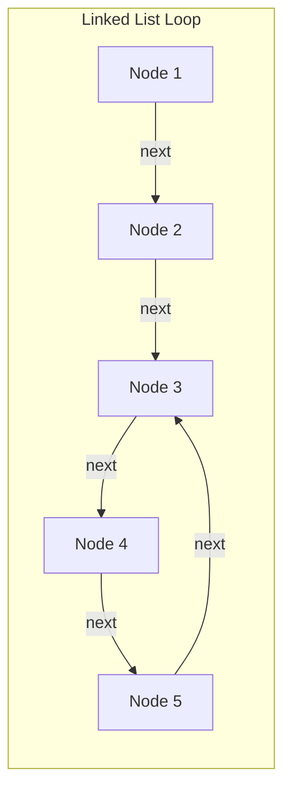
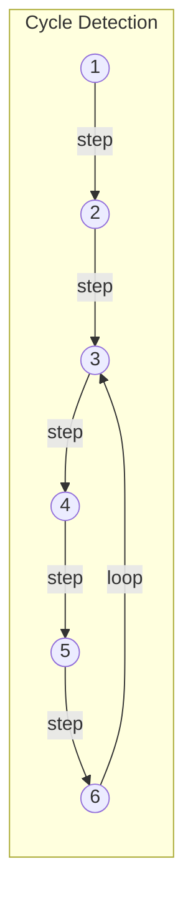
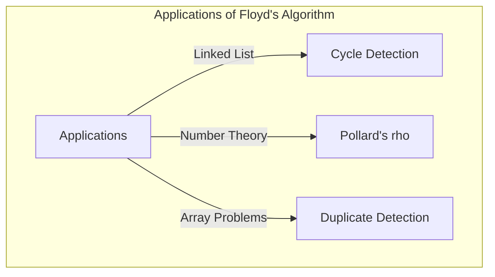

## はじめに

コンピュータサイエンスにおいて、データ構造の中に予期せぬ「循環（サイクル）」が含まれていないかを検出することは、無限ループを防ぐためなどに非常に重要です。この問題を解決するための最もエレガントな手法の1つが、 **ロバート・フロイドの循環検出法** （Floyd's cycle-finding algorithm）です。

このアルゴリズムは、速度の異なる2つのポインタ（擬似的に「ウサギ」と「カメ」と呼ばれることが多い）を用いることから、 **ウサギとカメのアルゴリズム** （Tortoise and Hare Algorithm）としても広く知られています。

本記事では、このアルゴリズムの仕組みから数学的な背景、そして C++ と Rust による具体的な実装例までを詳しく解説します。

## 循環検出とは何か？

単方向連結リスト（Singly Linked List）や状態遷移グラフにおいて、あるノードから辿っていったときに、以前に訪れたノードに再び到達してしまう構造を **循環（サイクル）** と呼びます。

例えば、以下のような連結リストを考えてみましょう。



このリストでは、Node 5 の次が Node 3 となっており、3 → 4 → 5 → 3 というループが形成されています。単に順にたどるだけのプログラムでは、このループに陥り無限ループを引き起こしてしまいます。

これに対処するための一つの方法は、訪れたノードをハッシュセット（`std::unordered_set` など）に記録していくことです。しかし、この方法ではノード数に比例する $O(N)$ の追加のメモリ空間が必要になります。メモリ空間を $O(1)$ に抑えつつ $O(N)$ の時間で循環を検出できるのが、 **フロイドの循環検出法** です。

## ウサギとカメのアルゴリズムの仕組み

アルゴリズムのアイデアは非常に直感的です。同じトラックを異なる速度で走る2人のランナーを想像してください。もしトラックが一直線であれば、速いランナーは遅いランナーを引き離す一方です。しかし、トラックに周回コース（サイクル）が含まれている場合、速いランナーはいずれ遅いランナーを「周回遅れ」にして、後ろから追いつくはずです。

具体的には、以下の2つのポインタを使います。

1. **カメ（Tortoise）** : 1ステップにつき1つ先のノードへ進む。
2. **ウサギ（Hare）** : 1ステップにつき2つ先のノードへ進む。

両者を同時にスタートさせ、ウサギが終端（`null`）に到達すればサイクルは存在しません。もしサイクルが存在すれば、必ずどこかの時点でウサギとカメが同じノードを指すことになります。

### 動作の図解

以下のようなサイクルを持つグラフで考えます。



ステップごとのポインタの移動は以下のようになります。
（※ カメ = $T$、ウサギ = $H$）

- **Step 0**: $T=1$, $H=1$
- **Step 1**: $T=2$, $H=3$
- **Step 2**: $T=3$, $H=5$
- **Step 3**: $T=4$, $H=3$
- **Step 4**: $T=5$, $H=5$ （ここで一致、サイクル検出！）

## 数学的な証明とサイクルの始点の特定

アルゴリズムが必ず衝突すること、そしてサイクルの開始地点（交差点）を特定する方法を数式を用いて証明します。

リストの始点からサイクルの開始地点までの距離を $x$ とします。
サイクルの開始地点から、2つのポインタが衝突した地点までの距離を $y$ とします。
衝突した地点から、再びサイクルの開始地点に戻るまでの距離を $z$ とします。
したがって、サイクルの全体の長さは $C = y + z$ となります。

カメとウサギが衝突したとき、それぞれの移動距離は以下のようになります。

- カメの移動距離: $d_T = x + y$
- ウサギの移動距離: $d_H = x + y + kC$ （$k$ はウサギがサイクルを周回した回数）

ウサギはカメの2倍の速度で移動しているため、以下の等式が成り立ちます。

$$ 2 \cdot d_T = d_H $$
$$ 2(x + y) = x + y + kC $$
$$ x + y = kC $$
$$ x = kC - y $$

ここで、$C = y + z$ であるため、
$$ x = k(y + z) - y $$
$$ x = (k - 1)(y + z) + z $$
$$ x = (k - 1)C + z $$

この式 $x = (k - 1)C + z$ は非常に重要な意味を持ちます。
ここで $k - 1$ は $0$ 以上の整数です。
これは、「リストの先頭からサイクルの開始地点までの距離 $x$」が、「衝突地点からサイクルの開始地点までの残りの距離 $z$」に、サイクル長 $C$ の整数倍（$(k-1)C$）を足したものに等しいことを示しています。

つまり、衝突が起きた直後、 **1つのポインタをリストの始点に戻し、もう1つのポインタを衝突地点に残したまま、両者を1ステップずつ進めると、必ずサイクルの開始地点で出会う** ことが証明されます。なぜなら、始点からスタートしたポインタが距離 $x$ を進んでサイクル開始点に到達する間に、衝突地点からスタートしたポインタは距離 $z$ を進んでサイクル開始点に到達し、その後サイクルを $(k-1)$ 周するからです。結果として両者はぴったり同じタイミングでサイクル開始地点に到達し、合流します。

## コードによる実装

それでは、上記の理論を C++ と Rust で実装してみましょう。

### C++ による実装

単方向リストのノード構造体と、循環を検出する関数、そしてサイクルの始点を見つける関数の実装です。

```cpp
#include <iostream>

// リストのノード定義
struct ListNode {
    int val;
    ListNode *next;
    ListNode(int x) : val(x), next(nullptr) {}
};

class Solution {
public:
    // 循環が存在するかどうかを判定する
    bool hasCycle(ListNode *head) {
        if (!head || !head->next) return false;
        
        ListNode *slow = head;
        ListNode *fast = head;
        
        while (fast != nullptr && fast->next != nullptr) {
            slow = slow->next;          // カメは1歩進む
            fast = fast->next->next;    // ウサギは2歩進む
            
            if (slow == fast) {
                return true; // 衝突したら循環あり
            }
        }
        
        return false; // ウサギがゴールに到達したら循環なし
    }

    // サイクルの開始地点のノードを返す
    ListNode *detectCycle(ListNode *head) {
        if (!head || !head->next) return nullptr;
        
        ListNode *slow = head;
        ListNode *fast = head;
        bool cycleExists = false;
        
        while (fast != nullptr && fast->next != nullptr) {
            slow = slow->next;
            fast = fast->next->next;
            
            if (slow == fast) {
                cycleExists = true;
                break;
            }
        }
        
        if (!cycleExists) return nullptr;
        
        // どちらか一方（ここではslow）を先頭に戻す
        slow = head;
        
        // 両者を1歩ずつ進め、出会った場所がサイクルの開始地点
        while (slow != fast) {
            slow = slow->next;
            fast = fast->next;
        }
        
        return slow;
    }
};

int main() {
    // 1 -> 2 -> 3 -> 4 -> 5 -> 3(サイクル) の構築
    ListNode* head = new ListNode(1);
    head->next = new ListNode(2);
    head->next = new ListNode(3);
    head->next = new ListNode(4);
    head->next = new ListNode(5);
    head->next->next->next->next->next = head->next->next; // 5 -> 3
    
    Solution sol;
    if (sol.hasCycle(head)) {
        std::cout << "Cycle detected!" << std::endl;
        ListNode* start = sol.detectCycle(head);
        if (start) {
            std::cout << "Cycle starts at node with value: " << start->val << std::endl;
        }
    } else {
        std::cout << "No cycle." << std::endl;
    }
    
    // メモリ解放はサイクルがあるため単純なdeleteでは不可（無限ループ防止が必要）
    // 本来はサイクルを解消してからdeleteするなどの処理が必要です。
    return 0;
}
```

### Rust による実装

Rust の場合は、所有権と借用のルールにより連結リストの実装が複雑になりがちですが、配列（または `Vec`）上のインデックス参照問題としてモデル化するのが競技プログラミングなどでは一般的です。
ここでは「次へのポインタ」の代わりに、「次のインデックス」を保持する配列を用いた実装例を示します。

```rust
// 次に移動する先のインデックスを持つ配列を仮想的な連結リストとみなす
// 例: arr[i] が次のノード。
fn has_cycle(arr: &Vec<usize>, start_idx: usize) -> bool {
    if arr.is_empty() {
        return false;
    }
    
    let mut slow = start_idx;
    let mut fast = start_idx;
    
    loop {
        // カメを1歩進める
        if slow >= arr.len() { break; }
        slow = arr[slow];
        
        // ウサギを2歩進める
        if fast >= arr.len() { break; }
        fast = arr[fast];
        if fast >= arr.len() { break; }
        fast = arr[fast];
        
        // 衝突判定
        if slow == fast {
            return true;
        }
    }
    
    false
}

fn detect_cycle_start(arr: &Vec<usize>, start_idx: usize) -> Option<usize> {
    if arr.is_empty() {
        return None;
    }
    
    let mut slow = start_idx;
    let mut fast = start_idx;
    let mut has_cycle = false;
    
    loop {
        if slow >= arr.len() || fast >= arr.len() || arr[fast] >= arr.len() {
            break;
        }
        slow = arr[slow];
        fast = arr[arr[fast]];
        
        if slow == fast {
            has_cycle = true;
            break;
        }
    }
    
    if !has_cycle {
        return None;
    }
    
    // カメをスタート地点に戻す
    slow = start_idx;
    
    // 1歩ずつ進める
    while slow != fast {
        slow = arr[slow];
        fast = arr[fast];
    }
    
    Some(slow)
}

fn main() {
    // インデックスによる遷移グラフ:
    // 0 -> 1 -> 2 -> 3 -> 4 -> 2 (2から始まるサイクル)
    // 値が範囲外(例: usize::MAX)なら終端とするが、今回はサイクルありを構築。
    let graph = vec![1, 2, 3, 4, 2];
    
    if has_cycle(&graph, 0) {
        println!("Cycle detected!");
        if let Some(start) = detect_cycle_start(&graph, 0) {
            println!("Cycle starts at index: {}", start);
        }
    } else {
        println!("No cycle.");
    }
}
```

## 計算量分析

このアルゴリズムは非常に優れたパフォーマンス特性を持っています。

- **時間計算量**: $O(N)$
  ウサギはサイクルに入るまで最大 $N$ ステップ移動し、サイクルに入った後はカメに追いつくまでに最大でサイクル長 $C$ ステップ移動します。$C \le N$ であるため、全体のステップ数は線形時間に収まります。
- **空間計算量**: $O(1)$
  ハッシュセットなどで訪問済みのノードを記憶する必要がなく、単に2つのポインタ変数を維持するだけで済むため、追加のメモリ使用量は定数空間となります。

## その他の応用例

フロイドの循環検出法は、単なる連結リストのサイクル検出だけでなく、さまざまなアルゴリズムに応用されています。

1. **ポラードの $\rho$ （ロー）素因数分解法**:
   乱数生成器の出力列がサイクルに入ることを利用し、巨大な合成数の素因数を効率的に見つけるアルゴリズムです。暗号分野でも利用される強力な素因数分解アルゴリズムです。
2. **重複する数字の検出（Find the Duplicate Number）**:
   例えば、要素数が $N+1$ で、各要素の値が $1$ から $N$ の範囲にある配列があるとします。鳩の巣原理により、少なくとも1つの数字は重複しています。配列内の要素を「次のインデックスへのポインタ」として扱うことで、配列空間を $O(1)$ に保ったまま、要素の重複をサイクルの開始地点として見つける手法に応用できます。LeetCodeなどの有名なコーディング面接問題でも頻出です。
   具体的には、配列 `nums` が与えられたとき、状態遷移を `next_node = nums[current_node]` と定義します。重複する値が存在するということは、複数の異なるインデックスから同じ値（つまり同じ次のノード）への遷移が存在することを意味し、これがサイクルの入り口を形成します。したがって、ウサギとカメのアルゴリズムをそのまま適用することで、時間計算量 $O(N)$、空間計算量 $O(1)$ で重複する値（サイクルの始点）を特定できます。



## まとめ

本記事では、 **ロバート・フロイドの循環検出法** （ウサギとカメのアルゴリズム）について解説しました。
速度の違う2つのポインタを走らせるというシンプルな発想でありながら、$O(N)$ の時間と $O(1)$ の空間でサイクルの検出と始点の特定を可能にするエレガントな手法です。
数学的な裏付けを理解することで、なぜ衝突後に1つのポインタを先頭に戻して同じ速度で進めると始点を見つけられるのかが明確になったと思います。

データ構造の実装や競技プログラミングにおいて、このアルゴリズムは非常に強力な武器となります。ぜひ、実際に手を動かして C++ や Rust で実装してみてください。

