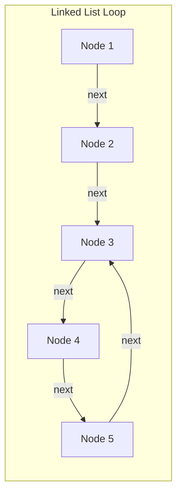
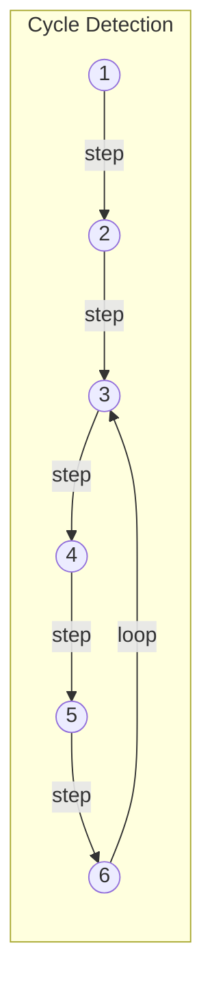
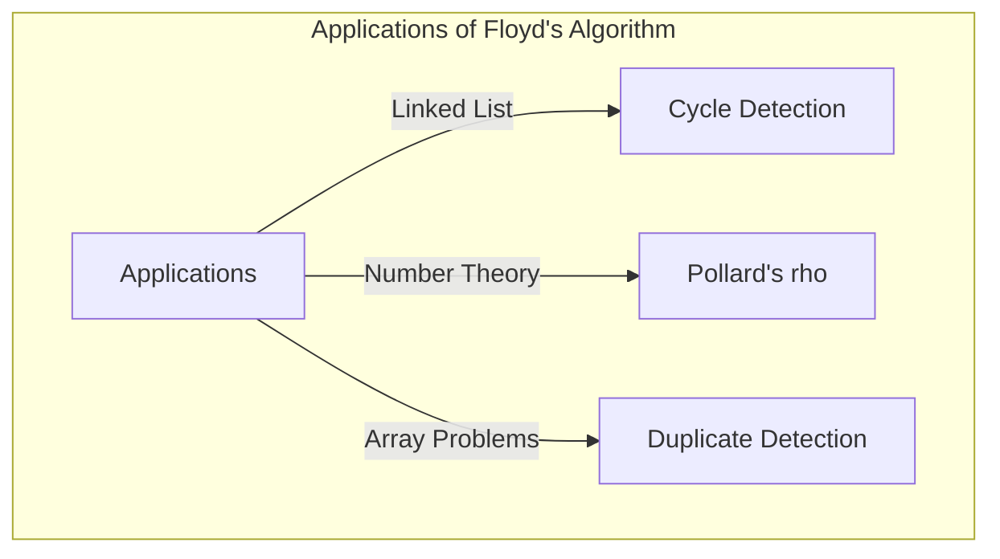

## Introdução

Na ciência da computação, é extremamente importante detetar se existe um "ciclo" inesperado numa estrutura de dados, por exemplo, para evitar loops infinitos. Um dos métodos mais elegantes para resolver este problema é o **Algoritmo de Deteção de Ciclos de Robert Floyd** (Floyd's cycle-finding algorithm).

Este algoritmo utiliza dois ponteiros que se movem a velocidades diferentes (frequentemente chamados de "lebre" e "tartaruga"), sendo por isso amplamente conhecido como o **Algoritmo da Lebre e da Tartaruga** (Tortoise and Hare Algorithm).

Neste artigo, explicaremos detalhadamente o mecanismo deste algoritmo, o seu contexto matemático e exemplos concretos de implementação usando C++ e [Rust](https://kenji.blog/pt/p/webassembly-wasm-current-future/).

## O que é a deteção de ciclos?

Numa lista ligada simples (Singly Linked List) ou num grafo de transição de estados, a estrutura onde, ao seguir os nós, se chega novamente a um nó já visitado é chamada de **ciclo** (ou loop).

Por exemplo, considere a seguinte lista ligada.



Nesta lista, o nó a seguir ao Node 5 é o Node 3, formando um loop 3 → 4 → 5 → 3. Num programa que simplesmente segue os nós em ordem, ele ficaria preso neste loop, causando um loop infinito.

Uma forma de lidar com isso é registar os nós visitados num conjunto hash (como `std::unordered_set`). No entanto, este método requer um espaço de memória adicional de $O(N)$, proporcional ao número de nós. O **Algoritmo de deteção de ciclos de Floyd** permite detetar um ciclo num tempo $O(N)$ enquanto mantém o espaço de memória restrito a $O(1)$.

## Como funciona o algoritmo da lebre e da tartaruga

A ideia do algoritmo é bastante intuitiva. Imagine dois corredores numa pista a correrem a velocidades diferentes. Se a pista for em linha reta, o corredor mais rápido distanciar-se-á do mais lento. No entanto, se a pista incluir um percurso circular (um ciclo), o corredor mais rápido acabará por dar a volta e alcançar o corredor mais lento por trás.

Especificamente, utilizam-se os seguintes dois ponteiros:

1. **Tartaruga (Tortoise)**: Avança um nó em cada passo.
2. **Lebre (Hare)**: Avança dois nós em cada passo.

Iniciando ambos em simultâneo, se a lebre atingir o fim (`null`), não existe ciclo. Se existir um ciclo, haverá inevitavelmente um momento em que a lebre e a tartaruga apontarão para o mesmo nó.

### Ilustração do funcionamento

Consideremos um grafo com o seguinte ciclo.



O movimento dos ponteiros em cada passo é o seguinte:
(* Tartaruga = $T$, Lebre = $H$)

- **Passo 0**: $T=1$, $H=1$
- **Passo 1**: $T=2$, $H=3$
- **Passo 2**: $T=3$, $H=5$
- **Passo 3**: $T=4$, $H=3$
- **Passo 4**: $T=5$, $H=5$ (Eles coincidem aqui, ciclo detetado!)

## Prova matemática e identificação do ponto de início do ciclo

Usaremos fórmulas para provar que o algoritmo sempre resulta numa colisão e também como identificar o ponto de início (interseção) do ciclo.

Seja $x$ a distância desde o início da lista até ao ponto de início do ciclo.
Seja $y$ a distância desde o ponto de início do ciclo até ao ponto onde os dois ponteiros colidiram.
Seja $z$ a distância desde o ponto de colisão até o retorno ao ponto de início do ciclo.
Portanto, o comprimento total do ciclo é $C = y + z$.

Quando a tartaruga e a lebre colidem, as distâncias percorridas por cada um são as seguintes:

- Distância percorrida pela tartaruga: $d_T = x + y$
- Distância percorrida pela lebre: $d_H = x + y + kC$ (onde $k$ é o número de voltas completadas pela lebre no ciclo)

Como a lebre se move a duas vezes a velocidade da tartaruga, a seguinte equação é verdadeira:

$$ 2 \cdot d_T = d_H $$
$$ 2(x + y) = x + y + kC $$
$$ x + y = kC $$
$$ x = kC - y $$

Aqui, visto que $C = y + z$:
$$ x = k(y + z) - y $$
$$ x = (k - 1)(y + z) + z $$
$$ x = (k - 1)C + z $$

Esta equação $x = (k - 1)C + z$ tem um significado muito importante.
Aqui, $k - 1$ é um número inteiro maior ou igual a $0$.
Isto indica que a "distância $x$ do início da lista ao ponto inicial do ciclo" é igual à "distância restante $z$ do ponto de colisão ao ponto inicial do ciclo" mais um múltiplo inteiro do comprimento do ciclo $C$ ($(k-1)C$).

Ou seja, prova-se que **logo após a colisão, se retornarmos um ponteiro ao início da lista e deixarmos o outro ponteiro no ponto de colisão, e depois os avançarmos um passo de cada vez, eles irão inevitavelmente encontrar-se no ponto inicial do ciclo**. Isto ocorre porque enquanto o ponteiro que começa no início avança a distância $x$ para alcançar o ponto inicial do ciclo, o ponteiro que começou no ponto de colisão avançará a distância $z$ para atingir o ponto inicial do ciclo, e então fará $(k-1)$ voltas completas pelo ciclo. Como resultado, ambos atingirão o ponto de início do ciclo exatamente no mesmo instante e convergirão.

## Implementação em código

Vamos implementar a teoria acima em C++ e [Rust](https://kenji.blog/pt/p/webassembly-wasm-current-future/).

### Implementação em C++

Abaixo está a implementação de uma estrutura de nó de lista ligada simples, a função que deteta a existência de um ciclo e a função que encontra o ponto de início do ciclo.

```cpp
#include <iostream>

// Definição do nó da lista
struct ListNode {
    int val;
    ListNode *next;
    ListNode(int x) : val(x), next(nullptr) {}
};

class Solution {
public:
    // Determina se existe um ciclo
    bool hasCycle(ListNode *head) {
        if (!head || !head->next) return false;
        
        ListNode *slow = head;
        ListNode *fast = head;
        
        while (fast != nullptr && fast->next != nullptr) {
            slow = slow->next;          // A tartaruga avança um passo
            fast = fast->next->next;    // A lebre avança dois passos
            
            if (slow == fast) {
                return true; // Colisão indica um ciclo
            }
        }
        
        return false; // Se a lebre atingir o fim, não há ciclo
    }

    // Retorna o nó de início do ciclo
    ListNode *detectCycle(ListNode *head) {
        if (!head || !head->next) return nullptr;
        
        ListNode *slow = head;
        ListNode *fast = head;
        bool cycleExists = false;
        
        while (fast != nullptr && fast->next != nullptr) {
            slow = slow->next;
            fast = fast->next->next;
            
            if (slow == fast) {
                cycleExists = true;
                break;
            }
        }
        
        if (!cycleExists) return nullptr;
        
        // Retorna um deles (aqui, o slow) ao início
        slow = head;
        
        // Ambos avançam um passo de cada vez; o ponto de encontro é o início do ciclo
        while (slow != fast) {
            slow = slow->next;
            fast = fast->next;
        }
        
        return slow;
    }
};

int main() {
    // Construção de 1 -> 2 -> 3 -> 4 -> 5 -> 3 (ciclo)
    ListNode* head = new ListNode(1);
    head->next = new ListNode(2);
    head->next = new ListNode(3);
    head->next = new ListNode(4);
    head->next = new ListNode(5);
    head->next->next->next->next->next = head->next->next; // 5 -> 3
    
    Solution sol;
    if (sol.hasCycle(head)) {
        std::cout << "Cycle detected!" << std::endl;
        ListNode* start = sol.detectCycle(head);
        if (start) {
            std::cout << "Cycle starts at node with value: " << start->val << std::endl;
        }
    } else {
        std::cout << "No cycle." << std::endl;
    }
    
    // A libertação de memória requer a resolução do ciclo antes de um delete simples (para prevenir loops infinitos).
    // Na realidade, é necessário processamento como quebrar o ciclo antes do delete.
    return 0;
}
```

### Implementação em [Rust](https://kenji.blog/pt/p/webassembly-wasm-current-future/)

No caso do [Rust](https://kenji.blog/pt/p/programming-languages-history-paradigm-evolution/), devido às regras de "ownership" (propriedade) e "borrowing" (empréstimo), a implementação de listas ligadas tende a ser complexa. Contudo, em programação competitiva, é comum modelar isto como um problema de referência de índices num array (ou `Vec`).
Aqui, apresentamos um exemplo de implementação utilizando um array onde cada elemento contém "o índice seguinte" em vez de um "ponteiro para o próximo".

```rust
// Array que contém o índice de destino é tratado como uma lista ligada virtual
// Exemplo: arr[i] é o próximo nó.
fn has_cycle(arr: &Vec<usize>, start_idx: usize) -> bool {
    if arr.is_empty() {
        return false;
    }
    
    let mut slow = start_idx;
    let mut fast = start_idx;
    
    loop {
        // A tartaruga avança um passo
        if slow >= arr.len() { break; }
        slow = arr[slow];
        
        // A lebre avança dois passos
        if fast >= arr.len() { break; }
        fast = arr[fast];
        if fast >= arr.len() { break; }
        fast = arr[fast];
        
        // Verificação da colisão
        if slow == fast {
            return true;
        }
    }
    
    false
}

fn detect_cycle_start(arr: &Vec<usize>, start_idx: usize) -> Option<usize> {
    if arr.is_empty() {
        return None;
    }
    
    let mut slow = start_idx;
    let mut fast = start_idx;
    let mut has_cycle = false;
    
    loop {
        if slow >= arr.len() || fast >= arr.len() || arr[fast] >= arr.len() {
            break;
        }
        slow = arr[slow];
        fast = arr[arr[fast]];
        
        if slow == fast {
            has_cycle = true;
            break;
        }
    }
    
    if !has_cycle {
        return None;
    }
    
    // A tartaruga regressa ao ponto de partida
    slow = start_idx;
    
    // Avança um passo de cada vez
    while slow != fast {
        slow = arr[slow];
        fast = arr[fast];
    }
    
    Some(slow)
}

fn main() {
    // Grafo de transição baseado em índices:
    // 0 -> 1 -> 2 -> 3 -> 4 -> 2 (Ciclo que começa no índice 2)
    // Valores fora do intervalo (ex: usize::MAX) funcionam como fins, mas aqui construímos um ciclo.
    let graph = vec![1, 2, 3, 4, 2];
    
    if has_cycle(&graph, 0) {
        println!("Cycle detected!");
        if let Some(start) = detect_cycle_start(&graph, 0) {
            println!("Cycle starts at index: {}", start);
        }
    } else {
        println!("No cycle.");
    }
}
```

## Análise de complexidade

Este algoritmo tem características de desempenho excecionais.

- **Complexidade de tempo**: $O(N)$
  A lebre move-se um máximo de $N$ passos até entrar no ciclo e, uma vez dentro do ciclo, move-se um máximo de $C$ (comprimento do ciclo) passos até alcançar a tartaruga. Como $C \le N$, o número total de passos é concluído num tempo linear.
- **Complexidade de espaço**: $O(1)$
  Não há necessidade de lembrar os nós visitados num conjunto hash ou similar, e como apenas duas variáveis de ponteiro são mantidas, o uso de memória adicional requer apenas um espaço constante.

## Outras aplicações

O algoritmo de deteção de ciclos de Floyd não se limita a detetar ciclos em listas ligadas, mas também é aplicado a vários outros algoritmos.

1. **Método $\rho$ (rho) de Pollard para fatorização de inteiros**:
   Um algoritmo que usa o facto de a sequência de saída de um gerador de números aleatórios formar um ciclo para encontrar eficientemente os fatores primos de um grande número composto. É um algoritmo poderoso de fatorização utilizado no campo da criptografia.
2. **Deteção de números duplicados (Find the Duplicate Number)**:
   Por exemplo, suponha que haja um array com $N+1$ elementos, onde o valor de cada elemento está entre $1$ e $N$. Pelo Princípio da Casa dos Pombos, pelo menos um número está repetido. Tratando os elementos no array como "ponteiros para o próximo índice", este método pode ser aplicado para encontrar valores repetidos (o ponto inicial do ciclo) enquanto mantém o espaço de memória do array em $O(1)$. É frequentemente perguntado em famosas entrevistas de codificação, como as do LeetCode.
   Especificamente, dado um array `nums`, defina a transição de estados como `next_node = nums[current_node]`. A existência de valores duplicados significa que há transições de vários índices diferentes para o mesmo valor (ou seja, o mesmo nó seguinte), e isso forma o início de um ciclo. Portanto, aplicando o algoritmo da lebre e da tartaruga diretamente, o valor duplicado (ponto inicial do ciclo) pode ser identificado com complexidade de tempo $O(N)$ e complexidade de espaço $O(1)$.



## Conclusão

Neste artigo, explicámos o **Algoritmo de deteção de ciclos de Robert Floyd** (Algoritmo da Lebre e da Tartaruga).
Apesar da ideia simples de ter dois ponteiros a moverem-se a velocidades diferentes, é um método elegante que permite a deteção do ciclo e a identificação do seu início em tempo $O(N)$ e espaço $O(1)$.
Ao compreender o contexto matemático, acreditamos que ficou claro por que retornar um dos ponteiros para o início e movê-los à mesma velocidade após a colisão, permite encontrar o ponto de partida do ciclo.

Este algoritmo é uma ferramenta muito poderosa na implementação de estruturas de dados e na programação competitiva. Certifique-se de experimentar e implementá-lo em C++ ou [Rust](https://kenji.blog/pt/p/webassembly-wasm-current-future/).
