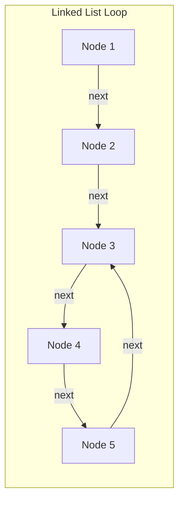
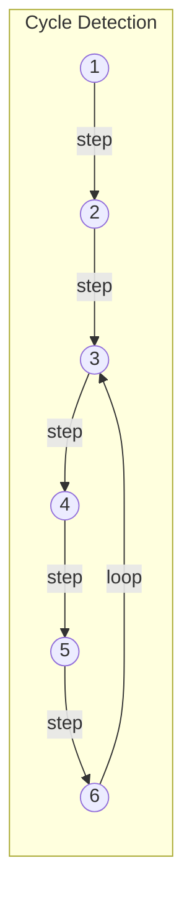
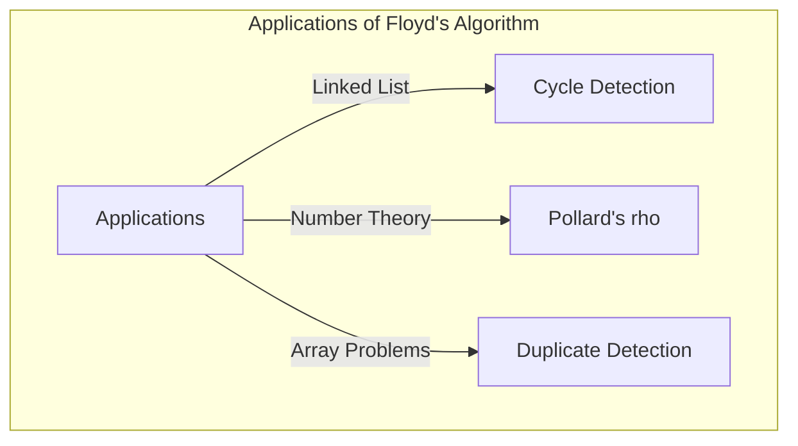

## Введение

В информатике критически важно уметь обнаруживать непредвиденные «циклы» (петли) в структурах данных, чтобы, например, предотвратить бесконечные циклы. Одним из самых элегантных методов решения этой проблемы является **алгоритм поиска цикла Флойда** (Floyd's cycle-finding algorithm).

Поскольку в этом алгоритме используются два указателя, движущихся с разной скоростью (часто условно называемые «черепаха» и «заяц»), он также широко известен как **алгоритм черепахи и зайца** (Tortoise and Hare Algorithm).

В этой статье мы подробно рассмотрим, как работает этот алгоритм, его математическую основу, а также приведем конкретные примеры реализации на C++ и [Rust](https://kenji.blog/ru/p/webassembly-wasm-current-future/).

## Что такое обнаружение цикла?

В односвязном списке (Singly Linked List) или графе переходов состояний **циклом** называется структура, при которой, следуя от одного узла к другому, мы снова возвращаемся к узлу, который уже посещали ранее.

Например, давайте рассмотрим следующий связный список.



В этом списке следующим за Node 5 идет Node 3, образуя петлю: 3 → 4 → 5 → 3. Программа, которая просто перебирает узлы по порядку, попадет в эту петлю и вызовет бесконечный цикл.

Один из способов справиться с этим — записывать посещенные узлы в хэш-множество (например, `std::unordered_set`). Однако этот метод требует дополнительного объема памяти $O(N)$, пропорционального количеству узлов. **Алгоритм поиска цикла Флойда** позволяет обнаружить цикл за время $O(N)$ при использовании константного объема памяти $O(1)$.

## Как работает алгоритм черепахи и зайца

Идея алгоритма очень интуитивна. Представьте себе двух бегунов, бегущих по одной дорожке с разной скоростью. Если дорожка прямая, быстрый бегун будет просто удаляться от медленного. Однако, если дорожка включает круговой маршрут (цикл), быстрый бегун в какой-то момент обязательно «обгонит на круг» медленного бегуна и догонит его сзади.

В частности, используются два следующих указателя:

1. **Черепаха (Tortoise)**: перемещается на один узел вперед за один шаг.
2. **Заяц (Hare)**: перемещается на два узла вперед за один шаг.

Мы запускаем их одновременно. Если заяц достигает конца списка (`null`), цикла нет. Если цикл существует, заяц и черепаха в какой-то момент обязательно окажутся на одном и том же узле.

### Визуализация работы

Рассмотрим граф с циклом, показанный ниже:



Перемещение указателей на каждом шаге будет следующим:
(* Черепаха = $T$, Заяц = $H$)

- **Шаг 0**: $T=1$, $H=1$
- **Шаг 1**: $T=2$, $H=3$
- **Шаг 2**: $T=3$, $H=5$
- **Шаг 3**: $T=4$, $H=3$
- **Шаг 4**: $T=5$, $H=5$ (Здесь они совпадают, цикл обнаружен!)

## Математическое доказательство и определение начала цикла

Давайте с помощью математических формул докажем, что алгоритм обязательно приведет к столкновению, и покажем, как определить начальную точку цикла (точку пересечения).

Пусть расстояние от начала списка до начала цикла равно $x$.
Пусть расстояние от начала цикла до точки столкновения двух указателей равно $y$.
Пусть расстояние от точки столкновения до возвращения к началу цикла равно $z$.
Следовательно, общая длина цикла равна $C = y + z$.

Когда черепаха и заяц сталкиваются, расстояния, которые они прошли, следующие:

- Расстояние, пройденное черепахой: $d_T = x + y$
- Расстояние, пройденное зайцем: $d_H = x + y + kC$ (где $k$ — количество кругов по циклу, которые сделал заяц)

Поскольку заяц движется в два раза быстрее черепахи, справедливо следующее уравнение:

$$ 2 \cdot d_T = d_H $$
$$ 2(x + y) = x + y + kC $$
$$ x + y = kC $$
$$ x = kC - y $$

Так как $C = y + z$, мы получаем:
$$ x = k(y + z) - y $$
$$ x = (k - 1)(y + z) + z $$
$$ x = (k - 1)C + z $$

Это уравнение $x = (k - 1)C + z$ имеет очень важное значение.
Здесь $k - 1$ — целое число, большее или равное $0$.
Оно показывает, что «расстояние $x$ от начала списка до начала цикла» равно «оставшемуся расстоянию $z$ от точки столкновения до начала цикла» плюс целое число длин цикла $C$ ($(k-1)C$).

Другими словами, доказано, что **сразу после столкновения, если мы вернем один указатель в начало списка, а второй оставим в точке столкновения, и будем перемещать оба по одному шагу за раз, они обязательно встретятся в начале цикла**. Это происходит потому, что пока указатель, стартовавший из начала списка, проходит расстояние $x$ до начала цикла, указатель, стартовавший из точки столкновения, проходит расстояние $z$ до начала цикла, а затем делает $(k-1)$ кругов. В результате они прибывают в точку начала цикла ровно в один и тот же момент и встречаются.

## Реализация в коде

Теперь давайте реализуем описанную выше теорию на C++ и [Rust](https://kenji.blog/ru/p/webassembly-wasm-current-future/).

### Реализация на C++

Ниже представлена структура узла односвязного списка, функция для проверки наличия цикла и функция для поиска начального узла цикла.

```cpp
#include <iostream>

// Определение узла списка
struct ListNode {
    int val;
    ListNode *next;
    ListNode(int x) : val(x), next(nullptr) {}
};

class Solution {
public:
    // Определяет, есть ли цикл
    bool hasCycle(ListNode *head) {
        if (!head || !head->next) return false;
        
        ListNode *slow = head;
        ListNode *fast = head;
        
        while (fast != nullptr && fast->next != nullptr) {
            slow = slow->next;          // Черепаха делает 1 шаг
            fast = fast->next->next;    // Заяц делает 2 шага
            
            if (slow == fast) {
                return true; // Если столкнулись, цикл есть
            }
        }
        
        return false; // Если заяц достиг конца, цикла нет
    }

    // Возвращает узел начала цикла
    ListNode *detectCycle(ListNode *head) {
        if (!head || !head->next) return nullptr;
        
        ListNode *slow = head;
        ListNode *fast = head;
        bool cycleExists = false;
        
        while (fast != nullptr && fast->next != nullptr) {
            slow = slow->next;
            fast = fast->next->next;
            
            if (slow == fast) {
                cycleExists = true;
                break;
            }
        }
        
        if (!cycleExists) return nullptr;
        
        // Возвращаем один из указателей (здесь slow) в начало
        slow = head;
        
        // Двигаем оба по 1 шагу, место встречи - начало цикла
        while (slow != fast) {
            slow = slow->next;
            fast = fast->next;
        }
        
        return slow;
    }
};

int main() {
    // Построение 1 -> 2 -> 3 -> 4 -> 5 -> 3(цикл)
    ListNode* head = new ListNode(1);
    head->next = new ListNode(2);
    head->next = new ListNode(3);
    head->next = new ListNode(4);
    head->next = new ListNode(5);
    head->next->next->next->next->next = head->next->next; // 5 -> 3
    
    Solution sol;
    if (sol.hasCycle(head)) {
        std::cout << "Cycle detected!" << std::endl;
        ListNode* start = sol.detectCycle(head);
        if (start) {
            std::cout << "Cycle starts at node with value: " << start->val << std::endl;
        }
    } else {
        std::cout << "No cycle." << std::endl;
    }
    
    // Освобождение памяти нельзя делать простым delete из-за цикла (чтобы избежать бесконечного цикла)
    // В реальности нужно сначала разорвать цикл, а затем делать delete.
    return 0;
}
```

### Реализация на [Rust](https://kenji.blog/ru/p/webassembly-wasm-current-future/)

В [Rust](https://kenji.blog/ru/p/programming-languages-history-paradigm-evolution/) реализация связных списков часто бывает сложной из-за правил владения (ownership) и заимствования (borrowing), поэтому в спортивном программировании и подобных задачах это обычно моделируется как проблема ссылок на индексы в массиве (или `Vec`).
Здесь показан пример реализации с использованием массива, где хранятся «следующие индексы» вместо «указателей на следующий элемент».

```rust
// Массив с индексами следующих переходов рассматривается как виртуальный связный список
// Пример: arr[i] - следующий узел.
fn has_cycle(arr: &Vec<usize>, start_idx: usize) -> bool {
    if arr.is_empty() {
        return false;
    }
    
    let mut slow = start_idx;
    let mut fast = start_idx;
    
    loop {
        // Черепаха делает 1 шаг
        if slow >= arr.len() { break; }
        slow = arr[slow];
        
        // Заяц делает 2 шага
        if fast >= arr.len() { break; }
        fast = arr[fast];
        if fast >= arr.len() { break; }
        fast = arr[fast];
        
        // Проверка столкновения
        if slow == fast {
            return true;
        }
    }
    
    false
}

fn detect_cycle_start(arr: &Vec<usize>, start_idx: usize) -> Option<usize> {
    if arr.is_empty() {
        return None;
    }
    
    let mut slow = start_idx;
    let mut fast = start_idx;
    let mut has_cycle = false;
    
    loop {
        if slow >= arr.len() || fast >= arr.len() || arr[fast] >= arr.len() {
            break;
        }
        slow = arr[slow];
        fast = arr[arr[fast]];
        
        if slow == fast {
            has_cycle = true;
            break;
        }
    }
    
    if !has_cycle {
        return None;
    }
    
    // Возвращаем черепаху в точку старта
    slow = start_idx;
    
    // Двигаем по 1 шагу
    while slow != fast {
        slow = arr[slow];
        fast = arr[fast];
    }
    
    Some(slow)
}

fn main() {
    // Граф переходов по индексам:
    // 0 -> 1 -> 2 -> 3 -> 4 -> 2 (цикл начинается с 2)
    // Если значение вне диапазона (например, usize::MAX), то это конец, но здесь мы строим цикл.
    let graph = vec![1, 2, 3, 4, 2];
    
    if has_cycle(&graph, 0) {
        println!("Cycle detected!");
        if let Some(start) = detect_cycle_start(&graph, 0) {
            println!("Cycle starts at index: {}", start);
        }
    } else {
        println!("No cycle.");
    }
}
```

## Анализ сложности

Этот алгоритм обладает превосходными характеристиками производительности.

- **Временная сложность**: $O(N)$
  Заяц перемещается максимум на $N$ шагов до входа в цикл, а после входа в цикл он догонит черепаху максимум за $C$ шагов, где $C$ — длина цикла. Так как $C \le N$, общее количество шагов укладывается в линейное время.
- **Пространственная сложность**: $O(1)$
  Поскольку нет необходимости запоминать посещенные узлы в хэш-множестве, а нужно лишь поддерживать две переменные-указателя, дополнительное использование памяти составляет константный объем.

## Другие примеры применения

Алгоритм поиска цикла Флойда применяется не только для простого обнаружения циклов в связных списках, но и в различных других алгоритмах.

1. **Ро-алгоритм Полларда (Pollard's rho algorithm)**:
   Алгоритм для эффективного нахождения простых делителей больших составных чисел, использующий тот факт, что последовательность генератора псевдослучайных чисел зацикливается. Это мощный алгоритм факторизации, применяемый в том числе в криптографии.
2. **Поиск дублирующегося числа (Find the Duplicate Number)**:
   Например, есть массив из $N+1$ элементов, где значение каждого элемента находится в диапазоне от $1$ до $N$. Согласно принципу Дирихле (принципу голубиных гнезд), по крайней мере одно число дублируется. Рассматривая элементы массива как «указатели на следующий индекс», этот метод можно использовать для нахождения дубликата как начальной точки цикла, сохраняя пространственную сложность $O(1)$. Это очень популярная задача на собеседованиях, например на LeetCode.
   В частности, для данного массива `nums` переход состояния определяется как `next_node = nums[current_node]`. Наличие дублирующегося значения означает наличие переходов к одному и тому же значению (т.е. к одному и тому же следующему узлу) из нескольких разных индексов, что и образует вход в цикл. Таким образом, напрямую применив алгоритм черепахи и зайца, можно найти дублирующееся значение (начало цикла) за время $O(N)$ с затратами памяти $O(1)$.



## Заключение

В этой статье мы рассмотрели **алгоритм поиска цикла Флойда** (алгоритм черепахи и зайца).
Несмотря на простую идею использования двух указателей, движущихся с разной скоростью, это элегантный метод, позволяющий обнаружить цикл и найти его начало за время $O(N)$ и с пространственной сложностью $O(1)$.
Поняв математическое обоснование, становится ясно, почему после столкновения перемещение одного из указателей в начало и продолжение движения с одинаковой скоростью позволяет найти начальную точку цикла.

В реализации структур данных и спортивном программировании этот алгоритм является очень мощным инструментом. Обязательно попробуйте реализовать его самостоятельно на C++ или [Rust](https://kenji.blog/ru/p/webassembly-wasm-current-future/).
