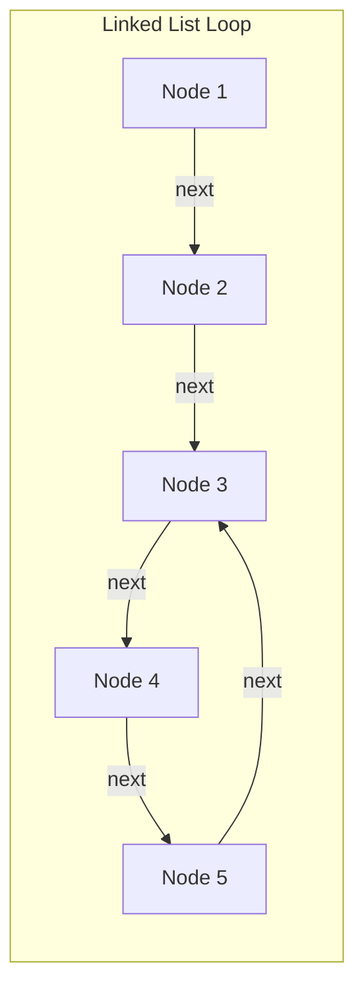
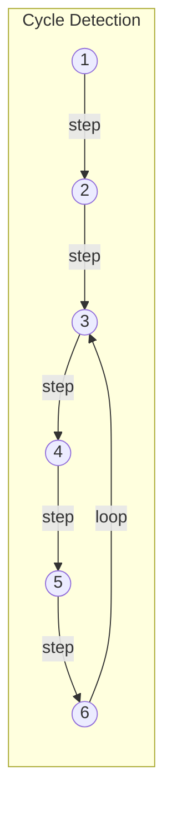
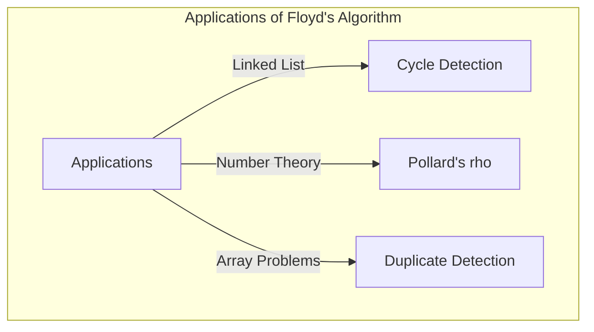

## 引言

在计算机科学中，检测数据结构中是否包含意料之外的“循环（Cycle）”，对于防止无限循环等问题非常重要。解决这个问题的最优雅的方法之一就是 **罗伯特·弗洛伊德的循环检测法** （Floyd's cycle-finding algorithm）。

由于该算法使用了两个速度不同的指针（通常被比喻为“兔子”和“乌龟”），因此它也被广泛称为 **龟兔赛跑算法** （Tortoise and Hare Algorithm）。

本文将从该算法的工作原理、数学背景，到使用 C++ 和 [Rust](https://kenji.blog/zh-cn/p/webassembly-wasm-current-future/) 的具体实现示例，进行详细的解说。

## 什么是循环检测？

在单向链表（Singly Linked List）或状态转移图中，从某个节点出发，顺着指针追踪时，如果再次到达之前访问过的节点，这种结构就被称为 **循环（Cycle）** 。

例如，让我们考虑以下链表。



在这个链表中，Node 5 的下一个节点是 Node 3，从而形成了一个 3 → 4 → 5 → 3 的循环。如果是一个只按顺序追踪的程序，就会陷入这个循环，导致无限循环。

解决这个问题的一种方法是，将访问过的节点记录在哈希集合（如 `std::unordered_set`）中。但是，这种方法需要与节点数成正比的 $O(N)$ 的额外内存空间。而能够在保持内存空间为 $O(1)$ 的同时，在 $O(N)$ 的时间复杂度内检测出循环的，就是 **弗洛伊德的循环检测法** 。

## 龟兔赛跑算法的原理

这个算法的思路非常直观。请想象两名以不同速度在同一条跑道上奔跑的跑者。如果跑道是一条直线，那么速度快的跑者只会把速度慢的跑者越甩越远。但是，如果跑道包含环形路线（循环），那么速度快的跑者最终一定会“套圈”速度慢的跑者，并从后面追上他。

具体来说，我们使用以下两个指针。

1. **乌龟（Tortoise）** ：每一步向下一个节点移动1次。
2. **兔子（Hare）** ：每一步向下一个节点移动2次。

让两者同时出发，如果兔子到达了终点（`null`），则说明不存在循环。如果存在循环，那么在某个时刻，兔子和乌龟必定会指向同一个节点。

### 运行图解

我们以包含如下循环的图为例进行思考。



每一步指针的移动如下：
（※ 乌龟 = $T$，兔子 = $H$）

- **Step 0**: $T=1$, $H=1$
- **Step 1**: $T=2$, $H=3$
- **Step 2**: $T=3$, $H=5$
- **Step 3**: $T=4$, $H=3$
- **Step 4**: $T=5$, $H=5$ （在此处相遇，检测到循环！）

## 数学证明与循环起点的定位

我们用数学公式来证明算法为什么必然会发生相遇，以及如何定位循环的起始点（交叉点）。

假设从链表起点到循环起始点的距离为 $x$ 。
假设从循环起始点到两个指针相遇点的距离为 $y$ 。
假设从相遇点再次回到循环起始点的距离为 $z$ 。
因此，循环的总长度为 $C = y + z$ 。

当乌龟和兔子相遇时，它们各自的移动距离如下：

- 乌龟的移动距离: $d_T = x + y$
- 兔子的移动距离: $d_H = x + y + kC$ （$k$ 是兔子在循环中绕圈的次数）

由于兔子移动的速度是乌龟的两倍，所以以下等式成立：

$$ 2 \cdot d_T = d_H $$
$$ 2(x + y) = x + y + kC $$
$$ x + y = kC $$
$$ x = kC - y $$

这里，因为 $C = y + z$ ，所以：
$$ x = k(y + z) - y $$
$$ x = (k - 1)(y + z) + z $$
$$ x = (k - 1)C + z $$

这个公式 $x = (k - 1)C + z$ 具有非常重要的意义。
在这里，$k - 1$ 是大于等于 $0$ 的整数。
它表明，“从链表头部到循环起始点的距离 $x$ ”，等于“从相遇点到循环起始点的剩余距离 $z$ ”加上循环长度 $C$ 的整数倍（$(k-1)C$）。

也就是说，在发生相遇后， **将其中一个指针移回链表起点，另一个指针留在相遇点，让它们以每次一步的速度同时移动，它们必然会在循环的起始点相遇** 。这是因为，从起点出发的指针移动距离 $x$ 到达循环起始点时，从相遇点出发的指针恰好移动了距离 $z$ 到达循环起始点，随后在循环中绕了 $(k-1)$ 圈。结果两者会在完全相同的时机到达循环起始点并汇合。

## 代码实现

接下来，让我们用 C++ 和 [Rust](https://kenji.blog/zh-cn/p/webassembly-wasm-current-future/) 来实现上述理论。

### C++ 的实现

以下是单向链表节点结构体、检测是否存在循环的函数，以及寻找循环起始点函数的实现。

```cpp
#include <iostream>

// 链表节点定义
struct ListNode {
    int val;
    ListNode *next;
    ListNode(int x) : val(x), next(nullptr) {}
};

class Solution {
public:
    // 判断是否存在循环
    bool hasCycle(ListNode *head) {
        if (!head || !head->next) return false;
        
        ListNode *slow = head;
        ListNode *fast = head;
        
        while (fast != nullptr && fast->next != nullptr) {
            slow = slow->next;          // 乌龟走1步
            fast = fast->next->next;    // 兔子走2步
            
            if (slow == fast) {
                return true; // 相遇说明有循环
            }
        }
        
        return false; // 兔子到达终点说明无循环
    }

    // 返回循环起始节点的指针
    ListNode *detectCycle(ListNode *head) {
        if (!head || !head->next) return nullptr;
        
        ListNode *slow = head;
        ListNode *fast = head;
        bool cycleExists = false;
        
        while (fast != nullptr && fast->next != nullptr) {
            slow = slow->next;
            fast = fast->next->next;
            
            if (slow == fast) {
                cycleExists = true;
                break;
            }
        }
        
        if (!cycleExists) return nullptr;
        
        // 将其中一方（这里是slow）移回起点
        slow = head;
        
        // 双方每次走1步，相遇的地方即为循环起始点
        while (slow != fast) {
            slow = slow->next;
            fast = fast->next;
        }
        
        return slow;
    }
};

int main() {
    // 构建 1 -> 2 -> 3 -> 4 -> 5 -> 3(循环)
    ListNode* head = new ListNode(1);
    head->next = new ListNode(2);
    head->next = new ListNode(3);
    head->next = new ListNode(4);
    head->next = new ListNode(5);
    head->next->next->next->next->next = head->next->next; // 5 -> 3
    
    Solution sol;
    if (sol.hasCycle(head)) {
        std::cout << "Cycle detected!" << std::endl;
        ListNode* start = sol.detectCycle(head);
        if (start) {
            std::cout << "Cycle starts at node with value: " << start->val << std::endl;
        }
    } else {
        std::cout << "No cycle." << std::endl;
    }
    
    // 释放内存（因为有循环，不能简单地delete，防止无限循环）
    // 实际应用中需要先解除循环再进行delete等处理。
    return 0;
}
```

### [Rust](https://kenji.blog/zh-cn/p/webassembly-wasm-current-future/) 的实现

在 Rust 中，由于所有权和借用规则，链表的实现往往会变得复杂，但在竞技编程等场景中，将其建模为数组（或 `Vec`）上的索引引用问题是很常见的。
这里展示了一个不使用“指向下一个的指针”，而是使用保存“下一个索引”的数组的实现示例。

```rust
// 将包含下一个跳转索引的数组视为虚拟链表
// 例: arr[i] 为下一个节点。
fn has_cycle(arr: &Vec<usize>, start_idx: usize) -> bool {
    if arr.is_empty() {
        return false;
    }
    
    let mut slow = start_idx;
    let mut fast = start_idx;
    
    loop {
        // 乌龟走1步
        if slow >= arr.len() { break; }
        slow = arr[slow];
        
        // 兔子走2步
        if fast >= arr.len() { break; }
        fast = arr[fast];
        if fast >= arr.len() { break; }
        fast = arr[fast];
        
        // 碰撞判断
        if slow == fast {
            return true;
        }
    }
    
    false
}

fn detect_cycle_start(arr: &Vec<usize>, start_idx: usize) -> Option<usize> {
    if arr.is_empty() {
        return None;
    }
    
    let mut slow = start_idx;
    let mut fast = start_idx;
    let mut has_cycle = false;
    
    loop {
        if slow >= arr.len() || fast >= arr.len() || arr[fast] >= arr.len() {
            break;
        }
        slow = arr[slow];
        fast = arr[arr[fast]];
        
        if slow == fast {
            has_cycle = true;
            break;
        }
    }
    
    if !has_cycle {
        return None;
    }
    
    // 把乌龟移回起点
    slow = start_idx;
    
    // 每次走1步
    while slow != fast {
        slow = arr[slow];
        fast = arr[fast];
    }
    
    Some(slow)
}

fn main() {
    // 基于索引的状态转移图:
    // 0 -> 1 -> 2 -> 3 -> 4 -> 2 (从2开始的循环)
    // 若值超出范围(例: usize::MAX)则视为终点，本例构造了包含循环的情况。
    let graph = vec![1, 2, 3, 4, 2];
    
    if has_cycle(&graph, 0) {
        println!("Cycle detected!");
        if let Some(start) = detect_cycle_start(&graph, 0) {
            println!("Cycle starts at index: {}", start);
        }
    } else {
        println!("No cycle.");
    }
}
```

## 复杂度分析

该算法具有非常优秀的性能特性。

- **时间复杂度**: $O(N)$
  兔子在进入循环前最多移动 $N$ 步，进入循环后在追上乌龟前最多移动循环长度 $C$ 步。由于 $C \le N$ ，因此总步数保持在线性时间内。
- **空间复杂度**: $O(1)$
  无需使用哈希集合等数据结构来记忆已访问的节点，只需维护两个指针变量，因此额外的内存使用量是常数空间。

## 其他应用示例

弗洛伊德的循环检测法不仅仅用于检测链表中的循环，还被应用在各种算法中。

1. **波拉德 $\rho$ （Rho）因数分解法**:
   这是一种利用随机数生成器的输出序列进入循环的特性，来高效寻找巨大合数质因数的算法。它也是密码学领域中使用的一种强大的因数分解算法。
2. **寻找重复数（Find the Duplicate Number）**:
   例如，假设有一个元素个数为 $N+1$ ，每个元素的值都在 $1$ 到 $N$ 范围内的数组。根据鸽巢原理，至少有一个数字是重复的。通过将数组中的元素视为“指向下一个索引的指针”，可以在保持数组空间为 $O(1)$ 的同时，将元素重复作为循环的起点来寻找。这也是 LeetCode 等著名编程面试题中的常见问题。
   具体来说，当给定数组 `nums` 时，定义状态转移为 `next_node = nums[current_node]` 。存在重复的值意味着存在从多个不同索引到同一个值（即同一个下一个节点）的转移，这就构成了循环的入口。因此，直接应用龟兔赛跑算法，就可以在 $O(N)$ 的时间复杂度和 $O(1)$ 的空间复杂度内定位重复的值（循环起始点）。



## 总结

本文讲解了 **罗伯特·弗洛伊德的循环检测法** （龟兔赛跑算法）。
尽管“让两个速度不同的指针奔跑”是一个简单的想法，但它却能在 $O(N)$ 的时间和 $O(1)$ 的空间内检测出循环并定位起点，是一种非常优雅的方法。
通过理解其数学依据，相信你已经明白了为什么在相遇后，将一个指针移回起点并以相同速度前进就能找到循环的起始点。

在数据结构实现和竞技编程中，这个算法是非常强大的武器。请务必亲自动手尝试用 C++ 或 [Rust](https://kenji.blog/zh-cn/p/webassembly-wasm-current-future/) 来实现一下。
