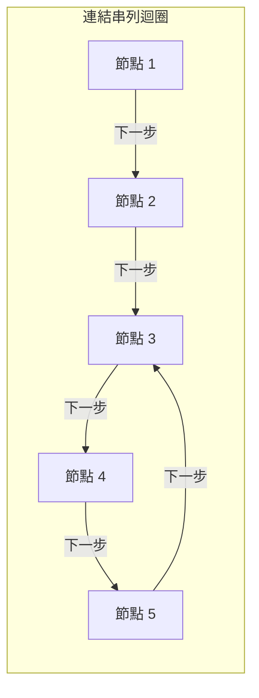
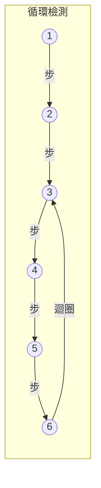
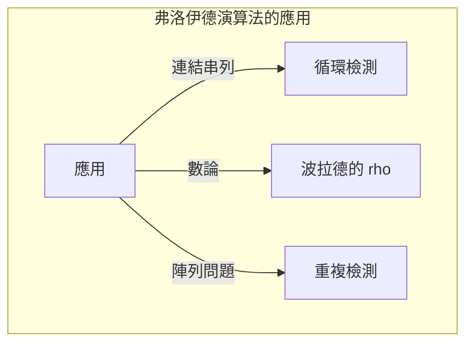

## 前言

在電腦科學中，檢測資料結構內是否包含未預期的「循環（Cycle）」對於防止無窮迴圈等問題非常重要。解決此問題最優雅的手法之一就是 **羅伯特·弗洛伊德的循環檢測法** （Floyd's cycle-finding algorithm）。

這個演算法使用兩個速度不同的指標（通常被擬人化為「兔子」與「烏龜」），因此也廣為人知地被稱為 **龜兔賽跑演算法** （Tortoise and Hare Algorithm）。

本文將從此演算法的運作原理、數學背景，到使用 C++ 與 [Rust](https://kenji.blog/zh-tw/p/webassembly-wasm-current-future/) 的具體實作範例進行詳細的解說。

## 什麼是循環檢測？

在單向連結串列（Singly Linked List）或狀態轉移圖中，從某個節點開始追蹤時，會再次到達之前已經造訪過的節點的結構稱為 **循環（Cycle）** 。

例如，讓我們考慮以下的連結串列：



在這個串列中，Node 5 的下一個是 Node 3，形成了 3 → 4 → 5 → 3 的迴圈。如果程式只是單純地依序追蹤，就會陷入這個迴圈並引發無窮迴圈。

處理這個問題的一種方法是將造訪過的節點記錄在雜湊集合（例如 `std::unordered_set`）中。然而，這個方法會需要與節點數量成正比的 $O(N)$ 額外記憶體空間。能夠將記憶體空間抑制在 $O(1)$ 並且以 $O(N)$ 的時間檢測出循環的，就是 **弗洛伊德的循環檢測法** 。

## 龜兔賽跑演算法的運作原理

演算法的想法非常直觀。想像兩名跑者以不同的速度在同一個賽道上奔跑。如果賽道是一直線，跑得快的跑者只會不斷拉開與跑得慢的跑者的距離。但是，如果賽道包含環狀路線（循環），跑得快的跑者最終一定會讓跑得慢的跑者「落後一圈」，並從後方追上。

具體來說，我們使用以下兩個指標：

1.  **烏龜（Tortoise）**  : 每一步前進到下一個節點（前進 1 步）。
2.  **兔子（Hare）**  : 每一步前進到下下個節點（前進 2 步）。

讓兩者同時出發，如果兔子到達了終點（`null`），則表示循環不存在。如果存在循環，在某個時間點兔子與烏龜一定會指向同一個節點。

### 運作圖解

讓我們用以下包含循環的圖來思考：



每一步的指標移動如下：
（※ 烏龜 = $T$，兔子 = $H$）

- **Step 0**: $T=1$, $H=1$
- **Step 1**: $T=2$, $H=3$
- **Step 2**: $T=3$, $H=5$
- **Step 3**: $T=4$, $H=3$
- **Step 4**: $T=5$, $H=5$ （在此處一致，檢測到循環！）

## 數學證明與尋找循環起點

我們將使用數學公式來證明演算法一定會發生碰撞，以及如何找出循環的起始點（交會點）。

假設從串列起點到循環起始點的距離為 $x$。
假設從循環起始點到兩個指標碰撞點的距離為 $y$。
假設從碰撞點再次回到循環起始點的距離為 $z$。
因此，循環的總長度為 $C = y + z$。

當烏龜與兔子碰撞時，各自的移動距離如下：

- 烏龜的移動距離: $d_T = x + y$
- 兔子的移動距離: $d_H = x + y + kC$ （$k$ 是兔子在循環中繞行的圈數）

因為兔子是以烏龜兩倍的速度移動，所以以下等式成立：

$$ 2 \cdot d_T = d_H $$
$$ 2(x + y) = x + y + kC $$
$$ x + y = kC $$
$$ x = kC - y $$

在這裡，因為 $C = y + z$，所以：
$$ x = k(y + z) - y $$
$$ x = (k - 1)(y + z) + z $$
$$ x = (k - 1)C + z $$

這個公式 $x = (k - 1)C + z$ 具有非常重要的意義。
這裡的 $k - 1$ 是大於等於 $0$ 的整數。
這表示「從串列起點到循環起始點的距離 $x$」等於「從碰撞點到循環起始點剩餘的距離 $z$」加上循環長度 $C$ 的整數倍（$(k-1)C$）。

也就是說，這證明了在發生碰撞後， **將一個指標移回串列起點，另一個指標留在碰撞點，然後讓兩者每次前進 1 步，它們必定會在循環的起始點相遇** 。這是因為從起點出發的指標前進距離 $x$ 到達循環起點的期間，從碰撞點出發的指標會前進距離 $z$ 到達循環起點，然後繞行循環 $(k-1)$ 圈。結果兩者會在完全相同的時間點到達循環起始點並會合。

## 程式碼實作

那麼，讓我們試著用 C++ 和 [Rust](https://kenji.blog/zh-tw/p/webassembly-wasm-current-future/) 來實作上述的理論。

### C++ 實作

以下是單向串列節點的結構體、檢測循環的函式，以及尋找循環起點函式的實作。

```cpp
#include <iostream>

// 串列的節點定義
struct ListNode {
    int val;
    ListNode *next;
    ListNode(int x) : val(x), next(nullptr) {}
};

class Solution {
public:
    // 判斷是否存在循環
    bool hasCycle(ListNode *head) {
        if (!head || !head->next) return false;
        
        ListNode *slow = head;
        ListNode *fast = head;
        
        while (fast != nullptr && fast->next != nullptr) {
            slow = slow->next;          // 烏龜前進1步
            fast = fast->next->next;    // 兔子前進2步
            
            if (slow == fast) {
                return true; // 碰撞表示有循環
            }
        }
        
        return false; // 兔子到達終點表示無循環
    }

    // 回傳循環起始點的節點
    ListNode *detectCycle(ListNode *head) {
        if (!head || !head->next) return nullptr;
        
        ListNode *slow = head;
        ListNode *fast = head;
        bool cycleExists = false;
        
        while (fast != nullptr && fast->next != nullptr) {
            slow = slow->next;
            fast = fast->next->next;
            
            if (slow == fast) {
                cycleExists = true;
                break;
            }
        }
        
        if (!cycleExists) return nullptr;
        
        // 將其中一方（這裡選 slow）移回起點
        slow = head;
        
        // 兩者各前進1步，相遇的地方即為循環起始點
        while (slow != fast) {
            slow = slow->next;
            fast = fast->next;
        }
        
        return slow;
    }
};

int main() {
    // 建構 1 -> 2 -> 3 -> 4 -> 5 -> 3 (循環)
    ListNode* head = new ListNode(1);
    head->next = new ListNode(2);
    head->next = new ListNode(3);
    head->next = new ListNode(4);
    head->next = new ListNode(5);
    head->next->next->next->next->next = head->next->next; // 5 -> 3
    
    Solution sol;
    if (sol.hasCycle(head)) {
        std::cout << "Cycle detected!" << std::endl;
        ListNode* start = sol.detectCycle(head);
        if (start) {
            std::cout << "Cycle starts at node with value: " << start->val << std::endl;
        }
    } else {
        std::cout << "No cycle." << std::endl;
    }
    
    // 由於存在循環，無法用單純的 delete 來釋放記憶體（需防止無窮迴圈）
    // 實務上需要先解開循環才能進行 delete 等處理。
    return 0;
}
```

### [Rust](https://kenji.blog/zh-tw/p/webassembly-wasm-current-future/) 實作

在 Rust 的情況下，由於所有權與借用的規則，連結串列的實作往往會變得很複雜，但在競技程式設計等地，將其模型化為陣列（或 `Vec`）上的索引參照問題是常見的做法。
這裡我們展示一個不使用「指向下一個的指標」，而是使用保存「下一個索引」的陣列的實作範例。

```rust
// 將擁有下一個移動目標索引的陣列視為虛擬的連結串列
// 例如：arr[i] 即為下一個節點。
fn has_cycle(arr: &Vec<usize>, start_idx: usize) -> bool {
    if arr.is_empty() {
        return false;
    }
    
    let mut slow = start_idx;
    let mut fast = start_idx;
    
    loop {
        // 烏龜前進1步
        if slow >= arr.len() { break; }
        slow = arr[slow];
        
        // 兔子前進2步
        if fast >= arr.len() { break; }
        fast = arr[fast];
        if fast >= arr.len() { break; }
        fast = arr[fast];
        
        // 碰撞判定
        if slow == fast {
            return true;
        }
    }
    
    false
}

fn detect_cycle_start(arr: &Vec<usize>, start_idx: usize) -> Option<usize> {
    if arr.is_empty() {
        return None;
    }
    
    let mut slow = start_idx;
    let mut fast = start_idx;
    let mut has_cycle = false;
    
    loop {
        if slow >= arr.len() || fast >= arr.len() || arr[fast] >= arr.len() {
            break;
        }
        slow = arr[slow];
        fast = arr[arr[fast]];
        
        if slow == fast {
            has_cycle = true;
            break;
        }
    }
    
    if !has_cycle {
        return None;
    }
    
    // 烏龜回到起點
    slow = start_idx;
    
    // 一次前進1步
    while slow != fast {
        slow = arr[slow];
        fast = arr[fast];
    }
    
    Some(slow)
}

fn main() {
    // 根據索引的狀態轉移圖：
    // 0 -> 1 -> 2 -> 3 -> 4 -> 2 (從2開始的循環)
    // 如果值超出範圍 (例如: usize::MAX) 則視為終點，但這次我們建構有循環的圖。
    let graph = vec![1, 2, 3, 4, 2];
    
    if has_cycle(&graph, 0) {
        println!("Cycle detected!");
        if let Some(start) = detect_cycle_start(&graph, 0) {
            println!("Cycle starts at index: {}", start);
        }
    } else {
        println!("No cycle.");
    }
}
```

## 複雜度分析

這個演算法具有非常優異的效能特性。

-  **時間複雜度** : $O(N)$
  兔子在進入循環前最多移動 $N$ 步，進入循環後直到追上烏龜最多移動相當於循環長度 $C$ 的步數。因為 $C \le N$，整體的步數會被控制在線性時間內。
-  **空間複雜度** : $O(1)$
  不需要使用雜湊集合等資料結構來記錄已造訪的節點，只需要維護兩個指標變數，因此額外的記憶體使用量為常數空間。

## 其他應用範例

弗洛伊德的循環檢測法不僅能用來檢測連結串列的循環，也被應用在各式各樣的演算法中。

1.  **波拉德的 $\rho$（Rho）質因數分解演算法** :
   這是一個利用亂數產生器輸出數列會進入循環的特性，來有效找出巨大合成數之質因數的演算法。在密碼學領域中也是一個被廣泛使用的強大質因數分解演算法。
2.  **尋找重複的數字（Find the Duplicate Number）** :
   舉例來說，假設有一個元素數量為 $N+1$ 且每個元素的值都在 $1$ 到 $N$ 範圍內的陣列。根據鴿巢原理，至少會有一個數字是重複的。透過將陣列內的元素視為「指向下一個索引的指標」，就可以在保持陣列空間為 $O(1)$ 的情況下，將這個手法應用在把重複元素當作循環起始點找出來的問題上。這在 LeetCode 等著名的程式面試題中也經常出現。
   具體來說，給定陣列 `nums`，我們定義狀態轉移為 `next_node = nums[current_node]`。存在重複的值代表存在從多個不同索引轉移到相同值（即相同的下一個節點）的情況，這就形成了循環的入口。因此，只要直接套用龜兔賽跑演算法，就能以時間複雜度 $O(N)$、空間複雜度 $O(1)$ 找出重複的值（循環的起點）。



## 總結

本文解說了 **羅伯特·弗洛伊德的循環檢測法** （龜兔賽跑演算法）。
這是一個讓兩個不同速度的指標在資料上奔跑的簡單想法，卻是一個能以 $O(N)$ 的時間與 $O(1)$ 的空間來檢測循環並找出起點的優雅手法。
透過理解其數學基礎，相信各位已經明白為什麼在碰撞後，將一個指標移回起點並以相同速度前進，就能找到循環的起點。

在實作資料結構或競技程式設計中，這個演算法將會是一個非常強大的武器。請務必親自動手用 C++ 或 [Rust](https://kenji.blog/zh-tw/p/webassembly-wasm-current-future/) 實作看看。
