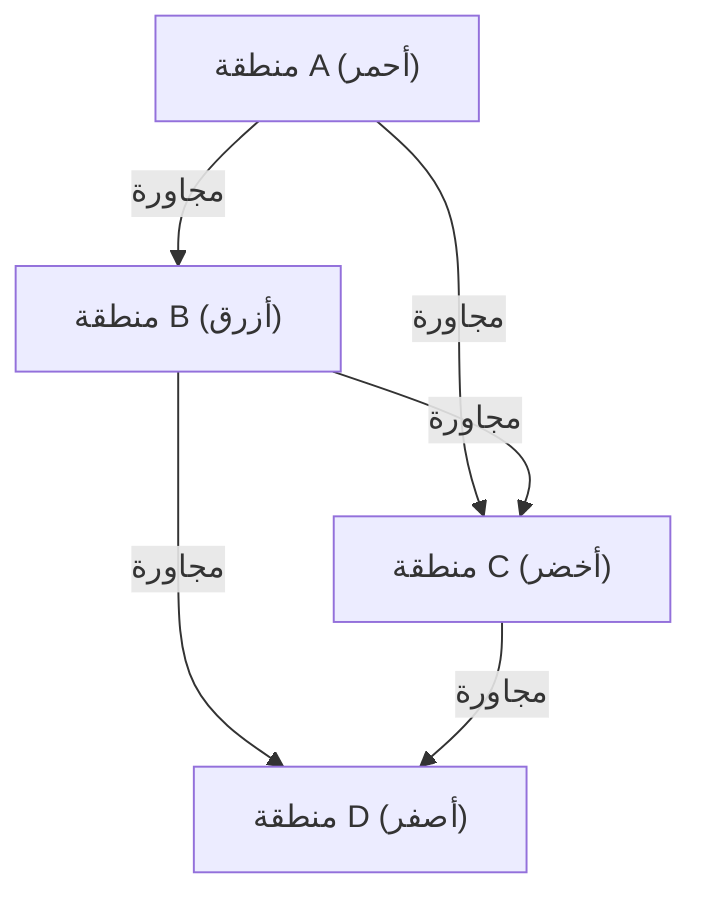

## 1. ما هي مبرهنة الألوان الأربعة؟

[مبرهنة الألوان الأربعة (Four Color Theorem)](https://kenji.blog/ar/p/four-color-theorem/) هي واحدة من أشهر وأكثر المسائل جاذبية في الرياضيات، وتحديداً في نظرية المخططات والطوبولوجيا. ادعاؤها بسيط جداً وبديهي لدرجة أن حتى طلاب المدارس الابتدائية يمكنهم فهمه. ينص الادعاء على أنه: "يكفي وجود **أربعة ألوان** على الأكثر لتلوين أي خريطة على مستوى بحيث تكون المناطق المتجاورة بألوان مختلفة".

مصطلح "المتجاورة" هنا يشير إلى حالة مشاركة خط الحدود، وليس نقطة. إذا كانت المناطق تتلامس في نقطة فقط، فلا توجد مشكلة في تلوينها بنفس اللون. تم طرح هذه الفرضية البديهية لأول مرة بواسطة فرانسيس غوثري (Francis Guthrie) في عام 1852. أثناء تلوينه لخريطة مقاطعات إنجلترا، لاحظ أنه بغض النظر عن مدى تعقيد حدود المقاطعات، فإن أربعة ألوان تكفي لتلوينها بشكل مميز.

## 2. الخلفية التاريخية لمبرهنة الألوان الأربعة

بعد أن لاحظ فرانسيس غوثري هذه المسألة، نقلها إلى أخيه عالم الرياضيات فريدريك غوثري. قام فريدريك بدوره بطرح المسألة على أستاذه أوغستس دي مورغان (Augustus De Morgan). تفاجأ دي مورغان ببساطة المسألة وصعوبة إثباتها الشديدة في نفس الوقت، وبدأ في مناقشتها مع علماء رياضيات آخرين.

في عام 1878، طرح آرثر كايلي (Arthur Cayley) المسألة رسمياً في جمعية الرياضيات بلندن، مما جعلها معروفة على نطاق واسع في مجتمع الرياضيات. حاول العديد من علماء الرياضيات البارزين حل هذه المسألة، ولكن الطريق إلى إثبات كامل كان أكثر وعورة مما كان يُعتقد.

## 3. إثبات كيمب ومثال هيوود المضاد

في عام 1879، نشر عالم رياضيات يدعى ألفريد كيمب (Alfred Kempe) إثباتاً لمبرهنة الألوان الأربعة. كان إثباته ذكياً جداً وقدم مفهوماً يُعرف الآن باسم "سلسلة كيمب (Kempe chain)". تم قبول إثبات كيمب على نطاق واسع، ولاعتقاد دام لأكثر من عقد من الزمان، اعتبرت مبرهنة الألوان الأربعة مسألة محلولة.

ولكن في عام 1890، اكتشف بيرسي هيوود (Percy Heawood) خللاً قاتلاً في إثبات كيمب. في الوقت الذي أشار فيه هيوود إلى الخطأ المنطقي لكيمب، قام بتطبيق طريقة كيمب لإثبات "مبرهنة الألوان الخمسة" ببراعة، والتي تنص على أنه "يمكن تلوين أي خريطة بـ **خمسة ألوان** ". وبذلك عادت مبرهنة الألوان الأربعة لتصبح مسألة غير محلولة مرة أخرى.

## 4. التحويل إلى نظرية المخططات

للتعامل مع مبرهنة الألوان الأربعة رياضياً وبدقة، تم ترجمة المسألة إلى لغة نظرية المخططات. يتم اعتبار كل منطقة على الخريطة كـ "رأس (Vertex)"، ويتم ربط المناطق التي تشترك في حدود بواسطة "حافة (Edge)". يُطلق على المخطط الذي تم إنشاؤه بهذه الطريقة اسم "مخطط مستوٍ (Planar Graph)".

المخطط المستوي هو مخطط يمكن رسمه على مستوى دون أن تتقاطع حوافه. تُختزل مبرهنة الألوان الأربعة إلى مسألة: "يمكن تلوين رؤوس جميع المخططات المستوية بـ **أربعة ألوان** بحيث تكون الرؤوس المتجاورة بألوان مختلفة".

بالتعبير عنها باستخدام المعادلات الرياضية، في مخطط $G = (V, E)$، يتعلق الأمر بإثبات وجود دالة تلوين $c: V \rightarrow \{1, 2, 3, 4\}$ بحيث يكون $c(u) \neq c(v)$ لكل حافة $(u, v) \in E$.

هنا، تلعب [صيغة أويلر للمجسمات](https://kenji.blog/ar/p/eulers-polyhedron-formula/) $V - E + F = 2$ (حيث $V$ هو عدد الرؤوس، $E$ هو عدد الحواف، و $F$ هو عدد الأوجه) دوراً مهماً في استكشاف خصائص المخططات المستوية.

## 5. صدمة الإثبات بواسطة الحاسوب

في عام 1976، تمكن كينيث أبل (Kenneth Appel) وولفغانغ هاكن (Wolfgang Haken) من جامعة إلينوي أخيراً من إثبات مبرهنة الألوان الأربعة. ومع ذلك، أثارت طريقة إثباتهم جدلاً كبيراً في مجتمع الرياضيات. قاموا باختزال إثبات المسألة إلى فحص عدد محدود (في النهاية 1936) من الأنماط المسماة "مجموعات لا يمكن تجنبها (Unavoidable set)"، وجعلوا حاسوباً فائقاً في ذلك الوقت يحسب للتأكد من أن جميع هذه الأنماط يمكن تلوينها بأربعة ألوان (قابلية الاختزال: Reducibility).

نظراً لأن حجم الحسابات كان هائلاً لدرجة تجعل من المستحيل على البشر التحقق من جميع خطوات الحساب يدوياً، أثار هذا نقاشاً فلسفياً حول: "هل يمكن حقاً تسمية هذا إثباتاً رياضياً؟"

## 6. تحسين الإثبات والمنظور الحديث

في عام 1997، قام نيل روبرتسون (Neil Robertson) وآخرون بتحسين إثبات أبل وهاكن، وتم تقليل عدد المجموعات التي لا يمكن تجنبها إلى 633. علاوة على ذلك، في عام 2005، أكمل جورج غونثير (Georges Gonthier) الإثبات الشكلي الكامل لمبرهنة الألوان الأربعة باستخدام نظام مساعد إثبات النظريات Coq. نتيجة لذلك، أصبح احتمال وجود خطأ بسبب خلل في برنامج الحاسوب منخفضاً للغاية، وأصبحت صحة الإثبات لا جدال فيها.

في الوقت الحاضر، أصبح الإثبات بمساعدة الحاسوب معترفاً به على نطاق واسع كأداة قوية في الرياضيات، وقد ساهم في حل مسائل صعبة أخرى، مثل إثبات حدسية كبلر.

## 7. الخاتمة

مبرهنة الألوان الأربعة هي أفضل مثال يوضح "كيف يمكن لمسألة بسيطة في ظاهرها أن تخفي هياكل رياضية عميقة ومعقدة". هذه المسألة، التي بدأت من متعة تلوين الخرائط، ساهمت في تطوير نظرية المخططات وأحدثت تأثيراً لا يُقاس من خلال تغيير طبيعة الإثبات الرياضي نفسه.

استكشاف هذه المسألة يعلمنا مدى قوة الحدس البشري، ومقدار الجهد والتقنيات الجديدة اللازمة لإثباته بصرامة.

## 1. ما هي مبرهنة الألوان الأربعة؟

[مبرهنة الألوان الأربعة (Four Color Theorem)](https://kenji.blog/ar/p/four-color-theorem/) هي واحدة من أشهر وأكثر المسائل جاذبية في الرياضيات، وتحديداً في نظرية المخططات والطوبولوجيا. ادعاؤها بسيط جداً وبديهي لدرجة أن حتى طلاب المدارس الابتدائية يمكنهم فهمه. ينص الادعاء على أنه: "يكفي وجود **أربعة ألوان** على الأكثر لتلوين أي خريطة على مستوى بحيث تكون المناطق المتجاورة بألوان مختلفة".

مصطلح "المتجاورة" هنا يشير إلى حالة مشاركة خط الحدود، وليس نقطة. إذا كانت المناطق تتلامس في نقطة فقط، فلا توجد مشكلة في تلوينها بنفس اللون. تم طرح هذه الفرضية البديهية لأول مرة بواسطة فرانسيس غوثري (Francis Guthrie) في عام 1852. أثناء تلوينه لخريطة مقاطعات إنجلترا، لاحظ أنه بغض النظر عن مدى تعقيد حدود المقاطعات، فإن أربعة ألوان تكفي لتلوينها بشكل مميز.

## 2. الخلفية التاريخية لمبرهنة الألوان الأربعة

بعد أن لاحظ فرانسيس غوثري هذه المسألة، نقلها إلى أخيه عالم الرياضيات فريدريك غوثري. قام فريدريك بدوره بطرح المسألة على أستاذه أوغستس دي مورغان (Augustus De Morgan). تفاجأ دي مورغان ببساطة المسألة وصعوبة إثباتها الشديدة في نفس الوقت، وبدأ في مناقشتها مع علماء رياضيات آخرين.

في عام 1878، طرح آرثر كايلي (Arthur Cayley) المسألة رسمياً في جمعية الرياضيات بلندن، مما جعلها معروفة على نطاق واسع في مجتمع الرياضيات. حاول العديد من علماء الرياضيات البارزين حل هذه المسألة، ولكن الطريق إلى إثبات كامل كان أكثر وعورة مما كان يُعتقد.

## 3. إثبات كيمب ومثال هيوود المضاد

في عام 1879، نشر عالم رياضيات يدعى ألفريد كيمب (Alfred Kempe) إثباتاً لمبرهنة الألوان الأربعة. كان إثباته ذكياً جداً وقدم مفهوماً يُعرف الآن باسم "سلسلة كيمب (Kempe chain)". تم قبول إثبات كيمب على نطاق واسع، ولاعتقاد دام لأكثر من عقد من الزمان، اعتبرت مبرهنة الألوان الأربعة مسألة محلولة.

ولكن في عام 1890، اكتشف بيرسي هيوود (Percy Heawood) خللاً قاتلاً في إثبات كيمب. في الوقت الذي أشار فيه هيوود إلى الخطأ المنطقي لكيمب، قام بتطبيق طريقة كيمب لإثبات "مبرهنة الألوان الخمسة" ببراعة، والتي تنص على أنه "يمكن تلوين أي خريطة بـ **خمسة ألوان** ". وبذلك عادت مبرهنة الألوان الأربعة لتصبح مسألة غير محلولة مرة أخرى.

## 4. التحويل إلى نظرية المخططات

للتعامل مع مبرهنة الألوان الأربعة رياضياً وبدقة، تم ترجمة المسألة إلى لغة نظرية المخططات. يتم اعتبار كل منطقة على الخريطة كـ "رأس (Vertex)"، ويتم ربط المناطق التي تشترك في حدود بواسطة "حافة (Edge)". يُطلق على المخطط الذي تم إنشاؤه بهذه الطريقة اسم "مخطط مستوٍ (Planar Graph)".

المخطط المستوي هو مخطط يمكن رسمه على مستوى دون أن تتقاطع حوافه. تُختزل مبرهنة الألوان الأربعة إلى مسألة: "يمكن تلوين رؤوس جميع المخططات المستوية بـ **أربعة ألوان** بحيث تكون الرؤوس المتجاورة بألوان مختلفة".

بالتعبير عنها باستخدام المعادلات الرياضية، في مخطط $G = (V, E)$، يتعلق الأمر بإثبات وجود دالة تلوين $c: V \rightarrow \{1, 2, 3, 4\}$ بحيث يكون $c(u) \neq c(v)$ لكل حافة $(u, v) \in E$.

هنا، تلعب [صيغة أويلر للمجسمات](https://kenji.blog/ar/p/eulers-polyhedron-formula/) $V - E + F = 2$ (حيث $V$ هو عدد الرؤوس، $E$ هو عدد الحواف، و $F$ هو عدد الأوجه) دوراً مهماً في استكشاف خصائص المخططات المستوية.

## 5. صدمة الإثبات بواسطة الحاسوب

في عام 1976، تمكن كينيث أبل (Kenneth Appel) وولفغانغ هاكن (Wolfgang Haken) من جامعة إلينوي أخيراً من إثبات مبرهنة الألوان الأربعة. ومع ذلك، أثارت طريقة إثباتهم جدلاً كبيراً في مجتمع الرياضيات. قاموا باختزال إثبات المسألة إلى فحص عدد محدود (في النهاية 1936) من الأنماط المسماة "مجموعات لا يمكن تجنبها (Unavoidable set)"، وجعلوا حاسوباً فائقاً في ذلك الوقت يحسب للتأكد من أن جميع هذه الأنماط يمكن تلوينها بأربعة ألوان (قابلية الاختزال: Reducibility).

نظراً لأن حجم الحسابات كان هائلاً لدرجة تجعل من المستحيل على البشر التحقق من جميع خطوات الحساب يدوياً، أثار هذا نقاشاً فلسفياً حول: "هل يمكن حقاً تسمية هذا إثباتاً رياضياً؟"

## 6. تحسين الإثبات والمنظور الحديث

في عام 1997، قام نيل روبرتسون (Neil Robertson) وآخرون بتحسين إثبات أبل وهاكن، وتم تقليل عدد المجموعات التي لا يمكن تجنبها إلى 633. علاوة على ذلك، في عام 2005، أكمل جورج غونثير (Georges Gonthier) الإثبات الشكلي الكامل لمبرهنة الألوان الأربعة باستخدام نظام مساعد إثبات النظريات Coq. نتيجة لذلك، أصبح احتمال وجود خطأ بسبب خلل في برنامج الحاسوب منخفضاً للغاية، وأصبحت صحة الإثبات لا جدال فيها.

في الوقت الحاضر، أصبح الإثبات بمساعدة الحاسوب معترفاً به على نطاق واسع كأداة قوية في الرياضيات، وقد ساهم في حل مسائل صعبة أخرى، مثل إثبات حدسية كبلر.

## 7. الخاتمة

مبرهنة الألوان الأربعة هي أفضل مثال يوضح "كيف يمكن لمسألة بسيطة في ظاهرها أن تخفي هياكل رياضية عميقة ومعقدة". هذه المسألة، التي بدأت من متعة تلوين الخرائط، ساهمت في تطوير نظرية المخططات وأحدثت تأثيراً لا يُقاس من خلال تغيير طبيعة الإثبات الرياضي نفسه.

استكشاف هذه المسألة يعلمنا مدى قوة الحدس البشري، ومقدار الجهد والتقنيات الجديدة اللازمة لإثباته بصرامة.

## 1. ما هي مبرهنة الألوان الأربعة؟

[مبرهنة الألوان الأربعة (Four Color Theorem)](https://kenji.blog/ar/p/four-color-theorem/) هي واحدة من أشهر وأكثر المسائل جاذبية في الرياضيات، وتحديداً في نظرية المخططات والطوبولوجيا. ادعاؤها بسيط جداً وبديهي لدرجة أن حتى طلاب المدارس الابتدائية يمكنهم فهمه. ينص الادعاء على أنه: "يكفي وجود **أربعة ألوان** على الأكثر لتلوين أي خريطة على مستوى بحيث تكون المناطق المتجاورة بألوان مختلفة".

مصطلح "المتجاورة" هنا يشير إلى حالة مشاركة خط الحدود، وليس نقطة. إذا كانت المناطق تتلامس في نقطة فقط، فلا توجد مشكلة في تلوينها بنفس اللون. تم طرح هذه الفرضية البديهية لأول مرة بواسطة فرانسيس غوثري (Francis Guthrie) في عام 1852. أثناء تلوينه لخريطة مقاطعات إنجلترا، لاحظ أنه بغض النظر عن مدى تعقيد حدود المقاطعات، فإن أربعة ألوان تكفي لتلوينها بشكل مميز.

## 2. الخلفية التاريخية لمبرهنة الألوان الأربعة

بعد أن لاحظ فرانسيس غوثري هذه المسألة، نقلها إلى أخيه عالم الرياضيات فريدريك غوثري. قام فريدريك بدوره بطرح المسألة على أستاذه أوغستس دي مورغان (Augustus De Morgan). تفاجأ دي مورغان ببساطة المسألة وصعوبة إثباتها الشديدة في نفس الوقت، وبدأ في مناقشتها مع علماء رياضيات آخرين.

في عام 1878، طرح آرثر كايلي (Arthur Cayley) المسألة رسمياً في جمعية الرياضيات بلندن، مما جعلها معروفة على نطاق واسع في مجتمع الرياضيات. حاول العديد من علماء الرياضيات البارزين حل هذه المسألة، ولكن الطريق إلى إثبات كامل كان أكثر وعورة مما كان يُعتقد.

## 3. إثبات كيمب ومثال هيوود المضاد

في عام 1879، نشر عالم رياضيات يدعى ألفريد كيمب (Alfred Kempe) إثباتاً لمبرهنة الألوان الأربعة. كان إثباته ذكياً جداً وقدم مفهوماً يُعرف الآن باسم "سلسلة كيمب (Kempe chain)". تم قبول إثبات كيمب على نطاق واسع، ولاعتقاد دام لأكثر من عقد من الزمان، اعتبرت مبرهنة الألوان الأربعة مسألة محلولة.

ولكن في عام 1890، اكتشف بيرسي هيوود (Percy Heawood) خللاً قاتلاً في إثبات كيمب. في الوقت الذي أشار فيه هيوود إلى الخطأ المنطقي لكيمب، قام بتطبيق طريقة كيمب لإثبات "مبرهنة الألوان الخمسة" ببراعة، والتي تنص على أنه "يمكن تلوين أي خريطة بـ **خمسة ألوان** ". وبذلك عادت مبرهنة الألوان الأربعة لتصبح مسألة غير محلولة مرة أخرى.

## 4. التحويل إلى نظرية المخططات

للتعامل مع مبرهنة الألوان الأربعة رياضياً وبدقة، تم ترجمة المسألة إلى لغة نظرية المخططات. يتم اعتبار كل منطقة على الخريطة كـ "رأس (Vertex)"، ويتم ربط المناطق التي تشترك في حدود بواسطة "حافة (Edge)". يُطلق على المخطط الذي تم إنشاؤه بهذه الطريقة اسم "مخطط مستوٍ (Planar Graph)".

المخطط المستوي هو مخطط يمكن رسمه على مستوى دون أن تتقاطع حوافه. تُختزل مبرهنة الألوان الأربعة إلى مسألة: "يمكن تلوين رؤوس جميع المخططات المستوية بـ **أربعة ألوان** بحيث تكون الرؤوس المتجاورة بألوان مختلفة".

بالتعبير عنها باستخدام المعادلات الرياضية، في مخطط $G = (V, E)$، يتعلق الأمر بإثبات وجود دالة تلوين $c: V \rightarrow \{1, 2, 3, 4\}$ بحيث يكون $c(u) \neq c(v)$ لكل حافة $(u, v) \in E$.

هنا، تلعب [صيغة أويلر للمجسمات](https://kenji.blog/ar/p/eulers-polyhedron-formula/) $V - E + F = 2$ (حيث $V$ هو عدد الرؤوس، $E$ هو عدد الحواف، و $F$ هو عدد الأوجه) دوراً مهماً في استكشاف خصائص المخططات المستوية.

## 5. صدمة الإثبات بواسطة الحاسوب

في عام 1976، تمكن كينيث أبل (Kenneth Appel) وولفغانغ هاكن (Wolfgang Haken) من جامعة إلينوي أخيراً من إثبات مبرهنة الألوان الأربعة. ومع ذلك، أثارت طريقة إثباتهم جدلاً كبيراً في مجتمع الرياضيات. قاموا باختزال إثبات المسألة إلى فحص عدد محدود (في النهاية 1936) من الأنماط المسماة "مجموعات لا يمكن تجنبها (Unavoidable set)"، وجعلوا حاسوباً فائقاً في ذلك الوقت يحسب للتأكد من أن جميع هذه الأنماط يمكن تلوينها بأربعة ألوان (قابلية الاختزال: Reducibility).

نظراً لأن حجم الحسابات كان هائلاً لدرجة تجعل من المستحيل على البشر التحقق من جميع خطوات الحساب يدوياً، أثار هذا نقاشاً فلسفياً حول: "هل يمكن حقاً تسمية هذا إثباتاً رياضياً؟"

## 6. تحسين الإثبات والمنظور الحديث

في عام 1997، قام نيل روبرتسون (Neil Robertson) وآخرون بتحسين إثبات أبل وهاكن، وتم تقليل عدد المجموعات التي لا يمكن تجنبها إلى 633. علاوة على ذلك، في عام 2005، أكمل جورج غونثير (Georges Gonthier) الإثبات الشكلي الكامل لمبرهنة الألوان الأربعة باستخدام نظام مساعد إثبات النظريات Coq. نتيجة لذلك، أصبح احتمال وجود خطأ بسبب خلل في برنامج الحاسوب منخفضاً للغاية، وأصبحت صحة الإثبات لا جدال فيها.

في الوقت الحاضر، أصبح الإثبات بمساعدة الحاسوب معترفاً به على نطاق واسع كأداة قوية في الرياضيات، وقد ساهم في حل مسائل صعبة أخرى، مثل إثبات حدسية كبلر.

## 7. الخاتمة

مبرهنة الألوان الأربعة هي أفضل مثال يوضح "كيف يمكن لمسألة بسيطة في ظاهرها أن تخفي هياكل رياضية عميقة ومعقدة". هذه المسألة، التي بدأت من متعة تلوين الخرائط، ساهمت في تطوير نظرية المخططات وأحدثت تأثيراً لا يُقاس من خلال تغيير طبيعة الإثبات الرياضي نفسه.

استكشاف هذه المسألة يعلمنا مدى قوة الحدس البشري، ومقدار الجهد والتقنيات الجديدة اللازمة لإثباته بصرامة.

## 1. ما هي مبرهنة الألوان الأربعة؟

[مبرهنة الألوان الأربعة (Four Color Theorem)](https://kenji.blog/ar/p/four-color-theorem/) هي واحدة من أشهر وأكثر المسائل جاذبية في الرياضيات، وتحديداً في نظرية المخططات والطوبولوجيا. ادعاؤها بسيط جداً وبديهي لدرجة أن حتى طلاب المدارس الابتدائية يمكنهم فهمه. ينص الادعاء على أنه: "يكفي وجود **أربعة ألوان** على الأكثر لتلوين أي خريطة على مستوى بحيث تكون المناطق المتجاورة بألوان مختلفة".

مصطلح "المتجاورة" هنا يشير إلى حالة مشاركة خط الحدود، وليس نقطة. إذا كانت المناطق تتلامس في نقطة فقط، فلا توجد مشكلة في تلوينها بنفس اللون. تم طرح هذه الفرضية البديهية لأول مرة بواسطة فرانسيس غوثري (Francis Guthrie) في عام 1852. أثناء تلوينه لخريطة مقاطعات إنجلترا، لاحظ أنه بغض النظر عن مدى تعقيد حدود المقاطعات، فإن أربعة ألوان تكفي لتلوينها بشكل مميز.

## 2. الخلفية التاريخية لمبرهنة الألوان الأربعة

بعد أن لاحظ فرانسيس غوثري هذه المسألة، نقلها إلى أخيه عالم الرياضيات فريدريك غوثري. قام فريدريك بدوره بطرح المسألة على أستاذه أوغستس دي مورغان (Augustus De Morgan). تفاجأ دي مورغان ببساطة المسألة وصعوبة إثباتها الشديدة في نفس الوقت، وبدأ في مناقشتها مع علماء رياضيات آخرين.

في عام 1878، طرح آرثر كايلي (Arthur Cayley) المسألة رسمياً في جمعية الرياضيات بلندن، مما جعلها معروفة على نطاق واسع في مجتمع الرياضيات. حاول العديد من علماء الرياضيات البارزين حل هذه المسألة، ولكن الطريق إلى إثبات كامل كان أكثر وعورة مما كان يُعتقد.

## 3. إثبات كيمب ومثال هيوود المضاد

في عام 1879، نشر عالم رياضيات يدعى ألفريد كيمب (Alfred Kempe) إثباتاً لمبرهنة الألوان الأربعة. كان إثباته ذكياً جداً وقدم مفهوماً يُعرف الآن باسم "سلسلة كيمب (Kempe chain)". تم قبول إثبات كيمب على نطاق واسع، ولاعتقاد دام لأكثر من عقد من الزمان، اعتبرت مبرهنة الألوان الأربعة مسألة محلولة.

ولكن في عام 1890، اكتشف بيرسي هيوود (Percy Heawood) خللاً قاتلاً في إثبات كيمب. في الوقت الذي أشار فيه هيوود إلى الخطأ المنطقي لكيمب، قام بتطبيق طريقة كيمب لإثبات "مبرهنة الألوان الخمسة" ببراعة، والتي تنص على أنه "يمكن تلوين أي خريطة بـ **خمسة ألوان** ". وبذلك عادت مبرهنة الألوان الأربعة لتصبح مسألة غير محلولة مرة أخرى.

## 4. التحويل إلى نظرية المخططات

للتعامل مع مبرهنة الألوان الأربعة رياضياً وبدقة، تم ترجمة المسألة إلى لغة نظرية المخططات. يتم اعتبار كل منطقة على الخريطة كـ "رأس (Vertex)"، ويتم ربط المناطق التي تشترك في حدود بواسطة "حافة (Edge)". يُطلق على المخطط الذي تم إنشاؤه بهذه الطريقة اسم "مخطط مستوٍ (Planar Graph)".

المخطط المستوي هو مخطط يمكن رسمه على مستوى دون أن تتقاطع حوافه. تُختزل مبرهنة الألوان الأربعة إلى مسألة: "يمكن تلوين رؤوس جميع المخططات المستوية بـ **أربعة ألوان** بحيث تكون الرؤوس المتجاورة بألوان مختلفة".

بالتعبير عنها باستخدام المعادلات الرياضية، في مخطط $G = (V, E)$، يتعلق الأمر بإثبات وجود دالة تلوين $c: V \rightarrow \{1, 2, 3, 4\}$ بحيث يكون $c(u) \neq c(v)$ لكل حافة $(u, v) \in E$.

هنا، تلعب [صيغة أويلر للمجسمات](https://kenji.blog/ar/p/eulers-polyhedron-formula/) $V - E + F = 2$ (حيث $V$ هو عدد الرؤوس، $E$ هو عدد الحواف، و $F$ هو عدد الأوجه) دوراً مهماً في استكشاف خصائص المخططات المستوية.

## 5. صدمة الإثبات بواسطة الحاسوب

في عام 1976، تمكن كينيث أبل (Kenneth Appel) وولفغانغ هاكن (Wolfgang Haken) من جامعة إلينوي أخيراً من إثبات مبرهنة الألوان الأربعة. ومع ذلك، أثارت طريقة إثباتهم جدلاً كبيراً في مجتمع الرياضيات. قاموا باختزال إثبات المسألة إلى فحص عدد محدود (في النهاية 1936) من الأنماط المسماة "مجموعات لا يمكن تجنبها (Unavoidable set)"، وجعلوا حاسوباً فائقاً في ذلك الوقت يحسب للتأكد من أن جميع هذه الأنماط يمكن تلوينها بأربعة ألوان (قابلية الاختزال: Reducibility).

نظراً لأن حجم الحسابات كان هائلاً لدرجة تجعل من المستحيل على البشر التحقق من جميع خطوات الحساب يدوياً، أثار هذا نقاشاً فلسفياً حول: "هل يمكن حقاً تسمية هذا إثباتاً رياضياً؟"

## 6. تحسين الإثبات والمنظور الحديث

في عام 1997، قام نيل روبرتسون (Neil Robertson) وآخرون بتحسين إثبات أبل وهاكن، وتم تقليل عدد المجموعات التي لا يمكن تجنبها إلى 633. علاوة على ذلك، في عام 2005، أكمل جورج غونثير (Georges Gonthier) الإثبات الشكلي الكامل لمبرهنة الألوان الأربعة باستخدام نظام مساعد إثبات النظريات Coq. نتيجة لذلك، أصبح احتمال وجود خطأ بسبب خلل في برنامج الحاسوب منخفضاً للغاية، وأصبحت صحة الإثبات لا جدال فيها.

في الوقت الحاضر، أصبح الإثبات بمساعدة الحاسوب معترفاً به على نطاق واسع كأداة قوية في الرياضيات، وقد ساهم في حل مسائل صعبة أخرى، مثل إثبات حدسية كبلر.

## 7. الخاتمة

مبرهنة الألوان الأربعة هي أفضل مثال يوضح "كيف يمكن لمسألة بسيطة في ظاهرها أن تخفي هياكل رياضية عميقة ومعقدة". هذه المسألة، التي بدأت من متعة تلوين الخرائط، ساهمت في تطوير نظرية المخططات وأحدثت تأثيراً لا يُقاس من خلال تغيير طبيعة الإثبات الرياضي نفسه.

استكشاف هذه المسألة يعلمنا مدى قوة الحدس البشري، ومقدار الجهد والتقنيات الجديدة اللازمة لإثباته بصرامة.
