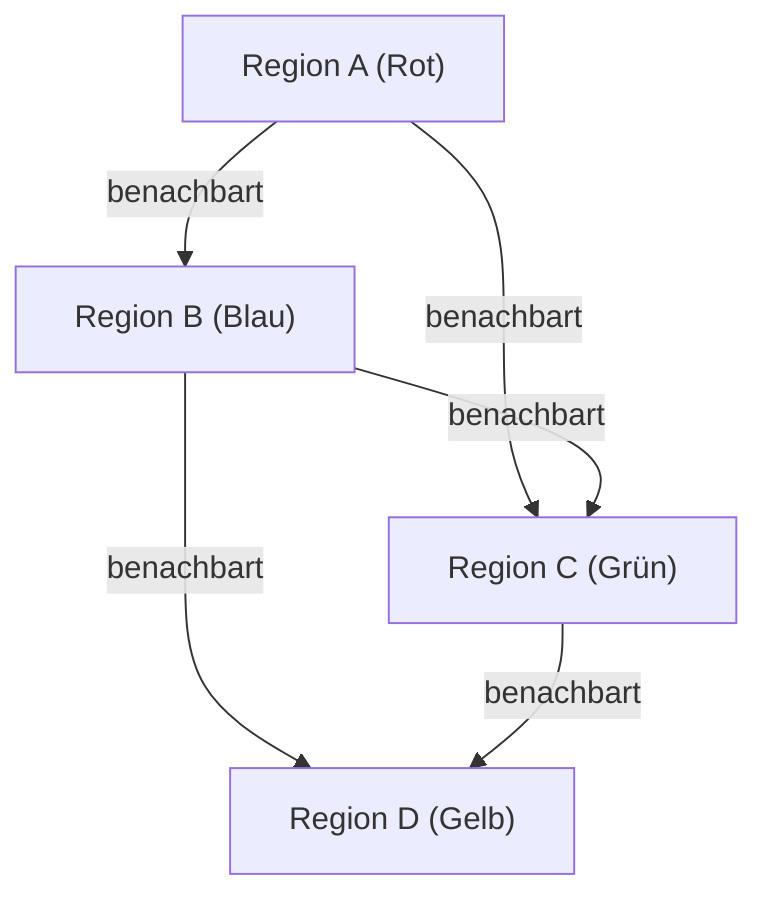

## 1. Was ist der Vier-Farben-Satz?

[Der Vier-Farben-Satz (Four Color Theorem)](https://kenji.blog/de/p/four-color-theorem/) ist eines der berühmtesten und faszinierendsten Probleme in der Mathematik, insbesondere in der Graphentheorie und Topologie. Seine Behauptung ist sehr einfach und intuitiv genug, um von einem Grundschüler verstanden zu werden: "Für jede Karte auf einer Ebene reichen maximal **4 Farben** aus, um benachbarte Regionen so einzufärben, dass sie unterschiedliche Farben haben."

Hier bedeutet "benachbart", dass eine Grenze und nicht nur ein Punkt geteilt wird. Wenn sie sich nur an einem Punkt berühren, ist es kein Problem, sie mit derselben Farbe zu färben. Diese intuitive Hypothese wurde erstmals 1852 von Francis Guthrie aufgestellt. Als er die Landkreise auf einer Karte von England einfärbte, stellte er fest, dass unabhängig davon, wie komplex die Grenzen waren, 4 Farben ausreichten.

## 2. Historischer Hintergrund des Vier-Farben-Satzes

Nachdem Francis Guthrie dieses Problem bemerkt hatte, erzählte er es seinem Bruder Frederick Guthrie, der Mathematiker war. Frederick stellte das Problem dann seinem Mentor Augustus De Morgan vor. De Morgan war überrascht von der Einfachheit des Problems und wie extrem schwierig es im Gegensatz dazu zu beweisen war, und begann, es mit anderen Mathematikern zu diskutieren.

1878 präsentierte Arthur Cayley das Problem offiziell der London Mathematical Society, wodurch es in der mathematischen Gemeinschaft weithin bekannt wurde. Viele brillante Mathematiker versuchten, das Problem zu lösen, aber der Weg zu einem vollständigen Beweis war weitaus steiler als man es sich vorgestellt hatte.

## 3. Kempes Beweis und Heawoods Gegenbeispiel

Im Jahr 1879 veröffentlichte ein Mathematiker namens Alfred Kempe einen Beweis für den Vier-Farben-Satz. Sein Beweis war sehr geschickt und führte ein Konzept ein, das heute als "Kempe-Kette (Kempe chain)" bekannt ist. Kempes Beweis wurde weithin akzeptiert, und mehr als ein Jahrzehnt lang galt der Vier-Farben-Satz als gelöst.

1890 entdeckte Percy Heawood jedoch einen fatalen Fehler in Kempes Beweis. Während Heawood auf den Fehler in Kempes Logik hinwies, wendete er Kempes Methode an, um brillant den "Fünf-Farben-Satz" zu beweisen, der besagt, dass "jede Karte mit **5 Farben** gefärbt werden kann". Der Vier-Farben-Satz stand wieder als ungelöstes Problem da.

## 4. Konvertierung in die Graphentheorie

Um den Vier-Farben-Satz mathematisch streng zu behandeln, wird das Problem in die Sprache der Graphentheorie übersetzt. Jede Region auf der Karte wird als "Knoten (Vertex)" betrachtet, und Regionen, die eine Grenze teilen, werden durch eine "Kante (Edge)" verbunden. Ein auf diese Weise erstellter [Graph](https://kenji.blog/de/p/tree-graph-data-structures-search-dfs-bfs-dijkstra/) wird als "planarer Graph (Planar Graph)" bezeichnet.

Ein planarer Graph ist ein Graph, der in einer Ebene gezeichnet werden kann, ohne dass sich die Kanten schneiden. Der Vier-Farben-Satz reduziert sich auf das Problem: "Alle Knoten jedes planaren Graphen können mit **4 Farben** so gefärbt werden, dass benachbarte Knoten unterschiedliche Farben haben."

Mathematisch ausgedrückt bedeutet dies, dass für einen Graphen $G = (V, E)$ eine Färbungsfunktion $c: V \rightarrow \{1, 2, 3, 4\}$ existiert, so dass $c(u) \neq c(v)$ für alle Kanten $(u, v) \in E$ gilt.

Hier spielt die eulersche Polyederformel $V - E + F = 2$ ($V$ ist die Anzahl der Knoten, $E$ ist die Anzahl der Kanten, $F$ ist die Anzahl der Flächen) eine wichtige Rolle bei der Untersuchung der Eigenschaften von planaren Graphen.

## 5. Der Schock des computergestützten Beweises

1976 bewiesen Kenneth Appel und Wolfgang Haken von der University of Illinois schließlich den Vier-Farben-Satz. Ihre Beweismethode löste jedoch große Kontroversen in der mathematischen Gemeinschaft aus. Sie reduzierten den Beweis des Problems auf die Überprüfung einer endlichen Anzahl (letztendlich 1936) von Mustern, die "unvermeidbare Mengen (Unavoidable set)" genannt wurden, und ließen die damaligen Supercomputer berechnen, dass all diese Muster mit 4 Farben gefärbt werden konnten (Reduzibilität: Reducibility).

Da die Menge an Berechnungen so enorm war, dass es für Menschen unmöglich war, alle Berechnungsprozesse manuell zu überprüfen, führte dies zu einer philosophischen Debatte: "Kann dies wirklich als mathematischer Beweis bezeichnet werden?"

## 6. Verfeinerung des Beweises und moderne Perspektiven

1997 wurde der Beweis von Appel und Haken von Neil Robertson und anderen verbessert, und die Anzahl der unvermeidbaren Mengen wurde auf 633 reduziert. Darüber hinaus vollendete Georges Gonthier 2005 mit dem interaktiven Theorembeweiser Coq einen vollständig formalen Beweis des Vier-Farben-Satzes. Infolgedessen wurde die Möglichkeit von Fehlern aufgrund von Fehlern im Computerprogramm extrem gering, und die Gültigkeit des Beweises wurde unbestreitbar.

Heute sind computergestützte Beweise als mächtiges Werkzeug in der Mathematik weithin anerkannt und haben zur Lösung anderer schwieriger Probleme wie der Kepler-Vermutung beigetragen.

## 7. Fazit

Der Vier-Farben-Satz ist das beste Beispiel dafür, "wie tief und komplex eine mathematische Struktur in einem scheinbar einfachen Problem verborgen ist". Dieses Problem, das aus dem spielerischen Färben einer Karte entstand, entwickelte die Graphentheorie und hatte sogar tiefgreifende Auswirkungen, indem es die Natur des mathematischen Beweises selbst veränderte.

Die Erforschung dieses Problems lehrt uns, wie mächtig die menschliche Intuition ist und wie viel Aufwand und neue Technologie erforderlich sind, um sie rigoros zu beweisen.

## 1. Was ist der Vier-Farben-Satz?

[Der Vier-Farben-Satz (Four Color Theorem)](https://kenji.blog/de/p/four-color-theorem/) ist eines der berühmtesten und faszinierendsten Probleme in der Mathematik, insbesondere in der Graphentheorie und Topologie. Seine Behauptung ist sehr einfach und intuitiv genug, um von einem Grundschüler verstanden zu werden: "Für jede Karte auf einer Ebene reichen maximal **4 Farben** aus, um benachbarte Regionen so einzufärben, dass sie unterschiedliche Farben haben."

Hier bedeutet "benachbart", dass eine Grenze und nicht nur ein Punkt geteilt wird. Wenn sie sich nur an einem Punkt berühren, ist es kein Problem, sie mit derselben Farbe zu färben. Diese intuitive Hypothese wurde erstmals 1852 von Francis Guthrie aufgestellt. Als er die Landkreise auf einer Karte von England einfärbte, stellte er fest, dass unabhängig davon, wie komplex die Grenzen waren, 4 Farben ausreichten.

## 2. Historischer Hintergrund des Vier-Farben-Satzes

Nachdem Francis Guthrie dieses Problem bemerkt hatte, erzählte er es seinem Bruder Frederick Guthrie, der Mathematiker war. Frederick stellte das Problem dann seinem Mentor Augustus De Morgan vor. De Morgan war überrascht von der Einfachheit des Problems und wie extrem schwierig es im Gegensatz dazu zu beweisen war, und begann, es mit anderen Mathematikern zu diskutieren.

1878 präsentierte Arthur Cayley das Problem offiziell der London Mathematical Society, wodurch es in der mathematischen Gemeinschaft weithin bekannt wurde. Viele brillante Mathematiker versuchten, das Problem zu lösen, aber der Weg zu einem vollständigen Beweis war weitaus steiler als man es sich vorgestellt hatte.

## 3. Kempes Beweis und Heawoods Gegenbeispiel

Im Jahr 1879 veröffentlichte ein Mathematiker namens Alfred Kempe einen Beweis für den Vier-Farben-Satz. Sein Beweis war sehr geschickt und führte ein Konzept ein, das heute als "Kempe-Kette (Kempe chain)" bekannt ist. Kempes Beweis wurde weithin akzeptiert, und mehr als ein Jahrzehnt lang galt der Vier-Farben-Satz als gelöst.

1890 entdeckte Percy Heawood jedoch einen fatalen Fehler in Kempes Beweis. Während Heawood auf den Fehler in Kempes Logik hinwies, wendete er Kempes Methode an, um brillant den "Fünf-Farben-Satz" zu beweisen, der besagt, dass "jede Karte mit **5 Farben** gefärbt werden kann". Der Vier-Farben-Satz stand wieder als ungelöstes Problem da.

## 4. Konvertierung in die Graphentheorie

Um den Vier-Farben-Satz mathematisch streng zu behandeln, wird das Problem in die Sprache der Graphentheorie übersetzt. Jede Region auf der Karte wird als "Knoten (Vertex)" betrachtet, und Regionen, die eine Grenze teilen, werden durch eine "Kante (Edge)" verbunden. Ein auf diese Weise erstellter [Graph](https://kenji.blog/de/p/tree-graph-data-structures-search-dfs-bfs-dijkstra/) wird als "planarer Graph (Planar Graph)" bezeichnet.

Ein planarer Graph ist ein Graph, der in einer Ebene gezeichnet werden kann, ohne dass sich die Kanten schneiden. Der Vier-Farben-Satz reduziert sich auf das Problem: "Alle Knoten jedes planaren Graphen können mit **4 Farben** so gefärbt werden, dass benachbarte Knoten unterschiedliche Farben haben."

Mathematisch ausgedrückt bedeutet dies, dass für einen Graphen $G = (V, E)$ eine Färbungsfunktion $c: V \rightarrow \{1, 2, 3, 4\}$ existiert, so dass $c(u) \neq c(v)$ für alle Kanten $(u, v) \in E$ gilt.

Hier spielt die eulersche Polyederformel $V - E + F = 2$ ($V$ ist die Anzahl der Knoten, $E$ ist die Anzahl der Kanten, $F$ ist die Anzahl der Flächen) eine wichtige Rolle bei der Untersuchung der Eigenschaften von planaren Graphen.

## 5. Der Schock des computergestützten Beweises

1976 bewiesen Kenneth Appel und Wolfgang Haken von der University of Illinois schließlich den Vier-Farben-Satz. Ihre Beweismethode löste jedoch große Kontroversen in der mathematischen Gemeinschaft aus. Sie reduzierten den Beweis des Problems auf die Überprüfung einer endlichen Anzahl (letztendlich 1936) von Mustern, die "unvermeidbare Mengen (Unavoidable set)" genannt wurden, und ließen die damaligen Supercomputer berechnen, dass all diese Muster mit 4 Farben gefärbt werden konnten (Reduzibilität: Reducibility).

Da die Menge an Berechnungen so enorm war, dass es für Menschen unmöglich war, alle Berechnungsprozesse manuell zu überprüfen, führte dies zu einer philosophischen Debatte: "Kann dies wirklich als mathematischer Beweis bezeichnet werden?"

## 6. Verfeinerung des Beweises und moderne Perspektiven

1997 wurde der Beweis von Appel und Haken von Neil Robertson und anderen verbessert, und die Anzahl der unvermeidbaren Mengen wurde auf 633 reduziert. Darüber hinaus vollendete Georges Gonthier 2005 mit dem interaktiven Theorembeweiser Coq einen vollständig formalen Beweis des Vier-Farben-Satzes. Infolgedessen wurde die Möglichkeit von Fehlern aufgrund von Fehlern im Computerprogramm extrem gering, und die Gültigkeit des Beweises wurde unbestreitbar.

Heute sind computergestützte Beweise als mächtiges Werkzeug in der Mathematik weithin anerkannt und haben zur Lösung anderer schwieriger Probleme wie der Kepler-Vermutung beigetragen.

## 7. Fazit

Der Vier-Farben-Satz ist das beste Beispiel dafür, "wie tief und komplex eine mathematische Struktur in einem scheinbar einfachen Problem verborgen ist". Dieses Problem, das aus dem spielerischen Färben einer Karte entstand, entwickelte die Graphentheorie und hatte sogar tiefgreifende Auswirkungen, indem es die Natur des mathematischen Beweises selbst veränderte.

Die Erforschung dieses Problems lehrt uns, wie mächtig die menschliche Intuition ist und wie viel Aufwand und neue Technologie erforderlich sind, um sie rigoros zu beweisen.

## 1. Was ist der Vier-Farben-Satz?

[Der Vier-Farben-Satz (Four Color Theorem)](https://kenji.blog/de/p/four-color-theorem/) ist eines der berühmtesten und faszinierendsten Probleme in der Mathematik, insbesondere in der Graphentheorie und Topologie. Seine Behauptung ist sehr einfach und intuitiv genug, um von einem Grundschüler verstanden zu werden: "Für jede Karte auf einer Ebene reichen maximal **4 Farben** aus, um benachbarte Regionen so einzufärben, dass sie unterschiedliche Farben haben."

Hier bedeutet "benachbart", dass eine Grenze und nicht nur ein Punkt geteilt wird. Wenn sie sich nur an einem Punkt berühren, ist es kein Problem, sie mit derselben Farbe zu färben. Diese intuitive Hypothese wurde erstmals 1852 von Francis Guthrie aufgestellt. Als er die Landkreise auf einer Karte von England einfärbte, stellte er fest, dass unabhängig davon, wie komplex die Grenzen waren, 4 Farben ausreichten.

## 2. Historischer Hintergrund des Vier-Farben-Satzes

Nachdem Francis Guthrie dieses Problem bemerkt hatte, erzählte er es seinem Bruder Frederick Guthrie, der Mathematiker war. Frederick stellte das Problem dann seinem Mentor Augustus De Morgan vor. De Morgan war überrascht von der Einfachheit des Problems und wie extrem schwierig es im Gegensatz dazu zu beweisen war, und begann, es mit anderen Mathematikern zu diskutieren.

1878 präsentierte Arthur Cayley das Problem offiziell der London Mathematical Society, wodurch es in der mathematischen Gemeinschaft weithin bekannt wurde. Viele brillante Mathematiker versuchten, das Problem zu lösen, aber der Weg zu einem vollständigen Beweis war weitaus steiler als man es sich vorgestellt hatte.

## 3. Kempes Beweis und Heawoods Gegenbeispiel

Im Jahr 1879 veröffentlichte ein Mathematiker namens Alfred Kempe einen Beweis für den Vier-Farben-Satz. Sein Beweis war sehr geschickt und führte ein Konzept ein, das heute als "Kempe-Kette (Kempe chain)" bekannt ist. Kempes Beweis wurde weithin akzeptiert, und mehr als ein Jahrzehnt lang galt der Vier-Farben-Satz als gelöst.

1890 entdeckte Percy Heawood jedoch einen fatalen Fehler in Kempes Beweis. Während Heawood auf den Fehler in Kempes Logik hinwies, wendete er Kempes Methode an, um brillant den "Fünf-Farben-Satz" zu beweisen, der besagt, dass "jede Karte mit **5 Farben** gefärbt werden kann". Der Vier-Farben-Satz stand wieder als ungelöstes Problem da.

## 4. Konvertierung in die Graphentheorie

Um den Vier-Farben-Satz mathematisch streng zu behandeln, wird das Problem in die Sprache der Graphentheorie übersetzt. Jede Region auf der Karte wird als "Knoten (Vertex)" betrachtet, und Regionen, die eine Grenze teilen, werden durch eine "Kante (Edge)" verbunden. Ein auf diese Weise erstellter [Graph](https://kenji.blog/de/p/tree-graph-data-structures-search-dfs-bfs-dijkstra/) wird als "planarer Graph (Planar Graph)" bezeichnet.

Ein planarer Graph ist ein Graph, der in einer Ebene gezeichnet werden kann, ohne dass sich die Kanten schneiden. Der Vier-Farben-Satz reduziert sich auf das Problem: "Alle Knoten jedes planaren Graphen können mit **4 Farben** so gefärbt werden, dass benachbarte Knoten unterschiedliche Farben haben."

Mathematisch ausgedrückt bedeutet dies, dass für einen Graphen $G = (V, E)$ eine Färbungsfunktion $c: V \rightarrow \{1, 2, 3, 4\}$ existiert, so dass $c(u) \neq c(v)$ für alle Kanten $(u, v) \in E$ gilt.

Hier spielt die eulersche Polyederformel $V - E + F = 2$ ($V$ ist die Anzahl der Knoten, $E$ ist die Anzahl der Kanten, $F$ ist die Anzahl der Flächen) eine wichtige Rolle bei der Untersuchung der Eigenschaften von planaren Graphen.

## 5. Der Schock des computergestützten Beweises

1976 bewiesen Kenneth Appel und Wolfgang Haken von der University of Illinois schließlich den Vier-Farben-Satz. Ihre Beweismethode löste jedoch große Kontroversen in der mathematischen Gemeinschaft aus. Sie reduzierten den Beweis des Problems auf die Überprüfung einer endlichen Anzahl (letztendlich 1936) von Mustern, die "unvermeidbare Mengen (Unavoidable set)" genannt wurden, und ließen die damaligen Supercomputer berechnen, dass all diese Muster mit 4 Farben gefärbt werden konnten (Reduzibilität: Reducibility).

Da die Menge an Berechnungen so enorm war, dass es für Menschen unmöglich war, alle Berechnungsprozesse manuell zu überprüfen, führte dies zu einer philosophischen Debatte: "Kann dies wirklich als mathematischer Beweis bezeichnet werden?"

## 6. Verfeinerung des Beweises und moderne Perspektiven

1997 wurde der Beweis von Appel und Haken von Neil Robertson und anderen verbessert, und die Anzahl der unvermeidbaren Mengen wurde auf 633 reduziert. Darüber hinaus vollendete Georges Gonthier 2005 mit dem interaktiven Theorembeweiser Coq einen vollständig formalen Beweis des Vier-Farben-Satzes. Infolgedessen wurde die Möglichkeit von Fehlern aufgrund von Fehlern im Computerprogramm extrem gering, und die Gültigkeit des Beweises wurde unbestreitbar.

Heute sind computergestützte Beweise als mächtiges Werkzeug in der Mathematik weithin anerkannt und haben zur Lösung anderer schwieriger Probleme wie der Kepler-Vermutung beigetragen.

## 7. Fazit

Der Vier-Farben-Satz ist das beste Beispiel dafür, "wie tief und komplex eine mathematische Struktur in einem scheinbar einfachen Problem verborgen ist". Dieses Problem, das aus dem spielerischen Färben einer Karte entstand, entwickelte die Graphentheorie und hatte sogar tiefgreifende Auswirkungen, indem es die Natur des mathematischen Beweises selbst veränderte.

Die Erforschung dieses Problems lehrt uns, wie mächtig die menschliche Intuition ist und wie viel Aufwand und neue Technologie erforderlich sind, um sie rigoros zu beweisen.

## 1. Was ist der Vier-Farben-Satz?

[Der Vier-Farben-Satz (Four Color Theorem)](https://kenji.blog/de/p/four-color-theorem/) ist eines der berühmtesten und faszinierendsten Probleme in der Mathematik, insbesondere in der Graphentheorie und Topologie. Seine Behauptung ist sehr einfach und intuitiv genug, um von einem Grundschüler verstanden zu werden: "Für jede Karte auf einer Ebene reichen maximal **4 Farben** aus, um benachbarte Regionen so einzufärben, dass sie unterschiedliche Farben haben."

Hier bedeutet "benachbart", dass eine Grenze und nicht nur ein Punkt geteilt wird. Wenn sie sich nur an einem Punkt berühren, ist es kein Problem, sie mit derselben Farbe zu färben. Diese intuitive Hypothese wurde erstmals 1852 von Francis Guthrie aufgestellt. Als er die Landkreise auf einer Karte von England einfärbte, stellte er fest, dass unabhängig davon, wie komplex die Grenzen waren, 4 Farben ausreichten.

## 2. Historischer Hintergrund des Vier-Farben-Satzes

Nachdem Francis Guthrie dieses Problem bemerkt hatte, erzählte er es seinem Bruder Frederick Guthrie, der Mathematiker war. Frederick stellte das Problem dann seinem Mentor Augustus De Morgan vor. De Morgan war überrascht von der Einfachheit des Problems und wie extrem schwierig es im Gegensatz dazu zu beweisen war, und begann, es mit anderen Mathematikern zu diskutieren.

1878 präsentierte Arthur Cayley das Problem offiziell der London Mathematical Society, wodurch es in der mathematischen Gemeinschaft weithin bekannt wurde. Viele brillante Mathematiker versuchten, das Problem zu lösen, aber der Weg zu einem vollständigen Beweis war weitaus steiler als man es sich vorgestellt hatte.

## 3. Kempes Beweis und Heawoods Gegenbeispiel

Im Jahr 1879 veröffentlichte ein Mathematiker namens Alfred Kempe einen Beweis für den Vier-Farben-Satz. Sein Beweis war sehr geschickt und führte ein Konzept ein, das heute als "Kempe-Kette (Kempe chain)" bekannt ist. Kempes Beweis wurde weithin akzeptiert, und mehr als ein Jahrzehnt lang galt der Vier-Farben-Satz als gelöst.

1890 entdeckte Percy Heawood jedoch einen fatalen Fehler in Kempes Beweis. Während Heawood auf den Fehler in Kempes Logik hinwies, wendete er Kempes Methode an, um brillant den "Fünf-Farben-Satz" zu beweisen, der besagt, dass "jede Karte mit **5 Farben** gefärbt werden kann". Der Vier-Farben-Satz stand wieder als ungelöstes Problem da.

## 4. Konvertierung in die Graphentheorie

Um den Vier-Farben-Satz mathematisch streng zu behandeln, wird das Problem in die Sprache der Graphentheorie übersetzt. Jede Region auf der Karte wird als "Knoten (Vertex)" betrachtet, und Regionen, die eine Grenze teilen, werden durch eine "Kante (Edge)" verbunden. Ein auf diese Weise erstellter [Graph](https://kenji.blog/de/p/tree-graph-data-structures-search-dfs-bfs-dijkstra/) wird als "planarer Graph (Planar Graph)" bezeichnet.

Ein planarer Graph ist ein Graph, der in einer Ebene gezeichnet werden kann, ohne dass sich die Kanten schneiden. Der Vier-Farben-Satz reduziert sich auf das Problem: "Alle Knoten jedes planaren Graphen können mit **4 Farben** so gefärbt werden, dass benachbarte Knoten unterschiedliche Farben haben."

Mathematisch ausgedrückt bedeutet dies, dass für einen Graphen $G = (V, E)$ eine Färbungsfunktion $c: V \rightarrow \{1, 2, 3, 4\}$ existiert, so dass $c(u) \neq c(v)$ für alle Kanten $(u, v) \in E$ gilt.

Hier spielt die eulersche Polyederformel $V - E + F = 2$ ($V$ ist die Anzahl der Knoten, $E$ ist die Anzahl der Kanten, $F$ ist die Anzahl der Flächen) eine wichtige Rolle bei der Untersuchung der Eigenschaften von planaren Graphen.

## 5. Der Schock des computergestützten Beweises

1976 bewiesen Kenneth Appel und Wolfgang Haken von der University of Illinois schließlich den Vier-Farben-Satz. Ihre Beweismethode löste jedoch große Kontroversen in der mathematischen Gemeinschaft aus. Sie reduzierten den Beweis des Problems auf die Überprüfung einer endlichen Anzahl (letztendlich 1936) von Mustern, die "unvermeidbare Mengen (Unavoidable set)" genannt wurden, und ließen die damaligen Supercomputer berechnen, dass all diese Muster mit 4 Farben gefärbt werden konnten (Reduzibilität: Reducibility).

Da die Menge an Berechnungen so enorm war, dass es für Menschen unmöglich war, alle Berechnungsprozesse manuell zu überprüfen, führte dies zu einer philosophischen Debatte: "Kann dies wirklich als mathematischer Beweis bezeichnet werden?"

## 6. Verfeinerung des Beweises und moderne Perspektiven

1997 wurde der Beweis von Appel und Haken von Neil Robertson und anderen verbessert, und die Anzahl der unvermeidbaren Mengen wurde auf 633 reduziert. Darüber hinaus vollendete Georges Gonthier 2005 mit dem interaktiven Theorembeweiser Coq einen vollständig formalen Beweis des Vier-Farben-Satzes. Infolgedessen wurde die Möglichkeit von Fehlern aufgrund von Fehlern im Computerprogramm extrem gering, und die Gültigkeit des Beweises wurde unbestreitbar.

Heute sind computergestützte Beweise als mächtiges Werkzeug in der Mathematik weithin anerkannt und haben zur Lösung anderer schwieriger Probleme wie der Kepler-Vermutung beigetragen.

## 7. Fazit

Der Vier-Farben-Satz ist das beste Beispiel dafür, "wie tief und komplex eine mathematische Struktur in einem scheinbar einfachen Problem verborgen ist". Dieses Problem, das aus dem spielerischen Färben einer Karte entstand, entwickelte die Graphentheorie und hatte sogar tiefgreifende Auswirkungen, indem es die Natur des mathematischen Beweises selbst veränderte.

Die Erforschung dieses Problems lehrt uns, wie mächtig die menschliche Intuition ist und wie viel Aufwand und neue Technologie erforderlich sind, um sie rigoros zu beweisen.
