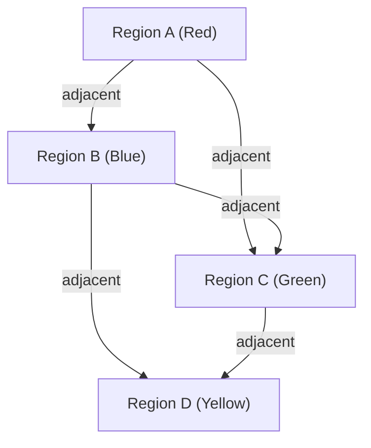

## 1. What is the [Four Color Theorem](https://kenji.blog/en/p/four-color-theorem/)?

The [Four Color Theorem](https://kenji.blog/en/p/four-color-theorem/) is one of the most famous and fascinating problems in mathematics, particularly in graph theory and topology. Its assertion is very simple, intuitive enough for an elementary school student to understand. It states that "for any map on a plane, a maximum of **4 colors** is sufficient to color it so that adjacent regions have different colors."

Here, "adjacent" refers to a state of sharing a boundary line, not a point. If they only touch at a point, there is no problem painting them the same color. This intuitive hypothesis was first proposed by Francis Guthrie in 1852. While coloring a map of the counties of England, he noticed that no matter how complex the boundary lines of the counties were, they could be colored with just 4 colors.

## 2. Historical Background of the [Four Color Theorem](https://kenji.blog/en/p/four-color-theorem/)

After Francis Guthrie noticed this problem, he communicated it to his brother, Frederick Guthrie, who was a mathematician. Frederick then presented the problem to his mentor, Augustus De Morgan. De Morgan was surprised by the simplicity of the problem and, conversely, by the extreme difficulty of proving it, and began discussing it with other mathematicians.

In 1878, Arthur Cayley officially presented this problem at the London Mathematical Society, making it widely known in the mathematical community. Many brilliant mathematicians attempted to solve this problem, but the path to a complete proof was much steeper than imagined.

## 3. Kempe's Proof and Heawood's Counterexample

In 1879, a mathematician named Alfred Kempe published a proof of the [Four Color Theorem](https://kenji.blog/en/p/four-color-theorem/). His proof was very clever, introducing a concept now called a "Kempe chain." Kempe's proof was widely accepted, and for over a decade, the [Four Color Theorem](https://kenji.blog/en/p/four-color-theorem/) was considered solved.

However, in 1890, Percy Heawood discovered a fatal flaw in Kempe's proof. While pointing out the logical error in Kempe's work, Heawood successfully applied Kempe's method to prove the "Five Color Theorem," which states that "any map can be colored with **5 colors**." The [Four Color Theorem](https://kenji.blog/en/p/four-color-theorem/) once again stood as an unsolved problem.

## 4. Conversion to Graph Theory

To handle the [Four Color Theorem](https://kenji.blog/en/p/four-color-theorem/) mathematically strictly, the problem is translated into the language of graph theory. Each region on the map is treated as a "Vertex," and regions sharing a boundary line are connected by an "Edge." The graph created in this way is called a "Planar Graph."

A planar graph is a graph that can be drawn on a plane without edges crossing. The [Four Color Theorem](https://kenji.blog/en/p/four-color-theorem/) reduces to the problem that "the vertices of every planar graph can be colored with **4 colors** such that adjacent vertices have different colors."

Expressed using mathematical formulas, for a graph $G = (V, E)$, it means showing that there exists a coloring function $c: V \rightarrow \{1, 2, 3, 4\}$ such that for all edges $(u, v) \in E$, $c(u) \neq c(v)$.

Here, Euler's polyhedron formula $V - E + F = 2$ (where $V$ is the number of vertices, $E$ is the number of edges, and $F$ is the number of faces) plays an important role in investigating the properties of planar graphs.

## 5. The Impact of Computer Proof

In 1976, Kenneth Appel and Wolfgang Haken of the University of Illinois finally proved the [Four Color Theorem](https://kenji.blog/en/p/four-color-theorem/). However, their method of proof caused a major controversy in the mathematical community. They reduced the proof of the problem to checking a finite number (ultimately 1,936) of patterns called an "Unavoidable set," and had the supercomputers of the time calculate that all these patterns could be colored with 4 colors (Reducibility).

Because the amount of calculation was so massive that it was impossible for humans to check all the calculation processes by hand, it sparked a philosophical debate: "Can this truly be called a mathematical proof?"

## 6. Refinement of the Proof and Modern Perspectives

In 1997, Neil Robertson and others improved the proof of Appel and Haken, reducing the number of unavoidable sets to 633. Furthermore, in 2005, Georges Gonthier completed a fully formal proof of the [Four Color Theorem](https://kenji.blog/en/p/four-color-theorem/) using the theorem proving assistant Coq. This made the possibility of errors due to computer program bugs extremely low, and the validity of the proof became unshakeable.

Today, computer-assisted proofs are widely recognized as powerful tools in mathematics, contributing to the resolution of other difficult problems, such as the proof of the Kepler conjecture.

## 7. Conclusion

The [Four Color Theorem](https://kenji.blog/en/p/four-color-theorem/) is the best example showing "how deeply complex mathematical structures are hidden within seemingly simple problems." This problem, which started from the playful act of coloring a map, has had an immeasurable impact by developing graph theory and even transforming the very nature of mathematical proofs.

The exploration of this problem teaches us how powerful human intuition is, and how much effort and new technology are required to rigorously prove it.

## 1. What is the [Four Color Theorem](https://kenji.blog/en/p/four-color-theorem/)?

The [Four Color Theorem](https://kenji.blog/en/p/four-color-theorem/) is one of the most famous and fascinating problems in mathematics, particularly in graph theory and topology. Its assertion is very simple, intuitive enough for an elementary school student to understand. It states that "for any map on a plane, a maximum of **4 colors** is sufficient to color it so that adjacent regions have different colors."

Here, "adjacent" refers to a state of sharing a boundary line, not a point. If they only touch at a point, there is no problem painting them the same color. This intuitive hypothesis was first proposed by Francis Guthrie in 1852. While coloring a map of the counties of England, he noticed that no matter how complex the boundary lines of the counties were, they could be colored with just 4 colors.

## 2. Historical Background of the [Four Color Theorem](https://kenji.blog/en/p/four-color-theorem/)

After Francis Guthrie noticed this problem, he communicated it to his brother, Frederick Guthrie, who was a mathematician. Frederick then presented the problem to his mentor, Augustus De Morgan. De Morgan was surprised by the simplicity of the problem and, conversely, by the extreme difficulty of proving it, and began discussing it with other mathematicians.

In 1878, Arthur Cayley officially presented this problem at the London Mathematical Society, making it widely known in the mathematical community. Many brilliant mathematicians attempted to solve this problem, but the path to a complete proof was much steeper than imagined.

## 3. Kempe's Proof and Heawood's Counterexample

In 1879, a mathematician named Alfred Kempe published a proof of the [Four Color Theorem](https://kenji.blog/en/p/four-color-theorem/). His proof was very clever, introducing a concept now called a "Kempe chain." Kempe's proof was widely accepted, and for over a decade, the [Four Color Theorem](https://kenji.blog/en/p/four-color-theorem/) was considered solved.

However, in 1890, Percy Heawood discovered a fatal flaw in Kempe's proof. While pointing out the logical error in Kempe's work, Heawood successfully applied Kempe's method to prove the "Five Color Theorem," which states that "any map can be colored with **5 colors**." The [Four Color Theorem](https://kenji.blog/en/p/four-color-theorem/) once again stood as an unsolved problem.

## 4. Conversion to Graph Theory

To handle the [Four Color Theorem](https://kenji.blog/en/p/four-color-theorem/) mathematically strictly, the problem is translated into the language of graph theory. Each region on the map is treated as a "Vertex," and regions sharing a boundary line are connected by an "Edge." The graph created in this way is called a "Planar Graph."

A planar graph is a graph that can be drawn on a plane without edges crossing. The [Four Color Theorem](https://kenji.blog/en/p/four-color-theorem/) reduces to the problem that "the vertices of every planar graph can be colored with **4 colors** such that adjacent vertices have different colors."

Expressed using mathematical formulas, for a graph $G = (V, E)$, it means showing that there exists a coloring function $c: V \rightarrow \{1, 2, 3, 4\}$ such that for all edges $(u, v) \in E$, $c(u) \neq c(v)$.

Here, Euler's polyhedron formula $V - E + F = 2$ (where $V$ is the number of vertices, $E$ is the number of edges, and $F$ is the number of faces) plays an important role in investigating the properties of planar graphs.

## 5. The Impact of Computer Proof

In 1976, Kenneth Appel and Wolfgang Haken of the University of Illinois finally proved the [Four Color Theorem](https://kenji.blog/en/p/four-color-theorem/). However, their method of proof caused a major controversy in the mathematical community. They reduced the proof of the problem to checking a finite number (ultimately 1,936) of patterns called an "Unavoidable set," and had the supercomputers of the time calculate that all these patterns could be colored with 4 colors (Reducibility).

Because the amount of calculation was so massive that it was impossible for humans to check all the calculation processes by hand, it sparked a philosophical debate: "Can this truly be called a mathematical proof?"

## 6. Refinement of the Proof and Modern Perspectives

In 1997, Neil Robertson and others improved the proof of Appel and Haken, reducing the number of unavoidable sets to 633. Furthermore, in 2005, Georges Gonthier completed a fully formal proof of the [Four Color Theorem](https://kenji.blog/en/p/four-color-theorem/) using the theorem proving assistant Coq. This made the possibility of errors due to computer program bugs extremely low, and the validity of the proof became unshakeable.

Today, computer-assisted proofs are widely recognized as powerful tools in mathematics, contributing to the resolution of other difficult problems, such as the proof of the Kepler conjecture.

## 7. Conclusion

The [Four Color Theorem](https://kenji.blog/en/p/four-color-theorem/) is the best example showing "how deeply complex mathematical structures are hidden within seemingly simple problems." This problem, which started from the playful act of coloring a map, has had an immeasurable impact by developing graph theory and even transforming the very nature of mathematical proofs.

The exploration of this problem teaches us how powerful human intuition is, and how much effort and new technology are required to rigorously prove it.

## 1. What is the [Four Color Theorem](https://kenji.blog/en/p/four-color-theorem/)?

The [Four Color Theorem](https://kenji.blog/en/p/four-color-theorem/) is one of the most famous and fascinating problems in mathematics, particularly in graph theory and topology. Its assertion is very simple, intuitive enough for an elementary school student to understand. It states that "for any map on a plane, a maximum of **4 colors** is sufficient to color it so that adjacent regions have different colors."

Here, "adjacent" refers to a state of sharing a boundary line, not a point. If they only touch at a point, there is no problem painting them the same color. This intuitive hypothesis was first proposed by Francis Guthrie in 1852. While coloring a map of the counties of England, he noticed that no matter how complex the boundary lines of the counties were, they could be colored with just 4 colors.

## 2. Historical Background of the [Four Color Theorem](https://kenji.blog/en/p/four-color-theorem/)

After Francis Guthrie noticed this problem, he communicated it to his brother, Frederick Guthrie, who was a mathematician. Frederick then presented the problem to his mentor, Augustus De Morgan. De Morgan was surprised by the simplicity of the problem and, conversely, by the extreme difficulty of proving it, and began discussing it with other mathematicians.

In 1878, Arthur Cayley officially presented this problem at the London Mathematical Society, making it widely known in the mathematical community. Many brilliant mathematicians attempted to solve this problem, but the path to a complete proof was much steeper than imagined.

## 3. Kempe's Proof and Heawood's Counterexample

In 1879, a mathematician named Alfred Kempe published a proof of the [Four Color Theorem](https://kenji.blog/en/p/four-color-theorem/). His proof was very clever, introducing a concept now called a "Kempe chain." Kempe's proof was widely accepted, and for over a decade, the [Four Color Theorem](https://kenji.blog/en/p/four-color-theorem/) was considered solved.

However, in 1890, Percy Heawood discovered a fatal flaw in Kempe's proof. While pointing out the logical error in Kempe's work, Heawood successfully applied Kempe's method to prove the "Five Color Theorem," which states that "any map can be colored with **5 colors**." The [Four Color Theorem](https://kenji.blog/en/p/four-color-theorem/) once again stood as an unsolved problem.

## 4. Conversion to Graph Theory

To handle the [Four Color Theorem](https://kenji.blog/en/p/four-color-theorem/) mathematically strictly, the problem is translated into the language of graph theory. Each region on the map is treated as a "Vertex," and regions sharing a boundary line are connected by an "Edge." The graph created in this way is called a "Planar Graph."

A planar graph is a graph that can be drawn on a plane without edges crossing. The [Four Color Theorem](https://kenji.blog/en/p/four-color-theorem/) reduces to the problem that "the vertices of every planar graph can be colored with **4 colors** such that adjacent vertices have different colors."

Expressed using mathematical formulas, for a graph $G = (V, E)$, it means showing that there exists a coloring function $c: V \rightarrow \{1, 2, 3, 4\}$ such that for all edges $(u, v) \in E$, $c(u) \neq c(v)$.

Here, Euler's polyhedron formula $V - E + F = 2$ (where $V$ is the number of vertices, $E$ is the number of edges, and $F$ is the number of faces) plays an important role in investigating the properties of planar graphs.

## 5. The Impact of Computer Proof

In 1976, Kenneth Appel and Wolfgang Haken of the University of Illinois finally proved the [Four Color Theorem](https://kenji.blog/en/p/four-color-theorem/). However, their method of proof caused a major controversy in the mathematical community. They reduced the proof of the problem to checking a finite number (ultimately 1,936) of patterns called an "Unavoidable set," and had the supercomputers of the time calculate that all these patterns could be colored with 4 colors (Reducibility).

Because the amount of calculation was so massive that it was impossible for humans to check all the calculation processes by hand, it sparked a philosophical debate: "Can this truly be called a mathematical proof?"

## 6. Refinement of the Proof and Modern Perspectives

In 1997, Neil Robertson and others improved the proof of Appel and Haken, reducing the number of unavoidable sets to 633. Furthermore, in 2005, Georges Gonthier completed a fully formal proof of the [Four Color Theorem](https://kenji.blog/en/p/four-color-theorem/) using the theorem proving assistant Coq. This made the possibility of errors due to computer program bugs extremely low, and the validity of the proof became unshakeable.

Today, computer-assisted proofs are widely recognized as powerful tools in mathematics, contributing to the resolution of other difficult problems, such as the proof of the Kepler conjecture.

## 7. Conclusion

The [Four Color Theorem](https://kenji.blog/en/p/four-color-theorem/) is the best example showing "how deeply complex mathematical structures are hidden within seemingly simple problems." This problem, which started from the playful act of coloring a map, has had an immeasurable impact by developing graph theory and even transforming the very nature of mathematical proofs.

The exploration of this problem teaches us how powerful human intuition is, and how much effort and new technology are required to rigorously prove it.

## 1. What is the [Four Color Theorem](https://kenji.blog/en/p/four-color-theorem/)?

The [Four Color Theorem](https://kenji.blog/en/p/four-color-theorem/) is one of the most famous and fascinating problems in mathematics, particularly in graph theory and topology. Its assertion is very simple, intuitive enough for an elementary school student to understand. It states that "for any map on a plane, a maximum of **4 colors** is sufficient to color it so that adjacent regions have different colors."

Here, "adjacent" refers to a state of sharing a boundary line, not a point. If they only touch at a point, there is no problem painting them the same color. This intuitive hypothesis was first proposed by Francis Guthrie in 1852. While coloring a map of the counties of England, he noticed that no matter how complex the boundary lines of the counties were, they could be colored with just 4 colors.

## 2. Historical Background of the [Four Color Theorem](https://kenji.blog/en/p/four-color-theorem/)

After Francis Guthrie noticed this problem, he communicated it to his brother, Frederick Guthrie, who was a mathematician. Frederick then presented the problem to his mentor, Augustus De Morgan. De Morgan was surprised by the simplicity of the problem and, conversely, by the extreme difficulty of proving it, and began discussing it with other mathematicians.

In 1878, Arthur Cayley officially presented this problem at the London Mathematical Society, making it widely known in the mathematical community. Many brilliant mathematicians attempted to solve this problem, but the path to a complete proof was much steeper than imagined.

## 3. Kempe's Proof and Heawood's Counterexample

In 1879, a mathematician named Alfred Kempe published a proof of the [Four Color Theorem](https://kenji.blog/en/p/four-color-theorem/). His proof was very clever, introducing a concept now called a "Kempe chain." Kempe's proof was widely accepted, and for over a decade, the [Four Color Theorem](https://kenji.blog/en/p/four-color-theorem/) was considered solved.

However, in 1890, Percy Heawood discovered a fatal flaw in Kempe's proof. While pointing out the logical error in Kempe's work, Heawood successfully applied Kempe's method to prove the "Five Color Theorem," which states that "any map can be colored with **5 colors**." The [Four Color Theorem](https://kenji.blog/en/p/four-color-theorem/) once again stood as an unsolved problem.

## 4. Conversion to Graph Theory

To handle the [Four Color Theorem](https://kenji.blog/en/p/four-color-theorem/) mathematically strictly, the problem is translated into the language of graph theory. Each region on the map is treated as a "Vertex," and regions sharing a boundary line are connected by an "Edge." The graph created in this way is called a "Planar Graph."

A planar graph is a graph that can be drawn on a plane without edges crossing. The [Four Color Theorem](https://kenji.blog/en/p/four-color-theorem/) reduces to the problem that "the vertices of every planar graph can be colored with **4 colors** such that adjacent vertices have different colors."

Expressed using mathematical formulas, for a graph $G = (V, E)$, it means showing that there exists a coloring function $c: V \rightarrow \{1, 2, 3, 4\}$ such that for all edges $(u, v) \in E$, $c(u) \neq c(v)$.

Here, Euler's polyhedron formula $V - E + F = 2$ (where $V$ is the number of vertices, $E$ is the number of edges, and $F$ is the number of faces) plays an important role in investigating the properties of planar graphs.

## 5. The Impact of Computer Proof

In 1976, Kenneth Appel and Wolfgang Haken of the University of Illinois finally proved the [Four Color Theorem](https://kenji.blog/en/p/four-color-theorem/). However, their method of proof caused a major controversy in the mathematical community. They reduced the proof of the problem to checking a finite number (ultimately 1,936) of patterns called an "Unavoidable set," and had the supercomputers of the time calculate that all these patterns could be colored with 4 colors (Reducibility).

Because the amount of calculation was so massive that it was impossible for humans to check all the calculation processes by hand, it sparked a philosophical debate: "Can this truly be called a mathematical proof?"

## 6. Refinement of the Proof and Modern Perspectives

In 1997, Neil Robertson and others improved the proof of Appel and Haken, reducing the number of unavoidable sets to 633. Furthermore, in 2005, Georges Gonthier completed a fully formal proof of the [Four Color Theorem](https://kenji.blog/en/p/four-color-theorem/) using the theorem proving assistant Coq. This made the possibility of errors due to computer program bugs extremely low, and the validity of the proof became unshakeable.

Today, computer-assisted proofs are widely recognized as powerful tools in mathematics, contributing to the resolution of other difficult problems, such as the proof of the Kepler conjecture.

## 7. Conclusion

The [Four Color Theorem](https://kenji.blog/en/p/four-color-theorem/) is the best example showing "how deeply complex mathematical structures are hidden within seemingly simple problems." This problem, which started from the playful act of coloring a map, has had an immeasurable impact by developing graph theory and even transforming the very nature of mathematical proofs.

The exploration of this problem teaches us how powerful human intuition is, and how much effort and new technology are required to rigorously prove it.
