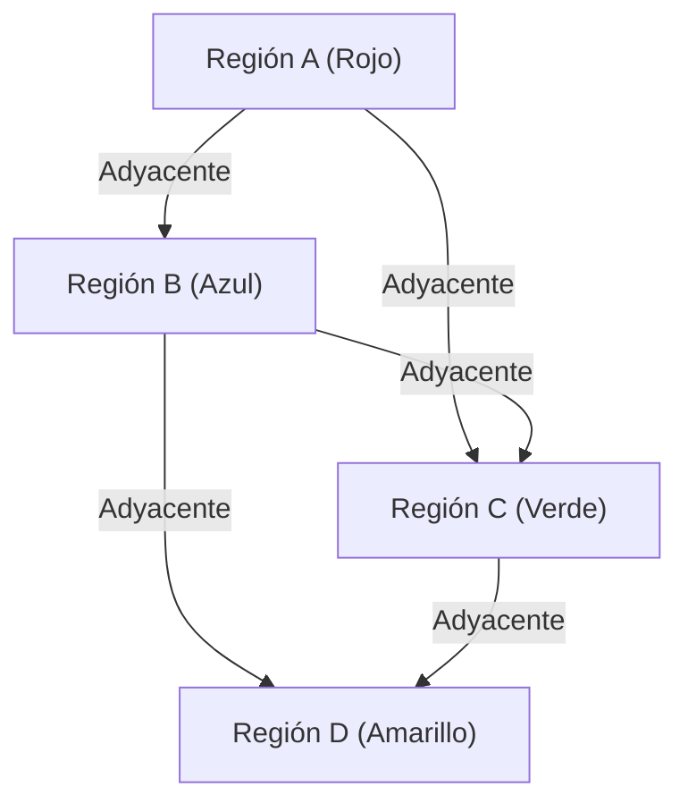

## 1. ¿Qué es el problema de los cuatro colores?

El problema de los cuatro colores ([Four Color Theorem](https://kenji.blog/p/four-color-theorem/)) es uno de los problemas más famosos y fascinantes de las matemáticas, especialmente en la teoría de grafos y la topología. Su afirmación es muy simple y tan intuitiva que incluso un estudiante de primaria puede entenderla. Afirma que "para cualquier mapa en un plano, un máximo de **4 colores** es suficiente para colorear las regiones adyacentes de modo que tengan colores diferentes".

Aquí, "adyacentes" significa que comparten un límite, no solo un punto. Si solo se tocan en un punto, se pueden colorear con el mismo color sin problema. Esta hipótesis intuitiva fue propuesta por primera vez en 1852 por Francis Guthrie. Mientras coloreaba un mapa de los condados de Inglaterra, se dio cuenta de que sin importar cuán complejos fueran los límites, cuatro colores eran suficientes para colorear el mapa.

## 2. Antecedentes históricos del problema de los cuatro colores

Después de que Francis Guthrie notó este problema, se lo comunicó a su hermano menor, Frederick Guthrie, quien era matemático. Frederick, a su vez, presentó este problema a su maestro, Augustus De Morgan. De Morgan se sorprendió por la simplicidad del problema y, por el contrario, la extrema dificultad de su demostración, y comenzó a discutirlo con otros matemáticos.

En 1878, Arthur Cayley presentó oficialmente el problema en la Sociedad Matemática de Londres, haciéndolo ampliamente conocido en el mundo de las matemáticas. Muchos matemáticos brillantes intentaron resolver este problema, pero el camino hacia una demostración completa fue mucho más arduo de lo imaginado.

## 3. La demostración de Kempe y el contraejemplo de Heawood

En 1879, un matemático llamado Alfred Kempe publicó una demostración del problema de los cuatro colores. Su demostración fue muy ingeniosa e introdujo el concepto que ahora se llama "cadena de Kempe (Kempe chain)". La demostración de Kempe fue ampliamente aceptada, y durante más de 10 años se pensó que el problema de los cuatro colores había sido resuelto.

Sin embargo, en 1890, Percy Heawood descubrió una falla fatal en la demostración de Kempe. Si bien Heawood señaló el error lógico de Kempe, aplicó el método de Kempe para demostrar brillantemente el "Teorema de los cinco colores", que establece que "cualquier mapa se puede colorear con **5 colores**". El problema de los cuatro colores volvió a alzarse como un problema no resuelto.

## 4. Conversión a la teoría de grafos

Para tratar rigurosamente el problema de los cuatro colores matemáticamente, el problema se traduce al lenguaje de la teoría de grafos. Cada región del mapa se considera un "vértice (Vertex)", y las regiones que comparten un límite se conectan mediante una "arista (Edge)". El grafo creado de esta manera se llama "grafo plano (Planar Graph)".

Un grafo plano es un grafo que se puede dibujar en un plano sin que sus aristas se crucen. El problema de los cuatro colores se reduce al problema de que "todos los vértices de un grafo plano se pueden colorear con **4 colores** de modo que los vértices adyacentes tengan colores diferentes".

Expresándolo con fórmulas matemáticas, en un grafo $G = (V, E)$, existe una función de coloración $c: V \rightarrow \{1, 2, 3, 4\}$ tal que para toda arista $(u, v) \in E$, se cumple que $c(u) \neq c(v)$.

Aquí, el teorema de los poliedros de Euler $V - E + F = 2$ ($V$ es el número de vértices, $E$ es el número de aristas, $F$ es el número de caras) juega un papel importante en la investigación de las propiedades de los grafos planos.

## 5. El impacto de la prueba por computadora

En 1976, Kenneth Appel y Wolfgang Haken de la Universidad de Illinois finalmente demostraron el problema de los cuatro colores. Sin embargo, su método de prueba causó una gran controversia en la comunidad matemática. Redujeron la prueba del problema a la verificación de un número finito (finalmente 1936) de patrones llamados "conjunto inevitable (Unavoidable set)", y usaron la supercomputadora de la época para calcular que todos esos patrones podían colorearse con 4 colores (reductibilidad: Reducibility).

Dado que la cantidad de cálculos era tan enorme que era imposible para un ser humano verificar todos los procesos de cálculo a mano, provocó un debate filosófico: "¿Se puede llamar a esto realmente una demostración matemática?".

## 6. Refinamiento de la demostración y perspectivas modernas

En 1997, Neil Robertson y otros mejoraron la demostración de Appel y Haken, y el número de conjuntos inevitables se redujo a 633. Además, en 2005, Georges Gonthier completó una demostración formal completa del teorema de los cuatro colores utilizando el asistente de demostración de teoremas Coq. Como resultado, la posibilidad de errores debidos a errores en programas informáticos se volvió extremadamente baja, y la validez de la demostración se volvió inquebrantable.

En la actualidad, las pruebas asistidas por computadora son ampliamente reconocidas como herramientas matemáticas poderosas y han contribuido a la resolución de otros problemas difíciles, como la demostración de la conjetura de Kepler.

## 7. Conclusión

El problema de los cuatro colores es el mejor ejemplo que muestra "cuán profundas y complejas estructuras matemáticas esconde un problema aparentemente simple". Este problema, que comenzó con la idea lúdica de colorear mapas, desarrolló la teoría de grafos y tuvo un impacto inconmensurable, transformando la naturaleza misma de las demostraciones matemáticas.

La exploración de este problema nos enseña cuán poderosa es la intuición humana y cuánto esfuerzo y nuevas tecnologías se necesitan para probarla rigurosamente.

## 1. ¿Qué es el problema de los cuatro colores?

El problema de los cuatro colores ([Four Color Theorem](https://kenji.blog/p/four-color-theorem/)) es uno de los problemas más famosos y fascinantes de las matemáticas, especialmente en la teoría de grafos y la topología. Su afirmación es muy simple y tan intuitiva que incluso un estudiante de primaria puede entenderla. Afirma que "para cualquier mapa en un plano, un máximo de **4 colores** es suficiente para colorear las regiones adyacentes de modo que tengan colores diferentes".

Aquí, "adyacentes" significa que comparten un límite, no solo un punto. Si solo se tocan en un punto, se pueden colorear con el mismo color sin problema. Esta hipótesis intuitiva fue propuesta por primera vez en 1852 por Francis Guthrie. Mientras coloreaba un mapa de los condados de Inglaterra, se dio cuenta de que sin importar cuán complejos fueran los límites, cuatro colores eran suficientes para colorear el mapa.

## 2. Antecedentes históricos del problema de los cuatro colores

Después de que Francis Guthrie notó este problema, se lo comunicó a su hermano menor, Frederick Guthrie, quien era matemático. Frederick, a su vez, presentó este problema a su maestro, Augustus De Morgan. De Morgan se sorprendió por la simplicidad del problema y, por el contrario, la extrema dificultad de su demostración, y comenzó a discutirlo con otros matemáticos.

En 1878, Arthur Cayley presentó oficialmente el problema en la Sociedad Matemática de Londres, haciéndolo ampliamente conocido en el mundo de las matemáticas. Muchos matemáticos brillantes intentaron resolver este problema, pero el camino hacia una demostración completa fue mucho más arduo de lo imaginado.

## 3. La demostración de Kempe y el contraejemplo de Heawood

En 1879, un matemático llamado Alfred Kempe publicó una demostración del problema de los cuatro colores. Su demostración fue muy ingeniosa e introdujo el concepto que ahora se llama "cadena de Kempe (Kempe chain)". La demostración de Kempe fue ampliamente aceptada, y durante más de 10 años se pensó que el problema de los cuatro colores había sido resuelto.

Sin embargo, en 1890, Percy Heawood descubrió una falla fatal en la demostración de Kempe. Si bien Heawood señaló el error lógico de Kempe, aplicó el método de Kempe para demostrar brillantemente el "Teorema de los cinco colores", que establece que "cualquier mapa se puede colorear con **5 colores**". El problema de los cuatro colores volvió a alzarse como un problema no resuelto.

## 4. Conversión a la teoría de grafos

Para tratar rigurosamente el problema de los cuatro colores matemáticamente, el problema se traduce al lenguaje de la teoría de grafos. Cada región del mapa se considera un "vértice (Vertex)", y las regiones que comparten un límite se conectan mediante una "arista (Edge)". El grafo creado de esta manera se llama "grafo plano (Planar Graph)".

Un grafo plano es un grafo que se puede dibujar en un plano sin que sus aristas se crucen. El problema de los cuatro colores se reduce al problema de que "todos los vértices de un grafo plano se pueden colorear con **4 colores** de modo que los vértices adyacentes tengan colores diferentes".

Expresándolo con fórmulas matemáticas, en un grafo $G = (V, E)$, existe una función de coloración $c: V \rightarrow \{1, 2, 3, 4\}$ tal que para toda arista $(u, v) \in E$, se cumple que $c(u) \neq c(v)$.

Aquí, el teorema de los poliedros de Euler $V - E + F = 2$ ($V$ es el número de vértices, $E$ es el número de aristas, $F$ es el número de caras) juega un papel importante en la investigación de las propiedades de los grafos planos.

## 5. El impacto de la prueba por computadora

En 1976, Kenneth Appel y Wolfgang Haken de la Universidad de Illinois finalmente demostraron el problema de los cuatro colores. Sin embargo, su método de prueba causó una gran controversia en la comunidad matemática. Redujeron la prueba del problema a la verificación de un número finito (finalmente 1936) de patrones llamados "conjunto inevitable (Unavoidable set)", y usaron la supercomputadora de la época para calcular que todos esos patrones podían colorearse con 4 colores (reductibilidad: Reducibility).

Dado que la cantidad de cálculos era tan enorme que era imposible para un ser humano verificar todos los procesos de cálculo a mano, provocó un debate filosófico: "¿Se puede llamar a esto realmente una demostración matemática?".

## 6. Refinamiento de la demostración y perspectivas modernas

En 1997, Neil Robertson y otros mejoraron la demostración de Appel y Haken, y el número de conjuntos inevitables se redujo a 633. Además, en 2005, Georges Gonthier completó una demostración formal completa del teorema de los cuatro colores utilizando el asistente de demostración de teoremas Coq. Como resultado, la posibilidad de errores debidos a errores en programas informáticos se volvió extremadamente baja, y la validez de la demostración se volvió inquebrantable.

En la actualidad, las pruebas asistidas por computadora son ampliamente reconocidas como herramientas matemáticas poderosas y han contribuido a la resolución de otros problemas difíciles, como la demostración de la conjetura de Kepler.

## 7. Conclusión

El problema de los cuatro colores es el mejor ejemplo que muestra "cuán profundas y complejas estructuras matemáticas esconde un problema aparentemente simple". Este problema, que comenzó con la idea lúdica de colorear mapas, desarrolló la teoría de grafos y tuvo un impacto inconmensurable, transformando la naturaleza misma de las demostraciones matemáticas.

La exploración de este problema nos enseña cuán poderosa es la intuición humana y cuánto esfuerzo y nuevas tecnologías se necesitan para probarla rigurosamente.

## 1. ¿Qué es el problema de los cuatro colores?

El problema de los cuatro colores ([Four Color Theorem](https://kenji.blog/p/four-color-theorem/)) es uno de los problemas más famosos y fascinantes de las matemáticas, especialmente en la teoría de grafos y la topología. Su afirmación es muy simple y tan intuitiva que incluso un estudiante de primaria puede entenderla. Afirma que "para cualquier mapa en un plano, un máximo de **4 colores** es suficiente para colorear las regiones adyacentes de modo que tengan colores diferentes".

Aquí, "adyacentes" significa que comparten un límite, no solo un punto. Si solo se tocan en un punto, se pueden colorear con el mismo color sin problema. Esta hipótesis intuitiva fue propuesta por primera vez en 1852 por Francis Guthrie. Mientras coloreaba un mapa de los condados de Inglaterra, se dio cuenta de que sin importar cuán complejos fueran los límites, cuatro colores eran suficientes para colorear el mapa.

## 2. Antecedentes históricos del problema de los cuatro colores

Después de que Francis Guthrie notó este problema, se lo comunicó a su hermano menor, Frederick Guthrie, quien era matemático. Frederick, a su vez, presentó este problema a su maestro, Augustus De Morgan. De Morgan se sorprendió por la simplicidad del problema y, por el contrario, la extrema dificultad de su demostración, y comenzó a discutirlo con otros matemáticos.

En 1878, Arthur Cayley presentó oficialmente el problema en la Sociedad Matemática de Londres, haciéndolo ampliamente conocido en el mundo de las matemáticas. Muchos matemáticos brillantes intentaron resolver este problema, pero el camino hacia una demostración completa fue mucho más arduo de lo imaginado.

## 3. La demostración de Kempe y el contraejemplo de Heawood

En 1879, un matemático llamado Alfred Kempe publicó una demostración del problema de los cuatro colores. Su demostración fue muy ingeniosa e introdujo el concepto que ahora se llama "cadena de Kempe (Kempe chain)". La demostración de Kempe fue ampliamente aceptada, y durante más de 10 años se pensó que el problema de los cuatro colores había sido resuelto.

Sin embargo, en 1890, Percy Heawood descubrió una falla fatal en la demostración de Kempe. Si bien Heawood señaló el error lógico de Kempe, aplicó el método de Kempe para demostrar brillantemente el "Teorema de los cinco colores", que establece que "cualquier mapa se puede colorear con **5 colores**". El problema de los cuatro colores volvió a alzarse como un problema no resuelto.

## 4. Conversión a la teoría de grafos

Para tratar rigurosamente el problema de los cuatro colores matemáticamente, el problema se traduce al lenguaje de la teoría de grafos. Cada región del mapa se considera un "vértice (Vertex)", y las regiones que comparten un límite se conectan mediante una "arista (Edge)". El grafo creado de esta manera se llama "grafo plano (Planar Graph)".

Un grafo plano es un grafo que se puede dibujar en un plano sin que sus aristas se crucen. El problema de los cuatro colores se reduce al problema de que "todos los vértices de un grafo plano se pueden colorear con **4 colores** de modo que los vértices adyacentes tengan colores diferentes".

Expresándolo con fórmulas matemáticas, en un grafo $G = (V, E)$, existe una función de coloración $c: V \rightarrow \{1, 2, 3, 4\}$ tal que para toda arista $(u, v) \in E$, se cumple que $c(u) \neq c(v)$.

Aquí, el teorema de los poliedros de Euler $V - E + F = 2$ ($V$ es el número de vértices, $E$ es el número de aristas, $F$ es el número de caras) juega un papel importante en la investigación de las propiedades de los grafos planos.

## 5. El impacto de la prueba por computadora

En 1976, Kenneth Appel y Wolfgang Haken de la Universidad de Illinois finalmente demostraron el problema de los cuatro colores. Sin embargo, su método de prueba causó una gran controversia en la comunidad matemática. Redujeron la prueba del problema a la verificación de un número finito (finalmente 1936) de patrones llamados "conjunto inevitable (Unavoidable set)", y usaron la supercomputadora de la época para calcular que todos esos patrones podían colorearse con 4 colores (reductibilidad: Reducibility).

Dado que la cantidad de cálculos era tan enorme que era imposible para un ser humano verificar todos los procesos de cálculo a mano, provocó un debate filosófico: "¿Se puede llamar a esto realmente una demostración matemática?".

## 6. Refinamiento de la demostración y perspectivas modernas

En 1997, Neil Robertson y otros mejoraron la demostración de Appel y Haken, y el número de conjuntos inevitables se redujo a 633. Además, en 2005, Georges Gonthier completó una demostración formal completa del teorema de los cuatro colores utilizando el asistente de demostración de teoremas Coq. Como resultado, la posibilidad de errores debidos a errores en programas informáticos se volvió extremadamente baja, y la validez de la demostración se volvió inquebrantable.

En la actualidad, las pruebas asistidas por computadora son ampliamente reconocidas como herramientas matemáticas poderosas y han contribuido a la resolución de otros problemas difíciles, como la demostración de la conjetura de Kepler.

## 7. Conclusión

El problema de los cuatro colores es el mejor ejemplo que muestra "cuán profundas y complejas estructuras matemáticas esconde un problema aparentemente simple". Este problema, que comenzó con la idea lúdica de colorear mapas, desarrolló la teoría de grafos y tuvo un impacto inconmensurable, transformando la naturaleza misma de las demostraciones matemáticas.

La exploración de este problema nos enseña cuán poderosa es la intuición humana y cuánto esfuerzo y nuevas tecnologías se necesitan para probarla rigurosamente.

## 1. ¿Qué es el problema de los cuatro colores?

El problema de los cuatro colores ([Four Color Theorem](https://kenji.blog/p/four-color-theorem/)) es uno de los problemas más famosos y fascinantes de las matemáticas, especialmente en la teoría de grafos y la topología. Su afirmación es muy simple y tan intuitiva que incluso un estudiante de primaria puede entenderla. Afirma que "para cualquier mapa en un plano, un máximo de **4 colores** es suficiente para colorear las regiones adyacentes de modo que tengan colores diferentes".

Aquí, "adyacentes" significa que comparten un límite, no solo un punto. Si solo se tocan en un punto, se pueden colorear con el mismo color sin problema. Esta hipótesis intuitiva fue propuesta por primera vez en 1852 por Francis Guthrie. Mientras coloreaba un mapa de los condados de Inglaterra, se dio cuenta de que sin importar cuán complejos fueran los límites, cuatro colores eran suficientes para colorear el mapa.

## 2. Antecedentes históricos del problema de los cuatro colores

Después de que Francis Guthrie notó este problema, se lo comunicó a su hermano menor, Frederick Guthrie, quien era matemático. Frederick, a su vez, presentó este problema a su maestro, Augustus De Morgan. De Morgan se sorprendió por la simplicidad del problema y, por el contrario, la extrema dificultad de su demostración, y comenzó a discutirlo con otros matemáticos.

En 1878, Arthur Cayley presentó oficialmente el problema en la Sociedad Matemática de Londres, haciéndolo ampliamente conocido en el mundo de las matemáticas. Muchos matemáticos brillantes intentaron resolver este problema, pero el camino hacia una demostración completa fue mucho más arduo de lo imaginado.

## 3. La demostración de Kempe y el contraejemplo de Heawood

En 1879, un matemático llamado Alfred Kempe publicó una demostración del problema de los cuatro colores. Su demostración fue muy ingeniosa e introdujo el concepto que ahora se llama "cadena de Kempe (Kempe chain)". La demostración de Kempe fue ampliamente aceptada, y durante más de 10 años se pensó que el problema de los cuatro colores había sido resuelto.

Sin embargo, en 1890, Percy Heawood descubrió una falla fatal en la demostración de Kempe. Si bien Heawood señaló el error lógico de Kempe, aplicó el método de Kempe para demostrar brillantemente el "Teorema de los cinco colores", que establece que "cualquier mapa se puede colorear con **5 colores**". El problema de los cuatro colores volvió a alzarse como un problema no resuelto.

## 4. Conversión a la teoría de grafos

Para tratar rigurosamente el problema de los cuatro colores matemáticamente, el problema se traduce al lenguaje de la teoría de grafos. Cada región del mapa se considera un "vértice (Vertex)", y las regiones que comparten un límite se conectan mediante una "arista (Edge)". El grafo creado de esta manera se llama "grafo plano (Planar Graph)".

Un grafo plano es un grafo que se puede dibujar en un plano sin que sus aristas se crucen. El problema de los cuatro colores se reduce al problema de que "todos los vértices de un grafo plano se pueden colorear con **4 colores** de modo que los vértices adyacentes tengan colores diferentes".

Expresándolo con fórmulas matemáticas, en un grafo $G = (V, E)$, existe una función de coloración $c: V \rightarrow \{1, 2, 3, 4\}$ tal que para toda arista $(u, v) \in E$, se cumple que $c(u) \neq c(v)$.

Aquí, el teorema de los poliedros de Euler $V - E + F = 2$ ($V$ es el número de vértices, $E$ es el número de aristas, $F$ es el número de caras) juega un papel importante en la investigación de las propiedades de los grafos planos.

## 5. El impacto de la prueba por computadora

En 1976, Kenneth Appel y Wolfgang Haken de la Universidad de Illinois finalmente demostraron el problema de los cuatro colores. Sin embargo, su método de prueba causó una gran controversia en la comunidad matemática. Redujeron la prueba del problema a la verificación de un número finito (finalmente 1936) de patrones llamados "conjunto inevitable (Unavoidable set)", y usaron la supercomputadora de la época para calcular que todos esos patrones podían colorearse con 4 colores (reductibilidad: Reducibility).

Dado que la cantidad de cálculos era tan enorme que era imposible para un ser humano verificar todos los procesos de cálculo a mano, provocó un debate filosófico: "¿Se puede llamar a esto realmente una demostración matemática?".

## 6. Refinamiento de la demostración y perspectivas modernas

En 1997, Neil Robertson y otros mejoraron la demostración de Appel y Haken, y el número de conjuntos inevitables se redujo a 633. Además, en 2005, Georges Gonthier completó una demostración formal completa del teorema de los cuatro colores utilizando el asistente de demostración de teoremas Coq. Como resultado, la posibilidad de errores debidos a errores en programas informáticos se volvió extremadamente baja, y la validez de la demostración se volvió inquebrantable.

En la actualidad, las pruebas asistidas por computadora son ampliamente reconocidas como herramientas matemáticas poderosas y han contribuido a la resolución de otros problemas difíciles, como la demostración de la conjetura de Kepler.

## 7. Conclusión

El problema de los cuatro colores es el mejor ejemplo que muestra "cuán profundas y complejas estructuras matemáticas esconde un problema aparentemente simple". Este problema, que comenzó con la idea lúdica de colorear mapas, desarrolló la teoría de grafos y tuvo un impacto inconmensurable, transformando la naturaleza misma de las demostraciones matemáticas.

La exploración de este problema nos enseña cuán poderosa es la intuición humana y cuánto esfuerzo y nuevas tecnologías se necesitan para probarla rigurosamente.
