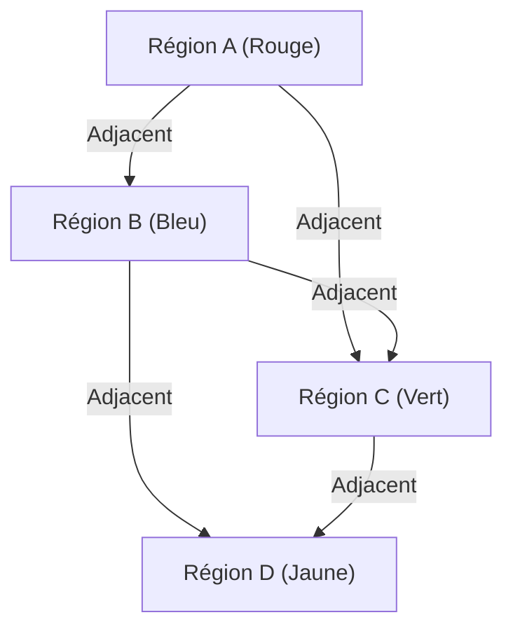

## 1. Qu'est-ce que le problème des quatre couleurs ?

Le théorème des quatre couleurs ([Four Color Theorem](https://kenji.blog/fr/p/four-color-theorem/)) est l'un des problèmes les plus célèbres et fascinants des mathématiques, en particulier de la théorie des graphes et de la topologie. Son affirmation est très simple et suffisamment intuitive pour qu'un élève du primaire la comprenne. Elle stipule que « pour colorier n'importe quelle carte sur un plan de telle sorte que les régions adjacentes soient de couleurs différentes, un maximum de **4 couleurs** suffit ».

Ici, « adjacent » ne désigne pas un point, mais un état de partage d'une ligne de démarcation. S'ils ne se touchent qu'en un point, ce n'est pas un problème de les colorier de la même couleur. Cette hypothèse intuitive a été proposée pour la première fois en 1852 par Francis Guthrie. En coloriant une carte des comtés d'Angleterre, il s'est rendu compte que, quelle que soit la complexité de leurs frontières, quatre couleurs suffisaient pour les distinguer.

## 2. Contexte historique du problème des quatre couleurs

Après que Francis Guthrie eut remarqué ce problème, il en a fait part à son frère, le mathématicien Frederick Guthrie. Frederick a ensuite présenté ce problème à son mentor, Augustus De Morgan. Surpris par la simplicité du problème qui contrastait avec l'extrême difficulté de sa preuve, De Morgan commença à en discuter avec d'autres mathématiciens.

En 1878, Arthur Cayley a officiellement présenté ce problème à la London Mathematical Society, ce qui l'a fait connaître à l'ensemble de la communauté mathématique. De nombreux mathématiciens brillants ont tenté de résoudre ce problème, mais le chemin vers une preuve complète s'est révélé bien plus ardu qu'imaginé.

## 3. La preuve de Kempe et le contre-exemple de Heawood

En 1879, le mathématicien Alfred Kempe publia une preuve du problème des quatre couleurs. Sa preuve était très ingénieuse et a introduit un concept désormais connu sous le nom de « chaîne de Kempe » (Kempe chain). La preuve de Kempe fut largement acceptée, et pendant plus de 10 ans, le problème des quatre couleurs fut considéré comme résolu.

Cependant, en 1890, Percy Heawood découvrit un défaut fatal dans la preuve de Kempe. Tout en soulignant l'erreur logique de Kempe, Heawood appliqua la méthode de Kempe pour prouver avec brio le « théorème des cinq couleurs », stipulant que « n'importe quelle carte peut être coloriée avec **5 couleurs** ». Le problème des quatre couleurs redevint ainsi un problème non résolu.

## 4. Conversion à la théorie des graphes

Afin de traiter le problème des quatre couleurs avec rigueur mathématique, le problème est traduit dans le langage de la théorie des graphes. Chaque région de la carte est un « Sommet » (Vertex) et les régions qui partagent une frontière sont reliées par une « Arête » (Edge). Le graphe ainsi créé est appelé un « graphe planaire » (Planar [Graph](https://kenji.blog/fr/p/tree-graph-data-structures-search-dfs-bfs-dijkstra/)).

Un graphe planaire est un graphe qui peut être dessiné sur un plan sans que ses arêtes ne se croisent. Le problème des quatre couleurs se réduit au problème selon lequel « les sommets de tous les graphes planaires peuvent être coloriés avec **4 couleurs** de telle sorte que les sommets adjacents aient des couleurs différentes ».

En utilisant une expression mathématique, cela consiste à démontrer que dans un graphe $G = (V, E)$, il existe une fonction de coloration $c: V \rightarrow \{1, 2, 3, 4\}$ telle que pour toutes les arêtes $(u, v) \in E$, on ait $c(u) \neq c(v)$.

Ici, la formule d'Euler pour les polyèdres $V - E + F = 2$ (où $V$ est le nombre de sommets, $E$ le nombre d'arêtes et $F$ le nombre de faces) joue un rôle important dans l'étude des propriétés des graphes planaires.

## 5. L'impact de la preuve par ordinateur

En 1976, Kenneth Appel et Wolfgang Haken de l'Université de l'Illinois ont finalement prouvé le problème des quatre couleurs. Cependant, leur méthode de preuve a provoqué une grande controverse dans la communauté mathématique. Ils ont réduit la preuve du problème à la vérification d'un nombre fini (finalement 1936) de modèles appelés « ensembles inévitables » (Unavoidable set), et ont utilisé un superordinateur de l'époque pour calculer que tous ces modèles pouvaient être coloriés avec 4 couleurs (réductibilité : Reducibility).

La quantité de calculs étant si vaste qu'il était impossible pour un humain de vérifier chaque étape à la main, cela a suscité un débat philosophique : « Peut-on vraiment appeler cela une preuve mathématique ? »

## 6. Raffinement de la preuve et perspective moderne

En 1997, Neil Robertson et d'autres ont amélioré la preuve d'Appel et Haken, réduisant le nombre d'ensembles inévitables à 633. De plus, en 2005, Georges Gonthier a achevé une preuve formelle complète du théorème des quatre couleurs en utilisant l'assistant de preuve Coq. Cela a rendu la possibilité d'une erreur due à un bug de programme informatique extrêmement faible, et la validité de la preuve est devenue inébranlable.

Aujourd'hui, la preuve assistée par ordinateur est largement reconnue comme un outil puissant en mathématiques et a contribué à la résolution d'autres problèmes difficiles, tels que la preuve de la conjecture de Kepler.

## 7. Conclusion

Le problème des quatre couleurs est le meilleur exemple montrant « comment un problème apparemment simple peut cacher une structure mathématique profonde et complexe ». Ce problème, commencé avec l'idée ludique de colorier une carte, a eu un impact incommensurable en développant la théorie des graphes et même en transformant la nature même de la preuve mathématique.

L'exploration de ce problème nous enseigne à quel point l'intuition humaine est puissante, et combien d'efforts et de nouvelles technologies sont nécessaires pour la prouver rigoureusement.

