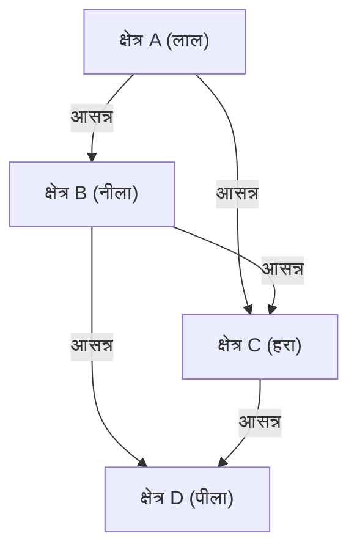

## 1. चार-रंग प्रमेय क्या है?

[चार-रंग प्रमेय (Four Color Theorem)](https://kenji.blog/p/four-color-theorem/) गणित, विशेषकर ग्राफ सिद्धांत (Graph Theory) और टोपोलॉजी (Topology) में सबसे प्रसिद्ध और आकर्षक समस्याओं में से एक है। इसका दावा बहुत सरल है और इतना सहज है कि एक प्राथमिक विद्यालय का छात्र भी इसे समझ सकता है: "किसी भी समतल नक्शे को रंगने के लिए, ताकि कोई भी दो आसन्न क्षेत्र समान रंग के न हों, अधिकतम **4 रंगों** की आवश्यकता होती है।"

यहाँ "आसन्न" होने का अर्थ एक बिंदु साझा करना नहीं, बल्कि एक सीमा रेखा साझा करना है। यदि वे केवल एक बिंदु पर मिलते हैं, तो उन्हें समान रंग से रंगा जा सकता है। यह सहज परिकल्पना पहली बार 1852 में फ्रांसिस गुथरी (Francis Guthrie) द्वारा प्रस्तावित की गई थी। इंग्लैंड के काउंटी का नक्शा रंगते समय, उन्होंने देखा कि काउंटी की सीमाएँ कितनी भी जटिल क्यों न हों, 4 रंग उन्हें अलग करने के लिए पर्याप्त थे।

## 2. चार-रंग प्रमेय की ऐतिहासिक पृष्ठभूमि

इस समस्या को देखने के बाद, फ्रांसिस गुथरी ने इसके बारे में अपने भाई फ्रेडरिक गुथरी (Frederick Guthrie) को बताया, जो एक गणितज्ञ थे। फ्रेडरिक ने इस समस्या को अपने गुरु ऑगस्टस डी मॉर्गन (Augustus De Morgan) के सामने प्रस्तुत किया। डी मॉर्गन समस्या की सरलता और इसके विपरीत, इसे साबित करने की अत्यधिक कठिनाई से चकित थे, और उन्होंने अन्य गणितज्ञों के साथ इस पर चर्चा शुरू कर दी।

1878 में, आर्थर केली (Arthur Cayley) ने आधिकारिक तौर पर लंदन मैथमैटिकल सोसाइटी में इस समस्या को प्रस्तुत किया, जिससे यह गणितीय दुनिया में व्यापक रूप से जानी जाने लगी। कई उत्कृष्ट गणितज्ञों ने इस समस्या को हल करने का प्रयास किया, लेकिन पूर्ण प्रमाण तक का मार्ग कल्पना से कहीं अधिक कठिन था।

## 3. केम्पे का प्रमाण और हीवुड का प्रति-उदाहरण

1879 में, अल्फ्रेड केम्पे (Alfred Kempe) नामक गणितज्ञ ने चार-रंग प्रमेय का एक प्रमाण प्रकाशित किया। उनका प्रमाण बहुत ही चतुर था, और उन्होंने एक अवधारणा पेश की जिसे अब "केम्पे श्रृंखला (Kempe chain)" के रूप में जाना जाता है। केम्पे के प्रमाण को व्यापक रूप से स्वीकार कर लिया गया था, और 10 से अधिक वर्षों तक यह माना जाता था कि चार-रंग प्रमेय हल हो गया है।

हालाँकि, 1890 में, पर्सी हीवुड (Percy Heawood) ने पाया कि केम्पे के प्रमाण में एक घातक दोष था। जबकि हीवुड ने केम्पे के तर्क में त्रुटि की ओर इशारा किया, उन्होंने "पांच-रंग प्रमेय" को शानदार ढंग से साबित करने के लिए केम्पे की विधि का भी उपयोग किया: "किसी भी नक्शे को **5 रंगों** से रंगा जा सकता है।" चार-रंग प्रमेय एक बार फिर एक अनसुलझी समस्या के रूप में सामने आया।

## 4. ग्राफ सिद्धांत में रूपांतरण

चार-रंग प्रमेय को गणितीय रूप से सख्ती से व्यवहार करने के लिए, समस्या का अनुवाद ग्राफ सिद्धांत की भाषा में किया जाता है। नक्शे पर प्रत्येक क्षेत्र को "शीर्ष (Vertex)" माना जाता है, और सीमा रेखा साझा करने वाले क्षेत्रों को "किनारों (Edge)" से जोड़ा जाता है। इस प्रकार बनाए गए ग्राफ को "समतल ग्राफ (Planar Graph)" कहा जाता है।

एक समतल ग्राफ एक ऐसा ग्राफ है जिसे किनारों के एक-दूसरे को पार किए बिना एक समतल पर खींचा जा सकता है। चार-रंग प्रमेय इस समस्या में बदल जाता है कि "सभी समतल ग्राफ़ के शीर्षों को **4 रंगों** के साथ रंगा जा सकता है ताकि आसन्न शीर्षों के रंग अलग-अलग हों।"

गणितीय सूत्रों का उपयोग करके व्यक्त किया गया है, ग्राफ $G = (V, E)$ में, एक रंग कार्य $c: V \rightarrow \{1, 2, 3, 4\}$ मौजूद है, और सभी किनारों $(u, v) \in E$ के लिए, हमें यह दिखाना होगा कि $c(u) \neq c(v)$ है।

यहाँ, यूलर का पॉलीहेड्रॉन सूत्र $V - E + F = 2$ ($V$ शीर्षों की संख्या है, $E$ किनारों की संख्या है, और $F$ चेहरों की संख्या है) समतल रेखांकन के गुणों की जांच में महत्वपूर्ण भूमिका निभाता है।

## 5. कंप्यूटर-सहायता प्राप्त प्रमाण का प्रभाव

1976 में, इलिनोइस विश्वविद्यालय के केनेथ एपेल (Kenneth Appel) और वोल्फगैंग हाकेन (Wolfgang Haken) ने अंततः चार-रंग प्रमेय को साबित कर दिया। हालाँकि, उनके प्रमाण के तरीके ने गणित की दुनिया में भारी विवाद पैदा कर दिया। उन्होंने "अपरिहार्य सेट (Unavoidable set)" (अंततः 1936) नामक पैटर्नों की एक सीमित संख्या की पुष्टि करने के लिए समस्या के प्रमाण को कम कर दिया, और उस समय सुपर कंप्यूटर का उपयोग करके गणना की कि इन सभी पैटर्नों को 4 रंगों (रिड्यूसिबिलिटी: Reducibility) से रंगा जा सकता है।

चूँकि गणनाओं की मात्रा इतनी अधिक थी कि किसी मनुष्य के लिए सभी गणना प्रक्रियाओं को मैन्युअल रूप से जाँचना असंभव था, इसलिए इसने एक दार्शनिक बहस छेड़ दी: "क्या इसे वास्तव में गणितीय प्रमाण कहा जा सकता है?"

## 6. प्रमाण का शोधन और आधुनिक परिप्रेक्ष्य

1997 में, नील रॉबर्टसन (Neil Robertson) और अन्य ने एपेल और हेकेन के प्रमाण में सुधार किया, जिससे अपरिहार्य सेटों की संख्या 633 हो गई। इसके अलावा, 2005 में, जॉर्जेस गोंथियर (Georges Gonthier) ने प्रमेय सिद्ध करने वाले सहायक Coq का उपयोग करके चार-रंग प्रमेय का संपूर्ण औपचारिक प्रमाण पूरा किया। इसके परिणामस्वरूप, कंप्यूटर प्रोग्राम में बग के कारण त्रुटियों की संभावना अत्यंत कम हो गई, और प्रमाण की वैधता अटूट हो गई।

आज, कंप्यूटर-सहायता प्राप्त प्रमाणों को गणित में शक्तिशाली उपकरणों के रूप में व्यापक रूप से मान्यता प्राप्त है और उन्होंने केप्लर के अनुमान के प्रमाण जैसी अन्य कठिन समस्याओं को हल करने में योगदान दिया है।

## 7. निष्कर्ष

चार-रंग प्रमेय इस बात का सबसे अच्छा उदाहरण है कि "कैसे एक प्रतीत होने वाली सरल समस्या गहरे और जटिल गणितीय संरचनाओं को छिपा सकती है।" नक्शे को रंगने के चंचल विचार से शुरू हुई इस समस्या का ग्राफ सिद्धांत को विकसित करने और यहाँ तक कि गणितीय प्रमाण की प्रकृति को बदलने पर अथाह प्रभाव पड़ा।

इस समस्या की खोज हमें सिखाती है कि मानव अंतर्ज्ञान कितना शक्तिशाली है, और इसे सख्ती से साबित करने के लिए कितने प्रयास और नई तकनीक की आवश्यकता है।

## 1. चार-रंग प्रमेय क्या है?

[चार-रंग प्रमेय (Four Color Theorem)](https://kenji.blog/p/four-color-theorem/) गणित, विशेषकर ग्राफ सिद्धांत (Graph Theory) और टोपोलॉजी (Topology) में सबसे प्रसिद्ध और आकर्षक समस्याओं में से एक है। इसका दावा बहुत सरल है और इतना सहज है कि एक प्राथमिक विद्यालय का छात्र भी इसे समझ सकता है: "किसी भी समतल नक्शे को रंगने के लिए, ताकि कोई भी दो आसन्न क्षेत्र समान रंग के न हों, अधिकतम **4 रंगों** की आवश्यकता होती है।"

यहाँ "आसन्न" होने का अर्थ एक बिंदु साझा करना नहीं, बल्कि एक सीमा रेखा साझा करना है। यदि वे केवल एक बिंदु पर मिलते हैं, तो उन्हें समान रंग से रंगा जा सकता है। यह सहज परिकल्पना पहली बार 1852 में फ्रांसिस गुथरी (Francis Guthrie) द्वारा प्रस्तावित की गई थी। इंग्लैंड के काउंटी का नक्शा रंगते समय, उन्होंने देखा कि काउंटी की सीमाएँ कितनी भी जटिल क्यों न हों, 4 रंग उन्हें अलग करने के लिए पर्याप्त थे।

## 2. चार-रंग प्रमेय की ऐतिहासिक पृष्ठभूमि

इस समस्या को देखने के बाद, फ्रांसिस गुथरी ने इसके बारे में अपने भाई फ्रेडरिक गुथरी (Frederick Guthrie) को बताया, जो एक गणितज्ञ थे। फ्रेडरिक ने इस समस्या को अपने गुरु ऑगस्टस डी मॉर्गन (Augustus De Morgan) के सामने प्रस्तुत किया। डी मॉर्गन समस्या की सरलता और इसके विपरीत, इसे साबित करने की अत्यधिक कठिनाई से चकित थे, और उन्होंने अन्य गणितज्ञों के साथ इस पर चर्चा शुरू कर दी।

1878 में, आर्थर केली (Arthur Cayley) ने आधिकारिक तौर पर लंदन मैथमैटिकल सोसाइटी में इस समस्या को प्रस्तुत किया, जिससे यह गणितीय दुनिया में व्यापक रूप से जानी जाने लगी। कई उत्कृष्ट गणितज्ञों ने इस समस्या को हल करने का प्रयास किया, लेकिन पूर्ण प्रमाण तक का मार्ग कल्पना से कहीं अधिक कठिन था।

## 3. केम्पे का प्रमाण और हीवुड का प्रति-उदाहरण

1879 में, अल्फ्रेड केम्पे (Alfred Kempe) नामक गणितज्ञ ने चार-रंग प्रमेय का एक प्रमाण प्रकाशित किया। उनका प्रमाण बहुत ही चतुर था, और उन्होंने एक अवधारणा पेश की जिसे अब "केम्पे श्रृंखला (Kempe chain)" के रूप में जाना जाता है। केम्पे के प्रमाण को व्यापक रूप से स्वीकार कर लिया गया था, और 10 से अधिक वर्षों तक यह माना जाता था कि चार-रंग प्रमेय हल हो गया है।

हालाँकि, 1890 में, पर्सी हीवुड (Percy Heawood) ने पाया कि केम्पे के प्रमाण में एक घातक दोष था। जबकि हीवुड ने केम्पे के तर्क में त्रुटि की ओर इशारा किया, उन्होंने "पांच-रंग प्रमेय" को शानदार ढंग से साबित करने के लिए केम्पे की विधि का भी उपयोग किया: "किसी भी नक्शे को **5 रंगों** से रंगा जा सकता है।" चार-रंग प्रमेय एक बार फिर एक अनसुलझी समस्या के रूप में सामने आया।

## 4. ग्राफ सिद्धांत में रूपांतरण

चार-रंग प्रमेय को गणितीय रूप से सख्ती से व्यवहार करने के लिए, समस्या का अनुवाद ग्राफ सिद्धांत की भाषा में किया जाता है। नक्शे पर प्रत्येक क्षेत्र को "शीर्ष (Vertex)" माना जाता है, और सीमा रेखा साझा करने वाले क्षेत्रों को "किनारों (Edge)" से जोड़ा जाता है। इस प्रकार बनाए गए ग्राफ को "समतल ग्राफ (Planar Graph)" कहा जाता है।

एक समतल ग्राफ एक ऐसा ग्राफ है जिसे किनारों के एक-दूसरे को पार किए बिना एक समतल पर खींचा जा सकता है। चार-रंग प्रमेय इस समस्या में बदल जाता है कि "सभी समतल ग्राफ़ के शीर्षों को **4 रंगों** के साथ रंगा जा सकता है ताकि आसन्न शीर्षों के रंग अलग-अलग हों।"

गणितीय सूत्रों का उपयोग करके व्यक्त किया गया है, ग्राफ $G = (V, E)$ में, एक रंग कार्य $c: V \rightarrow \{1, 2, 3, 4\}$ मौजूद है, और सभी किनारों $(u, v) \in E$ के लिए, हमें यह दिखाना होगा कि $c(u) \neq c(v)$ है।

यहाँ, यूलर का पॉलीहेड्रॉन सूत्र $V - E + F = 2$ ($V$ शीर्षों की संख्या है, $E$ किनारों की संख्या है, और $F$ चेहरों की संख्या है) समतल रेखांकन के गुणों की जांच में महत्वपूर्ण भूमिका निभाता है।

## 5. कंप्यूटर-सहायता प्राप्त प्रमाण का प्रभाव

1976 में, इलिनोइस विश्वविद्यालय के केनेथ एपेल (Kenneth Appel) और वोल्फगैंग हाकेन (Wolfgang Haken) ने अंततः चार-रंग प्रमेय को साबित कर दिया। हालाँकि, उनके प्रमाण के तरीके ने गणित की दुनिया में भारी विवाद पैदा कर दिया। उन्होंने "अपरिहार्य सेट (Unavoidable set)" (अंततः 1936) नामक पैटर्नों की एक सीमित संख्या की पुष्टि करने के लिए समस्या के प्रमाण को कम कर दिया, और उस समय सुपर कंप्यूटर का उपयोग करके गणना की कि इन सभी पैटर्नों को 4 रंगों (रिड्यूसिबिलिटी: Reducibility) से रंगा जा सकता है।

चूँकि गणनाओं की मात्रा इतनी अधिक थी कि किसी मनुष्य के लिए सभी गणना प्रक्रियाओं को मैन्युअल रूप से जाँचना असंभव था, इसलिए इसने एक दार्शनिक बहस छेड़ दी: "क्या इसे वास्तव में गणितीय प्रमाण कहा जा सकता है?"

## 6. प्रमाण का शोधन और आधुनिक परिप्रेक्ष्य

1997 में, नील रॉबर्टसन (Neil Robertson) और अन्य ने एपेल और हेकेन के प्रमाण में सुधार किया, जिससे अपरिहार्य सेटों की संख्या 633 हो गई। इसके अलावा, 2005 में, जॉर्जेस गोंथियर (Georges Gonthier) ने प्रमेय सिद्ध करने वाले सहायक Coq का उपयोग करके चार-रंग प्रमेय का संपूर्ण औपचारिक प्रमाण पूरा किया। इसके परिणामस्वरूप, कंप्यूटर प्रोग्राम में बग के कारण त्रुटियों की संभावना अत्यंत कम हो गई, और प्रमाण की वैधता अटूट हो गई।

आज, कंप्यूटर-सहायता प्राप्त प्रमाणों को गणित में शक्तिशाली उपकरणों के रूप में व्यापक रूप से मान्यता प्राप्त है और उन्होंने केप्लर के अनुमान के प्रमाण जैसी अन्य कठिन समस्याओं को हल करने में योगदान दिया है।

## 7. निष्कर्ष

चार-रंग प्रमेय इस बात का सबसे अच्छा उदाहरण है कि "कैसे एक प्रतीत होने वाली सरल समस्या गहरे और जटिल गणितीय संरचनाओं को छिपा सकती है।" नक्शे को रंगने के चंचल विचार से शुरू हुई इस समस्या का ग्राफ सिद्धांत को विकसित करने और यहाँ तक कि गणितीय प्रमाण की प्रकृति को बदलने पर अथाह प्रभाव पड़ा।

इस समस्या की खोज हमें सिखाती है कि मानव अंतर्ज्ञान कितना शक्तिशाली है, और इसे सख्ती से साबित करने के लिए कितने प्रयास और नई तकनीक की आवश्यकता है।

## 1. चार-रंग प्रमेय क्या है?

[चार-रंग प्रमेय (Four Color Theorem)](https://kenji.blog/p/four-color-theorem/) गणित, विशेषकर ग्राफ सिद्धांत (Graph Theory) और टोपोलॉजी (Topology) में सबसे प्रसिद्ध और आकर्षक समस्याओं में से एक है। इसका दावा बहुत सरल है और इतना सहज है कि एक प्राथमिक विद्यालय का छात्र भी इसे समझ सकता है: "किसी भी समतल नक्शे को रंगने के लिए, ताकि कोई भी दो आसन्न क्षेत्र समान रंग के न हों, अधिकतम **4 रंगों** की आवश्यकता होती है।"

यहाँ "आसन्न" होने का अर्थ एक बिंदु साझा करना नहीं, बल्कि एक सीमा रेखा साझा करना है। यदि वे केवल एक बिंदु पर मिलते हैं, तो उन्हें समान रंग से रंगा जा सकता है। यह सहज परिकल्पना पहली बार 1852 में फ्रांसिस गुथरी (Francis Guthrie) द्वारा प्रस्तावित की गई थी। इंग्लैंड के काउंटी का नक्शा रंगते समय, उन्होंने देखा कि काउंटी की सीमाएँ कितनी भी जटिल क्यों न हों, 4 रंग उन्हें अलग करने के लिए पर्याप्त थे।

## 2. चार-रंग प्रमेय की ऐतिहासिक पृष्ठभूमि

इस समस्या को देखने के बाद, फ्रांसिस गुथरी ने इसके बारे में अपने भाई फ्रेडरिक गुथरी (Frederick Guthrie) को बताया, जो एक गणितज्ञ थे। फ्रेडरिक ने इस समस्या को अपने गुरु ऑगस्टस डी मॉर्गन (Augustus De Morgan) के सामने प्रस्तुत किया। डी मॉर्गन समस्या की सरलता और इसके विपरीत, इसे साबित करने की अत्यधिक कठिनाई से चकित थे, और उन्होंने अन्य गणितज्ञों के साथ इस पर चर्चा शुरू कर दी।

1878 में, आर्थर केली (Arthur Cayley) ने आधिकारिक तौर पर लंदन मैथमैटिकल सोसाइटी में इस समस्या को प्रस्तुत किया, जिससे यह गणितीय दुनिया में व्यापक रूप से जानी जाने लगी। कई उत्कृष्ट गणितज्ञों ने इस समस्या को हल करने का प्रयास किया, लेकिन पूर्ण प्रमाण तक का मार्ग कल्पना से कहीं अधिक कठिन था।

## 3. केम्पे का प्रमाण और हीवुड का प्रति-उदाहरण

1879 में, अल्फ्रेड केम्पे (Alfred Kempe) नामक गणितज्ञ ने चार-रंग प्रमेय का एक प्रमाण प्रकाशित किया। उनका प्रमाण बहुत ही चतुर था, और उन्होंने एक अवधारणा पेश की जिसे अब "केम्पे श्रृंखला (Kempe chain)" के रूप में जाना जाता है। केम्पे के प्रमाण को व्यापक रूप से स्वीकार कर लिया गया था, और 10 से अधिक वर्षों तक यह माना जाता था कि चार-रंग प्रमेय हल हो गया है।

हालाँकि, 1890 में, पर्सी हीवुड (Percy Heawood) ने पाया कि केम्पे के प्रमाण में एक घातक दोष था। जबकि हीवुड ने केम्पे के तर्क में त्रुटि की ओर इशारा किया, उन्होंने "पांच-रंग प्रमेय" को शानदार ढंग से साबित करने के लिए केम्पे की विधि का भी उपयोग किया: "किसी भी नक्शे को **5 रंगों** से रंगा जा सकता है।" चार-रंग प्रमेय एक बार फिर एक अनसुलझी समस्या के रूप में सामने आया।

## 4. ग्राफ सिद्धांत में रूपांतरण

चार-रंग प्रमेय को गणितीय रूप से सख्ती से व्यवहार करने के लिए, समस्या का अनुवाद ग्राफ सिद्धांत की भाषा में किया जाता है। नक्शे पर प्रत्येक क्षेत्र को "शीर्ष (Vertex)" माना जाता है, और सीमा रेखा साझा करने वाले क्षेत्रों को "किनारों (Edge)" से जोड़ा जाता है। इस प्रकार बनाए गए ग्राफ को "समतल ग्राफ (Planar Graph)" कहा जाता है।

एक समतल ग्राफ एक ऐसा ग्राफ है जिसे किनारों के एक-दूसरे को पार किए बिना एक समतल पर खींचा जा सकता है। चार-रंग प्रमेय इस समस्या में बदल जाता है कि "सभी समतल ग्राफ़ के शीर्षों को **4 रंगों** के साथ रंगा जा सकता है ताकि आसन्न शीर्षों के रंग अलग-अलग हों।"

गणितीय सूत्रों का उपयोग करके व्यक्त किया गया है, ग्राफ $G = (V, E)$ में, एक रंग कार्य $c: V \rightarrow \{1, 2, 3, 4\}$ मौजूद है, और सभी किनारों $(u, v) \in E$ के लिए, हमें यह दिखाना होगा कि $c(u) \neq c(v)$ है।

यहाँ, यूलर का पॉलीहेड्रॉन सूत्र $V - E + F = 2$ ($V$ शीर्षों की संख्या है, $E$ किनारों की संख्या है, और $F$ चेहरों की संख्या है) समतल रेखांकन के गुणों की जांच में महत्वपूर्ण भूमिका निभाता है।

## 5. कंप्यूटर-सहायता प्राप्त प्रमाण का प्रभाव

1976 में, इलिनोइस विश्वविद्यालय के केनेथ एपेल (Kenneth Appel) और वोल्फगैंग हाकेन (Wolfgang Haken) ने अंततः चार-रंग प्रमेय को साबित कर दिया। हालाँकि, उनके प्रमाण के तरीके ने गणित की दुनिया में भारी विवाद पैदा कर दिया। उन्होंने "अपरिहार्य सेट (Unavoidable set)" (अंततः 1936) नामक पैटर्नों की एक सीमित संख्या की पुष्टि करने के लिए समस्या के प्रमाण को कम कर दिया, और उस समय सुपर कंप्यूटर का उपयोग करके गणना की कि इन सभी पैटर्नों को 4 रंगों (रिड्यूसिबिलिटी: Reducibility) से रंगा जा सकता है।

चूँकि गणनाओं की मात्रा इतनी अधिक थी कि किसी मनुष्य के लिए सभी गणना प्रक्रियाओं को मैन्युअल रूप से जाँचना असंभव था, इसलिए इसने एक दार्शनिक बहस छेड़ दी: "क्या इसे वास्तव में गणितीय प्रमाण कहा जा सकता है?"

## 6. प्रमाण का शोधन और आधुनिक परिप्रेक्ष्य

1997 में, नील रॉबर्टसन (Neil Robertson) और अन्य ने एपेल और हेकेन के प्रमाण में सुधार किया, जिससे अपरिहार्य सेटों की संख्या 633 हो गई। इसके अलावा, 2005 में, जॉर्जेस गोंथियर (Georges Gonthier) ने प्रमेय सिद्ध करने वाले सहायक Coq का उपयोग करके चार-रंग प्रमेय का संपूर्ण औपचारिक प्रमाण पूरा किया। इसके परिणामस्वरूप, कंप्यूटर प्रोग्राम में बग के कारण त्रुटियों की संभावना अत्यंत कम हो गई, और प्रमाण की वैधता अटूट हो गई।

आज, कंप्यूटर-सहायता प्राप्त प्रमाणों को गणित में शक्तिशाली उपकरणों के रूप में व्यापक रूप से मान्यता प्राप्त है और उन्होंने केप्लर के अनुमान के प्रमाण जैसी अन्य कठिन समस्याओं को हल करने में योगदान दिया है।

## 7. निष्कर्ष

चार-रंग प्रमेय इस बात का सबसे अच्छा उदाहरण है कि "कैसे एक प्रतीत होने वाली सरल समस्या गहरे और जटिल गणितीय संरचनाओं को छिपा सकती है।" नक्शे को रंगने के चंचल विचार से शुरू हुई इस समस्या का ग्राफ सिद्धांत को विकसित करने और यहाँ तक कि गणितीय प्रमाण की प्रकृति को बदलने पर अथाह प्रभाव पड़ा।

इस समस्या की खोज हमें सिखाती है कि मानव अंतर्ज्ञान कितना शक्तिशाली है, और इसे सख्ती से साबित करने के लिए कितने प्रयास और नई तकनीक की आवश्यकता है।

## 1. चार-रंग प्रमेय क्या है?

[चार-रंग प्रमेय (Four Color Theorem)](https://kenji.blog/p/four-color-theorem/) गणित, विशेषकर ग्राफ सिद्धांत (Graph Theory) और टोपोलॉजी (Topology) में सबसे प्रसिद्ध और आकर्षक समस्याओं में से एक है। इसका दावा बहुत सरल है और इतना सहज है कि एक प्राथमिक विद्यालय का छात्र भी इसे समझ सकता है: "किसी भी समतल नक्शे को रंगने के लिए, ताकि कोई भी दो आसन्न क्षेत्र समान रंग के न हों, अधिकतम **4 रंगों** की आवश्यकता होती है।"

यहाँ "आसन्न" होने का अर्थ एक बिंदु साझा करना नहीं, बल्कि एक सीमा रेखा साझा करना है। यदि वे केवल एक बिंदु पर मिलते हैं, तो उन्हें समान रंग से रंगा जा सकता है। यह सहज परिकल्पना पहली बार 1852 में फ्रांसिस गुथरी (Francis Guthrie) द्वारा प्रस्तावित की गई थी। इंग्लैंड के काउंटी का नक्शा रंगते समय, उन्होंने देखा कि काउंटी की सीमाएँ कितनी भी जटिल क्यों न हों, 4 रंग उन्हें अलग करने के लिए पर्याप्त थे।

## 2. चार-रंग प्रमेय की ऐतिहासिक पृष्ठभूमि

इस समस्या को देखने के बाद, फ्रांसिस गुथरी ने इसके बारे में अपने भाई फ्रेडरिक गुथरी (Frederick Guthrie) को बताया, जो एक गणितज्ञ थे। फ्रेडरिक ने इस समस्या को अपने गुरु ऑगस्टस डी मॉर्गन (Augustus De Morgan) के सामने प्रस्तुत किया। डी मॉर्गन समस्या की सरलता और इसके विपरीत, इसे साबित करने की अत्यधिक कठिनाई से चकित थे, और उन्होंने अन्य गणितज्ञों के साथ इस पर चर्चा शुरू कर दी।

1878 में, आर्थर केली (Arthur Cayley) ने आधिकारिक तौर पर लंदन मैथमैटिकल सोसाइटी में इस समस्या को प्रस्तुत किया, जिससे यह गणितीय दुनिया में व्यापक रूप से जानी जाने लगी। कई उत्कृष्ट गणितज्ञों ने इस समस्या को हल करने का प्रयास किया, लेकिन पूर्ण प्रमाण तक का मार्ग कल्पना से कहीं अधिक कठिन था।

## 3. केम्पे का प्रमाण और हीवुड का प्रति-उदाहरण

1879 में, अल्फ्रेड केम्पे (Alfred Kempe) नामक गणितज्ञ ने चार-रंग प्रमेय का एक प्रमाण प्रकाशित किया। उनका प्रमाण बहुत ही चतुर था, और उन्होंने एक अवधारणा पेश की जिसे अब "केम्पे श्रृंखला (Kempe chain)" के रूप में जाना जाता है। केम्पे के प्रमाण को व्यापक रूप से स्वीकार कर लिया गया था, और 10 से अधिक वर्षों तक यह माना जाता था कि चार-रंग प्रमेय हल हो गया है।

हालाँकि, 1890 में, पर्सी हीवुड (Percy Heawood) ने पाया कि केम्पे के प्रमाण में एक घातक दोष था। जबकि हीवुड ने केम्पे के तर्क में त्रुटि की ओर इशारा किया, उन्होंने "पांच-रंग प्रमेय" को शानदार ढंग से साबित करने के लिए केम्पे की विधि का भी उपयोग किया: "किसी भी नक्शे को **5 रंगों** से रंगा जा सकता है।" चार-रंग प्रमेय एक बार फिर एक अनसुलझी समस्या के रूप में सामने आया।

## 4. ग्राफ सिद्धांत में रूपांतरण

चार-रंग प्रमेय को गणितीय रूप से सख्ती से व्यवहार करने के लिए, समस्या का अनुवाद ग्राफ सिद्धांत की भाषा में किया जाता है। नक्शे पर प्रत्येक क्षेत्र को "शीर्ष (Vertex)" माना जाता है, और सीमा रेखा साझा करने वाले क्षेत्रों को "किनारों (Edge)" से जोड़ा जाता है। इस प्रकार बनाए गए ग्राफ को "समतल ग्राफ (Planar Graph)" कहा जाता है।

एक समतल ग्राफ एक ऐसा ग्राफ है जिसे किनारों के एक-दूसरे को पार किए बिना एक समतल पर खींचा जा सकता है। चार-रंग प्रमेय इस समस्या में बदल जाता है कि "सभी समतल ग्राफ़ के शीर्षों को **4 रंगों** के साथ रंगा जा सकता है ताकि आसन्न शीर्षों के रंग अलग-अलग हों।"

गणितीय सूत्रों का उपयोग करके व्यक्त किया गया है, ग्राफ $G = (V, E)$ में, एक रंग कार्य $c: V \rightarrow \{1, 2, 3, 4\}$ मौजूद है, और सभी किनारों $(u, v) \in E$ के लिए, हमें यह दिखाना होगा कि $c(u) \neq c(v)$ है।

यहाँ, यूलर का पॉलीहेड्रॉन सूत्र $V - E + F = 2$ ($V$ शीर्षों की संख्या है, $E$ किनारों की संख्या है, और $F$ चेहरों की संख्या है) समतल रेखांकन के गुणों की जांच में महत्वपूर्ण भूमिका निभाता है।

## 5. कंप्यूटर-सहायता प्राप्त प्रमाण का प्रभाव

1976 में, इलिनोइस विश्वविद्यालय के केनेथ एपेल (Kenneth Appel) और वोल्फगैंग हाकेन (Wolfgang Haken) ने अंततः चार-रंग प्रमेय को साबित कर दिया। हालाँकि, उनके प्रमाण के तरीके ने गणित की दुनिया में भारी विवाद पैदा कर दिया। उन्होंने "अपरिहार्य सेट (Unavoidable set)" (अंततः 1936) नामक पैटर्नों की एक सीमित संख्या की पुष्टि करने के लिए समस्या के प्रमाण को कम कर दिया, और उस समय सुपर कंप्यूटर का उपयोग करके गणना की कि इन सभी पैटर्नों को 4 रंगों (रिड्यूसिबिलिटी: Reducibility) से रंगा जा सकता है।

चूँकि गणनाओं की मात्रा इतनी अधिक थी कि किसी मनुष्य के लिए सभी गणना प्रक्रियाओं को मैन्युअल रूप से जाँचना असंभव था, इसलिए इसने एक दार्शनिक बहस छेड़ दी: "क्या इसे वास्तव में गणितीय प्रमाण कहा जा सकता है?"

## 6. प्रमाण का शोधन और आधुनिक परिप्रेक्ष्य

1997 में, नील रॉबर्टसन (Neil Robertson) और अन्य ने एपेल और हेकेन के प्रमाण में सुधार किया, जिससे अपरिहार्य सेटों की संख्या 633 हो गई। इसके अलावा, 2005 में, जॉर्जेस गोंथियर (Georges Gonthier) ने प्रमेय सिद्ध करने वाले सहायक Coq का उपयोग करके चार-रंग प्रमेय का संपूर्ण औपचारिक प्रमाण पूरा किया। इसके परिणामस्वरूप, कंप्यूटर प्रोग्राम में बग के कारण त्रुटियों की संभावना अत्यंत कम हो गई, और प्रमाण की वैधता अटूट हो गई।

आज, कंप्यूटर-सहायता प्राप्त प्रमाणों को गणित में शक्तिशाली उपकरणों के रूप में व्यापक रूप से मान्यता प्राप्त है और उन्होंने केप्लर के अनुमान के प्रमाण जैसी अन्य कठिन समस्याओं को हल करने में योगदान दिया है।

## 7. निष्कर्ष

चार-रंग प्रमेय इस बात का सबसे अच्छा उदाहरण है कि "कैसे एक प्रतीत होने वाली सरल समस्या गहरे और जटिल गणितीय संरचनाओं को छिपा सकती है।" नक्शे को रंगने के चंचल विचार से शुरू हुई इस समस्या का ग्राफ सिद्धांत को विकसित करने और यहाँ तक कि गणितीय प्रमाण की प्रकृति को बदलने पर अथाह प्रभाव पड़ा।

इस समस्या की खोज हमें सिखाती है कि मानव अंतर्ज्ञान कितना शक्तिशाली है, और इसे सख्ती से साबित करने के लिए कितने प्रयास और नई तकनीक की आवश्यकता है।

