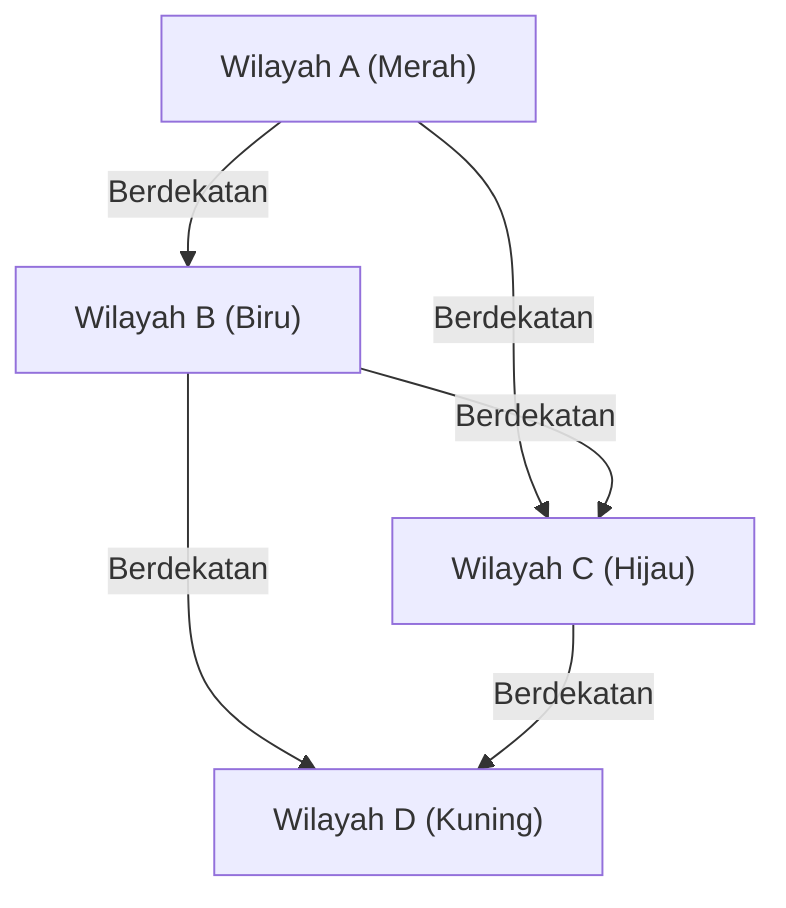

## 1. Apa itu Masalah Empat Warna?

Masalah Empat Warna ([Four Color Theorem](https://kenji.blog/p/four-color-theorem/)) adalah salah satu masalah paling terkenal dan menarik dalam matematika, terutama dalam teori graf dan topologi. Klaimnya sangat sederhana dan cukup intuitif untuk dipahami bahkan oleh siswa sekolah dasar. Klaim tersebut adalah bahwa "untuk mewarnai peta mana pun di bidang datar sedemikian rupa sehingga wilayah yang berdekatan memiliki warna yang berbeda, maksimal **4 warna** sudah cukup".

"Berdekatan" di sini berarti berbagi garis batas, bukan hanya sebuah titik. Jika mereka hanya bersentuhan di satu titik, tidak masalah jika diwarnai dengan warna yang sama. Hipotesis intuitif ini pertama kali diajukan oleh Francis Guthrie pada tahun 1852. Saat mewarnai peta Inggris, ia menyadari bahwa betapapun rumitnya batas-batas suatu wilayah, 4 warna sudah cukup untuk mewarnai semuanya.

## 2. Latar Belakang Sejarah Masalah Empat Warna

Setelah Francis Guthrie menyadari masalah ini, ia menyampaikannya kepada saudaranya yang seorang matematikawan, Frederick Guthrie. Frederick kemudian mempresentasikan masalah ini kepada mentornya, Augustus De Morgan. De Morgan terkejut dengan kesederhanaan masalah ini dan betapa sulitnya membuktikan kebalikannya, lalu mulai mendiskusikannya dengan matematikawan lain.

Pada tahun 1878, Arthur Cayley secara resmi mempresentasikan masalah ini di London Mathematical Society, membuatnya dikenal luas dalam komunitas matematika. Banyak matematikawan brilian berusaha memecahkan masalah ini, namun jalan menuju pembuktian yang lengkap jauh lebih curam dari yang dibayangkan.

## 3. Bukti Kempe dan Contoh Penyangkal Heawood

Pada tahun 1879, seorang matematikawan bernama Alfred Kempe menerbitkan sebuah bukti untuk Masalah Empat Warna. Buktinya sangat cerdik dan memperkenalkan konsep yang sekarang dikenal sebagai "Rantai Kempe (Kempe chain)". Bukti Kempe diterima secara luas, dan selama lebih dari 10 tahun, Masalah Empat Warna dianggap telah terpecahkan.

Namun, pada tahun 1890, Percy Heawood menemukan kelemahan fatal dalam bukti Kempe. Meskipun menunjukkan kesalahan logika Kempe, Heawood dengan brilian menerapkan metode Kempe untuk membuktikan "Teorema Lima Warna", yang menyatakan bahwa "peta mana pun dapat diwarnai dengan **5 warna**". Masalah Empat Warna pun kembali menjadi masalah yang belum terpecahkan.

## 4. Transformasi ke Teori Graf

Untuk menangani Masalah Empat Warna secara matematis dan ketat, masalah ini diterjemahkan ke dalam bahasa teori graf. Setiap wilayah di peta direpresentasikan sebagai "Simpul (Vertex)", dan wilayah yang berbagi batas dihubungkan oleh "Sisi (Edge)". Graf yang terbentuk dengan cara ini disebut "Graf Planar (Planar Graph)".

Graf Planar adalah graf yang dapat digambar pada bidang datar tanpa ada sisi yang saling bersilangan. Masalah Empat Warna kemudian direduksi menjadi masalah bahwa "simpul dari semua graf planar dapat diwarnai dengan **4 warna** sedemikian rupa sehingga simpul yang berdekatan memiliki warna yang berbeda".

Dalam rumus matematika, ini berarti menunjukkan bahwa untuk suatu graf $G = (V, E)$, terdapat fungsi pewarnaan $c: V \rightarrow \{1, 2, 3, 4\}$ sedemikian rupa sehingga untuk semua sisi $(u, v) \in E$, berlaku $c(u) \neq c(v)$.

Di sini, Teorema Polihedron Euler $V - E + F = 2$ ($V$ adalah jumlah simpul, $E$ adalah jumlah sisi, $F$ adalah jumlah sisi/permukaan) memainkan peran penting dalam menyelidiki sifat-sifat graf planar.

## 5. Dampak Pembuktian Menggunakan Komputer

Pada tahun 1976, Kenneth Appel dan Wolfgang Haken dari University of Illinois akhirnya membuktikan Masalah Empat Warna. Namun, metode pembuktian mereka memicu kontroversi besar dalam komunitas matematika. Mereka mereduksi pembuktian masalah menjadi pengecekan sejumlah terbatas (akhirnya 1936) pola yang disebut "Himpunan yang tak terhindarkan (Unavoidable set)", dan menggunakan superkomputer pada masa itu untuk menghitung bahwa semua pola ini dapat diwarnai dengan 4 warna (Sifat dapat direduksi: Reducibility).

Karena jumlah perhitungan sangat besar sehingga tidak mungkin bagi manusia untuk memverifikasi setiap langkah secara manual, hal ini memicu perdebatan filosofis: "Apakah ini benar-benar bisa disebut sebagai bukti matematika?".

## 6. Penyempurnaan Pembuktian dan Pandangan Modern

Pada tahun 1997, Neil Robertson dan rekan-rekannya menyempurnakan bukti Appel dan Haken, mengurangi jumlah himpunan yang tak terhindarkan menjadi 633. Selain itu, pada tahun 2005, Georges Gonthier menggunakan sistem asisten pembuktian teorema Coq untuk menyelesaikan pembuktian formal lengkap dari Teorema Empat Warna. Hal ini membuat kemungkinan kesalahan akibat bug program komputer menjadi sangat rendah, dan keabsahan bukti menjadi tak terbantahkan.

Saat ini, pembuktian berbantuan komputer secara luas diakui sebagai alat yang ampuh dalam matematika dan telah berkontribusi pada pemecahan masalah sulit lainnya, seperti pembuktian dugaan Kepler.

## 7. Penutup

Masalah Empat Warna adalah contoh terbaik untuk menunjukkan "bagaimana masalah yang tampaknya sederhana menyimpan struktur matematika yang dalam dan kompleks". Masalah ini, yang dimulai dari gagasan iseng mewarnai peta, telah memicu perkembangan teori graf dan bahkan berdampak besar dengan mengubah cara kita memahami pembuktian matematis itu sendiri.

Eksplorasi masalah ini mengajarkan kita betapa kuatnya intuisi manusia, dan berapa banyak upaya serta teknologi baru yang diperlukan untuk membuktikannya secara ketat.

## 1. Apa itu Masalah Empat Warna?

Masalah Empat Warna ([Four Color Theorem](https://kenji.blog/p/four-color-theorem/)) adalah salah satu masalah paling terkenal dan menarik dalam matematika, terutama dalam teori graf dan topologi. Klaimnya sangat sederhana dan cukup intuitif untuk dipahami bahkan oleh siswa sekolah dasar. Klaim tersebut adalah bahwa "untuk mewarnai peta mana pun di bidang datar sedemikian rupa sehingga wilayah yang berdekatan memiliki warna yang berbeda, maksimal **4 warna** sudah cukup".

"Berdekatan" di sini berarti berbagi garis batas, bukan hanya sebuah titik. Jika mereka hanya bersentuhan di satu titik, tidak masalah jika diwarnai dengan warna yang sama. Hipotesis intuitif ini pertama kali diajukan oleh Francis Guthrie pada tahun 1852. Saat mewarnai peta Inggris, ia menyadari bahwa betapapun rumitnya batas-batas suatu wilayah, 4 warna sudah cukup untuk mewarnai semuanya.

## 2. Latar Belakang Sejarah Masalah Empat Warna

Setelah Francis Guthrie menyadari masalah ini, ia menyampaikannya kepada saudaranya yang seorang matematikawan, Frederick Guthrie. Frederick kemudian mempresentasikan masalah ini kepada mentornya, Augustus De Morgan. De Morgan terkejut dengan kesederhanaan masalah ini dan betapa sulitnya membuktikan kebalikannya, lalu mulai mendiskusikannya dengan matematikawan lain.

Pada tahun 1878, Arthur Cayley secara resmi mempresentasikan masalah ini di London Mathematical Society, membuatnya dikenal luas dalam komunitas matematika. Banyak matematikawan brilian berusaha memecahkan masalah ini, namun jalan menuju pembuktian yang lengkap jauh lebih curam dari yang dibayangkan.

## 3. Bukti Kempe dan Contoh Penyangkal Heawood

Pada tahun 1879, seorang matematikawan bernama Alfred Kempe menerbitkan sebuah bukti untuk Masalah Empat Warna. Buktinya sangat cerdik dan memperkenalkan konsep yang sekarang dikenal sebagai "Rantai Kempe (Kempe chain)". Bukti Kempe diterima secara luas, dan selama lebih dari 10 tahun, Masalah Empat Warna dianggap telah terpecahkan.

Namun, pada tahun 1890, Percy Heawood menemukan kelemahan fatal dalam bukti Kempe. Meskipun menunjukkan kesalahan logika Kempe, Heawood dengan brilian menerapkan metode Kempe untuk membuktikan "Teorema Lima Warna", yang menyatakan bahwa "peta mana pun dapat diwarnai dengan **5 warna**". Masalah Empat Warna pun kembali menjadi masalah yang belum terpecahkan.

## 4. Transformasi ke Teori Graf

Untuk menangani Masalah Empat Warna secara matematis dan ketat, masalah ini diterjemahkan ke dalam bahasa teori graf. Setiap wilayah di peta direpresentasikan sebagai "Simpul (Vertex)", dan wilayah yang berbagi batas dihubungkan oleh "Sisi (Edge)". Graf yang terbentuk dengan cara ini disebut "Graf Planar (Planar Graph)".

Graf Planar adalah graf yang dapat digambar pada bidang datar tanpa ada sisi yang saling bersilangan. Masalah Empat Warna kemudian direduksi menjadi masalah bahwa "simpul dari semua graf planar dapat diwarnai dengan **4 warna** sedemikian rupa sehingga simpul yang berdekatan memiliki warna yang berbeda".

Dalam rumus matematika, ini berarti menunjukkan bahwa untuk suatu graf $G = (V, E)$, terdapat fungsi pewarnaan $c: V \rightarrow \{1, 2, 3, 4\}$ sedemikian rupa sehingga untuk semua sisi $(u, v) \in E$, berlaku $c(u) \neq c(v)$.

Di sini, Teorema Polihedron Euler $V - E + F = 2$ ($V$ adalah jumlah simpul, $E$ adalah jumlah sisi, $F$ adalah jumlah sisi/permukaan) memainkan peran penting dalam menyelidiki sifat-sifat graf planar.

## 5. Dampak Pembuktian Menggunakan Komputer

Pada tahun 1976, Kenneth Appel dan Wolfgang Haken dari University of Illinois akhirnya membuktikan Masalah Empat Warna. Namun, metode pembuktian mereka memicu kontroversi besar dalam komunitas matematika. Mereka mereduksi pembuktian masalah menjadi pengecekan sejumlah terbatas (akhirnya 1936) pola yang disebut "Himpunan yang tak terhindarkan (Unavoidable set)", dan menggunakan superkomputer pada masa itu untuk menghitung bahwa semua pola ini dapat diwarnai dengan 4 warna (Sifat dapat direduksi: Reducibility).

Karena jumlah perhitungan sangat besar sehingga tidak mungkin bagi manusia untuk memverifikasi setiap langkah secara manual, hal ini memicu perdebatan filosofis: "Apakah ini benar-benar bisa disebut sebagai bukti matematika?".

## 6. Penyempurnaan Pembuktian dan Pandangan Modern

Pada tahun 1997, Neil Robertson dan rekan-rekannya menyempurnakan bukti Appel dan Haken, mengurangi jumlah himpunan yang tak terhindarkan menjadi 633. Selain itu, pada tahun 2005, Georges Gonthier menggunakan sistem asisten pembuktian teorema Coq untuk menyelesaikan pembuktian formal lengkap dari Teorema Empat Warna. Hal ini membuat kemungkinan kesalahan akibat bug program komputer menjadi sangat rendah, dan keabsahan bukti menjadi tak terbantahkan.

Saat ini, pembuktian berbantuan komputer secara luas diakui sebagai alat yang ampuh dalam matematika dan telah berkontribusi pada pemecahan masalah sulit lainnya, seperti pembuktian dugaan Kepler.

## 7. Penutup

Masalah Empat Warna adalah contoh terbaik untuk menunjukkan "bagaimana masalah yang tampaknya sederhana menyimpan struktur matematika yang dalam dan kompleks". Masalah ini, yang dimulai dari gagasan iseng mewarnai peta, telah memicu perkembangan teori graf dan bahkan berdampak besar dengan mengubah cara kita memahami pembuktian matematis itu sendiri.

Eksplorasi masalah ini mengajarkan kita betapa kuatnya intuisi manusia, dan berapa banyak upaya serta teknologi baru yang diperlukan untuk membuktikannya secara ketat.

## 1. Apa itu Masalah Empat Warna?

Masalah Empat Warna ([Four Color Theorem](https://kenji.blog/p/four-color-theorem/)) adalah salah satu masalah paling terkenal dan menarik dalam matematika, terutama dalam teori graf dan topologi. Klaimnya sangat sederhana dan cukup intuitif untuk dipahami bahkan oleh siswa sekolah dasar. Klaim tersebut adalah bahwa "untuk mewarnai peta mana pun di bidang datar sedemikian rupa sehingga wilayah yang berdekatan memiliki warna yang berbeda, maksimal **4 warna** sudah cukup".

"Berdekatan" di sini berarti berbagi garis batas, bukan hanya sebuah titik. Jika mereka hanya bersentuhan di satu titik, tidak masalah jika diwarnai dengan warna yang sama. Hipotesis intuitif ini pertama kali diajukan oleh Francis Guthrie pada tahun 1852. Saat mewarnai peta Inggris, ia menyadari bahwa betapapun rumitnya batas-batas suatu wilayah, 4 warna sudah cukup untuk mewarnai semuanya.

## 2. Latar Belakang Sejarah Masalah Empat Warna

Setelah Francis Guthrie menyadari masalah ini, ia menyampaikannya kepada saudaranya yang seorang matematikawan, Frederick Guthrie. Frederick kemudian mempresentasikan masalah ini kepada mentornya, Augustus De Morgan. De Morgan terkejut dengan kesederhanaan masalah ini dan betapa sulitnya membuktikan kebalikannya, lalu mulai mendiskusikannya dengan matematikawan lain.

Pada tahun 1878, Arthur Cayley secara resmi mempresentasikan masalah ini di London Mathematical Society, membuatnya dikenal luas dalam komunitas matematika. Banyak matematikawan brilian berusaha memecahkan masalah ini, namun jalan menuju pembuktian yang lengkap jauh lebih curam dari yang dibayangkan.

## 3. Bukti Kempe dan Contoh Penyangkal Heawood

Pada tahun 1879, seorang matematikawan bernama Alfred Kempe menerbitkan sebuah bukti untuk Masalah Empat Warna. Buktinya sangat cerdik dan memperkenalkan konsep yang sekarang dikenal sebagai "Rantai Kempe (Kempe chain)". Bukti Kempe diterima secara luas, dan selama lebih dari 10 tahun, Masalah Empat Warna dianggap telah terpecahkan.

Namun, pada tahun 1890, Percy Heawood menemukan kelemahan fatal dalam bukti Kempe. Meskipun menunjukkan kesalahan logika Kempe, Heawood dengan brilian menerapkan metode Kempe untuk membuktikan "Teorema Lima Warna", yang menyatakan bahwa "peta mana pun dapat diwarnai dengan **5 warna**". Masalah Empat Warna pun kembali menjadi masalah yang belum terpecahkan.

## 4. Transformasi ke Teori Graf

Untuk menangani Masalah Empat Warna secara matematis dan ketat, masalah ini diterjemahkan ke dalam bahasa teori graf. Setiap wilayah di peta direpresentasikan sebagai "Simpul (Vertex)", dan wilayah yang berbagi batas dihubungkan oleh "Sisi (Edge)". Graf yang terbentuk dengan cara ini disebut "Graf Planar (Planar Graph)".

Graf Planar adalah graf yang dapat digambar pada bidang datar tanpa ada sisi yang saling bersilangan. Masalah Empat Warna kemudian direduksi menjadi masalah bahwa "simpul dari semua graf planar dapat diwarnai dengan **4 warna** sedemikian rupa sehingga simpul yang berdekatan memiliki warna yang berbeda".

Dalam rumus matematika, ini berarti menunjukkan bahwa untuk suatu graf $G = (V, E)$, terdapat fungsi pewarnaan $c: V \rightarrow \{1, 2, 3, 4\}$ sedemikian rupa sehingga untuk semua sisi $(u, v) \in E$, berlaku $c(u) \neq c(v)$.

Di sini, Teorema Polihedron Euler $V - E + F = 2$ ($V$ adalah jumlah simpul, $E$ adalah jumlah sisi, $F$ adalah jumlah sisi/permukaan) memainkan peran penting dalam menyelidiki sifat-sifat graf planar.

## 5. Dampak Pembuktian Menggunakan Komputer

Pada tahun 1976, Kenneth Appel dan Wolfgang Haken dari University of Illinois akhirnya membuktikan Masalah Empat Warna. Namun, metode pembuktian mereka memicu kontroversi besar dalam komunitas matematika. Mereka mereduksi pembuktian masalah menjadi pengecekan sejumlah terbatas (akhirnya 1936) pola yang disebut "Himpunan yang tak terhindarkan (Unavoidable set)", dan menggunakan superkomputer pada masa itu untuk menghitung bahwa semua pola ini dapat diwarnai dengan 4 warna (Sifat dapat direduksi: Reducibility).

Karena jumlah perhitungan sangat besar sehingga tidak mungkin bagi manusia untuk memverifikasi setiap langkah secara manual, hal ini memicu perdebatan filosofis: "Apakah ini benar-benar bisa disebut sebagai bukti matematika?".

## 6. Penyempurnaan Pembuktian dan Pandangan Modern

Pada tahun 1997, Neil Robertson dan rekan-rekannya menyempurnakan bukti Appel dan Haken, mengurangi jumlah himpunan yang tak terhindarkan menjadi 633. Selain itu, pada tahun 2005, Georges Gonthier menggunakan sistem asisten pembuktian teorema Coq untuk menyelesaikan pembuktian formal lengkap dari Teorema Empat Warna. Hal ini membuat kemungkinan kesalahan akibat bug program komputer menjadi sangat rendah, dan keabsahan bukti menjadi tak terbantahkan.

Saat ini, pembuktian berbantuan komputer secara luas diakui sebagai alat yang ampuh dalam matematika dan telah berkontribusi pada pemecahan masalah sulit lainnya, seperti pembuktian dugaan Kepler.

## 7. Penutup

Masalah Empat Warna adalah contoh terbaik untuk menunjukkan "bagaimana masalah yang tampaknya sederhana menyimpan struktur matematika yang dalam dan kompleks". Masalah ini, yang dimulai dari gagasan iseng mewarnai peta, telah memicu perkembangan teori graf dan bahkan berdampak besar dengan mengubah cara kita memahami pembuktian matematis itu sendiri.

Eksplorasi masalah ini mengajarkan kita betapa kuatnya intuisi manusia, dan berapa banyak upaya serta teknologi baru yang diperlukan untuk membuktikannya secara ketat.
