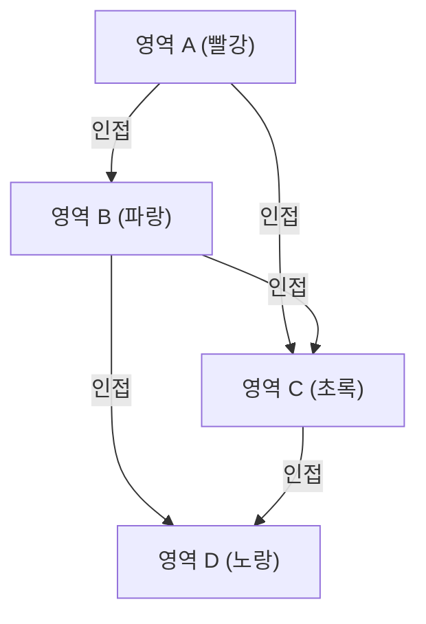

## 1. 4색 정리란 무엇인가?

[4색 정리(Four Color Theorem)](https://kenji.blog/ko/p/four-color-theorem/)는 수학, 특히 그래프 이론 및 위상 수학에서 가장 유명하고 매력적인 문제 중 하나입니다. 그 주장은 매우 단순하여 초등학생도 이해할 수 있을 정도로 직관적입니다. "어떠한 평면상의 지도라도, 인접한 영역이 다른 색이 되도록 칠하려면 최대 **4색** 이면 충분하다"는 것입니다.

여기서 말하는 "인접한"이란, 점이 아니라 경계선을 공유하고 있는 상태를 가리킵니다. 만약 점으로만 접해 있는 경우에는 같은 색으로 칠해도 문제가 없습니다. 이 직관적인 가설은 1852년에 프랜시스 구스리(Francis Guthrie)에 의해 처음 제기되었습니다. 그는 영국의 지도를 칠하던 중에 아무리 복잡한 경계선을 가진 주라도 4가지 색만 있으면 구별하여 칠할 수 있다는 사실을 깨달았습니다.

## 2. 4색 정리의 역사적 배경

프랜시스 구스리가 이 문제를 깨달은 후, 그는 수학자였던 동생 프레더릭 구스리에게 이 문제를 전했습니다. 프레더릭은 더 나아가 스승인 오거스터스 드 모르간(Augustus De Morgan)에게 이 문제를 제시했습니다. 드 모르간은 이 문제의 단순함과, 그에 반해 증명이 극히 어렵다는 점에 놀라며 다른 수학자들과 논의를 시작했습니다.

1878년, 아서 케일리(Arthur Cayley)가 런던 수학회에서 이 문제를 공식적으로 제시함으로써 널리 수학계에 알려지게 되었습니다. 많은 뛰어난 수학자들이 이 문제의 해결에 도전했지만, 완전한 증명에 이르기까지의 길은 상상 이상으로 험난했습니다.

## 3. 켐프의 증명과 히우드의 반례

1879년, 알프레드 켐프(Alfred Kempe)라는 수학자가 4색 정리의 증명을 발표했습니다. 그의 증명은 매우 교묘하여, 현재 "켐프 사슬(Kempe chain)"이라고 불리는 개념을 도입했습니다. 켐프의 증명은 널리 받아들여졌고, 10년 이상에 걸쳐 4색 정리는 해결된 것으로 간주되었습니다.

그러나 1890년, 퍼시 히우드(Percy Heawood)가 켐프의 증명에 치명적인 결함이 있음을 발견했습니다. 히우드는 켐프의 논리적 오류를 지적하는 한편, 켐프의 기법을 응용하여 "어떤 지도라도 **5색** 이면 칠할 수 있다"는 "5색 정리"를 훌륭하게 증명했습니다. 4색 정리는 다시 미해결 문제로 가로막히게 된 것입니다.

## 4. 그래프 이론으로의 변환

4색 정리를 수학적으로 엄밀하게 다루기 위해, 문제는 그래프 이론의 언어로 번역됩니다. 지도상의 각 영역을 "정점(Vertex)"으로 하고, 경계선을 공유하는 영역끼리를 "간선(Edge)"으로 연결합니다. 이렇게 만들어진 그래프는 "평면 그래프(Planar [Graph](https://kenji.blog/ko/p/tree-graph-data-structures-search-dfs-bfs-dijkstra/))"라고 불립니다.

평면 그래프란 간선이 교차하지 않고 평면상에 그릴 수 있는 그래프를 말합니다. 4색 정리는 "모든 평면 그래프의 정점은, 인접한 정점이 다른 색이 되도록 **4색** 으로 채색 가능하다"는 문제로 귀결됩니다.

수식을 사용하여 표현하면, 그래프 $G = (V, E)$ 에서 채색 함수 $c: V \rightarrow \{1, 2, 3, 4\}$ 가 존재하고, 모든 간선 $(u, v) \in E$ 에 대해 $c(u) \neq c(v)$ 가 됨을 보여주는 것이 됩니다.

여기서 [오일러의 다면체 정리](https://kenji.blog/ko/p/eulers-polyhedron-formula/) $V - E + F = 2$ ($V$ 는 정점의 수, $E$ 는 간선의 수, $F$ 는 면의 수)가 평면 그래프의 성질을 조사하는 데 중요한 역할을 합니다.

## 5. 컴퓨터를 이용한 증명의 충격

1976년, 일리노이 대학의 케네스 아펠(Kenneth Appel)과 볼프강 하켄(Wolfgang Haken)이 마침내 4색 정리를 증명했습니다. 그러나 그 증명 방법은 수학계에 큰 논쟁을 불러일으키는 것이었습니다. 그들은 문제의 증명을 유한 개(최종적으로는 1936개)의 "불가피 집합(Unavoidable set)"이라고 불리는 패턴의 확인으로 귀결시키고, 그 패턴들이 모두 4색으로 칠할 수 있음(가약성: Reducibility)을 당시의 슈퍼컴퓨터를 구사하여 계산하게 한 것입니다.

인간이 모든 계산 과정을 수작업으로 확인하는 것은 불가능할 정도의 방대한 계산량이었기 때문에, "이것이 정말 수학의 증명이라고 부를 수 있는가?"라는 철학적인 논쟁을 불러일으켰습니다.

## 6. 증명의 세련화와 현대의 관점

1997년, 닐 로버트슨(Neil Robertson) 등에 의해 아펠과 하켄의 증명은 개량되었고, 불가피 집합의 수는 633개까지 줄어들었습니다. 나아가 2005년에는 조르주 공티에(Georges Gonthier)가 정리 증명 지원 시스템인 Coq를 사용하여 4색 정리의 완전한 형식적 증명을 완성했습니다. 이로 인해 컴퓨터 프로그램의 버그로 인한 오류의 가능성은 극히 낮아졌고, 증명의 정당성은 흔들림 없는 것이 되었습니다.

현재는 컴퓨터 지원 증명이 수학의 강력한 도구로서 널리 인지되고 있으며, 케플러의 추측 증명 등 다른 난제 해결에도 공헌하고 있습니다.

## 7. 맺음말

4색 정리는 "언뜻 단순해 보이는 문제가 얼마나 깊고 복잡한 수학적 구조를 숨기고 있는가"를 보여주는 가장 좋은 예입니다. 지도를 칠한다는 장난기에서 시작된 이 문제는 그래프 이론을 발전시켰고, 나아가 수학적 증명의 존재 방식 자체를 변혁한다는 헤아릴 수 없는 영향을 미쳤습니다.

이 문제의 탐구는 인간의 직관이 얼마나 강력한지, 그리고 그것을 엄밀하게 증명하기 위해 얼마나 많은 노력과 새로운 기술이 필요한지를 가르쳐 줍니다.

