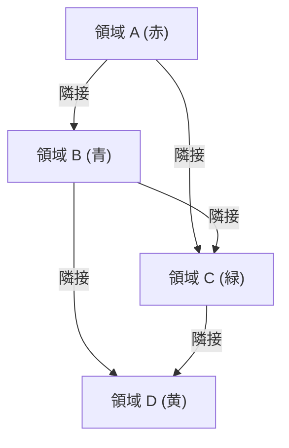

## 1. 四色問題とは何か？

[四色問題（Four Color Theorem）](https://kenji.blog/p/four-color-theorem/)は、数学、特に[グラフ理論](https://kenji.blog/p/graph-theory-dijkstra-a-star/)および位相幾何学における最も有名で魅力的な問題の一つです。その主張は非常にシンプルで、小学生でも理解できるほど直感的です。「いかなる平面上の地図も、隣接する領域が異なる色になるように塗るには、最大でも **4色** あれば十分である」というものです。

ここで言う「隣接する」とは、点ではなく、境界線を共有している状態を指します。もし点でしか接していない場合は、同じ色で塗っても問題ありません。この直感的な仮説は、1852年にフランシス・ガスリー（Francis Guthrie）によって初めて提起されました。彼はイギリスの地図を塗り分けている際に、どんなに複雑な境界線を持つ県であっても、4つの色があれば塗り分けられることに気づきました。

## 2. 四色問題の歴史的背景

フランシス・ガスリーがこの問題に気づいた後、彼は数学者であった弟のフレデリック・ガスリーにこの問題を伝えました。フレデリックはさらに、恩師であるオーガスタス・ド・モルガン（Augustus De Morgan）にこの問題を提示しました。ド・モルガンはこの問題のシンプルさと、それに反して証明が極めて困難であることに驚き、他の数学者たちと議論を始めました。

1878年、アーサー・ケイリー（Arthur Cayley）がロンドン数学会でこの問題を公式に提示したことで、広く数学界に知られることになります。多くの優れた数学者がこの問題の解決に挑みましたが、完全な証明に至るまでの道のりは想像以上に険しいものでした。

## 3. ケンペの証明とヒーウッドの反例

1879年、アルフレッド・ケンプ（Alfred Kempe）という数学者が、四色問題の証明を発表しました。彼の証明は非常に巧妙で、現在「ケンペ鎖（Kempe chain）」と呼ばれる概念を導入しました。ケンペの証明は広く受け入れられ、10年以上にわたって四色問題は解決済みであると考えられていました。

しかし1890年、パーシー・ヒーウッド（Percy Heawood）がケンペの証明に致命的な欠陥があることを発見しました。ヒーウッドはケンペの論理の誤りを指摘する一方で、ケンペの手法を応用して「どんな地図でも **5色** あれば塗り分けられる」という「五色定理」を見事に証明しました。四色問題は再び未解決問題として立ちはだかることになったのです。

## 4. グラフ理論への変換

四色問題を数学的に厳密に扱うために、問題はグラフ理論の言葉に翻訳されます。地図上の各領域を「頂点（Vertex）」とし、境界線を共有する領域同士を「辺（Edge）」で結びます。このようにして作られたグラフは「平面グラフ（Planar Graph）」と呼ばれます。

平面グラフとは、辺が交差することなく平面上に描画できるグラフのことです。四色問題は、「すべての平面グラフの頂点は、隣接する頂点が異なる色になるように **4色** で彩色可能である」という問題に帰着します。

数式を用いて表現すると、グラフ $G = (V, E)$ において、彩色関数 $c: V \rightarrow \{1, 2, 3, 4\}$ が存在し、すべての辺 $(u, v) \in E$ に対して $c(u) \neq c(v)$ となることを示すことになります。

ここで、[オイラー](https://kenji.blog/p/euler/)の多面体定理 $V - E + F = 2$ （$V$ は頂点の数、$E$ は辺の数、$F$ は面の数）が、平面グラフの性質を調べる上で重要な役割を果たします。

## 5. コンピュータによる証明の衝撃

1976年、イリノイ大学のケネス・アッペル（Kenneth Appel）とヴォルフガング・ハーケン（Wolfgang Haken）がついに四色問題を証明しました。しかし、その証明方法は数学界に大きな論争を巻き起こすものでした。彼らは、問題の証明を有限個（最終的には1936個）の「不可避集合（Unavoidable set）」と呼ばれるパターンの確認に帰着させ、それらのパターンがすべて4色で塗り分け可能（可約性：Reducibility）であることを、当時のスーパーコンピュータを駆使して計算させたのです。

人間がすべての計算過程を手作業で確認することは不可能なほどの膨大な計算量であったため、「これは本当に数学の証明と呼べるのか？」という哲学的な議論を呼びました。

## 6. 証明の洗練と現代の視点

1997年、ニール・ロバートソン（Neil Robertson）らにより、アッペルとハーケンの証明は改良され、不可避集合の数は633個まで減らされました。さらに2005年には、ジョルジュ・ゴンティエ（Georges Gonthier）が定理証明支援系 Coq を用いて[四色定理](https://kenji.blog/p/four-color-theorem/)の完全な形式的証明を完成させました。これにより、コンピュータプログラムのバグによる誤りの可能性は極めて低くなり、証明の正当性は揺るぎないものとなりました。

現在では、コンピュータ支援証明は数学の強力なツールとして広く認知されており、ケプラー予想の証明など、他の難問解決にも貢献しています。

## 7. おわりに

四色問題は、「一見単純な問題が、いかに深く複雑な数学的構造を秘めているか」を示す最良の例です。地図の塗り分けという遊び心から始まったこの問題は、[グラフ理論](https://kenji.blog/p/graph-theory-dijkstra-a-star/)を発展させ、さらには数学的証明のあり方そのものを変革するという、計り知れない影響を与えました。

この問題の探求は、人間の直感がいかに強力であるか、そしてそれを厳密に証明するためにいかに多くの努力と新しい技術が必要であるかを教えてくれます。

## 1. 四色問題とは何か？

[四色問題（Four Color Theorem）](https://kenji.blog/p/four-color-theorem/)は、数学、特に[グラフ理論](https://kenji.blog/p/graph-theory-dijkstra-a-star/)および位相幾何学における最も有名で魅力的な問題の一つです。その主張は非常にシンプルで、小学生でも理解できるほど直感的です。「いかなる平面上の地図も、隣接する領域が異なる色になるように塗るには、最大でも **4色** あれば十分である」というものです。

ここで言う「隣接する」とは、点ではなく、境界線を共有している状態を指します。もし点でしか接していない場合は、同じ色で塗っても問題ありません。この直感的な仮説は、1852年にフランシス・ガスリー（Francis Guthrie）によって初めて提起されました。彼はイギリスの地図を塗り分けている際に、どんなに複雑な境界線を持つ県であっても、4つの色があれば塗り分けられることに気づきました。

## 2. 四色問題の歴史的背景

フランシス・ガスリーがこの問題に気づいた後、彼は数学者であった弟のフレデリック・ガスリーにこの問題を伝えました。フレデリックはさらに、恩師であるオーガスタス・ド・モルガン（Augustus De Morgan）にこの問題を提示しました。ド・モルガンはこの問題のシンプルさと、それに反して証明が極めて困難であることに驚き、他の数学者たちと議論を始めました。

1878年、アーサー・ケイリー（Arthur Cayley）がロンドン数学会でこの問題を公式に提示したことで、広く数学界に知られることになります。多くの優れた数学者がこの問題の解決に挑みましたが、完全な証明に至るまでの道のりは想像以上に険しいものでした。

## 3. ケンペの証明とヒーウッドの反例

1879年、アルフレッド・ケンプ（Alfred Kempe）という数学者が、四色問題の証明を発表しました。彼の証明は非常に巧妙で、現在「ケンペ鎖（Kempe chain）」と呼ばれる概念を導入しました。ケンペの証明は広く受け入れられ、10年以上にわたって四色問題は解決済みであると考えられていました。

しかし1890年、パーシー・ヒーウッド（Percy Heawood）がケンペの証明に致命的な欠陥があることを発見しました。ヒーウッドはケンペの論理の誤りを指摘する一方で、ケンペの手法を応用して「どんな地図でも **5色** あれば塗り分けられる」という「五色定理」を見事に証明しました。四色問題は再び未解決問題として立ちはだかることになったのです。

## 4. グラフ理論への変換

四色問題を数学的に厳密に扱うために、問題はグラフ理論の言葉に翻訳されます。地図上の各領域を「頂点（Vertex）」とし、境界線を共有する領域同士を「辺（Edge）」で結びます。このようにして作られたグラフは「平面グラフ（Planar Graph）」と呼ばれます。

平面グラフとは、辺が交差することなく平面上に描画できるグラフのことです。四色問題は、「すべての平面グラフの頂点は、隣接する頂点が異なる色になるように **4色** で彩色可能である」という問題に帰着します。

数式を用いて表現すると、グラフ $G = (V, E)$ において、彩色関数 $c: V \rightarrow \{1, 2, 3, 4\}$ が存在し、すべての辺 $(u, v) \in E$ に対して $c(u) \neq c(v)$ となることを示すことになります。

ここで、[オイラー](https://kenji.blog/p/euler/)の多面体定理 $V - E + F = 2$ （$V$ は頂点の数、$E$ は辺の数、$F$ は面の数）が、平面グラフの性質を調べる上で重要な役割を果たします。

## 5. コンピュータによる証明の衝撃

1976年、イリノイ大学のケネス・アッペル（Kenneth Appel）とヴォルフガング・ハーケン（Wolfgang Haken）がついに四色問題を証明しました。しかし、その証明方法は数学界に大きな論争を巻き起こすものでした。彼らは、問題の証明を有限個（最終的には1936個）の「不可避集合（Unavoidable set）」と呼ばれるパターンの確認に帰着させ、それらのパターンがすべて4色で塗り分け可能（可約性：Reducibility）であることを、当時のスーパーコンピュータを駆使して計算させたのです。

人間がすべての計算過程を手作業で確認することは不可能なほどの膨大な計算量であったため、「これは本当に数学の証明と呼べるのか？」という哲学的な議論を呼びました。

## 6. 証明の洗練と現代の視点

1997年、ニール・ロバートソン（Neil Robertson）らにより、アッペルとハーケンの証明は改良され、不可避集合の数は633個まで減らされました。さらに2005年には、ジョルジュ・ゴンティエ（Georges Gonthier）が定理証明支援系 Coq を用いて[四色定理](https://kenji.blog/p/four-color-theorem/)の完全な形式的証明を完成させました。これにより、コンピュータプログラムのバグによる誤りの可能性は極めて低くなり、証明の正当性は揺るぎないものとなりました。

現在では、コンピュータ支援証明は数学の強力なツールとして広く認知されており、ケプラー予想の証明など、他の難問解決にも貢献しています。

## 7. おわりに

四色問題は、「一見単純な問題が、いかに深く複雑な数学的構造を秘めているか」を示す最良の例です。地図の塗り分けという遊び心から始まったこの問題は、[グラフ理論](https://kenji.blog/p/graph-theory-dijkstra-a-star/)を発展させ、さらには数学的証明のあり方そのものを変革するという、計り知れない影響を与えました。

この問題の探求は、人間の直感がいかに強力であるか、そしてそれを厳密に証明するためにいかに多くの努力と新しい技術が必要であるかを教えてくれます。

## 1. 四色問題とは何か？

[四色問題（Four Color Theorem）](https://kenji.blog/p/four-color-theorem/)は、数学、特に[グラフ理論](https://kenji.blog/p/graph-theory-dijkstra-a-star/)および位相幾何学における最も有名で魅力的な問題の一つです。その主張は非常にシンプルで、小学生でも理解できるほど直感的です。「いかなる平面上の地図も、隣接する領域が異なる色になるように塗るには、最大でも **4色** あれば十分である」というものです。

ここで言う「隣接する」とは、点ではなく、境界線を共有している状態を指します。もし点でしか接していない場合は、同じ色で塗っても問題ありません。この直感的な仮説は、1852年にフランシス・ガスリー（Francis Guthrie）によって初めて提起されました。彼はイギリスの地図を塗り分けている際に、どんなに複雑な境界線を持つ県であっても、4つの色があれば塗り分けられることに気づきました。

## 2. 四色問題の歴史的背景

フランシス・ガスリーがこの問題に気づいた後、彼は数学者であった弟のフレデリック・ガスリーにこの問題を伝えました。フレデリックはさらに、恩師であるオーガスタス・ド・モルガン（Augustus De Morgan）にこの問題を提示しました。ド・モルガンはこの問題のシンプルさと、それに反して証明が極めて困難であることに驚き、他の数学者たちと議論を始めました。

1878年、アーサー・ケイリー（Arthur Cayley）がロンドン数学会でこの問題を公式に提示したことで、広く数学界に知られることになります。多くの優れた数学者がこの問題の解決に挑みましたが、完全な証明に至るまでの道のりは想像以上に険しいものでした。

## 3. ケンペの証明とヒーウッドの反例

1879年、アルフレッド・ケンプ（Alfred Kempe）という数学者が、四色問題の証明を発表しました。彼の証明は非常に巧妙で、現在「ケンペ鎖（Kempe chain）」と呼ばれる概念を導入しました。ケンペの証明は広く受け入れられ、10年以上にわたって四色問題は解決済みであると考えられていました。

しかし1890年、パーシー・ヒーウッド（Percy Heawood）がケンペの証明に致命的な欠陥があることを発見しました。ヒーウッドはケンペの論理の誤りを指摘する一方で、ケンペの手法を応用して「どんな地図でも **5色** あれば塗り分けられる」という「五色定理」を見事に証明しました。四色問題は再び未解決問題として立ちはだかることになったのです。

## 4. グラフ理論への変換

四色問題を数学的に厳密に扱うために、問題はグラフ理論の言葉に翻訳されます。地図上の各領域を「頂点（Vertex）」とし、境界線を共有する領域同士を「辺（Edge）」で結びます。このようにして作られたグラフは「平面グラフ（Planar Graph）」と呼ばれます。

平面グラフとは、辺が交差することなく平面上に描画できるグラフのことです。四色問題は、「すべての平面グラフの頂点は、隣接する頂点が異なる色になるように **4色** で彩色可能である」という問題に帰着します。

数式を用いて表現すると、グラフ $G = (V, E)$ において、彩色関数 $c: V \rightarrow \{1, 2, 3, 4\}$ が存在し、すべての辺 $(u, v) \in E$ に対して $c(u) \neq c(v)$ となることを示すことになります。

ここで、[オイラー](https://kenji.blog/p/euler/)の多面体定理 $V - E + F = 2$ （$V$ は頂点の数、$E$ は辺の数、$F$ は面の数）が、平面グラフの性質を調べる上で重要な役割を果たします。

## 5. コンピュータによる証明の衝撃

1976年、イリノイ大学のケネス・アッペル（Kenneth Appel）とヴォルフガング・ハーケン（Wolfgang Haken）がついに四色問題を証明しました。しかし、その証明方法は数学界に大きな論争を巻き起こすものでした。彼らは、問題の証明を有限個（最終的には1936個）の「不可避集合（Unavoidable set）」と呼ばれるパターンの確認に帰着させ、それらのパターンがすべて4色で塗り分け可能（可約性：Reducibility）であることを、当時のスーパーコンピュータを駆使して計算させたのです。

人間がすべての計算過程を手作業で確認することは不可能なほどの膨大な計算量であったため、「これは本当に数学の証明と呼べるのか？」という哲学的な議論を呼びました。

## 6. 証明の洗練と現代の視点

1997年、ニール・ロバートソン（Neil Robertson）らにより、アッペルとハーケンの証明は改良され、不可避集合の数は633個まで減らされました。さらに2005年には、ジョルジュ・ゴンティエ（Georges Gonthier）が定理証明支援系 Coq を用いて[四色定理](https://kenji.blog/p/four-color-theorem/)の完全な形式的証明を完成させました。これにより、コンピュータプログラムのバグによる誤りの可能性は極めて低くなり、証明の正当性は揺るぎないものとなりました。

現在では、コンピュータ支援証明は数学の強力なツールとして広く認知されており、ケプラー予想の証明など、他の難問解決にも貢献しています。

## 7. おわりに

四色問題は、「一見単純な問題が、いかに深く複雑な数学的構造を秘めているか」を示す最良の例です。地図の塗り分けという遊び心から始まったこの問題は、[グラフ理論](https://kenji.blog/p/graph-theory-dijkstra-a-star/)を発展させ、さらには数学的証明のあり方そのものを変革するという、計り知れない影響を与えました。

この問題の探求は、人間の直感がいかに強力であるか、そしてそれを厳密に証明するためにいかに多くの努力と新しい技術が必要であるかを教えてくれます。

## 1. 四色問題とは何か？

[四色問題（Four Color Theorem）](https://kenji.blog/p/four-color-theorem/)は、数学、特に[グラフ理論](https://kenji.blog/p/graph-theory-dijkstra-a-star/)および位相幾何学における最も有名で魅力的な問題の一つです。その主張は非常にシンプルで、小学生でも理解できるほど直感的です。「いかなる平面上の地図も、隣接する領域が異なる色になるように塗るには、最大でも **4色** あれば十分である」というものです。

ここで言う「隣接する」とは、点ではなく、境界線を共有している状態を指します。もし点でしか接していない場合は、同じ色で塗っても問題ありません。この直感的な仮説は、1852年にフランシス・ガスリー（Francis Guthrie）によって初めて提起されました。彼はイギリスの地図を塗り分けている際に、どんなに複雑な境界線を持つ県であっても、4つの色があれば塗り分けられることに気づきました。

## 2. 四色問題の歴史的背景

フランシス・ガスリーがこの問題に気づいた後、彼は数学者であった弟のフレデリック・ガスリーにこの問題を伝えました。フレデリックはさらに、恩師であるオーガスタス・ド・モルガン（Augustus De Morgan）にこの問題を提示しました。ド・モルガンはこの問題のシンプルさと、それに反して証明が極めて困難であることに驚き、他の数学者たちと議論を始めました。

1878年、アーサー・ケイリー（Arthur Cayley）がロンドン数学会でこの問題を公式に提示したことで、広く数学界に知られることになります。多くの優れた数学者がこの問題の解決に挑みましたが、完全な証明に至るまでの道のりは想像以上に険しいものでした。

## 3. ケンペの証明とヒーウッドの反例

1879年、アルフレッド・ケンプ（Alfred Kempe）という数学者が、四色問題の証明を発表しました。彼の証明は非常に巧妙で、現在「ケンペ鎖（Kempe chain）」と呼ばれる概念を導入しました。ケンペの証明は広く受け入れられ、10年以上にわたって四色問題は解決済みであると考えられていました。

しかし1890年、パーシー・ヒーウッド（Percy Heawood）がケンペの証明に致命的な欠陥があることを発見しました。ヒーウッドはケンペの論理の誤りを指摘する一方で、ケンペの手法を応用して「どんな地図でも **5色** あれば塗り分けられる」という「五色定理」を見事に証明しました。四色問題は再び未解決問題として立ちはだかることになったのです。

## 4. グラフ理論への変換

四色問題を数学的に厳密に扱うために、問題はグラフ理論の言葉に翻訳されます。地図上の各領域を「頂点（Vertex）」とし、境界線を共有する領域同士を「辺（Edge）」で結びます。このようにして作られたグラフは「平面グラフ（Planar Graph）」と呼ばれます。

平面グラフとは、辺が交差することなく平面上に描画できるグラフのことです。四色問題は、「すべての平面グラフの頂点は、隣接する頂点が異なる色になるように **4色** で彩色可能である」という問題に帰着します。

数式を用いて表現すると、グラフ $G = (V, E)$ において、彩色関数 $c: V \rightarrow \{1, 2, 3, 4\}$ が存在し、すべての辺 $(u, v) \in E$ に対して $c(u) \neq c(v)$ となることを示すことになります。

ここで、[オイラー](https://kenji.blog/p/euler/)の多面体定理 $V - E + F = 2$ （$V$ は頂点の数、$E$ は辺の数、$F$ は面の数）が、平面グラフの性質を調べる上で重要な役割を果たします。

## 5. コンピュータによる証明の衝撃

1976年、イリノイ大学のケネス・アッペル（Kenneth Appel）とヴォルフガング・ハーケン（Wolfgang Haken）がついに四色問題を証明しました。しかし、その証明方法は数学界に大きな論争を巻き起こすものでした。彼らは、問題の証明を有限個（最終的には1936個）の「不可避集合（Unavoidable set）」と呼ばれるパターンの確認に帰着させ、それらのパターンがすべて4色で塗り分け可能（可約性：Reducibility）であることを、当時のスーパーコンピュータを駆使して計算させたのです。

人間がすべての計算過程を手作業で確認することは不可能なほどの膨大な計算量であったため、「これは本当に数学の証明と呼べるのか？」という哲学的な議論を呼びました。

## 6. 証明の洗練と現代の視点

1997年、ニール・ロバートソン（Neil Robertson）らにより、アッペルとハーケンの証明は改良され、不可避集合の数は633個まで減らされました。さらに2005年には、ジョルジュ・ゴンティエ（Georges Gonthier）が定理証明支援系 Coq を用いて[四色定理](https://kenji.blog/p/four-color-theorem/)の完全な形式的証明を完成させました。これにより、コンピュータプログラムのバグによる誤りの可能性は極めて低くなり、証明の正当性は揺るぎないものとなりました。

現在では、コンピュータ支援証明は数学の強力なツールとして広く認知されており、ケプラー予想の証明など、他の難問解決にも貢献しています。

## 7. おわりに

四色問題は、「一見単純な問題が、いかに深く複雑な数学的構造を秘めているか」を示す最良の例です。地図の塗り分けという遊び心から始まったこの問題は、[グラフ理論](https://kenji.blog/p/graph-theory-dijkstra-a-star/)を発展させ、さらには数学的証明のあり方そのものを変革するという、計り知れない影響を与えました。

この問題の探求は、人間の直感がいかに強力であるか、そしてそれを厳密に証明するためにいかに多くの努力と新しい技術が必要であるかを教えてくれます。
