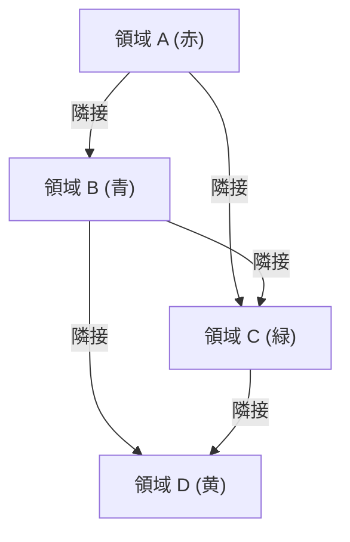

## 1. はじめに：四色問題のシンプルな主張と深い謎

「いかなる平面上の地図も、隣接する領域が異なる色になるように塗るには、最大でも4色あれば十分である。」

これが、数学の歴史において最も有名であり、同時に多くの数学者を悩ませた「四色問題（Four Color Theorem）」の主張です。この定理の特筆すべき点は、その主張があまりにもシンプルで、小学生にでも直感的に理解できることでしょう。複雑な数式や高度な抽象概念を必要とせず、ただ「地図を塗り分ける」という日常的な行為から導き出された問いです。

しかし、このシンプルな問題の証明は、数学界における「エベレスト登頂」に例えられるほど困難なものでした。19世紀半ばに提起されてから、実に120年以上もの間、世界中の天才数学者たちが証明に挑んでは敗れ去りました。最終的にこの問題が解決されたのは1976年であり、しかもそれは「コンピュータを用いた証明」という、当時の数学界に大きな物議を醸すアプローチによるものでした。

本記事では、四色問題がいかにして生まれ、どのようにして解決に至ったのか、そしてこの問題が現代の数学や計算機科学にどのような影響を与えたのかを、詳細に解説していきます。

## 2. 四色問題の起源：ガスリー兄弟からド・モルガンへ

四色問題の歴史は、1852年のイギリスに遡ります。当時、ユニヴァーシティ・カレッジ・ロンドンを卒業したばかりのフランシス・ガスリー（Francis Guthrie）は、イングランドの地図の各郡を異なる色で塗り分けていました。彼は地図を塗っているうちに、どんなに複雑な境界線を持つ地図であっても、4色あれば隣接する郡が同じ色にならないように塗り分けられることに気づきました。

ここでいう「隣接する」とは、点ではなく線（境界線）を共有している状態を指します。点でしか接していない領域同士は、同じ色で塗っても構いません。

フランシスはこの直感的な発見を、当時ユニヴァーシティ・カレッジ・ロンドンで数学を学んでいた弟のフレデリック・ガスリーに伝えました。フレデリック自身もこの問題の証明を試みましたがうまくいかず、彼の指導教員であった著名な数学者、オーガスタス・ド・モルガン（Augustus De Morgan）に質問を投げかけました。

ド・モルガンはこの問いのシンプルさと、それに反する証明の難しさに驚愕しました。彼は直ちにアイルランドの数学者ウィリアム・ローワン・ハミルトン（William Rowan Hamilton）に手紙を書き、この問題を共有しました。しかし、ハミルトンはこの問題にあまり関心を示さなかったと言われています。

その後、ド・モルガンらを通じて数学者の間で細々と議論されていた四色問題は、1878年にアーサー・ケイリー（Arthur Cayley）がロンドン数学会で公式に「未解決問題」として提示したことで、広く数学界に認知されることになります。

## 3. 最初の挑戦と挫折：ケンペの証明とヒーウッドによる発見

ケイリーによる問題提起の翌年である1879年、アルフレッド・ケンプ（Alfred Kempe）という弁護士であり数学者でもあった人物が、科学誌『ネイチャー』に四色問題の証明を発表しました。

ケンペの証明は非常に巧妙で、「ケンペ鎖（Kempe chain）」と呼ばれる革新的な概念を導入しました。ケンペ鎖とは、2つの色だけで交互に塗られた領域の連なりのことです。彼はこの鎖の概念を用いて、領域の色を反転させることで、複雑な地図でも4色で塗り分け可能であることを論理的に示しました。

ケンペの証明は当時の数学界に広く受け入れられ、彼は王立協会のフェローに選ばれるなど高い評価を得ました。四色問題は解決済みであると、誰もが信じて疑いませんでした。

ところが、その11年後の1890年、パーシー・ヒーウッド（Percy Heawood）という数学者が、ケンペの証明に致命的な論理の飛躍があることを指摘しました。ヒーウッドは特定の地図のパターンにおいて、ケンペ鎖の操作を複数同時に行うと矛盾が生じることを発見したのです。これにより、四色問題は再び「未解決の難問」として数学界の前に立ちはだかりました。

しかし、ヒーウッドは単にケンペの誤りを指摘しただけではありません。彼はケンペの手法を応用・修正することで、「どんな地図でも5色あれば塗り分けられる」という「五色定理（Five Color Theorem）」を見事に証明しました。この五色定理の証明は極めて強固なものであり、四色問題へのアプローチにおける重要な足場となりました。

## 4. 問題の数学的定式化：グラフ理論におけるアプローチ

四色問題を数学的に厳密に解明するためには、「地図」という視覚的な表現を抽象化し、数学の言葉に翻訳する必要があります。ここで用いられるのが「グラフ理論（Graph Theory）」です。

地図の塗り分け問題は、以下のようにしてグラフ理論の問題に変換されます。
1. 地図上の各領域（国や県など）を1つの「頂点（Vertex）」とみなします。
2. 境界線を共有して隣接している領域同士を、「辺（Edge）」で結びます。
3. こうしてできあがったグラフは、辺が互いに交差することなく平面上に描画できるため、「平面グラフ（Planar Graph）」と呼ばれます。

この変換により、四色問題は「すべての平面グラフの頂点は、隣接する頂点が異なる色になるように最大4色で彩色可能であるか」という「グラフの彩色問題」に帰着しました。

数式的に表現すると、グラフ $G = (V, E)$ において、頂点集合 $V$ の各要素に対して色を割り当てる彩色関数 $c: V \rightarrow \{1, 2, 3, 4\}$ が存在し、すべての辺 $(u, v) \in E$ に対して $c(u) \neq c(v)$ が成り立つことを証明することになります。

## 5. 証明への道のり：不可避集合と可約性

20世紀に入り、四色問題の解決に向けたアプローチは、主に「不可避集合（Unavoidable set）」と「可約配置（Reducible configuration）」という2つの概念に集約されていきました。

1. **不可避集合**: どんな平面グラフを描こうとも、そのグラフの中に必ず少なくとも一つは含まれるような部分的なパターンの集合のことです。[オイラーの多面体定理](/p/eulers-polyhedron-formula/)（$V - E + F = 2$）を利用することで、どのような地図でも必ず含むべき基本的な形状が存在することが示されます。
2. **可約配置**: もしそのパターンを含む地図全体が4色で塗れない（反例である）と仮定した場合、そのパターンを取り除いて少し小さくした地図もやはり4色で塗れない、という性質を持つパターンのことです。逆の言い方をすれば、小さな地図が4色で塗れるなら、可約配置を組み込んで大きくした地図も必ず4色で塗れることを意味します。

四色定理を証明するための基本戦略は、「すべてのパターンが可約配置であるような、不可避集合を見つけ出すこと」に絞られました。つまり、「どのような地図にも必ず現れるパターンのリスト」を作成し、その「リスト上のすべてのパターンが4色で塗り分け可能である（可約である）」ことを一つずつ証明すれば、四色問題は完全に証明されたことになります。

しかし問題は、その不可避集合に含まれるパターンの数が膨大であり、人間が手作業で一つ一つ確認していくのは現実的に不可能だということでした。

## 6. コンピュータによる歴史的ブレイクスルー

1976年、イリノイ大学の数学者ケネス・アッペル（Kenneth Appel）とヴォルフガング・ハーケン（Wolfgang Haken）が、ついに四色問題の完全な証明を発表しました。彼らは、コンピュータの圧倒的な計算能力を証明のプロセスに直接組み込むという、前代未聞の手法を採用しました。

アッペルとハーケンは長年の研究の末、1936個のパターンからなる不可避集合を特定しました（のちに少し修正され、最終的な数は変動しています）。そして、これらのパターンがすべて可約配置であることを確認するため、当時の最新鋭のスーパーコンピュータを用いて計算を行いました。

コンピュータは昼夜を問わず計算を続け、約1200時間（約50日）の計算時間の末に、すべてのパターンが可約であることを弾き出しました。これにより、1852年の問題提起から実に124年の時を経て、四色定理はついに証明されたのです。イリノイ大学の郵便局は、この偉業を称えて「Four colors suffice（4色で十分である）」という消印を使用しました。

## 7. 数学界の論争：「これは本当の証明か？」

四色問題の解決は数学界に歓喜をもたらすと同時に、巨大な論争を巻き起こしました。アッペルとハーケンの証明は、コンピュータによる膨大な計算結果に全面的に依存しており、人間がそのすべての過程を手計算で追体験し、検証することは不可能でした。

伝統的な数学において「証明」とは、人間がその論理展開を一行ずつ読み解き、真理であることを頭脳で理解し、納得できるものでなければなりませんでした。しかし、四色問題の証明は「ブラックボックス」であるコンピュータの内部で行われた計算結果を信じるしかありません。「もしプログラムにバグがあったらどうするのか？」「コンピュータのハードウェアが計算中にエラーを起こした可能性はないのか？」といった疑問が次々と投げかけられました。

これは数学的証明の哲学的な定義そのものを揺るがす出来事でした。多くの数学者が、「これは正しいかもしれないが、美しい証明（エレガントな証明）ではない」と批判的な態度をとりました。四色定理は、人間とコンピュータの役割、そして「証明とは何か」という根源的な問いを数学界に突きつけたのです。

## 8. 証明の洗練と形式的証明：Coqの登場

1997年、ニール・ロバートソン（Neil Robertson）らを含む4人の数学者グループが、アッペルとハーケンの証明を大幅に改良した新しい証明を発表しました。彼らは不可避集合のパターン数を633個にまで削減し、アルゴリズムの複雑さを低減させました。依然としてコンピュータによる計算は必要でしたが、計算の信頼性は大幅に向上し、アルゴリズムの正しさを人間が検証しやすくなりました。

そして2005年、四色定理の歴史に新たな金字塔が打ち立てられます。Microsoft Research のジョルジュ・ゴンティエ（Georges Gonthier）とベンジャミン・ウェルナー（Benjamin Werner）が、定理証明支援系（Proof Assistant）である「Coq」を用いて、四色定理の「完全な形式的証明」を完成させたのです。

定理証明支援系とは、数学の証明の論理的なステップを厳密なルールに従って記述し、ソフトウェアがその各ステップに論理的飛躍や矛盾がないかを自動で検証するシステムです。ゴンティエらは四色定理の証明をすべてCoqの記述言語に翻訳し、ソフトウェアによる検証をパスさせることに成功しました。

これにより、証明を担うプログラムそのものにバグがないことが数学的に保証され、「コンピュータ証明の信頼性」に関する論争には終止符が打たれました。現在では、四色定理は間違いなく真であると誰もが認めています。

## 9. 四色定理がもたらした影響と他の分野への応用

四色問題の解決過程は、数学そのものを大きく進化させました。グラフの彩色問題に関する研究は、単なる地図の塗り分けにとどまらず、計算機科学、オペレーションズ・リサーチ、ネットワーク理論など、現代のデジタル社会を支える様々な分野に直接的な応用を持っています。

たとえば、携帯電話の基地局において周波数帯を割り当てる際、隣接する基地局同士が同じ周波数を使うと混信（干渉）が起きてしまいます。これを防ぐために最小限の周波数で全基地局をカバーする問題は、まさに「グラフの彩色問題」そのものです。また、コンパイラがプログラムの変数をCPUのレジスタに割り当てる「レジスタ割り付け」アルゴリズムも、グラフ彩色理論を応用しています。

さらに、アッペルとハーケンによるコンピュータ支援証明の手法は、数学の新しい扉を開きました。ケプラー予想（球充填問題）の解決など、人間の手には負えない膨大な場合分けを要する問題に対して、コンピュータを強力なパートナーとして活用するアプローチが、現代の数学研究では一般的なものとなっています。

## 10. まとめ：人間の直感と計算機科学の融合

一人の青年の素朴な疑問から始まった四色問題は、100年以上の時を経て、グラフ理論の発展を促し、さらには「数学的証明とは何か」という哲学的なパラダイムシフトを引き起こしました。

「どんな地図も4色あれば塗り分けられるか」という問いに対する最終的な答えは、人間の直感、幾何学的な洞察、巧妙な論理展開、そして計算機科学の圧倒的なパワーが見事に融合することでもたらされました。

四色定理は、単なる数学の定理の一つではありません。それは、人間とコンピュータが協力することで、かつては到達不可能と思われていた真理の頂きに到達できることを示した、歴史的なマイルストーンなのです。
