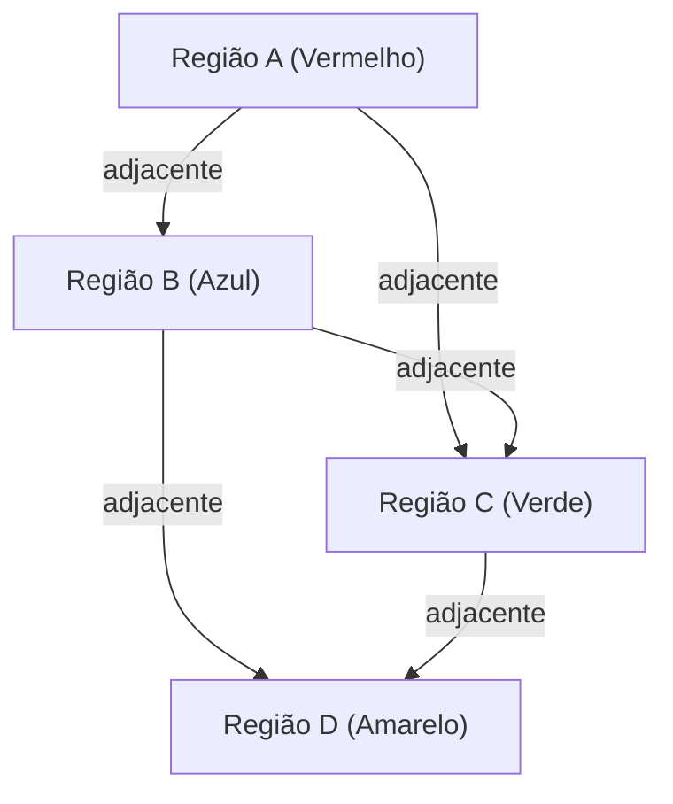

## 1. O que é o Teorema das Quatro Cores?

O [Teorema das Quatro Cores (Four Color Theorem)](https://kenji.blog/p/four-color-theorem/) é um dos problemas mais famosos e fascinantes da matemática, especialmente na teoria dos grafos e topologia. Sua afirmação é muito simples, tão intuitiva que até um estudante do ensino fundamental pode entender. Ele afirma que "qualquer mapa em um plano pode ser colorido de tal forma que regiões adjacentes tenham cores diferentes usando no máximo **4 cores**".

O termo "adjacentes" aqui refere-se ao estado de compartilhar uma fronteira, e não apenas um ponto. Se as regiões se tocarem apenas por um ponto, não há problema em colori-las com a mesma cor. Esta hipótese intuitiva foi levantada pela primeira vez em 1852 por Francis Guthrie. Ao colorir um mapa da Inglaterra, ele percebeu que não importava quão complexas fossem as fronteiras, bastavam 4 cores para colorir o mapa.

## 2. Contexto Histórico do Teorema das Quatro Cores

Depois que Francis Guthrie notou esse problema, ele o comunicou ao seu irmão, Frederick Guthrie, que era matemático. Frederick, por sua vez, apresentou o problema a seu mentor, Augustus De Morgan. De Morgan ficou surpreso com a simplicidade do problema contrastando com a extrema dificuldade de prová-lo, e começou a discuti-lo com outros matemáticos.

Em 1878, Arthur Cayley apresentou oficialmente este problema na Sociedade Matemática de Londres, o que o tornou amplamente conhecido na comunidade matemática. Muitos matemáticos brilhantes tentaram resolver este problema, mas o caminho para uma prova completa provou ser muito mais árduo do que se imaginava.

## 3. A Prova de Kempe e o Contraexemplo de Heawood

Em 1879, um matemático chamado Alfred Kempe publicou uma prova para o Teorema das Quatro Cores. Sua prova era muito engenhosa e introduziu o conceito agora conhecido como "Cadeia de Kempe" (Kempe chain). A prova de Kempe foi amplamente aceita, e por mais de 10 anos considerou-se que o problema das quatro cores estava resolvido.

No entanto, em 1890, Percy Heawood descobriu uma falha fatal na prova de Kempe. Enquanto Heawood apontou o erro na lógica de Kempe, ele também aplicou o método de Kempe para provar de forma brilhante o "Teorema das Cinco Cores", afirmando que "qualquer mapa pode ser colorido usando **5 cores**". O problema das quatro cores ressurgiu novamente como um problema não resolvido.

## 4. Transformação em Teoria dos Grafos

Para tratar matematicamente e com rigor o problema das quatro cores, o problema é traduzido para a linguagem da teoria dos grafos. Cada região no mapa é considerada um "Vértice" (Vertex), e regiões que compartilham uma fronteira são conectadas por uma "Aresta" (Edge). O grafo construído desta maneira é chamado de "Grafo Planar" (Planar Graph).

Um grafo planar é um grafo que pode ser desenhado num plano sem que as arestas se cruzem. O problema das quatro cores se reduz ao problema em que "os vértices de todos os grafos planares podem ser coloridos com **4 cores** de modo que vértices adjacentes tenham cores diferentes".

Expressando usando fórmulas matemáticas, trata-se de mostrar que para um grafo $G = (V, E)$, existe uma função de coloração $c: V \rightarrow \{1, 2, 3, 4\}$ tal que para todas as arestas $(u, v) \in E$, tem-se $c(u) \neq c(v)$.

Aqui, o teorema poliedral de Euler $V - E + F = 2$ ($V$ é o número de vértices, $E$ é o número de arestas, $F$ é o número de faces) desempenha um papel importante na investigação das propriedades dos grafos planares.

## 5. O Impacto da Prova por Computador

Em 1976, Kenneth Appel e Wolfgang Haken da Universidade de Illinois finalmente provaram o Teorema das Quatro Cores. No entanto, seu método de prova gerou grande controvérsia na comunidade matemática. Eles reduziram a prova do problema à verificação de um número finito (finalmente 1936) de padrões chamados "conjunto inevitável" (Unavoidable set), e usaram os supercomputadores da época para calcular que todos esses padrões eram coloríveis com 4 cores (redutibilidade: Reducibility).

Como o volume de cálculos era tão colossal que seria impossível para os humanos verificar todos os processos de cálculo manualmente, gerou um debate filosófico: "Isto pode ser realmente chamado de prova matemática?".

## 6. Refinamento da Prova e Perspectivas Modernas

Em 1997, Neil Robertson e outros refinaram a prova de Appel e Haken, e o número de conjuntos inevitáveis foi reduzido para 633. Além disso, em 2005, Georges Gonthier concluiu uma prova formal completa do teorema das quatro cores usando o assistente de prova de teoremas Coq. Com isso, a possibilidade de erros devido a bugs de programas de computador tornou-se extremamente baixa, e a validade da prova tornou-se inabalável.

Atualmente, provas assistidas por computador são amplamente reconhecidas como uma ferramenta poderosa em matemática e têm contribuído para resolver outros problemas difíceis, como a prova da conjectura de Kepler.

## 7. Conclusão

O Teorema das Quatro Cores é o melhor exemplo para mostrar "quão profundas e complexas estruturas matemáticas um problema aparentemente simples pode esconder". Começando como uma curiosidade lúdica de colorir mapas, este problema desenvolveu a teoria dos grafos e, além disso, teve um impacto imensurável ao transformar a própria natureza das provas matemáticas.

A exploração deste problema nos ensina quão poderosa é a intuição humana, e quanto esforço e novas tecnologias são necessários para prová-la rigorosamente.

## 1. O que é o Teorema das Quatro Cores?

O [Teorema das Quatro Cores (Four Color Theorem)](https://kenji.blog/p/four-color-theorem/) é um dos problemas mais famosos e fascinantes da matemática, especialmente na teoria dos grafos e topologia. Sua afirmação é muito simples, tão intuitiva que até um estudante do ensino fundamental pode entender. Ele afirma que "qualquer mapa em um plano pode ser colorido de tal forma que regiões adjacentes tenham cores diferentes usando no máximo **4 cores**".

O termo "adjacentes" aqui refere-se ao estado de compartilhar uma fronteira, e não apenas um ponto. Se as regiões se tocarem apenas por um ponto, não há problema em colori-las com a mesma cor. Esta hipótese intuitiva foi levantada pela primeira vez em 1852 por Francis Guthrie. Ao colorir um mapa da Inglaterra, ele percebeu que não importava quão complexas fossem as fronteiras, bastavam 4 cores para colorir o mapa.

## 2. Contexto Histórico do Teorema das Quatro Cores

Depois que Francis Guthrie notou esse problema, ele o comunicou ao seu irmão, Frederick Guthrie, que era matemático. Frederick, por sua vez, apresentou o problema a seu mentor, Augustus De Morgan. De Morgan ficou surpreso com a simplicidade do problema contrastando com a extrema dificuldade de prová-lo, e começou a discuti-lo com outros matemáticos.

Em 1878, Arthur Cayley apresentou oficialmente este problema na Sociedade Matemática de Londres, o que o tornou amplamente conhecido na comunidade matemática. Muitos matemáticos brilhantes tentaram resolver este problema, mas o caminho para uma prova completa provou ser muito mais árduo do que se imaginava.

## 3. A Prova de Kempe e o Contraexemplo de Heawood

Em 1879, um matemático chamado Alfred Kempe publicou uma prova para o Teorema das Quatro Cores. Sua prova era muito engenhosa e introduziu o conceito agora conhecido como "Cadeia de Kempe" (Kempe chain). A prova de Kempe foi amplamente aceita, e por mais de 10 anos considerou-se que o problema das quatro cores estava resolvido.

No entanto, em 1890, Percy Heawood descobriu uma falha fatal na prova de Kempe. Enquanto Heawood apontou o erro na lógica de Kempe, ele também aplicou o método de Kempe para provar de forma brilhante o "Teorema das Cinco Cores", afirmando que "qualquer mapa pode ser colorido usando **5 cores**". O problema das quatro cores ressurgiu novamente como um problema não resolvido.

## 4. Transformação em Teoria dos Grafos

Para tratar matematicamente e com rigor o problema das quatro cores, o problema é traduzido para a linguagem da teoria dos grafos. Cada região no mapa é considerada um "Vértice" (Vertex), e regiões que compartilham uma fronteira são conectadas por uma "Aresta" (Edge). O grafo construído desta maneira é chamado de "Grafo Planar" (Planar Graph).

Um grafo planar é um grafo que pode ser desenhado num plano sem que as arestas se cruzem. O problema das quatro cores se reduz ao problema em que "os vértices de todos os grafos planares podem ser coloridos com **4 cores** de modo que vértices adjacentes tenham cores diferentes".

Expressando usando fórmulas matemáticas, trata-se de mostrar que para um grafo $G = (V, E)$, existe uma função de coloração $c: V \rightarrow \{1, 2, 3, 4\}$ tal que para todas as arestas $(u, v) \in E$, tem-se $c(u) \neq c(v)$.

Aqui, o teorema poliedral de Euler $V - E + F = 2$ ($V$ é o número de vértices, $E$ é o número de arestas, $F$ é o número de faces) desempenha um papel importante na investigação das propriedades dos grafos planares.

## 5. O Impacto da Prova por Computador

Em 1976, Kenneth Appel e Wolfgang Haken da Universidade de Illinois finalmente provaram o Teorema das Quatro Cores. No entanto, seu método de prova gerou grande controvérsia na comunidade matemática. Eles reduziram a prova do problema à verificação de um número finito (finalmente 1936) de padrões chamados "conjunto inevitável" (Unavoidable set), e usaram os supercomputadores da época para calcular que todos esses padrões eram coloríveis com 4 cores (redutibilidade: Reducibility).

Como o volume de cálculos era tão colossal que seria impossível para os humanos verificar todos os processos de cálculo manualmente, gerou um debate filosófico: "Isto pode ser realmente chamado de prova matemática?".

## 6. Refinamento da Prova e Perspectivas Modernas

Em 1997, Neil Robertson e outros refinaram a prova de Appel e Haken, e o número de conjuntos inevitáveis foi reduzido para 633. Além disso, em 2005, Georges Gonthier concluiu uma prova formal completa do teorema das quatro cores usando o assistente de prova de teoremas Coq. Com isso, a possibilidade de erros devido a bugs de programas de computador tornou-se extremamente baixa, e a validade da prova tornou-se inabalável.

Atualmente, provas assistidas por computador são amplamente reconhecidas como uma ferramenta poderosa em matemática e têm contribuído para resolver outros problemas difíceis, como a prova da conjectura de Kepler.

## 7. Conclusão

O Teorema das Quatro Cores é o melhor exemplo para mostrar "quão profundas e complexas estruturas matemáticas um problema aparentemente simples pode esconder". Começando como uma curiosidade lúdica de colorir mapas, este problema desenvolveu a teoria dos grafos e, além disso, teve um impacto imensurável ao transformar a própria natureza das provas matemáticas.

A exploração deste problema nos ensina quão poderosa é a intuição humana, e quanto esforço e novas tecnologias são necessários para prová-la rigorosamente.

## 1. O que é o Teorema das Quatro Cores?

O [Teorema das Quatro Cores (Four Color Theorem)](https://kenji.blog/p/four-color-theorem/) é um dos problemas mais famosos e fascinantes da matemática, especialmente na teoria dos grafos e topologia. Sua afirmação é muito simples, tão intuitiva que até um estudante do ensino fundamental pode entender. Ele afirma que "qualquer mapa em um plano pode ser colorido de tal forma que regiões adjacentes tenham cores diferentes usando no máximo **4 cores**".

O termo "adjacentes" aqui refere-se ao estado de compartilhar uma fronteira, e não apenas um ponto. Se as regiões se tocarem apenas por um ponto, não há problema em colori-las com a mesma cor. Esta hipótese intuitiva foi levantada pela primeira vez em 1852 por Francis Guthrie. Ao colorir um mapa da Inglaterra, ele percebeu que não importava quão complexas fossem as fronteiras, bastavam 4 cores para colorir o mapa.

## 2. Contexto Histórico do Teorema das Quatro Cores

Depois que Francis Guthrie notou esse problema, ele o comunicou ao seu irmão, Frederick Guthrie, que era matemático. Frederick, por sua vez, apresentou o problema a seu mentor, Augustus De Morgan. De Morgan ficou surpreso com a simplicidade do problema contrastando com a extrema dificuldade de prová-lo, e começou a discuti-lo com outros matemáticos.

Em 1878, Arthur Cayley apresentou oficialmente este problema na Sociedade Matemática de Londres, o que o tornou amplamente conhecido na comunidade matemática. Muitos matemáticos brilhantes tentaram resolver este problema, mas o caminho para uma prova completa provou ser muito mais árduo do que se imaginava.

## 3. A Prova de Kempe e o Contraexemplo de Heawood

Em 1879, um matemático chamado Alfred Kempe publicou uma prova para o Teorema das Quatro Cores. Sua prova era muito engenhosa e introduziu o conceito agora conhecido como "Cadeia de Kempe" (Kempe chain). A prova de Kempe foi amplamente aceita, e por mais de 10 anos considerou-se que o problema das quatro cores estava resolvido.

No entanto, em 1890, Percy Heawood descobriu uma falha fatal na prova de Kempe. Enquanto Heawood apontou o erro na lógica de Kempe, ele também aplicou o método de Kempe para provar de forma brilhante o "Teorema das Cinco Cores", afirmando que "qualquer mapa pode ser colorido usando **5 cores**". O problema das quatro cores ressurgiu novamente como um problema não resolvido.

## 4. Transformação em Teoria dos Grafos

Para tratar matematicamente e com rigor o problema das quatro cores, o problema é traduzido para a linguagem da teoria dos grafos. Cada região no mapa é considerada um "Vértice" (Vertex), e regiões que compartilham uma fronteira são conectadas por uma "Aresta" (Edge). O grafo construído desta maneira é chamado de "Grafo Planar" (Planar Graph).

Um grafo planar é um grafo que pode ser desenhado num plano sem que as arestas se cruzem. O problema das quatro cores se reduz ao problema em que "os vértices de todos os grafos planares podem ser coloridos com **4 cores** de modo que vértices adjacentes tenham cores diferentes".

Expressando usando fórmulas matemáticas, trata-se de mostrar que para um grafo $G = (V, E)$, existe uma função de coloração $c: V \rightarrow \{1, 2, 3, 4\}$ tal que para todas as arestas $(u, v) \in E$, tem-se $c(u) \neq c(v)$.

Aqui, o teorema poliedral de Euler $V - E + F = 2$ ($V$ é o número de vértices, $E$ é o número de arestas, $F$ é o número de faces) desempenha um papel importante na investigação das propriedades dos grafos planares.

## 5. O Impacto da Prova por Computador

Em 1976, Kenneth Appel e Wolfgang Haken da Universidade de Illinois finalmente provaram o Teorema das Quatro Cores. No entanto, seu método de prova gerou grande controvérsia na comunidade matemática. Eles reduziram a prova do problema à verificação de um número finito (finalmente 1936) de padrões chamados "conjunto inevitável" (Unavoidable set), e usaram os supercomputadores da época para calcular que todos esses padrões eram coloríveis com 4 cores (redutibilidade: Reducibility).

Como o volume de cálculos era tão colossal que seria impossível para os humanos verificar todos os processos de cálculo manualmente, gerou um debate filosófico: "Isto pode ser realmente chamado de prova matemática?".

## 6. Refinamento da Prova e Perspectivas Modernas

Em 1997, Neil Robertson e outros refinaram a prova de Appel e Haken, e o número de conjuntos inevitáveis foi reduzido para 633. Além disso, em 2005, Georges Gonthier concluiu uma prova formal completa do teorema das quatro cores usando o assistente de prova de teoremas Coq. Com isso, a possibilidade de erros devido a bugs de programas de computador tornou-se extremamente baixa, e a validade da prova tornou-se inabalável.

Atualmente, provas assistidas por computador são amplamente reconhecidas como uma ferramenta poderosa em matemática e têm contribuído para resolver outros problemas difíceis, como a prova da conjectura de Kepler.

## 7. Conclusão

O Teorema das Quatro Cores é o melhor exemplo para mostrar "quão profundas e complexas estruturas matemáticas um problema aparentemente simples pode esconder". Começando como uma curiosidade lúdica de colorir mapas, este problema desenvolveu a teoria dos grafos e, além disso, teve um impacto imensurável ao transformar a própria natureza das provas matemáticas.

A exploração deste problema nos ensina quão poderosa é a intuição humana, e quanto esforço e novas tecnologias são necessários para prová-la rigorosamente.

## 1. O que é o Teorema das Quatro Cores?

O [Teorema das Quatro Cores (Four Color Theorem)](https://kenji.blog/p/four-color-theorem/) é um dos problemas mais famosos e fascinantes da matemática, especialmente na teoria dos grafos e topologia. Sua afirmação é muito simples, tão intuitiva que até um estudante do ensino fundamental pode entender. Ele afirma que "qualquer mapa em um plano pode ser colorido de tal forma que regiões adjacentes tenham cores diferentes usando no máximo **4 cores**".

O termo "adjacentes" aqui refere-se ao estado de compartilhar uma fronteira, e não apenas um ponto. Se as regiões se tocarem apenas por um ponto, não há problema em colori-las com a mesma cor. Esta hipótese intuitiva foi levantada pela primeira vez em 1852 por Francis Guthrie. Ao colorir um mapa da Inglaterra, ele percebeu que não importava quão complexas fossem as fronteiras, bastavam 4 cores para colorir o mapa.

## 2. Contexto Histórico do Teorema das Quatro Cores

Depois que Francis Guthrie notou esse problema, ele o comunicou ao seu irmão, Frederick Guthrie, que era matemático. Frederick, por sua vez, apresentou o problema a seu mentor, Augustus De Morgan. De Morgan ficou surpreso com a simplicidade do problema contrastando com a extrema dificuldade de prová-lo, e começou a discuti-lo com outros matemáticos.

Em 1878, Arthur Cayley apresentou oficialmente este problema na Sociedade Matemática de Londres, o que o tornou amplamente conhecido na comunidade matemática. Muitos matemáticos brilhantes tentaram resolver este problema, mas o caminho para uma prova completa provou ser muito mais árduo do que se imaginava.

## 3. A Prova de Kempe e o Contraexemplo de Heawood

Em 1879, um matemático chamado Alfred Kempe publicou uma prova para o Teorema das Quatro Cores. Sua prova era muito engenhosa e introduziu o conceito agora conhecido como "Cadeia de Kempe" (Kempe chain). A prova de Kempe foi amplamente aceita, e por mais de 10 anos considerou-se que o problema das quatro cores estava resolvido.

No entanto, em 1890, Percy Heawood descobriu uma falha fatal na prova de Kempe. Enquanto Heawood apontou o erro na lógica de Kempe, ele também aplicou o método de Kempe para provar de forma brilhante o "Teorema das Cinco Cores", afirmando que "qualquer mapa pode ser colorido usando **5 cores**". O problema das quatro cores ressurgiu novamente como um problema não resolvido.

## 4. Transformação em Teoria dos Grafos

Para tratar matematicamente e com rigor o problema das quatro cores, o problema é traduzido para a linguagem da teoria dos grafos. Cada região no mapa é considerada um "Vértice" (Vertex), e regiões que compartilham uma fronteira são conectadas por uma "Aresta" (Edge). O grafo construído desta maneira é chamado de "Grafo Planar" (Planar Graph).

Um grafo planar é um grafo que pode ser desenhado num plano sem que as arestas se cruzem. O problema das quatro cores se reduz ao problema em que "os vértices de todos os grafos planares podem ser coloridos com **4 cores** de modo que vértices adjacentes tenham cores diferentes".

Expressando usando fórmulas matemáticas, trata-se de mostrar que para um grafo $G = (V, E)$, existe uma função de coloração $c: V \rightarrow \{1, 2, 3, 4\}$ tal que para todas as arestas $(u, v) \in E$, tem-se $c(u) \neq c(v)$.

Aqui, o teorema poliedral de Euler $V - E + F = 2$ ($V$ é o número de vértices, $E$ é o número de arestas, $F$ é o número de faces) desempenha um papel importante na investigação das propriedades dos grafos planares.

## 5. O Impacto da Prova por Computador

Em 1976, Kenneth Appel e Wolfgang Haken da Universidade de Illinois finalmente provaram o Teorema das Quatro Cores. No entanto, seu método de prova gerou grande controvérsia na comunidade matemática. Eles reduziram a prova do problema à verificação de um número finito (finalmente 1936) de padrões chamados "conjunto inevitável" (Unavoidable set), e usaram os supercomputadores da época para calcular que todos esses padrões eram coloríveis com 4 cores (redutibilidade: Reducibility).

Como o volume de cálculos era tão colossal que seria impossível para os humanos verificar todos os processos de cálculo manualmente, gerou um debate filosófico: "Isto pode ser realmente chamado de prova matemática?".

## 6. Refinamento da Prova e Perspectivas Modernas

Em 1997, Neil Robertson e outros refinaram a prova de Appel e Haken, e o número de conjuntos inevitáveis foi reduzido para 633. Além disso, em 2005, Georges Gonthier concluiu uma prova formal completa do teorema das quatro cores usando o assistente de prova de teoremas Coq. Com isso, a possibilidade de erros devido a bugs de programas de computador tornou-se extremamente baixa, e a validade da prova tornou-se inabalável.

Atualmente, provas assistidas por computador são amplamente reconhecidas como uma ferramenta poderosa em matemática e têm contribuído para resolver outros problemas difíceis, como a prova da conjectura de Kepler.

## 7. Conclusão

O Teorema das Quatro Cores é o melhor exemplo para mostrar "quão profundas e complexas estruturas matemáticas um problema aparentemente simples pode esconder". Começando como uma curiosidade lúdica de colorir mapas, este problema desenvolveu a teoria dos grafos e, além disso, teve um impacto imensurável ao transformar a própria natureza das provas matemáticas.

A exploração deste problema nos ensina quão poderosa é a intuição humana, e quanto esforço e novas tecnologias são necessários para prová-la rigorosamente.
