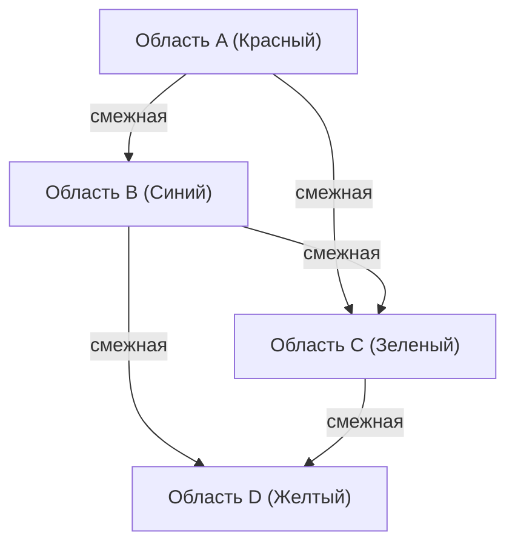

## 1. Что такое проблема четырех красок?

[Проблема четырех красок (Four Color Theorem)](https://kenji.blog/ru/p/four-color-theorem/) — одна из самых известных и увлекательных проблем в математике, особенно в теории графов и топологии. Ее утверждение предельно простое и интуитивно понятное даже школьнику: «Для раскраски любой карты на плоскости так, чтобы соседние области имели разные цвета, достаточно максимум ** 4 цветов **».

Здесь под словом «соседние» понимаются области, имеющие общую границу, а не только точку соприкосновения. Если они соприкасаются только в точке, их можно раскрасить одним цветом без проблем. Эта интуитивная гипотеза была впервые выдвинута в 1852 году Фрэнсисом Гатри (Francis Guthrie). Раскрашивая карту графств Англии, он заметил, что какими бы сложными ни были границы графств, для их раскраски достаточно 4 цветов.

## 2. Исторический контекст проблемы четырех красок

После того как Фрэнсис Гатри заметил эту проблему, он рассказал о ней своему брату-математику Фредерику Гатри. Фредерик, в свою очередь, представил проблему своему учителю Огастесу де Моргану (Augustus De Morgan). Де Морган был удивлен простотой проблемы в сочетании с тем, что ее доказательство оказалось крайне сложным, и начал обсуждать ее с другими математиками.

В 1878 году Артур Кэли (Arthur Cayley) официально представил эту проблему Лондонскому математическому обществу, благодаря чему она стала широко известна в математическом мире. Многие выдающиеся математики пытались решить ее, но путь к полному доказательству оказался намного сложнее, чем можно было представить.

## 3. Доказательство Кемпе и контрпример Хивуда

В 1879 году математик по имени Альфред Кемпе (Alfred Kempe) опубликовал доказательство проблемы четырех красок. Его доказательство было очень остроумным и ввело концепцию, которая сейчас называется «цепи Кемпе» (Kempe chain). Доказательство Кемпе было широко принято, и более 10 лет считалось, что проблема четырех красок решена.

Однако в 1890 году Перси Хивуд (Percy Heawood) обнаружил фатальную ошибку в доказательстве Кемпе. Указывая на логическую ошибку Кемпе, Хивуд, тем не менее, блестяще применил метод Кемпе для доказательства «Теоремы о пяти красках», утверждающей, что «любую карту можно раскрасить ** 5 цветами **». Таким образом, проблема четырех красок снова стала нерешенной задачей.

## 4. Переход к теории графов

Чтобы математически строго работать с проблемой четырех красок, она была переведена на язык теории графов. Каждая область на карте становится «вершиной» (Vertex), а области, имеющие общую границу, соединяются «ребром» (Edge). Полученный таким образом граф называется «планарным графом» (Planar [Graph](https://kenji.blog/ru/p/tree-graph-data-structures-search-dfs-bfs-dijkstra/)).

Планарный граф — это граф, который можно нарисовать на плоскости без пересечения ребер. Проблема четырех красок сводится к задаче: «все вершины любого планарного графа могут быть раскрашены в ** 4 цвета ** так, чтобы соседние вершины имели разные цвета».

Выражая это в виде формулы, мы должны показать, что для графа $G = (V, E)$ существует функция раскраски $c: V \rightarrow \{1, 2, 3, 4\}$, такая что для всех ребер $(u, v) \in E$ выполняется условие $c(u) \neq c(v)$.

Здесь важную роль в изучении свойств планарных графов играет формула Эйлера для многогранников $V - E + F = 2$ (где $V$ — количество вершин, $E$ — количество ребер, $F$ — количество граней).

## 5. Потрясение от компьютерного доказательства

В 1976 году Кеннет Аппель (Kenneth Appel) и Вольфганг Хакен (Wolfgang Haken) из Иллинойсского университета наконец доказали проблему четырех красок. Однако метод их доказательства вызвал большие споры в математическом сообществе. Они свели доказательство проблемы к проверке конечного числа (в итоге 1936) шаблонов, называемых «неизбежным множеством» (Unavoidable set), и использовали суперкомпьютеры того времени для расчетов, чтобы показать, что все эти шаблоны могут быть раскрашены в 4 цвета (свойство сводимости: Reducibility).

Из-за того, что объем вычислений был настолько огромен, что человек не мог проверить все процессы расчетов вручную, это вызвало философские дискуссии на тему: «Действительно ли это можно назвать математическим доказательством?».

## 6. Усовершенствование доказательства и современный взгляд

В 1997 году Нил Робертсон (Neil Robertson) и его коллеги усовершенствовали доказательство Аппеля и Хакена, сократив количество неизбежных множеств до 633. В 2005 году Жорж Гонтье (Georges Gonthier) завершил полностью формальное доказательство теоремы о четырех красках с использованием системы автоматического доказательства теорем Coq. Благодаря этому вероятность ошибки из-за багов в компьютерной программе стала крайне низкой, а правильность доказательства стала неоспоримой.

В настоящее время компьютерные доказательства широко признаны как мощный инструмент в математике и способствуют решению других сложных проблем, таких как доказательство гипотезы Кеплера.

## 7. Заключение

Проблема четырех красок является лучшим примером того, «как простая на первый взгляд проблема может скрывать в себе глубокую и сложную математическую структуру». Эта проблема, начавшаяся с игривой идеи раскрашивания карт, привела к развитию теории графов и даже изменила саму концепцию математического доказательства, оказав неизмеримое влияние на науку.

Изучение этой проблемы учит нас тому, насколько мощной может быть человеческая интуиция, и как много усилий и новых технологий требуется для ее строгого математического доказательства.

## 1. Что такое проблема четырех красок?

[Проблема четырех красок (Four Color Theorem)](https://kenji.blog/ru/p/four-color-theorem/) — одна из самых известных и увлекательных проблем в математике, особенно в теории графов и топологии. Ее утверждение предельно простое и интуитивно понятное даже школьнику: «Для раскраски любой карты на плоскости так, чтобы соседние области имели разные цвета, достаточно максимум ** 4 цветов **».

Здесь под словом «соседние» понимаются области, имеющие общую границу, а не только точку соприкосновения. Если они соприкасаются только в точке, их можно раскрасить одним цветом без проблем. Эта интуитивная гипотеза была впервые выдвинута в 1852 году Фрэнсисом Гатри (Francis Guthrie). Раскрашивая карту графств Англии, он заметил, что какими бы сложными ни были границы графств, для их раскраски достаточно 4 цветов.

## 2. Исторический контекст проблемы четырех красок

После того как Фрэнсис Гатри заметил эту проблему, он рассказал о ней своему брату-математику Фредерику Гатри. Фредерик, в свою очередь, представил проблему своему учителю Огастесу де Моргану (Augustus De Morgan). Де Морган был удивлен простотой проблемы в сочетании с тем, что ее доказательство оказалось крайне сложным, и начал обсуждать ее с другими математиками.

В 1878 году Артур Кэли (Arthur Cayley) официально представил эту проблему Лондонскому математическому обществу, благодаря чему она стала широко известна в математическом мире. Многие выдающиеся математики пытались решить ее, но путь к полному доказательству оказался намного сложнее, чем можно было представить.

## 3. Доказательство Кемпе и контрпример Хивуда

В 1879 году математик по имени Альфред Кемпе (Alfred Kempe) опубликовал доказательство проблемы четырех красок. Его доказательство было очень остроумным и ввело концепцию, которая сейчас называется «цепи Кемпе» (Kempe chain). Доказательство Кемпе было широко принято, и более 10 лет считалось, что проблема четырех красок решена.

Однако в 1890 году Перси Хивуд (Percy Heawood) обнаружил фатальную ошибку в доказательстве Кемпе. Указывая на логическую ошибку Кемпе, Хивуд, тем не менее, блестяще применил метод Кемпе для доказательства «Теоремы о пяти красках», утверждающей, что «любую карту можно раскрасить ** 5 цветами **». Таким образом, проблема четырех красок снова стала нерешенной задачей.

## 4. Переход к теории графов

Чтобы математически строго работать с проблемой четырех красок, она была переведена на язык теории графов. Каждая область на карте становится «вершиной» (Vertex), а области, имеющие общую границу, соединяются «ребром» (Edge). Полученный таким образом граф называется «планарным графом» (Planar [Graph](https://kenji.blog/ru/p/tree-graph-data-structures-search-dfs-bfs-dijkstra/)).

Планарный граф — это граф, который можно нарисовать на плоскости без пересечения ребер. Проблема четырех красок сводится к задаче: «все вершины любого планарного графа могут быть раскрашены в ** 4 цвета ** так, чтобы соседние вершины имели разные цвета».

Выражая это в виде формулы, мы должны показать, что для графа $G = (V, E)$ существует функция раскраски $c: V \rightarrow \{1, 2, 3, 4\}$, такая что для всех ребер $(u, v) \in E$ выполняется условие $c(u) \neq c(v)$.

Здесь важную роль в изучении свойств планарных графов играет формула Эйлера для многогранников $V - E + F = 2$ (где $V$ — количество вершин, $E$ — количество ребер, $F$ — количество граней).

## 5. Потрясение от компьютерного доказательства

В 1976 году Кеннет Аппель (Kenneth Appel) и Вольфганг Хакен (Wolfgang Haken) из Иллинойсского университета наконец доказали проблему четырех красок. Однако метод их доказательства вызвал большие споры в математическом сообществе. Они свели доказательство проблемы к проверке конечного числа (в итоге 1936) шаблонов, называемых «неизбежным множеством» (Unavoidable set), и использовали суперкомпьютеры того времени для расчетов, чтобы показать, что все эти шаблоны могут быть раскрашены в 4 цвета (свойство сводимости: Reducibility).

Из-за того, что объем вычислений был настолько огромен, что человек не мог проверить все процессы расчетов вручную, это вызвало философские дискуссии на тему: «Действительно ли это можно назвать математическим доказательством?».

## 6. Усовершенствование доказательства и современный взгляд

В 1997 году Нил Робертсон (Neil Robertson) и его коллеги усовершенствовали доказательство Аппеля и Хакена, сократив количество неизбежных множеств до 633. В 2005 году Жорж Гонтье (Georges Gonthier) завершил полностью формальное доказательство теоремы о четырех красках с использованием системы автоматического доказательства теорем Coq. Благодаря этому вероятность ошибки из-за багов в компьютерной программе стала крайне низкой, а правильность доказательства стала неоспоримой.

В настоящее время компьютерные доказательства широко признаны как мощный инструмент в математике и способствуют решению других сложных проблем, таких как доказательство гипотезы Кеплера.

## 7. Заключение

Проблема четырех красок является лучшим примером того, «как простая на первый взгляд проблема может скрывать в себе глубокую и сложную математическую структуру». Эта проблема, начавшаяся с игривой идеи раскрашивания карт, привела к развитию теории графов и даже изменила саму концепцию математического доказательства, оказав неизмеримое влияние на науку.

Изучение этой проблемы учит нас тому, насколько мощной может быть человеческая интуиция, и как много усилий и новых технологий требуется для ее строгого математического доказательства.

## 1. Что такое проблема четырех красок?

[Проблема четырех красок (Four Color Theorem)](https://kenji.blog/ru/p/four-color-theorem/) — одна из самых известных и увлекательных проблем в математике, особенно в теории графов и топологии. Ее утверждение предельно простое и интуитивно понятное даже школьнику: «Для раскраски любой карты на плоскости так, чтобы соседние области имели разные цвета, достаточно максимум ** 4 цветов **».

Здесь под словом «соседние» понимаются области, имеющие общую границу, а не только точку соприкосновения. Если они соприкасаются только в точке, их можно раскрасить одним цветом без проблем. Эта интуитивная гипотеза была впервые выдвинута в 1852 году Фрэнсисом Гатри (Francis Guthrie). Раскрашивая карту графств Англии, он заметил, что какими бы сложными ни были границы графств, для их раскраски достаточно 4 цветов.

## 2. Исторический контекст проблемы четырех красок

После того как Фрэнсис Гатри заметил эту проблему, он рассказал о ней своему брату-математику Фредерику Гатри. Фредерик, в свою очередь, представил проблему своему учителю Огастесу де Моргану (Augustus De Morgan). Де Морган был удивлен простотой проблемы в сочетании с тем, что ее доказательство оказалось крайне сложным, и начал обсуждать ее с другими математиками.

В 1878 году Артур Кэли (Arthur Cayley) официально представил эту проблему Лондонскому математическому обществу, благодаря чему она стала широко известна в математическом мире. Многие выдающиеся математики пытались решить ее, но путь к полному доказательству оказался намного сложнее, чем можно было представить.

## 3. Доказательство Кемпе и контрпример Хивуда

В 1879 году математик по имени Альфред Кемпе (Alfred Kempe) опубликовал доказательство проблемы четырех красок. Его доказательство было очень остроумным и ввело концепцию, которая сейчас называется «цепи Кемпе» (Kempe chain). Доказательство Кемпе было широко принято, и более 10 лет считалось, что проблема четырех красок решена.

Однако в 1890 году Перси Хивуд (Percy Heawood) обнаружил фатальную ошибку в доказательстве Кемпе. Указывая на логическую ошибку Кемпе, Хивуд, тем не менее, блестяще применил метод Кемпе для доказательства «Теоремы о пяти красках», утверждающей, что «любую карту можно раскрасить ** 5 цветами **». Таким образом, проблема четырех красок снова стала нерешенной задачей.

## 4. Переход к теории графов

Чтобы математически строго работать с проблемой четырех красок, она была переведена на язык теории графов. Каждая область на карте становится «вершиной» (Vertex), а области, имеющие общую границу, соединяются «ребром» (Edge). Полученный таким образом граф называется «планарным графом» (Planar [Graph](https://kenji.blog/ru/p/tree-graph-data-structures-search-dfs-bfs-dijkstra/)).

Планарный граф — это граф, который можно нарисовать на плоскости без пересечения ребер. Проблема четырех красок сводится к задаче: «все вершины любого планарного графа могут быть раскрашены в ** 4 цвета ** так, чтобы соседние вершины имели разные цвета».

Выражая это в виде формулы, мы должны показать, что для графа $G = (V, E)$ существует функция раскраски $c: V \rightarrow \{1, 2, 3, 4\}$, такая что для всех ребер $(u, v) \in E$ выполняется условие $c(u) \neq c(v)$.

Здесь важную роль в изучении свойств планарных графов играет формула Эйлера для многогранников $V - E + F = 2$ (где $V$ — количество вершин, $E$ — количество ребер, $F$ — количество граней).

## 5. Потрясение от компьютерного доказательства

В 1976 году Кеннет Аппель (Kenneth Appel) и Вольфганг Хакен (Wolfgang Haken) из Иллинойсского университета наконец доказали проблему четырех красок. Однако метод их доказательства вызвал большие споры в математическом сообществе. Они свели доказательство проблемы к проверке конечного числа (в итоге 1936) шаблонов, называемых «неизбежным множеством» (Unavoidable set), и использовали суперкомпьютеры того времени для расчетов, чтобы показать, что все эти шаблоны могут быть раскрашены в 4 цвета (свойство сводимости: Reducibility).

Из-за того, что объем вычислений был настолько огромен, что человек не мог проверить все процессы расчетов вручную, это вызвало философские дискуссии на тему: «Действительно ли это можно назвать математическим доказательством?».

## 6. Усовершенствование доказательства и современный взгляд

В 1997 году Нил Робертсон (Neil Robertson) и его коллеги усовершенствовали доказательство Аппеля и Хакена, сократив количество неизбежных множеств до 633. В 2005 году Жорж Гонтье (Georges Gonthier) завершил полностью формальное доказательство теоремы о четырех красках с использованием системы автоматического доказательства теорем Coq. Благодаря этому вероятность ошибки из-за багов в компьютерной программе стала крайне низкой, а правильность доказательства стала неоспоримой.

В настоящее время компьютерные доказательства широко признаны как мощный инструмент в математике и способствуют решению других сложных проблем, таких как доказательство гипотезы Кеплера.

## 7. Заключение

Проблема четырех красок является лучшим примером того, «как простая на первый взгляд проблема может скрывать в себе глубокую и сложную математическую структуру». Эта проблема, начавшаяся с игривой идеи раскрашивания карт, привела к развитию теории графов и даже изменила саму концепцию математического доказательства, оказав неизмеримое влияние на науку.

Изучение этой проблемы учит нас тому, насколько мощной может быть человеческая интуиция, и как много усилий и новых технологий требуется для ее строгого математического доказательства.
\n\n\n## 1. Что такое проблема четырех красок?## 7. Заключение

Проблема четырех красок является лучшим примером того, «как простая на первый взгляд проблема может скрывать в себе глубокую и сложную математическую структуру». Эта проблема, начавшаяся с игривой идеи раскрашивания карт, привела к развитию теории графов и даже изменила саму концепцию математического доказательства, оказав неизмеримое влияние на науку.

Изучение этой проблемы учит нас тому, насколько мощной может быть человеческая интуиция, и как много усилий и новых технологий требуется для ее строгого математического доказательства.
\n\n\n## 1. Что такое проблема четырех красок?

[Проблема четырех красок (Four Color Theorem)](https://kenji.blog/ru/p/four-color-theorem/) — одна из самых известных и увлекательных проблем в математике, особенно в теории графов и топологии. Ее утверждение предельно простое и интуитивно понятное даже школьнику: «Для раскраски любой карты на плоскости так, чтобы соседние области имели разные цвета, достаточно максимум ** 4 цветов **».

Здесь под словом «соседние» понимаются области, имеющие общую границу, а не только точку соприкосновения. Если они соприкасаются только в точке, их можно раскрасить одним цветом без проблем. Эта интуитивная гипотеза была впервые выдвинута в 1852 году Фрэнсисом Гатри (Francis Guthrie). Раскрашивая карту графств Англии, он заметил, что какими бы сложными ни были границы графств, для их раскраски достаточно 4 цветов.

## 2. Исторический контекст проблемы четырех красок

После того как Фрэнсис Гатри заметил эту проблему, он рассказал о ней своему брату-математику Фредерику Гатри. Фредерик, в свою очередь, представил проблему своему учителю Огастесу де Моргану (Augustus De Morgan). Де Морган был удивлен простотой проблемы в сочетании с тем, что ее доказательство оказалось крайне сложным, и начал обсуждать ее с другими математиками.

В 1878 году Артур Кэли (Arthur Cayley) официально представил эту проблему Лондонскому математическому обществу, благодаря чему она стала широко известна в математическом мире. Многие выдающиеся математики пытались решить ее, но путь к полному доказательству оказался намного сложнее, чем можно было представить.

## 3. Доказательство Кемпе и контрпример Хивуда

В 1879 году математик по имени Альфред Кемпе (Alfred Kempe) опубликовал доказательство проблемы четырех красок. Его доказательство было очень остроумным и ввело концепцию, которая сейчас называется «цепи Кемпе» (Kempe chain). Доказательство Кемпе было широко принято, и более 10 лет считалось, что проблема четырех красок решена.

Однако в 1890 году Перси Хивуд (Percy Heawood) обнаружил фатальную ошибку в доказательстве Кемпе. Указывая на логическую ошибку Кемпе, Хивуд, тем не менее, блестяще применил метод Кемпе для доказательства «Теоремы о пяти красках», утверждающей, что «любую карту можно раскрасить ** 5 цветами **». Таким образом, проблема четырех красок снова стала нерешенной задачей.

## 4. Переход к теории графов

Чтобы математически строго работать с проблемой четырех красок, она была переведена на язык теории графов. Каждая область на карте становится «вершиной» (Vertex), а области, имеющие общую границу, соединяются «ребром» (Edge). Полученный таким образом граф называется «планарным графом» (Planar [Graph](https://kenji.blog/ru/p/tree-graph-data-structures-search-dfs-bfs-dijkstra/)).

Планарный граф — это граф, который можно нарисовать на плоскости без пересечения ребер. Проблема четырех красок сводится к задаче: «все вершины любого планарного графа могут быть раскрашены в ** 4 цвета ** так, чтобы соседние вершины имели разные цвета».

Выражая это в виде формулы, мы должны показать, что для графа $G = (V, E)$ существует функция раскраски $c: V \rightarrow \{1, 2, 3, 4\}$, такая что для всех ребер $(u, v) \in E$ выполняется условие $c(u) \neq c(v)$.

Здесь важную роль в изучении свойств планарных графов играет формула Эйлера для многогранников $V - E + F = 2$ (где $V$ — количество вершин, $E$ — количество ребер, $F$ — количество граней).

## 5. Потрясение от компьютерного доказательства

В 1976 году Кеннет Аппель (Kenneth Appel) и Вольфганг Хакен (Wolfgang Haken) из Иллинойсского университета наконец доказали проблему четырех красок. Однако метод их доказательства вызвал большие споры в математическом сообществе. Они свели доказательство проблемы к проверке конечного числа (в итоге 1936) шаблонов, называемых «неизбежным множеством» (Unavoidable set), и использовали суперкомпьютеры того времени для расчетов, чтобы показать, что все эти шаблоны могут быть раскрашены в 4 цвета (свойство сводимости: Reducibility).

Из-за того, что объем вычислений был настолько огромен, что человек не мог проверить все процессы расчетов вручную, это вызвало философские дискуссии на тему: «Действительно ли это можно назвать математическим доказательством?».

## 6. Усовершенствование доказательства и современный взгляд

В 1997 году Нил Робертсон (Neil Robertson) и его коллеги усовершенствовали доказательство Аппеля и Хакена, сократив количество неизбежных множеств до 633. В 2005 году Жорж Гонтье (Georges Gonthier) завершил полностью формальное доказательство теоремы о четырех красках с использованием системы автоматического доказательства теорем Coq. Благодаря этому вероятность ошибки из-за багов в компьютерной программе стала крайне низкой, а правильность доказательства стала неоспоримой.

В настоящее время компьютерные доказательства широко признаны как мощный инструмент в математике и способствуют решению других сложных проблем, таких как доказательство гипотезы Кеплера.

## 7. Заключение

Проблема четырех красок является лучшим примером того, «как простая на первый взгляд проблема может скрывать в себе глубокую и сложную математическую структуру». Эта проблема, начавшаяся с игривой идеи раскрашивания карт, привела к развитию теории графов и даже изменила саму концепцию математического доказательства, оказав неизмеримое влияние на науку.

Изучение этой проблемы учит нас тому, насколько мощной может быть человеческая интуиция, и как много усилий и новых технологий требуется для ее строгого математического доказательства.\n