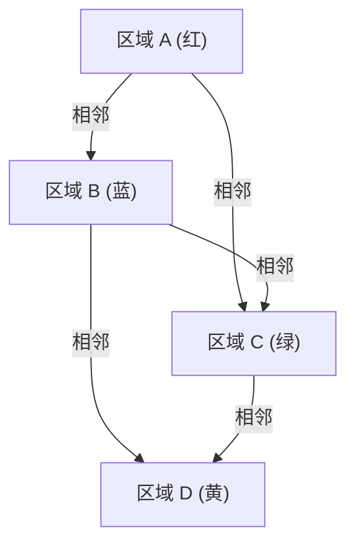

## 1. 什么是四色问题？

四色问题（Four Color Theorem）是数学领域，尤其是图论和拓扑学中最著名、最引人入胜的问题之一。它的主张非常简单，简单到连小学生都能凭借直觉理解：“任何平面上的地图，为了使相邻的区域颜色不同，最多只需要 **4色** 就足够了。”

这里所说的“相邻”，是指共享边界线，而不是仅仅在一个点上相交。如果只是在点上相接，涂上相同的颜色也是没有问题的。这个直观的假说最早由弗朗西斯·格思里（Francis Guthrie）在1852年提出。他在给英国的地图着色时发现，无论各郡的边界线多么复杂，只要有4种颜色就能区分开来。

## 2. 四色问题的历史背景

弗朗西斯·格思里发现这个问题后，他把这个问题告诉了身为数学家的弟弟弗雷德里克·格思里。弗雷德里克随后向他的恩师奥古斯都·德·摩根（Augustus De Morgan）提出了这个问题。德·摩根对这个问题的简单性与其证明的极度困难形成的反差感到惊讶，并开始与其他数学家进行讨论。

1878年，阿瑟·凯莱（Arthur Cayley）在伦敦数学学会上正式提出了这个问题，从而使其在数学界广为人知。许多杰出的数学家都试图解决这个问题，但通向完整证明的道路比想象中要艰难得多。

## 3. 肯普的证明与希伍德的反例

1879年，一位名叫阿尔弗雷德·肯普（Alfred Kempe）的数学家发表了四色问题的证明。他的证明非常巧妙，引入了现在被称为“肯普链（Kempe chain）”的概念。肯普的证明被广泛接受，十多年来，四色问题一直被认为是已经解决的。

然而在1890年，珀西·希伍德（Percy Heawood）发现了肯普证明中的一个致命缺陷。希伍德在指出肯普逻辑错误的同时，应用肯普的方法出色地证明了“任何地图只要有 **5色** 就能着色”的“五色定理”。于是，四色问题再次作为未解决的难题挡在了人们面前。

## 4. 转换为图论

为了在数学上严谨地处理四色问题，问题被转化为图论的语言。将地图上的每个区域作为“顶点（Vertex）”，将共享边界线的区域之间用“边（Edge）”连接起来。这样构成的图被称为“平面图（Planar Graph）”。

平面图是指可以在平面上绘制且边不相交的图。四色问题归结为这样一个问题：“所有平面图的顶点，都能用 **4色** 进行着色，使得相邻的顶点颜色不同。”

用数学公式表达的话，就是证明在图 $G = (V, E)$ 中，存在着色函数 $c: V \rightarrow \{1, 2, 3, 4\}$，使得对于所有的边 $(u, v) \in E$，都有 $c(u) \neq c(v)$。

这里，欧拉的多面体定理 $V - E + F = 2$ （$V$ 是顶点数，$E$ 是边数，$F$ 是面数）在研究平面图的性质时发挥了重要作用。

## 5. 计算机辅助证明的冲击

1976年，伊利诺伊大学的肯尼斯·阿佩尔（Kenneth Appel）和沃尔夫冈·哈肯（Wolfgang Haken）终于证明了四色问题。然而，他们的证明方法在数学界引起了巨大的争议。他们将问题的证明归结为对有限个（最终是1936个）被称为“不可避免集（Unavoidable set）”的模式的确认，并利用当时的超级计算机计算出这些模式都可以用4种颜色着色（可约性：Reducibility）。

由于计算量极其庞大，人类根本不可能手工验证所有的计算过程，因此引发了“这到底能不能称为数学证明？”的哲学讨论。

## 6. 证明的完善与现代视角

1997年，尼尔·罗伯逊（Neil Robertson）等人对阿佩尔和哈肯的证明进行了改进，将不可避免集的数量减少到了633个。到了2005年，乔治·贡提耶（Georges Gonthier）利用定理证明辅助系统 Coq 完成了[四色定理](https://kenji.blog/p/four-color-theorem/)的完整形式化证明。这使得由于计算机程序的 bug 而导致错误的可能性降到了极低，证明的正确性变得不可动摇。

现在，计算机辅助证明已被广泛认可为数学的强大工具，并为解决其他难题（如开普勒猜想的证明）做出了贡献。

## 7. 结语

四色问题是展示“看似简单的问题，其背后隐藏着多么深奥复杂的数学结构”的最佳例子。这个从地图着色这种游戏心态开始的问题，推动了图论的发展，甚至改变了数学证明本身的形态，产生了不可估量的影响。

对这个问题的探索告诉我们，人类的直觉是多么强大，而为了严格证明它，又需要付出多少努力和新技术。

## 1. 什么是四色问题？

四色问题（Four Color Theorem）是数学领域，尤其是图论和拓扑学中最著名、最引人入胜的问题之一。它的主张非常简单，简单到连小学生都能凭借直觉理解：“任何平面上的地图，为了使相邻的区域颜色不同，最多只需要 **4色** 就足够了。”

这里所说的“相邻”，是指共享边界线，而不是仅仅在一个点上相交。如果只是在点上相接，涂上相同的颜色也是没有问题的。这个直观的假说最早由弗朗西斯·格思里（Francis Guthrie）在1852年提出。他在给英国的地图着色时发现，无论各郡的边界线多么复杂，只要有4种颜色就能区分开来。

## 2. 四色问题的历史背景

弗朗西斯·格思里发现这个问题后，他把这个问题告诉了身为数学家的弟弟弗雷德里克·格思里。弗雷德里克随后向他的恩师奥古斯都·德·摩根（Augustus De Morgan）提出了这个问题。德·摩根对这个问题的简单性与其证明的极度困难形成的反差感到惊讶，并开始与其他数学家进行讨论。

1878年，阿瑟·凯莱（Arthur Cayley）在伦敦数学学会上正式提出了这个问题，从而使其在数学界广为人知。许多杰出的数学家都试图解决这个问题，但通向完整证明的道路比想象中要艰难得多。

## 3. 肯普的证明与希伍德的反例

1879年，一位名叫阿尔弗雷德·肯普（Alfred Kempe）的数学家发表了四色问题的证明。他的证明非常巧妙，引入了现在被称为“肯普链（Kempe chain）”的概念。肯普的证明被广泛接受，十多年来，四色问题一直被认为是已经解决的。

然而在1890年，珀西·希伍德（Percy Heawood）发现了肯普证明中的一个致命缺陷。希伍德在指出肯普逻辑错误的同时，应用肯普的方法出色地证明了“任何地图只要有 **5色** 就能着色”的“五色定理”。于是，四色问题再次作为未解决的难题挡在了人们面前。

## 4. 转换为图论

为了在数学上严谨地处理四色问题，问题被转化为图论的语言。将地图上的每个区域作为“顶点（Vertex）”，将共享边界线的区域之间用“边（Edge）”连接起来。这样构成的图被称为“平面图（Planar Graph）”。

平面图是指可以在平面上绘制且边不相交的图。四色问题归结为这样一个问题：“所有平面图的顶点，都能用 **4色** 进行着色，使得相邻的顶点颜色不同。”

用数学公式表达的话，就是证明在图 $G = (V, E)$ 中，存在着色函数 $c: V \rightarrow \{1, 2, 3, 4\}$，使得对于所有的边 $(u, v) \in E$，都有 $c(u) \neq c(v)$。

这里，欧拉的多面体定理 $V - E + F = 2$ （$V$ 是顶点数，$E$ 是边数，$F$ 是面数）在研究平面图的性质时发挥了重要作用。

## 5. 计算机辅助证明的冲击

1976年，伊利诺伊大学的肯尼斯·阿佩尔（Kenneth Appel）和沃尔夫冈·哈肯（Wolfgang Haken）终于证明了四色问题。然而，他们的证明方法在数学界引起了巨大的争议。他们将问题的证明归结为对有限个（最终是1936个）被称为“不可避免集（Unavoidable set）”的模式的确认，并利用当时的超级计算机计算出这些模式都可以用4种颜色着色（可约性：Reducibility）。

由于计算量极其庞大，人类根本不可能手工验证所有的计算过程，因此引发了“这到底能不能称为数学证明？”的哲学讨论。

## 6. 证明的完善与现代视角

1997年，尼尔·罗伯逊（Neil Robertson）等人对阿佩尔和哈肯的证明进行了改进，将不可避免集的数量减少到了633个。到了2005年，乔治·贡提耶（Georges Gonthier）利用定理证明辅助系统 Coq 完成了[四色定理](https://kenji.blog/p/four-color-theorem/)的完整形式化证明。这使得由于计算机程序的 bug 而导致错误的可能性降到了极低，证明的正确性变得不可动摇。

现在，计算机辅助证明已被广泛认可为数学的强大工具，并为解决其他难题（如开普勒猜想的证明）做出了贡献。

## 7. 结语

四色问题是展示“看似简单的问题，其背后隐藏着多么深奥复杂的数学结构”的最佳例子。这个从地图着色这种游戏心态开始的问题，推动了图论的发展，甚至改变了数学证明本身的形态，产生了不可估量的影响。

对这个问题的探索告诉我们，人类的直觉是多么强大，而为了严格证明它，又需要付出多少努力和新技术。

## 1. 什么是四色问题？

四色问题（Four Color Theorem）是数学领域，尤其是图论和拓扑学中最著名、最引人入胜的问题之一。它的主张非常简单，简单到连小学生都能凭借直觉理解：“任何平面上的地图，为了使相邻的区域颜色不同，最多只需要 **4色** 就足够了。”

这里所说的“相邻”，是指共享边界线，而不是仅仅在一个点上相交。如果只是在点上相接，涂上相同的颜色也是没有问题的。这个直观的假说最早由弗朗西斯·格思里（Francis Guthrie）在1852年提出。他在给英国的地图着色时发现，无论各郡的边界线多么复杂，只要有4种颜色就能区分开来。

## 2. 四色问题的历史背景

弗朗西斯·格思里发现这个问题后，他把这个问题告诉了身为数学家的弟弟弗雷德里克·格思里。弗雷德里克随后向他的恩师奥古斯都·德·摩根（Augustus De Morgan）提出了这个问题。德·摩根对这个问题的简单性与其证明的极度困难形成的反差感到惊讶，并开始与其他数学家进行讨论。

1878年，阿瑟·凯莱（Arthur Cayley）在伦敦数学学会上正式提出了这个问题，从而使其在数学界广为人知。许多杰出的数学家都试图解决这个问题，但通向完整证明的道路比想象中要艰难得多。

## 3. 肯普的证明与希伍德的反例

1879年，一位名叫阿尔弗雷德·肯普（Alfred Kempe）的数学家发表了四色问题的证明。他的证明非常巧妙，引入了现在被称为“肯普链（Kempe chain）”的概念。肯普的证明被广泛接受，十多年来，四色问题一直被认为是已经解决的。

然而在1890年，珀西·希伍德（Percy Heawood）发现了肯普证明中的一个致命缺陷。希伍德在指出肯普逻辑错误的同时，应用肯普的方法出色地证明了“任何地图只要有 **5色** 就能着色”的“五色定理”。于是，四色问题再次作为未解决的难题挡在了人们面前。

## 4. 转换为图论

为了在数学上严谨地处理四色问题，问题被转化为图论的语言。将地图上的每个区域作为“顶点（Vertex）”，将共享边界线的区域之间用“边（Edge）”连接起来。这样构成的图被称为“平面图（Planar Graph）”。

平面图是指可以在平面上绘制且边不相交的图。四色问题归结为这样一个问题：“所有平面图的顶点，都能用 **4色** 进行着色，使得相邻的顶点颜色不同。”

用数学公式表达的话，就是证明在图 $G = (V, E)$ 中，存在着色函数 $c: V \rightarrow \{1, 2, 3, 4\}$，使得对于所有的边 $(u, v) \in E$，都有 $c(u) \neq c(v)$。

这里，欧拉的多面体定理 $V - E + F = 2$ （$V$ 是顶点数，$E$ 是边数，$F$ 是面数）在研究平面图的性质时发挥了重要作用。

## 5. 计算机辅助证明的冲击

1976年，伊利诺伊大学的肯尼斯·阿佩尔（Kenneth Appel）和沃尔夫冈·哈肯（Wolfgang Haken）终于证明了四色问题。然而，他们的证明方法在数学界引起了巨大的争议。他们将问题的证明归结为对有限个（最终是1936个）被称为“不可避免集（Unavoidable set）”的模式的确认，并利用当时的超级计算机计算出这些模式都可以用4种颜色着色（可约性：Reducibility）。

由于计算量极其庞大，人类根本不可能手工验证所有的计算过程，因此引发了“这到底能不能称为数学证明？”的哲学讨论。

## 6. 证明的完善与现代视角

1997年，尼尔·罗伯逊（Neil Robertson）等人对阿佩尔和哈肯的证明进行了改进，将不可避免集的数量减少到了633个。到了2005年，乔治·贡提耶（Georges Gonthier）利用定理证明辅助系统 Coq 完成了[四色定理](https://kenji.blog/p/four-color-theorem/)的完整形式化证明。这使得由于计算机程序的 bug 而导致错误的可能性降到了极低，证明的正确性变得不可动摇。

现在，计算机辅助证明已被广泛认可为数学的强大工具，并为解决其他难题（如开普勒猜想的证明）做出了贡献。

## 7. 结语

四色问题是展示“看似简单的问题，其背后隐藏着多么深奥复杂的数学结构”的最佳例子。这个从地图着色这种游戏心态开始的问题，推动了图论的发展，甚至改变了数学证明本身的形态，产生了不可估量的影响。

对这个问题的探索告诉我们，人类的直觉是多么强大，而为了严格证明它，又需要付出多少努力和新技术。
