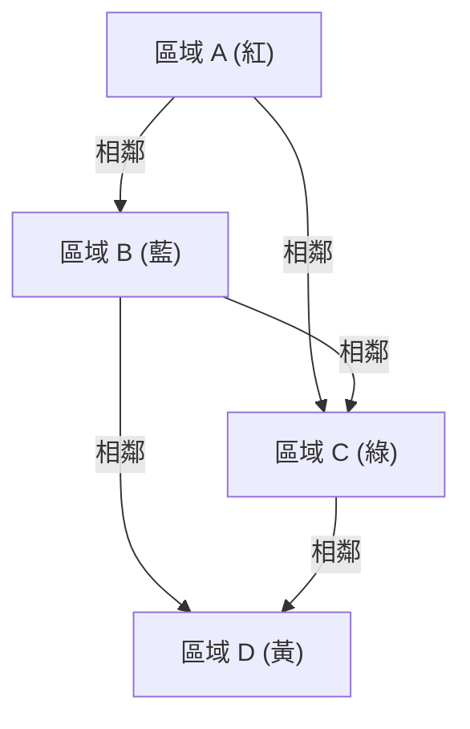

## 1. 什麼是四色定理？

四色定理（Four Color Theorem）是數學，特別是圖論及拓撲學中最著名且迷人的問題之一。它的主張非常簡單，直觀到連小學生都能理解。「任何平面上的地圖，若要相鄰的區域塗上不同的顏色，最多只需要 **4種顏色** 就足夠了。」

這裡說的「相鄰」，是指共享邊界線的狀態，而不是只有點接觸。如果只是在點上接觸，那麼塗上相同的顏色也沒有問題。這個直觀的假說最初是在1852年由法蘭西斯·古德里（Francis Guthrie）提出。他在為英國地圖塗色時，注意到無論縣的邊界線多麼複雜，只要有4種顏色就能完全塗滿。

## 2. 四色定理的歷史背景

法蘭西斯·古德里注意到這個問題後，他將這個問題告訴了他身為數學家的弟弟弗雷德里克·古德里。弗雷德里克進一步將這個問題提交給他的恩師奧古斯塔斯·德摩根（Augustus De Morgan）。德摩根對這個問題的簡單性以及與之相反的極度困難的證明感到驚訝，並開始與其他數學家們討論。

1878年，亞瑟·凱萊（Arthur Cayley）在倫敦數學學會上正式提出了這個問題，使它在數學界廣為人知。許多傑出的數學家都試圖解決這個問題，但要達到完全證明的道路比想像中要崎嶇得多。

## 3. 肯普的證明與希伍德的反例

1879年，一位名叫阿爾弗雷德·肯普（Alfred Kempe）的數學家發表了四色定理的證明。他的證明非常巧妙，引入了現在稱為「肯普鏈（Kempe chain）」的概念。肯普的證明被廣泛接受，十多年來，四色定理被認為已經解決。

然而在1890年，珀西·希伍德（Percy Heawood）發現肯普的證明有致命的缺陷。希伍德在指出肯普邏輯錯誤的同時，巧妙地應用了肯普的方法，證明了「任何地圖只要有 **5種顏色** 就能塗滿」的「五色定理」。四色定理再次作為未解決的難題阻擋在人們面前。

## 4. 轉換為圖論

為了在數學上嚴謹地處理四色定理，問題被翻譯成圖論的語言。地圖上的每個區域作為「頂點（Vertex）」，而共享邊界線的區域則用「邊（Edge）」連接。這樣建立的圖被稱為「平面圖（Planar Graph）」。

平面圖是指可以在平面上繪製而邊不相交的圖。四色問題於是歸結為：「所有平面圖的頂點，都可以用 **4種顏色** 著色，使得相鄰的頂點顏色不同。」

用數學公式表達的話，在圖 $G = (V, E)$ 中，存在著色函數 $c: V \rightarrow \{1, 2, 3, 4\}$，並證明對所有的邊 $(u, v) \in E$，都有 $c(u) \neq c(v)$。

在這裡，歐拉的多面體定理 $V - E + F = 2$ （$V$ 是頂點數量，$E$ 是邊的數量，$F$ 是面的數量），在研究平面圖的性質上扮演了重要的角色。

## 5. 電腦證明的衝擊

1976年，伊利諾大學的肯尼斯·阿佩爾（Kenneth Appel）和沃爾夫岡·哈肯（Wolfgang Haken）終於證明了四色定理。然而，他們的證明方法在數學界引起了極大的爭議。他們將問題的證明歸結為確認有限個（最終是1936個）稱為「不可避免集（Unavoidable set）」的模式，並利用當時的超級電腦進行計算，確認所有這些模式都可以用4種顏色著色（可約性：Reducibility）。

由於計算量過於龐大，人類根本不可能手動確認所有的計算過程，因此引發了「這真的能稱為數學證明嗎？」的哲學討論。

## 6. 證明的精煉與現代視角

1997年，尼爾·羅伯森（Neil Robertson）等人改進了阿佩爾和哈肯的證明，將不可避免集的數量減少到了633個。進一步在2005年，喬治·貢提耶（Georges Gonthier）利用定理證明輔助系統 Coq 完成了四色定理的完整形式化證明。這使得因為電腦程式錯誤而導致出錯的可能性降到了極低，證明的正確性也變得無可動搖。

如今，電腦輔助證明已被廣泛認為是數學中強大的工具，並對解決包括克卜勒猜想在內的其他難題做出了貢獻。

## 7. 結語

四色定理是展示「一個看似簡單的問題，如何隱藏著深刻而複雜的數學結構」的最佳例子。這個始於地圖著色趣味的問題，推動了圖論的發展，甚至改變了數學證明本身的樣貌，帶來了無法估量的影響。

對這個問題的探索告訴我們，人類的直覺是多麼強大，而為了嚴謹地證明它，又需要多少努力和新技術。

## 1. 什麼是四色定理？

四色定理（Four Color Theorem）是數學，特別是圖論及拓撲學中最著名且迷人的問題之一。它的主張非常簡單，直觀到連小學生都能理解。「任何平面上的地圖，若要相鄰的區域塗上不同的顏色，最多只需要 **4種顏色** 就足夠了。」

這裡說的「相鄰」，是指共享邊界線的狀態，而不是只有點接觸。如果只是在點上接觸，那麼塗上相同的顏色也沒有問題。這個直觀的假說最初是在1852年由法蘭西斯·古德里（Francis Guthrie）提出。他在為英國地圖塗色時，注意到無論縣的邊界線多麼複雜，只要有4種顏色就能完全塗滿。

## 2. 四色定理的歷史背景

法蘭西斯·古德里注意到這個問題後，他將這個問題告訴了他身為數學家的弟弟弗雷德里克·古德里。弗雷德里克進一步將這個問題提交給他的恩師奧古斯塔斯·德摩根（Augustus De Morgan）。德摩根對這個問題的簡單性以及與之相反的極度困難的證明感到驚訝，並開始與其他數學家們討論。

1878年，亞瑟·凱萊（Arthur Cayley）在倫敦數學學會上正式提出了這個問題，使它在數學界廣為人知。許多傑出的數學家都試圖解決這個問題，但要達到完全證明的道路比想像中要崎嶇得多。

## 3. 肯普的證明與希伍德的反例

1879年，一位名叫阿爾弗雷德·肯普（Alfred Kempe）的數學家發表了四色定理的證明。他的證明非常巧妙，引入了現在稱為「肯普鏈（Kempe chain）」的概念。肯普的證明被廣泛接受，十多年來，四色定理被認為已經解決。

然而在1890年，珀西·希伍德（Percy Heawood）發現肯普的證明有致命的缺陷。希伍德在指出肯普邏輯錯誤的同時，巧妙地應用了肯普的方法，證明了「任何地圖只要有 **5種顏色** 就能塗滿」的「五色定理」。四色定理再次作為未解決的難題阻擋在人們面前。

## 4. 轉換為圖論

為了在數學上嚴謹地處理四色定理，問題被翻譯成圖論的語言。地圖上的每個區域作為「頂點（Vertex）」，而共享邊界線的區域則用「邊（Edge）」連接。這樣建立的圖被稱為「平面圖（Planar Graph）」。

平面圖是指可以在平面上繪製而邊不相交的圖。四色問題於是歸結為：「所有平面圖的頂點，都可以用 **4種顏色** 著色，使得相鄰的頂點顏色不同。」

用數學公式表達的話，在圖 $G = (V, E)$ 中，存在著色函數 $c: V \rightarrow \{1, 2, 3, 4\}$，並證明對所有的邊 $(u, v) \in E$，都有 $c(u) \neq c(v)$。

在這裡，歐拉的多面體定理 $V - E + F = 2$ （$V$ 是頂點數量，$E$ 是邊的數量，$F$ 是面的數量），在研究平面圖的性質上扮演了重要的角色。

## 5. 電腦證明的衝擊

1976年，伊利諾大學的肯尼斯·阿佩爾（Kenneth Appel）和沃爾夫岡·哈肯（Wolfgang Haken）終於證明了四色定理。然而，他們的證明方法在數學界引起了極大的爭議。他們將問題的證明歸結為確認有限個（最終是1936個）稱為「不可避免集（Unavoidable set）」的模式，並利用當時的超級電腦進行計算，確認所有這些模式都可以用4種顏色著色（可約性：Reducibility）。

由於計算量過於龐大，人類根本不可能手動確認所有的計算過程，因此引發了「這真的能稱為數學證明嗎？」的哲學討論。

## 6. 證明的精煉與現代視角

1997年，尼爾·羅伯森（Neil Robertson）等人改進了阿佩爾和哈肯的證明，將不可避免集的數量減少到了633個。進一步在2005年，喬治·貢提耶（Georges Gonthier）利用定理證明輔助系統 Coq 完成了四色定理的完整形式化證明。這使得因為電腦程式錯誤而導致出錯的可能性降到了極低，證明的正確性也變得無可動搖。

如今，電腦輔助證明已被廣泛認為是數學中強大的工具，並對解決包括克卜勒猜想在內的其他難題做出了貢獻。

## 7. 結語

四色定理是展示「一個看似簡單的問題，如何隱藏著深刻而複雜的數學結構」的最佳例子。這個始於地圖著色趣味的問題，推動了圖論的發展，甚至改變了數學證明本身的樣貌，帶來了無法估量的影響。

對這個問題的探索告訴我們，人類的直覺是多麼強大，而為了嚴謹地證明它，又需要多少努力和新技術。

## 1. 什麼是四色定理？

四色定理（Four Color Theorem）是數學，特別是圖論及拓撲學中最著名且迷人的問題之一。它的主張非常簡單，直觀到連小學生都能理解。「任何平面上的地圖，若要相鄰的區域塗上不同的顏色，最多只需要 **4種顏色** 就足夠了。」

這裡說的「相鄰」，是指共享邊界線的狀態，而不是只有點接觸。如果只是在點上接觸，那麼塗上相同的顏色也沒有問題。這個直觀的假說最初是在1852年由法蘭西斯·古德里（Francis Guthrie）提出。他在為英國地圖塗色時，注意到無論縣的邊界線多麼複雜，只要有4種顏色就能完全塗滿。

## 2. 四色定理的歷史背景

法蘭西斯·古德里注意到這個問題後，他將這個問題告訴了他身為數學家的弟弟弗雷德里克·古德里。弗雷德里克進一步將這個問題提交給他的恩師奧古斯塔斯·德摩根（Augustus De Morgan）。德摩根對這個問題的簡單性以及與之相反的極度困難的證明感到驚訝，並開始與其他數學家們討論。

1878年，亞瑟·凱萊（Arthur Cayley）在倫敦數學學會上正式提出了這個問題，使它在數學界廣為人知。許多傑出的數學家都試圖解決這個問題，但要達到完全證明的道路比想像中要崎嶇得多。

## 3. 肯普的證明與希伍德的反例

1879年，一位名叫阿爾弗雷德·肯普（Alfred Kempe）的數學家發表了四色定理的證明。他的證明非常巧妙，引入了現在稱為「肯普鏈（Kempe chain）」的概念。肯普的證明被廣泛接受，十多年來，四色定理被認為已經解決。

然而在1890年，珀西·希伍德（Percy Heawood）發現肯普的證明有致命的缺陷。希伍德在指出肯普邏輯錯誤的同時，巧妙地應用了肯普的方法，證明了「任何地圖只要有 **5種顏色** 就能塗滿」的「五色定理」。四色定理再次作為未解決的難題阻擋在人們面前。

## 4. 轉換為圖論

為了在數學上嚴謹地處理四色定理，問題被翻譯成圖論的語言。地圖上的每個區域作為「頂點（Vertex）」，而共享邊界線的區域則用「邊（Edge）」連接。這樣建立的圖被稱為「平面圖（Planar Graph）」。

平面圖是指可以在平面上繪製而邊不相交的圖。四色問題於是歸結為：「所有平面圖的頂點，都可以用 **4種顏色** 著色，使得相鄰的頂點顏色不同。」

用數學公式表達的話，在圖 $G = (V, E)$ 中，存在著色函數 $c: V \rightarrow \{1, 2, 3, 4\}$，並證明對所有的邊 $(u, v) \in E$，都有 $c(u) \neq c(v)$。

在這裡，歐拉的多面體定理 $V - E + F = 2$ （$V$ 是頂點數量，$E$ 是邊的數量，$F$ 是面的數量），在研究平面圖的性質上扮演了重要的角色。

## 5. 電腦證明的衝擊

1976年，伊利諾大學的肯尼斯·阿佩爾（Kenneth Appel）和沃爾夫岡·哈肯（Wolfgang Haken）終於證明了四色定理。然而，他們的證明方法在數學界引起了極大的爭議。他們將問題的證明歸結為確認有限個（最終是1936個）稱為「不可避免集（Unavoidable set）」的模式，並利用當時的超級電腦進行計算，確認所有這些模式都可以用4種顏色著色（可約性：Reducibility）。

由於計算量過於龐大，人類根本不可能手動確認所有的計算過程，因此引發了「這真的能稱為數學證明嗎？」的哲學討論。

## 6. 證明的精煉與現代視角

1997年，尼爾·羅伯森（Neil Robertson）等人改進了阿佩爾和哈肯的證明，將不可避免集的數量減少到了633個。進一步在2005年，喬治·貢提耶（Georges Gonthier）利用定理證明輔助系統 Coq 完成了四色定理的完整形式化證明。這使得因為電腦程式錯誤而導致出錯的可能性降到了極低，證明的正確性也變得無可動搖。

如今，電腦輔助證明已被廣泛認為是數學中強大的工具，並對解決包括克卜勒猜想在內的其他難題做出了貢獻。

## 7. 結語

四色定理是展示「一個看似簡單的問題，如何隱藏著深刻而複雜的數學結構」的最佳例子。這個始於地圖著色趣味的問題，推動了圖論的發展，甚至改變了數學證明本身的樣貌，帶來了無法估量的影響。

對這個問題的探索告訴我們，人類的直覺是多麼強大，而為了嚴謹地證明它，又需要多少努力和新技術。

## 1. 什麼是四色定理？

四色定理（Four Color Theorem）是數學，特別是圖論及拓撲學中最著名且迷人的問題之一。它的主張非常簡單，直觀到連小學生都能理解。「任何平面上的地圖，若要相鄰的區域塗上不同的顏色，最多只需要 **4種顏色** 就足夠了。」

這裡說的「相鄰」，是指共享邊界線的狀態，而不是只有點接觸。如果只是在點上接觸，那麼塗上相同的顏色也沒有問題。這個直觀的假說最初是在1852年由法蘭西斯·古德里（Francis Guthrie）提出。他在為英國地圖塗色時，注意到無論縣的邊界線多麼複雜，只要有4種顏色就能完全塗滿。

## 2. 四色定理的歷史背景

法蘭西斯·古德里注意到這個問題後，他將這個問題告訴了他身為數學家的弟弟弗雷德里克·古德里。弗雷德里克進一步將這個問題提交給他的恩師奧古斯塔斯·德摩根（Augustus De Morgan）。德摩根對這個問題的簡單性以及與之相反的極度困難的證明感到驚訝，並開始與其他數學家們討論。

1878年，亞瑟·凱萊（Arthur Cayley）在倫敦數學學會上正式提出了這個問題，使它在數學界廣為人知。許多傑出的數學家都試圖解決這個問題，但要達到完全證明的道路比想像中要崎嶇得多。

## 3. 肯普的證明與希伍德的反例

1879年，一位名叫阿爾弗雷德·肯普（Alfred Kempe）的數學家發表了四色定理的證明。他的證明非常巧妙，引入了現在稱為「肯普鏈（Kempe chain）」的概念。肯普的證明被廣泛接受，十多年來，四色定理被認為已經解決。

然而在1890年，珀西·希伍德（Percy Heawood）發現肯普的證明有致命的缺陷。希伍德在指出肯普邏輯錯誤的同時，巧妙地應用了肯普的方法，證明了「任何地圖只要有 **5種顏色** 就能塗滿」的「五色定理」。四色定理再次作為未解決的難題阻擋在人們面前。

## 4. 轉換為圖論

為了在數學上嚴謹地處理四色定理，問題被翻譯成圖論的語言。地圖上的每個區域作為「頂點（Vertex）」，而共享邊界線的區域則用「邊（Edge）」連接。這樣建立的圖被稱為「平面圖（Planar Graph）」。

平面圖是指可以在平面上繪製而邊不相交的圖。四色問題於是歸結為：「所有平面圖的頂點，都可以用 **4種顏色** 著色，使得相鄰的頂點顏色不同。」

用數學公式表達的話，在圖 $G = (V, E)$ 中，存在著色函數 $c: V \rightarrow \{1, 2, 3, 4\}$，並證明對所有的邊 $(u, v) \in E$，都有 $c(u) \neq c(v)$。

在這裡，歐拉的多面體定理 $V - E + F = 2$ （$V$ 是頂點數量，$E$ 是邊的數量，$F$ 是面的數量），在研究平面圖的性質上扮演了重要的角色。

## 5. 電腦證明的衝擊

1976年，伊利諾大學的肯尼斯·阿佩爾（Kenneth Appel）和沃爾夫岡·哈肯（Wolfgang Haken）終於證明了四色定理。然而，他們的證明方法在數學界引起了極大的爭議。他們將問題的證明歸結為確認有限個（最終是1936個）稱為「不可避免集（Unavoidable set）」的模式，並利用當時的超級電腦進行計算，確認所有這些模式都可以用4種顏色著色（可約性：Reducibility）。

由於計算量過於龐大，人類根本不可能手動確認所有的計算過程，因此引發了「這真的能稱為數學證明嗎？」的哲學討論。

## 6. 證明的精煉與現代視角

1997年，尼爾·羅伯森（Neil Robertson）等人改進了阿佩爾和哈肯的證明，將不可避免集的數量減少到了633個。進一步在2005年，喬治·貢提耶（Georges Gonthier）利用定理證明輔助系統 Coq 完成了四色定理的完整形式化證明。這使得因為電腦程式錯誤而導致出錯的可能性降到了極低，證明的正確性也變得無可動搖。

如今，電腦輔助證明已被廣泛認為是數學中強大的工具，並對解決包括克卜勒猜想在內的其他難題做出了貢獻。

## 7. 結語

四色定理是展示「一個看似簡單的問題，如何隱藏著深刻而複雜的數學結構」的最佳例子。這個始於地圖著色趣味的問題，推動了圖論的發展，甚至改變了數學證明本身的樣貌，帶來了無法估量的影響。

對這個問題的探索告訴我們，人類的直覺是多麼強大，而為了嚴謹地證明它，又需要多少努力和新技術。

