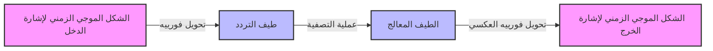

## 1. مقدمة: سحر جمع الموجات

بيئتنا مليئة بـ **"الموجات"** المختلفة مثل الصوت والضوء والموجات الكهرومغناطيسية. ماذا لو كانت الأشكال الموجية التي تبدو معقدة وغير منتظمة للغاية للوهلة الأولى مكونة في الواقع من مجموعات من الموجات البسيطة؟ التمثيل الرياضي لهذه الحقيقة المذهلة هو **"متسلسلة فورييه"** التي اقترحها جوزيف فورييه، وتطورها اللاحق، **"تحويل فورييه"**.

في هذه المقالة، سنتعمق في هذه الطريقة الرياضية الرائعة، من أسسها إلى الفهم البديهي، وتطبيقاتها في التكنولوجيا الحديثة.

## 2. متسلسلة فورييه: تحليل الموجات الدورية

الفكرة الأساسية لمتسلسلة فورييه هي أن "أي دالة دورية يمكن التعبير عنها كمجموع لانهائي من موجات الجيب وجيب التمام بترددات مختلفة".

### 2.1 متسلسلة فورييه ذات القيم الحقيقية

يمكن توسيع دالة $f(x)$ ذات دورة $2\pi$ على النحو التالي.

$$
f(x) = \frac{a_0}{2} + \sum_{n=1}^{\infty} \left( a_n \cos(nx) + b_n \sin(nx) \right)
$$

هنا، يطلق على $a_0$ و $a_n$ و $b_n$ اسم **"معاملات فورييه"**، وهي تمثل مدى قوة تضمين كل موجة. يتم حساب هذه المعاملات بواسطة التكاملات التالية.

$$
a_0 = \frac{1}{\pi} \int_{-\pi}^{\pi} f(x) dx \quad (\text{مكون التيار المستمر})
$$
$$
a_n = \frac{1}{\pi} \int_{-\pi}^{\pi} f(x) \cos(nx) dx \quad (\text{وزن مكون جيب التمام})
$$
$$
b_n = \frac{1}{\pi} \int_{-\pi}^{\pi} f(x) \sin(nx) dx \quad (\text{وزن مكون الجيب})
$$

### 2.2 متسلسلة فورييه المعقدة

باستخدام صيغة أويلر $e^{i\theta} = \cos\theta + i\sin\theta$، يمكن كتابة متسلسلة فورييه بشكل أكثر أناقة في شكل دوال أسية معقدة.

$$
f(x) = \sum_{n=-\infty}^{\infty} c_n e^{inx}
$$

$$
c_n = \frac{1}{2\pi} \int_{-\pi}^{\pi} f(x) e^{-inx} dx \quad (\text{معامل فورييه المعقد})
$$

يلعب الشكل المعقد دورًا مهمًا للغاية كجسر إلى تحويل فورييه الموضح لاحقًا.

## 3. تحويل فورييه: الامتداد إلى الدوال غير الدورية

لا يمكن تطبيق متسلسلة فورييه إلا على الدوال الدورية. ومع ذلك، فإن العديد من الإشارات في العالم الحقيقي (مثل النطقات الصوتية القصيرة أو إشارات النبض لمرة واحدة) غير دورية. لذلك، من خلال النظر في الحد حيث تذهب الدورة إلى ما لا نهاية ($T \to \infty$)، يتم اشتقاق **"تحويل فورييه"**.

### 3.1 تعريف تحويل فورييه

يتم تعريف تحويل فورييه $\mathcal{F}\{f(t)\}$ وتحويل فورييه العكسي لدالة $f(t)$ على النحو التالي.

$$
F(\omega) = \int_{-\infty}^{\infty} f(t) e^{-i\omega t} dt \quad (\text{التحويل من المجال الزمني إلى مجال التردد})
$$

$$
f(t) = \frac{1}{2\pi} \int_{-\infty}^{\infty} F(\omega) e^{i\omega t} d\omega \quad (\text{التحويل العكسي من مجال التردد إلى المجال الزمني})
$$

هنا، يمثل $t$ الوقت، ويمثل $\omega$ التردد الزاوي. $F(\omega)$ هي دالة تشير إلى مقدار مكون التردد $\omega$ (السعة والطور) المضمن في الإشارة الأصلية $f(t)$.

### 3.2 تدفق معالجة الإشارات

يوضح المخطط التالي كيفية معالجة إشارة الدخل باستخدام تحويل فورييه.



## 4. تحويل فورييه المتقطع (DFT) وتحويل فورييه السريع (FFT)

لمعالجة الإشارات باستخدام أجهزة الكمبيوتر، يجب استبدال الوقت المستمر والتكاملات ذات الطول اللانهائي بمجموع عدد محدود من نقاط البيانات المتقطعة. هذا هو **تحويل فورييه المتقطع (DFT)**.

$$
X_k = \sum_{n=0}^{N-1} x_n e^{-i \frac{2\pi}{N} k n} \quad \text{من أجل } k = 0, 1, \dots, N-1
$$

علاوة على ذلك، فإن الخوارزمية التي تقلل بشكل كبير من التعقيد الحسابي لـ DFT من $O(N^2)$ إلى $O(N \log N)$ هي **تحويل فورييه السريع (FFT)**. مع ظهور FFT، شهد مجال معالجة الإشارات الرقمية (DSP) تطورًا هائلاً. تستفيد العديد من تقنياتنا المألوفة، مثل التعرف على الكلام على الهواتف الذكية وضغط صور JPEG، من FFT.

```python
import numpy as np
import matplotlib.pyplot as plt

# إنشاء محور الوقت (من 0 إلى 1 ثانية، تردد أخذ العينات 1000 هرتز)
t = np.linspace(0, 1, 1000, endpoint=False)

# إشارة تجمع بين موجات جيبية 50 هرتز و 120 هرتز
signal = np.sin(2 * np.pi * 50 * t) + 0.5 * np.sin(2 * np.pi * 120 * t)

# تنفيذ FFT
fft_result = np.fft.fft(signal)
frequencies = np.fft.fftfreq(len(t), 1/1000)

# فهرس لرسم مجال التردد الموجب فقط
positive_freqs = frequencies > 0
```

## 5. الخلاصة

تعد [متسلسلة فورييه وتحويل فورييه](https://kenji.blog/ar/p/fourier-series-and-transform/) من بين أقوى الأدوات في العلوم والهندسة، حيث تقسم الظواهر المعقدة إلى عناصر بسيطة. من خلال النظر إلى العالم من خلال هذه "العدسة" الرياضية التي تحول الوقت إلى تردد، يمكننا اكتشاف الأنماط المخفية ومعالجة المعلومات بكفاءة.

يستمر سحر جمع الموجات في لعب دور نشط كأساس للتكنولوجيا الحديثة اليوم.
