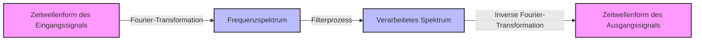

## 1. Einführung: Die Magie des Addierens von Wellen

Unsere Umgebung ist erfüllt von verschiedenen **"Wellen"** wie Schall, Licht und elektromagnetischen Wellen. Was wäre, wenn Wellenformen, die auf den ersten Blick sehr komplex und unregelmäßig erscheinen, tatsächlich aus Kombinationen einfacher Wellen bestehen? Die mathematische Darstellung dieser erstaunlichen Tatsache ist die von Joseph Fourier vorgeschlagene **"Fourier-Reihe"** und ihre Weiterentwicklung, die **"Fourier-Transformation"**.

In diesem Artikel werden wir tief in diese faszinierende mathematische Methode eintauchen, von ihren Grundlagen bis hin zum intuitiven Verständnis und ihren Anwendungen in der modernen Technologie.

## 2. Fourier-Reihe: Periodische Wellen zerlegen

Die grundlegende Idee der Fourier-Reihe ist, dass "jede periodische Funktion als unendliche Summe von Sinus- und Kosinuswellen mit unterschiedlichen Frequenzen ausgedrückt werden kann".

### 2.1 Reellwertige Fourier-Reihe

Eine Funktion $f(x)$ mit der Periode $2\pi$ kann wie folgt entwickelt werden.

$$
f(x) = \frac{a_0}{2} + \sum_{n=1}^{\infty} \left( a_n \cos(nx) + b_n \sin(nx) \right)
$$

Hierbei werden $a_0$, $a_n$ und $b_n$ als **"Fourier-Koeffizienten"** bezeichnet, und sie geben an, wie stark jede Welle enthalten ist. Diese Koeffizienten werden durch die folgenden Integrale berechnet.

$$
a_0 = \frac{1}{\pi} \int_{-\pi}^{\pi} f(x) dx \quad (\text{Gleichanteil})
$$
$$
a_n = \frac{1}{\pi} \int_{-\pi}^{\pi} f(x) \cos(nx) dx \quad (\text{Gewichtung der Kosinuskomponente})
$$
$$
b_n = \frac{1}{\pi} \int_{-\pi}^{\pi} f(x) \sin(nx) dx \quad (\text{Gewichtung der Sinuskomponente})
$$

### 2.2 Komplexe Fourier-Reihe

Unter Verwendung der Eulerschen Formel $e^{i\theta} = \cos\theta + i\sin\theta$ kann die Fourier-Reihe eleganter in Form von komplexen Exponentialfunktionen geschrieben werden.

$$
f(x) = \sum_{n=-\infty}^{\infty} c_n e^{inx}
$$

$$
c_n = \frac{1}{2\pi} \int_{-\pi}^{\pi} f(x) e^{-inx} dx \quad (\text{Komplexer Fourier-Koeffizient})
$$

Die komplexe Form spielt eine sehr wichtige Rolle als Brücke zur später beschriebenen Fourier-Transformation.

## 3. Fourier-Transformation: Erweiterung auf nichtperiodische Funktionen

Die Fourier-Reihe kann nur auf periodische Funktionen angewendet werden. Viele Signale in der realen Welt (wie kurze vokale Äußerungen oder einmalige Impulssignale) sind jedoch nichtperiodisch. Indem man also den Grenzwert betrachtet, bei dem die Periode gegen unendlich geht ($T \to \infty$), leitet sich die **"Fourier-Transformation"** ab.

### 3.1 Definition der Fourier-Transformation

Die Fourier-Transformation $\mathcal{F}\{f(t)\}$ und die inverse Fourier-Transformation für eine Funktion $f(t)$ sind wie folgt definiert.

$$
F(\omega) = \int_{-\infty}^{\infty} f(t) e^{-i\omega t} dt \quad (\text{Transformation vom Zeit- in den Frequenzbereich})
$$

$$
f(t) = \frac{1}{2\pi} \int_{-\infty}^{\infty} F(\omega) e^{i\omega t} d\omega \quad (\text{Inverse Transformation vom Frequenz- in den Zeitbereich})
$$

Hierbei steht $t$ für die Zeit und $\omega$ für die Kreisfrequenz. $F(\omega)$ ist eine Funktion, die angibt, wie viel von der Komponente der Frequenz $\omega$ (Amplitude und Phase) im ursprünglichen Signal $f(t)$ enthalten ist.

### 3.2 Signalverarbeitungsablauf

Das folgende Diagramm zeigt, wie ein Eingangssignal mit der Fourier-Transformation verarbeitet wird.



## 4. Diskrete Fourier-Transformation (DFT) und Schnelle Fourier-Transformation (FFT)

Um Signale mit Computern zu verarbeiten, müssen kontinuierliche Zeit und Integrale mit unendlicher Länge durch eine Summe einer endlichen Anzahl von diskreten Datenpunkten ersetzt werden. Dies ist die **Diskrete Fourier-Transformation (DFT)**.

$$
X_k = \sum_{n=0}^{N-1} x_n e^{-i \frac{2\pi}{N} k n} \quad \text{für } k = 0, 1, \dots, N-1
$$

Darüber hinaus ist ein Algorithmus, der die Rechenkomplexität dieser DFT von $O(N^2)$ auf $O(N \log N)$ drastisch reduziert, die **[Schnelle Fourier-Transformation (FFT)](/de/p/fast-fourier-transform-algorithm/)**. Mit dem Aufkommen der [FFT](/de/p/fast-fourier-transform-algorithm/) hat das Gebiet der digitalen Signalverarbeitung (DSP) eine explosive Entwicklung durchgemacht. Viele unserer vertrauten Technologien, wie Spracherkennung auf Smartphones und JPEG-Bildkomprimierung, profitieren von der [FFT](/de/p/fast-fourier-transform-algorithm/).

```python
import numpy as np
import matplotlib.pyplot as plt

# Zeitachse erstellen (von 0 bis 1 Sekunde, Abtastfrequenz 1000 Hz)
t = np.linspace(0, 1, 1000, endpoint=False)

# Signal, das 50Hz- und 120Hz-Sinuswellen synthetisiert
signal = np.sin(2 * np.pi * 50 * t) + 0.5 * np.sin(2 * np.pi * 120 * t)

# FFT ausführen
fft_result = np.fft.fft(signal)
frequencies = np.fft.fftfreq(len(t), 1/1000)

# Index zum Plotten nur des positiven Frequenzbereichs
positive_freqs = frequencies > 0
```

## 5. Fazit

Die Fourier-Reihe und die Fourier-Transformation gehören zu den mächtigsten Werkzeugen in Wissenschaft und Technik und zerlegen komplexe Phänomene in einfache Elemente. Indem wir die Welt durch diese mathematische "Linse" betrachten, die Zeit in Frequenz umwandelt, können wir verborgene Muster entdecken und Informationen effizient verarbeiten.

Die Magie des Addierens von Wellen spielt auch heute noch eine aktive Rolle als Grundlage der modernen Technologie.
