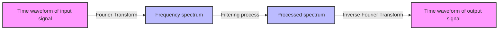

## 1. Introduction: The Magic of Adding Waves

Our surroundings are filled with various **"waves"** such as sound, light, and electromagnetic waves. What if waveforms that appear highly complex and irregular at first glance are actually made up of combinations of simple waves? The mathematical representation of this amazing fact is the **"Fourier Series"** proposed by Joseph Fourier, and its further development, the **"Fourier Transform"**.

In this article, we will delve deeply into this fascinating mathematical method, from its foundations to intuitive understanding, and its applications in modern technology.

## 2. Fourier Series: Decomposing Periodic Waves

The fundamental idea of the Fourier series is that "any periodic function can be expressed as an infinite sum of sine and cosine waves with different frequencies."

### 2.1 Real-Valued Fourier Series

A function $f(x)$ with a period of $2\pi$ can be expanded as follows.

$$
f(x) = \frac{a_0}{2} + \sum_{n=1}^{\infty} \left( a_n \cos(nx) + b_n \sin(nx) \right)
$$

Here, $a_0$, $a_n$, and $b_n$ are called **"Fourier coefficients"**, and they represent how strongly each wave is included. These coefficients are calculated by the following integrals.

$$
a_0 = \frac{1}{\pi} \int_{-\pi}^{\pi} f(x) dx \quad (\text{DC component})
$$
$$
a_n = \frac{1}{\pi} \int_{-\pi}^{\pi} f(x) \cos(nx) dx \quad (\text{Weight of cosine component})
$$
$$
b_n = \frac{1}{\pi} \int_{-\pi}^{\pi} f(x) \sin(nx) dx \quad (\text{Weight of sine component})
$$

### 2.2 Complex Fourier Series

By using Euler's formula $e^{i\theta} = \cos\theta + i\sin\theta$, the Fourier series can be written more elegantly in the form of complex exponential functions.

$$
f(x) = \sum_{n=-\infty}^{\infty} c_n e^{inx}
$$

$$
c_n = \frac{1}{2\pi} \int_{-\pi}^{\pi} f(x) e^{-inx} dx \quad (\text{Complex Fourier coefficient})
$$

The complex form plays a very important role as a bridge to the Fourier transform described later.

## 3. Fourier Transform: Extension to Non-Periodic Functions

The Fourier series can only be applied to periodic functions. However, many signals in the real world (such as short vocal utterances or one-time pulse signals) are non-periodic. Therefore, by considering the limit where the period goes to infinity ($T \to \infty$), the **"Fourier Transform"** is derived.

### 3.1 Definition of the Fourier Transform

The Fourier transform $\mathcal{F}\{f(t)\}$ and inverse Fourier transform for a function $f(t)$ are defined as follows.

$$
F(\omega) = \int_{-\infty}^{\infty} f(t) e^{-i\omega t} dt \quad (\text{Transform from time domain to frequency domain})
$$

$$
f(t) = \frac{1}{2\pi} \int_{-\infty}^{\infty} F(\omega) e^{i\omega t} d\omega \quad (\text{Inverse transform from frequency domain to time domain})
$$

Here, $t$ represents time, and $\omega$ represents angular frequency. $F(\omega)$ is a function that indicates how much of the frequency $\omega$ component (amplitude and phase) is included in the original signal $f(t)$.

### 3.2 Signal Processing Flow

The following diagram shows how an input signal is processed using the Fourier transform.



## 4. Discrete Fourier Transform (DFT) and Fast Fourier Transform (FFT)

To process signals with computers, continuous time and integrals with infinite length must be replaced by a sum of a finite number of discrete data points. This is the **Discrete Fourier Transform (DFT)**.

$$
X_k = \sum_{n=0}^{N-1} x_n e^{-i \frac{2\pi}{N} k n} \quad \text{for } k = 0, 1, \dots, N-1
$$

Furthermore, an algorithm that dramatically reduces the computational complexity of this DFT from $O(N^2)$ to $O(N \log N)$ is the **Fast Fourier Transform (FFT)**. With the advent of FFT, the field of digital signal processing (DSP) has undergone explosive development. Many of our familiar technologies, such as speech recognition on smartphones and JPEG image compression, benefit from FFT.

```python
import numpy as np
import matplotlib.pyplot as plt

# Create time axis (from 0 to 1 second, sampling frequency 1000Hz)
t = np.linspace(0, 1, 1000, endpoint=False)

# Signal synthesizing 50Hz and 120Hz sine waves
signal = np.sin(2 * np.pi * 50 * t) + 0.5 * np.sin(2 * np.pi * 120 * t)

# Execute FFT
fft_result = np.fft.fft(signal)
frequencies = np.fft.fftfreq(len(t), 1/1000)

# Index to plot only the positive frequency domain
positive_freqs = frequencies > 0
```

## 5. Conclusion

The Fourier series and Fourier transform are among the most powerful tools in science and engineering, breaking down complex phenomena into simple elements. By looking at the world through this mathematical "lens" that converts time to frequency, we can discover hidden patterns and process information efficiently.

The magic of adding waves continues to play an active role as the foundation of modern technology today.
