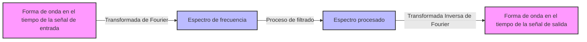

## 1. Introducción: La Magia de Sumar Ondas

Nuestro entorno está lleno de diversas **"ondas"** como el sonido, la luz y las ondas electromagnéticas. ¿Qué pasaría si las formas de onda que a primera vista parecen muy complejas e irregulares estuvieran realmente compuestas de combinaciones de ondas simples? La representación matemática de este asombroso hecho es la **"Serie de Fourier"** propuesta por Joseph Fourier, y su desarrollo posterior, la **"Transformada de Fourier"**.

En este artículo, profundizaremos en este fascinante método matemático, desde sus fundamentos hasta una comprensión intuitiva, y sus aplicaciones en la tecnología moderna.

## 2. Series de Fourier: Descomponiendo Ondas Periódicas

La idea fundamental de la serie de Fourier es que "cualquier función periódica puede expresarse como una suma infinita de ondas de seno y coseno con diferentes frecuencias".

### 2.1 Series de Fourier de Valores Reales

Una función $f(x)$ con un período de $2\pi$ se puede expandir de la siguiente manera.

$$
f(x) = \frac{a_0}{2} + \sum_{n=1}^{\infty} \left( a_n \cos(nx) + b_n \sin(nx) \right)
$$

Aquí, $a_0$, $a_n$ y $b_n$ se llaman **"coeficientes de Fourier"**, y representan la intensidad con la que se incluye cada onda. Estos coeficientes se calculan mediante las siguientes integrales.

$$
a_0 = \frac{1}{\pi} \int_{-\pi}^{\pi} f(x) dx \quad (\text{Componente de corriente continua})
$$
$$
a_n = \frac{1}{\pi} \int_{-\pi}^{\pi} f(x) \cos(nx) dx \quad (\text{Peso del componente coseno})
$$
$$
b_n = \frac{1}{\pi} \int_{-\pi}^{\pi} f(x) \sin(nx) dx \quad (\text{Peso del componente seno})
$$

### 2.2 Series de Fourier Complejas

Usando la fórmula de Euler $e^{i\theta} = \cos\theta + i\sin\theta$, la serie de Fourier se puede escribir de manera más elegante en forma de funciones exponenciales complejas.

$$
f(x) = \sum_{n=-\infty}^{\infty} c_n e^{inx}
$$

$$
c_n = \frac{1}{2\pi} \int_{-\pi}^{\pi} f(x) e^{-inx} dx \quad (\text{Coeficiente de Fourier complejo})
$$

La forma compleja juega un papel muy importante como puente hacia la transformada de Fourier que se describe más adelante.

## 3. Transformada de Fourier: Extensión a Funciones No Periódicas

La serie de Fourier solo se puede aplicar a funciones periódicas. Sin embargo, muchas señales en el mundo real (como expresiones vocales cortas o señales de pulso único) no son periódicas. Por lo tanto, al considerar el límite donde el período va hacia el infinito ($T \to \infty$), se deriva la **"Transformada de Fourier"**.

### 3.1 Definición de la Transformada de Fourier

La transformada de Fourier $\mathcal{F}\{f(t)\}$ y la transformada de Fourier inversa para una función $f(t)$ se definen de la siguiente manera.

$$
F(\omega) = \int_{-\infty}^{\infty} f(t) e^{-i\omega t} dt \quad (\text{Transformación del dominio del tiempo al dominio de la frecuencia})
$$

$$
f(t) = \frac{1}{2\pi} \int_{-\infty}^{\infty} F(\omega) e^{i\omega t} d\omega \quad (\text{Transformación inversa del dominio de la frecuencia al dominio del tiempo})
$$

Aquí, $t$ representa el tiempo y $\omega$ representa la frecuencia angular. $F(\omega)$ es una función que indica qué cantidad de la componente de frecuencia $\omega$ (amplitud y fase) se incluye en la señal original $f(t)$.

### 3.2 Flujo de Procesamiento de Señales

El siguiente diagrama muestra cómo se procesa una señal de entrada utilizando la transformada de Fourier.



## 4. Transformada de Fourier Discreta (DFT) y Transformada Rápida de Fourier (FFT)

Para procesar señales con computadoras, el tiempo continuo y las integrales con longitud infinita deben reemplazarse por una suma de un número finito de puntos de datos discretos. Esta es la **Transformada de Fourier Discreta (DFT)**.

$$
X_k = \sum_{n=0}^{N-1} x_n e^{-i \frac{2\pi}{N} k n} \quad \text{para } k = 0, 1, \dots, N-1
$$

Además, un algoritmo que reduce drásticamente la complejidad computacional de esta DFT de $O(N^2)$ a $O(N \log N)$ es la **[Transformada Rápida de Fourier (FFT)](/es/p/fast-fourier-transform-algorithm/)**. Con la llegada de la [FFT](/es/p/fast-fourier-transform-algorithm/), el campo del procesamiento de señales digitales (DSP) ha experimentado un desarrollo explosivo. Muchas de nuestras tecnologías familiares, como el reconocimiento de voz en teléfonos inteligentes y la compresión de imágenes JPEG, se benefician de la [FFT](/es/p/fast-fourier-transform-algorithm/).

```python
import numpy as np
import matplotlib.pyplot as plt

# Crear eje de tiempo (de 0 a 1 segundo, frecuencia de muestreo 1000Hz)
t = np.linspace(0, 1, 1000, endpoint=False)

# Señal sintetizando ondas sinusoidales de 50Hz y 120Hz
signal = np.sin(2 * np.pi * 50 * t) + 0.5 * np.sin(2 * np.pi * 120 * t)

# Ejecutar FFT
fft_result = np.fft.fft(signal)
frequencies = np.fft.fftfreq(len(t), 1/1000)

# Índice para trazar solo el dominio de frecuencia positiva
positive_freqs = frequencies > 0
```

## 5. Conclusión

Las series de Fourier y la transformada de Fourier se encuentran entre las herramientas más poderosas de la ciencia y la ingeniería, desglosando fenómenos complejos en elementos simples. Al observar el mundo a través de esta "lente" matemática que convierte el tiempo en frecuencia, podemos descubrir patrones ocultos y procesar información de manera eficiente.

La magia de sumar ondas continúa desempeñando un papel activo como base de la tecnología moderna actual.
