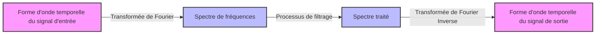

## 1. Introduction : La Magie de l'Addition des Ondes

Notre environnement est rempli de diverses **"ondes"** telles que le son, la lumière et les ondes électromagnétiques. Et si les formes d'onde qui semblent très complexes et irrégulières à première vue étaient en fait composées de combinaisons d'ondes simples ? La représentation mathématique de ce fait étonnant est la **"Série de Fourier"** proposée par Joseph Fourier, et son développement ultérieur, la **"Transformée de Fourier"**.

Dans cet article, nous plongerons profondément dans cette méthode mathématique fascinante, de ses fondements à une compréhension intuitive, et à ses applications dans la technologie moderne.

## 2. Série de Fourier : Décomposer les Ondes Périodiques

L'idée fondamentale de la série de Fourier est que "toute fonction périodique peut être exprimée comme une somme infinie d'ondes de sinus et cosinus avec des fréquences différentes".

### 2.1 Série de Fourier à Valeurs Réelles

Une fonction $f(x)$ d'une période de $2\pi$ peut être développée comme suit.

$$
f(x) = \frac{a_0}{2} + \sum_{n=1}^{\infty} \left( a_n \cos(nx) + b_n \sin(nx) \right)
$$

Ici, $a_0$, $a_n$ et $b_n$ sont appelés **"coefficients de Fourier"**, et ils représentent la force avec laquelle chaque onde est incluse. Ces coefficients sont calculés par les intégrales suivantes.

$$
a_0 = \frac{1}{\pi} \int_{-\pi}^{\pi} f(x) dx \quad (\text{Composante continue})
$$
$$
a_n = \frac{1}{\pi} \int_{-\pi}^{\pi} f(x) \cos(nx) dx \quad (\text{Poids de la composante cosinus})
$$
$$
b_n = \frac{1}{\pi} \int_{-\pi}^{\pi} f(x) \sin(nx) dx \quad (\text{Poids de la composante sinus})
$$

### 2.2 Série de Fourier Complexe

En utilisant la formule d'Euler $e^{i\theta} = \cos\theta + i\sin\theta$, la série de Fourier peut être écrite plus élégamment sous forme de fonctions exponentielles complexes.

$$
f(x) = \sum_{n=-\infty}^{\infty} c_n e^{inx}
$$

$$
c_n = \frac{1}{2\pi} \int_{-\pi}^{\pi} f(x) e^{-inx} dx \quad (\text{Coefficient de Fourier complexe})
$$

La forme complexe joue un rôle très important en tant que pont vers la transformée de Fourier décrite plus loin.

## 3. Transformée de Fourier : Extension aux Fonctions Non Périodiques

La série de Fourier ne peut être appliquée qu'à des fonctions périodiques. Cependant, de nombreux signaux dans le monde réel (comme les énoncés vocaux courts ou les signaux d'impulsion uniques) sont non périodiques. Ainsi, en considérant la limite où la période tend vers l'infini ($T \to \infty$), on déduit la **"Transformée de Fourier"**.

### 3.1 Définition de la Transformée de Fourier

La transformée de Fourier $\mathcal{F}\{f(t)\}$ et la transformée de Fourier inverse pour une fonction $f(t)$ sont définies comme suit.

$$
F(\omega) = \int_{-\infty}^{\infty} f(t) e^{-i\omega t} dt \quad (\text{Transformation du domaine temporel au domaine fréquentiel})
$$

$$
f(t) = \frac{1}{2\pi} \int_{-\infty}^{\infty} F(\omega) e^{i\omega t} d\omega \quad (\text{Transformation inverse du domaine fréquentiel au domaine temporel})
$$

Ici, $t$ représente le temps et $\omega$ représente la fréquence angulaire. $F(\omega)$ est une fonction qui indique quelle quantité de la composante de fréquence $\omega$ (amplitude et phase) est incluse dans le signal d'origine $f(t)$.

### 3.2 [Flux](https://kenji.blog/fr/p/state-management-history-redux-context-recoil-zustand/) de Traitement du Signal

Le diagramme suivant montre comment un signal d'entrée est traité à l'aide de la transformée de Fourier.



## 4. Transformée de Fourier Discrète (DFT) et Transformée de Fourier Rapide (FFT)

Pour traiter des signaux avec des ordinateurs, le temps continu et les intégrales de longueur infinie doivent être remplacés par une somme d'un nombre fini de points de données discrets. C'est la **Transformée de Fourier Discrète (DFT)**.

$$
X_k = \sum_{n=0}^{N-1} x_n e^{-i \frac{2\pi}{N} k n} \quad \text{pour } k = 0, 1, \dots, N-1
$$

De plus, un algorithme qui réduit considérablement la complexité de calcul de cette DFT de $O(N^2)$ à $O(N \log N)$ est la **Transformée de Fourier Rapide ([FFT](/fr/p/fast-fourier-transform-algorithm/))**. Avec l'avènement de la [FFT](/fr/p/fast-fourier-transform-algorithm/), le domaine du traitement du signal numérique (DSP) a connu un développement explosif. Bon nombre de nos technologies familières, telles que la reconnaissance vocale sur les smartphones et la compression d'images JPEG, bénéficient de la [FFT](/fr/p/fast-fourier-transform-algorithm/).

```python
import numpy as np
import matplotlib.pyplot as plt

# Créer un axe temporel (de 0 à 1 seconde, fréquence d'échantillonnage 1000Hz)
t = np.linspace(0, 1, 1000, endpoint=False)

# Signal synthétisant des ondes sinusoïdales de 50Hz et 120Hz
signal = np.sin(2 * np.pi * 50 * t) + 0.5 * np.sin(2 * np.pi * 120 * t)

# Exécuter la FFT
fft_result = np.fft.fft(signal)
frequencies = np.fft.fftfreq(len(t), 1/1000)

# Indice pour tracer uniquement le domaine de fréquence positive
positive_freqs = frequencies > 0
```

## 5. Conclusion

La série de Fourier et la transformée de Fourier figurent parmi les outils les plus puissants en science et en ingénierie, décomposant des phénomènes complexes en éléments simples. En regardant le monde à travers cette "lentille" mathématique qui convertit le temps en fréquence, nous pouvons découvrir des modèles cachés et traiter les informations efficacement.

La magie de l'addition des ondes continue de jouer un rôle actif en tant que fondement de la technologie moderne d'aujourd'hui.
