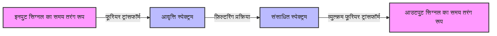

## 1. परिचय: तरंगों को जोड़ने का जादू

हमारा परिवेश ध्वनि, प्रकाश और विद्युत चुम्बकीय तरंगों जैसी विभिन्न **"तरंगों"** से भरा है। क्या हो अगर तरंगें जो पहली नज़र में अत्यधिक जटिल और अनियमित लगती हैं, वे वास्तव में सरल तरंगों के संयोजन से बनी हों? इस आश्चर्यजनक तथ्य का गणितीय प्रतिनिधित्व जोसेफ फूरियर द्वारा प्रस्तावित **"फूरियर श्रृंखला"** और इसके आगे के विकास, **"फूरियर ट्रांसफॉर्म"** द्वारा किया जाता है।

इस लेख में, हम इस आकर्षक गणितीय पद्धति की गहराई में जाएंगे, इसके आधार से लेकर सहज समझ और आधुनिक तकनीक में इसके अनुप्रयोगों तक।

## 2. फूरियर श्रृंखला: आवधिक तरंगों को विघटित करना

फूरियर श्रृंखला का मूल विचार यह है कि "किसी भी आवधिक कार्य को विभिन्न आवृत्तियों वाली साइन और कोसाइन तरंगों के अनंत योग के रूप में व्यक्त किया जा सकता है।"

### 2.1 वास्तविक मूल्यवान फूरियर श्रृंखला

$2\pi$ की अवधि वाले फलन $f(x)$ को इस प्रकार विस्तारित किया जा सकता है।

$$
f(x) = \frac{a_0}{2} + \sum_{n=1}^{\infty} \left( a_n \cos(nx) + b_n \sin(nx) \right)
$$

यहाँ, $a_0$, $a_n$, और $b_n$ को **"फूरियर गुणांक"** कहा जाता है, और वे दर्शाते हैं कि प्रत्येक तरंग कितनी दृढ़ता से शामिल है। इन गुणांकों की गणना निम्नलिखित समाकलनों द्वारा की जाती है।

$$
a_0 = \frac{1}{\pi} \int_{-\pi}^{\pi} f(x) dx \quad (\text{डीसी घटक})
$$
$$
a_n = \frac{1}{\pi} \int_{-\pi}^{\pi} f(x) \cos(nx) dx \quad (\text{कोसाइन घटक का भार})
$$
$$
b_n = \frac{1}{\pi} \int_{-\pi}^{\pi} f(x) \sin(nx) dx \quad (\text{साइन घटक का भार})
$$

### 2.2 जटिल फूरियर श्रृंखला

यूलर के सूत्र $e^{i\theta} = \cos\theta + i\sin\theta$ का उपयोग करते हुए, फूरियर श्रृंखला को जटिल घातीय कार्यों के रूप में अधिक शानदार ढंग से लिखा जा सकता है।

$$
f(x) = \sum_{n=-\infty}^{\infty} c_n e^{inx}
$$

$$
c_n = \frac{1}{2\pi} \int_{-\pi}^{\pi} f(x) e^{-inx} dx \quad (\text{जटिल फूरियर गुणांक})
$$

जटिल रूप बाद में वर्णित फूरियर ट्रांसफॉर्म के लिए एक पुल के रूप में एक बहुत ही महत्वपूर्ण भूमिका निभाता है।

## 3. फूरियर ट्रांसफॉर्म: गैर-आवधिक कार्यों के लिए विस्तार

फूरियर श्रृंखला को केवल आवधिक कार्यों पर ही लागू किया जा सकता है। हालाँकि, वास्तविक दुनिया में कई संकेत (जैसे छोटी मुखर ध्वनियाँ या एक बार के पल्स संकेत) गैर-आवधिक होते हैं। इसलिए, उस सीमा पर विचार करके जहां अवधि अनंत तक जाती है ($T \to \infty$), **"फूरियर ट्रांसफॉर्म"** व्युत्पन्न होता है।

### 3.1 फूरियर ट्रांसफॉर्म की परिभाषा

फलन $f(t)$ के लिए फूरियर ट्रांसफॉर्म $\mathcal{F}\{f(t)\}$ और व्युत्क्रम फूरियर ट्रांसफॉर्म इस प्रकार परिभाषित किए गए हैं।

$$
F(\omega) = \int_{-\infty}^{\infty} f(t) e^{-i\omega t} dt \quad (\text{समय डोमेन से आवृत्ति डोमेन में परिवर्तन})
$$

$$
f(t) = \frac{1}{2\pi} \int_{-\infty}^{\infty} F(\omega) e^{i\omega t} d\omega \quad (\text{आवृत्ति डोमेन से समय डोमेन में व्युत्क्रम परिवर्तन})
$$

यहाँ, $t$ समय का प्रतिनिधित्व करता है, और $\omega$ कोणीय आवृत्ति का प्रतिनिधित्व करता है। $F(\omega)$ एक फलन है जो यह दर्शाता है कि आवृत्ति $\omega$ का घटक (आयाम और चरण) मूल संकेत $f(t)$ में कितना शामिल है।

### 3.2 सिग्नल प्रोसेसिंग प्रवाह

निम्नलिखित आरेख दिखाता है कि फूरियर ट्रांसफॉर्म का उपयोग करके इनपुट सिग्नल को कैसे संसाधित किया जाता है।



## 4. असतत फूरियर ट्रांसफॉर्म (DFT) और फास्ट फूरियर ट्रांसफॉर्म (FFT)

कंप्यूटर के साथ संकेतों को संसाधित करने के लिए, निरंतर समय और अनंत लंबाई वाले समाकलनों को परिमित संख्या के असतत डेटा बिंदुओं के योग से प्रतिस्थापित किया जाना चाहिए। यह **असतत फूरियर ट्रांसफॉर्म (DFT)** है।

$$
X_k = \sum_{n=0}^{N-1} x_n e^{-i \frac{2\pi}{N} k n} \quad \text{के लिए } k = 0, 1, \dots, N-1
$$

इसके अलावा, एक एल्गोरिथ्म जो नाटकीय रूप से इस डीएफटी की कम्प्यूटेशनल जटिलता को $O(N^2)$ से $O(N \log N)$ तक कम करता है, वह **फास्ट फूरियर ट्रांसफॉर्म (FFT)** है। एफएफटी के आगमन के साथ, डिजिटल सिग्नल प्रोसेसिंग (डीएसपी) के क्षेत्र में विस्फोटक विकास हुआ है। हमारी कई परिचित तकनीकें, जैसे कि स्मार्टफोन पर वाक् पहचान और जेपीईजी छवि संपीड़न, एफएफटी से लाभान्वित होती हैं।

```python
import numpy as np
import matplotlib.pyplot as plt

# समय अक्ष बनाएं (0 से 1 सेकंड तक, नमूना आवृत्ति 1000Hz)
t = np.linspace(0, 1, 1000, endpoint=False)

# 50Hz और 120Hz साइन तरंगों को संश्लेषित करने वाला संकेत
signal = np.sin(2 * np.pi * 50 * t) + 0.5 * np.sin(2 * np.pi * 120 * t)

# FFT निष्पादित करें
fft_result = np.fft.fft(signal)
frequencies = np.fft.fftfreq(len(t), 1/1000)

# केवल सकारात्मक आवृत्ति डोमेन को प्लॉट करने के लिए अनुक्रमणिका
positive_freqs = frequencies > 0
```

## 5. निष्कर्ष

[फूरियर श्रृंखला और फूरियर ट्रांसफॉर्म](https://kenji.blog/hi/p/fourier-series-and-transform/) विज्ञान और इंजीनियरिंग में सबसे शक्तिशाली उपकरणों में से हैं, जो जटिल घटनाओं को सरल तत्वों में तोड़ते हैं। समय को आवृत्ति में बदलने वाले इस गणितीय "लेंस" के माध्यम से दुनिया को देखने से, हम छिपे हुए पैटर्न की खोज कर सकते हैं और जानकारी को कुशलतापूर्वक संसाधित कर सकते हैं।

तरंगों को जोड़ने का जादू आज भी आधुनिक तकनीक की नींव के रूप में सक्रिय भूमिका निभा रहा है।
