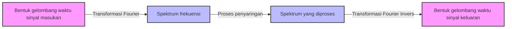

## 1. Pengantar: Keajaiban Menambahkan Gelombang

Lingkungan sekitar kita dipenuhi oleh berbagai **"gelombang"** seperti suara, cahaya, dan gelombang elektromagnetik. Bagaimana jika bentuk gelombang yang pada pandangan pertama terlihat sangat kompleks dan tidak teratur sebenarnya terbentuk dari kombinasi gelombang-gelombang sederhana? Representasi matematika dari fakta menakjubkan ini adalah **"Deret Fourier"** yang diusulkan oleh Joseph Fourier, dan perkembangan selanjutnya, **"Transformasi Fourier"**.

Dalam artikel ini, kita akan mendalami metode matematika yang menarik ini, mulai dari dasar-dasarnya hingga pemahaman intuitif, serta aplikasinya dalam teknologi modern.

## 2. Deret Fourier: Menguraikan Gelombang Periodik

Gagasan dasar dari deret Fourier adalah bahwa "fungsi periodik apa pun dapat diekspresikan sebagai jumlah tak terbatas dari gelombang sinus dan kosinus dengan frekuensi berbeda".

### 2.1 Deret Fourier Bernilai Real

Sebuah fungsi $f(x)$ dengan periode $2\pi$ dapat dijabarkan sebagai berikut.

$$
f(x) = \frac{a_0}{2} + \sum_{n=1}^{\infty} \left( a_n \cos(nx) + b_n \sin(nx) \right)
$$

Di sini, $a_0$, $a_n$, dan $b_n$ disebut **"koefisien Fourier"**, dan ini merepresentasikan seberapa kuat setiap gelombang disertakan. Koefisien-koefisien ini dihitung melalui integral berikut.

$$
a_0 = \frac{1}{\pi} \int_{-\pi}^{\pi} f(x) dx \quad (\text{Komponen DC})
$$
$$
a_n = \frac{1}{\pi} \int_{-\pi}^{\pi} f(x) \cos(nx) dx \quad (\text{Bobot komponen kosinus})
$$
$$
b_n = \frac{1}{\pi} \int_{-\pi}^{\pi} f(x) \sin(nx) dx \quad (\text{Bobot komponen sinus})
$$

### 2.2 Deret Fourier Kompleks

Dengan menggunakan rumus Euler $e^{i\theta} = \cos\theta + i\sin\theta$, deret Fourier dapat ditulis dengan lebih elegan dalam bentuk fungsi eksponensial kompleks.

$$
f(x) = \sum_{n=-\infty}^{\infty} c_n e^{inx}
$$

$$
c_n = \frac{1}{2\pi} \int_{-\pi}^{\pi} f(x) e^{-inx} dx \quad (\text{Koefisien Fourier kompleks})
$$

Bentuk kompleks ini memainkan peran yang sangat penting sebagai jembatan menuju transformasi Fourier yang akan dijelaskan kemudian.

## 3. Transformasi Fourier: Perluasan ke Fungsi Non-Periodik

Deret Fourier hanya dapat diterapkan pada fungsi periodik. Namun, banyak sinyal di dunia nyata (seperti ucapan vokal singkat atau sinyal pulsa satu kali) bersifat non-periodik. Oleh karena itu, dengan mempertimbangkan batas di mana periode mendekati tak terhingga ($T \to \infty$), diturunkanlah **"Transformasi Fourier"**.

### 3.1 Definisi Transformasi Fourier

Transformasi Fourier $\mathcal{F}\{f(t)\}$ dan transformasi Fourier invers untuk suatu fungsi $f(t)$ didefinisikan sebagai berikut.

$$
F(\omega) = \int_{-\infty}^{\infty} f(t) e^{-i\omega t} dt \quad (\text{Transformasi dari domain waktu ke domain frekuensi})
$$

$$
f(t) = \frac{1}{2\pi} \int_{-\infty}^{\infty} F(\omega) e^{i\omega t} d\omega \quad (\text{Transformasi invers dari domain frekuensi ke domain waktu})
$$

Di sini, $t$ merepresentasikan waktu, dan $\omega$ merepresentasikan frekuensi sudut. $F(\omega)$ adalah sebuah fungsi yang menunjukkan seberapa besar komponen frekuensi $\omega$ (amplitudo dan fase) yang terkandung dalam sinyal asli $f(t)$.

### 3.2 Alur Pemrosesan Sinyal

Diagram berikut menunjukkan bagaimana sinyal masukan diproses menggunakan transformasi Fourier.



## 4. Transformasi Fourier Diskrit (DFT) dan Transformasi Fourier Cepat (FFT)

Untuk memproses sinyal dengan komputer, waktu kontinu dan integral dengan panjang tak terhingga harus diganti dengan jumlah titik data diskrit dalam jumlah terbatas. Inilah yang disebut **Transformasi Fourier Diskrit (DFT)**.

$$
X_k = \sum_{n=0}^{N-1} x_n e^{-i \frac{2\pi}{N} k n} \quad \text{untuk } k = 0, 1, \dots, N-1
$$

Selanjutnya, algoritma yang secara dramatis mengurangi kompleksitas komputasi DFT ini dari $O(N^2)$ menjadi $O(N \log N)$ adalah **Transformasi Fourier Cepat (FFT)**. Dengan munculnya FFT, bidang pemrosesan sinyal digital (DSP) telah mengalami perkembangan pesat. Banyak teknologi yang kita kenal, seperti pengenalan suara di ponsel pintar dan kompresi gambar JPEG, mendapat manfaat dari FFT.

```python
import numpy as np
import matplotlib.pyplot as plt

# Buat sumbu waktu (dari 0 hingga 1 detik, frekuensi pengambilan sampel 1000Hz)
t = np.linspace(0, 1, 1000, endpoint=False)

# Sinyal yang mensintesis gelombang sinus 50Hz dan 120Hz
signal = np.sin(2 * np.pi * 50 * t) + 0.5 * np.sin(2 * np.pi * 120 * t)

# Jalankan FFT
fft_result = np.fft.fft(signal)
frequencies = np.fft.fftfreq(len(t), 1/1000)

# Indeks untuk memplot hanya domain frekuensi positif
positive_freqs = frequencies > 0
```

## 5. Kesimpulan

Deret Fourier dan transformasi Fourier adalah beberapa alat paling kuat dalam sains dan teknik, memecah fenomena kompleks menjadi elemen-elemen sederhana. Dengan memandang dunia melalui "lensa" matematika yang mengubah waktu menjadi frekuensi ini, kita dapat menemukan pola tersembunyi dan memproses informasi secara efisien.

Keajaiban menambahkan gelombang ini terus berperan aktif sebagai fondasi teknologi modern saat ini.
