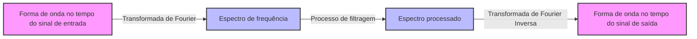

## 1. Introdução: A Magia de Somar Ondas

Nosso ambiente é preenchido por várias **"ondas"** como som, luz e ondas eletromagnéticas. E se as formas de onda que parecem altamente complexas e irregulares à primeira vista fossem, na verdade, constituídas por combinações de ondas simples? A representação matemática desse fato surpreendente é a **"Série de Fourier"** proposta por Joseph Fourier, e seu desenvolvimento posterior, a **"Transformada de Fourier"**.

Neste artigo, aprofundaremos neste fascinante método matemático, desde seus fundamentos até uma compreensão intuitiva, e suas aplicações na tecnologia moderna.

## 2. Série de Fourier: Decompondo Ondas Periódicas

A ideia fundamental da série de Fourier é que "qualquer função periódica pode ser expressa como uma soma infinita de ondas de seno e cosseno com frequências diferentes".

### 2.1 Série de Fourier de Valores Reais

Uma função $f(x)$ com um período de $2\pi$ pode ser expandida da seguinte forma.

$$
f(x) = \frac{a_0}{2} + \sum_{n=1}^{\infty} \left( a_n \cos(nx) + b_n \sin(nx) \right)
$$

Aqui, $a_0$, $a_n$ e $b_n$ são chamados de **"coeficientes de Fourier"**, e representam a intensidade com que cada onda é incluída. Esses coeficientes são calculados pelas seguintes integrais.

$$
a_0 = \frac{1}{\pi} \int_{-\pi}^{\pi} f(x) dx \quad (\text{Componente DC})
$$
$$
a_n = \frac{1}{\pi} \int_{-\pi}^{\pi} f(x) \cos(nx) dx \quad (\text{Peso da componente cosseno})
$$
$$
b_n = \frac{1}{\pi} \int_{-\pi}^{\pi} f(x) \sin(nx) dx \quad (\text{Peso da componente seno})
$$

### 2.2 Série de Fourier Complexa

Usando a fórmula de Euler $e^{i\theta} = \cos\theta + i\sin\theta$, a série de Fourier pode ser escrita de forma mais elegante como funções exponenciais complexas.

$$
f(x) = \sum_{n=-\infty}^{\infty} c_n e^{inx}
$$

$$
c_n = \frac{1}{2\pi} \int_{-\pi}^{\pi} f(x) e^{-inx} dx \quad (\text{Coeficiente de Fourier complexo})
$$

A forma complexa desempenha um papel muito importante como uma ponte para a transformada de Fourier descrita posteriormente.

## 3. Transformada de Fourier: Extensão para Funções Não Periódicas

A série de Fourier só pode ser aplicada a funções periódicas. No entanto, muitos sinais no mundo real (como curtas emissões vocais ou sinais de pulso único) são não periódicos. Portanto, ao considerar o limite em que o período vai para o infinito ($T \to \infty$), deriva-se a **"Transformada de Fourier"**.

### 3.1 Definição da Transformada de Fourier

A transformada de Fourier $\mathcal{F}\{f(t)\}$ e a transformada de Fourier inversa para uma função $f(t)$ são definidas da seguinte maneira.

$$
F(\omega) = \int_{-\infty}^{\infty} f(t) e^{-i\omega t} dt \quad (\text{Transformação do domínio do tempo para o domínio da frequência})
$$

$$
f(t) = \frac{1}{2\pi} \int_{-\infty}^{\infty} F(\omega) e^{i\omega t} d\omega \quad (\text{Transformação inversa do domínio da frequência para o domínio do tempo})
$$

Aqui, $t$ representa o tempo e $\omega$ representa a frequência angular. $F(\omega)$ é uma função que indica a quantidade do componente de frequência $\omega$ (amplitude e fase) que está incluída no sinal original $f(t)$.

### 3.2 Fluxo de Processamento de Sinais

O diagrama a seguir mostra como um sinal de entrada é processado usando a transformada de Fourier.



## 4. Transformada de Fourier Discreta (DFT) e Transformada Rápida de Fourier (FFT)

Para processar sinais com computadores, o tempo contínuo e as integrais com comprimento infinito devem ser substituídos por uma soma de um número finito de pontos de dados discretos. Esta é a **Transformada de Fourier Discreta (DFT)**.

$$
X_k = \sum_{n=0}^{N-1} x_n e^{-i \frac{2\pi}{N} k n} \quad \text{para } k = 0, 1, \dots, N-1
$$

Além disso, um algoritmo que reduz drasticamente a complexidade computacional dessa DFT de $O(N^2)$ para $O(N \log N)$ é a **[Transformada Rápida de Fourier (FFT)](/pt/p/fast-fourier-transform-algorithm/)**. Com o advento da [FFT](/pt/p/fast-fourier-transform-algorithm/), o campo do processamento digital de sinais (DSP) sofreu um desenvolvimento explosivo. Muitas de nossas tecnologias familiares, como reconhecimento de voz em smartphones e compressão de imagens JPEG, se beneficiam da [FFT](/pt/p/fast-fourier-transform-algorithm/).

```python
import numpy as np
import matplotlib.pyplot as plt

# Criar eixo de tempo (de 0 a 1 segundo, frequência de amostragem 1000Hz)
t = np.linspace(0, 1, 1000, endpoint=False)

# Sinal sintetizando ondas senoidais de 50Hz e 120Hz
signal = np.sin(2 * np.pi * 50 * t) + 0.5 * np.sin(2 * np.pi * 120 * t)

# Executar FFT
fft_result = np.fft.fft(signal)
frequencies = np.fft.fftfreq(len(t), 1/1000)

# Índice para plotar apenas o domínio da frequência positiva
positive_freqs = frequencies > 0
```

## 5. Conclusão

A série de Fourier e a transformada de Fourier estão entre as ferramentas mais poderosas na ciência e engenharia, dividindo fenômenos complexos em elementos simples. Ao olhar o mundo através dessa "lente" matemática que converte o tempo em frequência, podemos descobrir padrões ocultos e processar informações de forma eficiente.

A magia de somar ondas continua a desempenhar um papel ativo como a base da tecnologia moderna de hoje.
