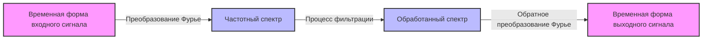

## 1. Введение: Магия сложения волн

Наше окружение наполнено различными **«волнами»**, такими как звук, свет и электромагнитные волны. Что, если формы сигналов, которые на первый взгляд кажутся очень сложными и нерегулярными, на самом деле состоят из комбинаций простых волн? Математическим представлением этого удивительного факта является **«Ряд Фурье»**, предложенный Жозефом Фурье, и его дальнейшее развитие — **«Преобразование Фурье»**.

В этой статье мы глубоко погрузимся в этот увлекательный математический метод, от его основ до интуитивного понимания и применения в современных технологиях.

## 2. Ряд Фурье: Разложение периодических волн

Основная идея ряда Фурье заключается в том, что «любую периодическую функцию можно представить в виде бесконечной суммы синусоидальных и косинусоидальных волн с разными частотами».

### 2.1 Вещественный ряд Фурье

Функцию $f(x)$ с периодом $2\pi$ можно разложить следующим образом.

$$
f(x) = \frac{a_0}{2} + \sum_{n=1}^{\infty} \left( a_n \cos(nx) + b_n \sin(nx) \right)
$$

Здесь $a_0$, $a_n$ и $b_n$ называются **«коэффициентами Фурье»**, и они показывают, насколько сильно включена каждая волна. Эти коэффициенты вычисляются с помощью следующих интегралов.

$$
a_0 = \frac{1}{\pi} \int_{-\pi}^{\pi} f(x) dx \quad (\text{Постоянная составляющая})
$$
$$
a_n = \frac{1}{\pi} \int_{-\pi}^{\pi} f(x) \cos(nx) dx \quad (\text{Вес косинусной составляющей})
$$
$$
b_n = \frac{1}{\pi} \int_{-\pi}^{\pi} f(x) \sin(nx) dx \quad (\text{Вес синусной составляющей})
$$

### 2.2 Комплексный ряд Фурье

Используя формулу Эйлера $e^{i\theta} = \cos\theta + i\sin\theta$, ряд Фурье можно более элегантно записать в виде комплексных экспоненциальных функций.

$$
f(x) = \sum_{n=-\infty}^{\infty} c_n e^{inx}
$$

$$
c_n = \frac{1}{2\pi} \int_{-\pi}^{\pi} f(x) e^{-inx} dx \quad (\text{Комплексный коэффициент Фурье})
$$

Комплексная форма играет очень важную роль в качестве моста к преобразованию Фурье, описанному ниже.

## 3. Преобразование Фурье: Расширение на непериодические функции

Ряд Фурье можно применять только к периодическим функциям. Однако многие сигналы в реальном мире (такие как короткие вокальные высказывания или однократные импульсные сигналы) не являются периодическими. Поэтому при рассмотрении предела, когда период стремится к бесконечности ($T \to \infty$), выводится **«Преобразование Фурье»**.

### 3.1 Определение преобразования Фурье

Преобразование Фурье $\mathcal{F}\{f(t)\}$ и обратное преобразование Фурье для функции $f(t)$ определяются следующим образом.

$$
F(\omega) = \int_{-\infty}^{\infty} f(t) e^{-i\omega t} dt \quad (\text{Преобразование из временной области в частотную})
$$

$$
f(t) = \frac{1}{2\pi} \int_{-\infty}^{\infty} F(\omega) e^{i\omega t} d\omega \quad (\text{Обратное преобразование из частотной области во временную})
$$

Здесь $t$ представляет время, а $\omega$ представляет угловую частоту. $F(\omega)$ — это функция, которая показывает, какая часть компонента частоты $\omega$ (амплитуда и фаза) включена в исходный сигнал $f(t)$.

### 3.2 Процесс обработки сигналов

Следующая диаграмма показывает, как входной сигнал обрабатывается с использованием преобразования Фурье.



## 4. Дискретное преобразование Фурье (ДПФ) и быстрое преобразование Фурье (БПФ)

Для обработки сигналов с помощью компьютеров непрерывное время и интегралы бесконечной длины должны быть заменены суммой конечного числа дискретных точек данных. Это **Дискретное преобразование Фурье (ДПФ)**.

$$
X_k = \sum_{n=0}^{N-1} x_n e^{-i \frac{2\pi}{N} k n} \quad \text{для } k = 0, 1, \dots, N-1
$$

Кроме того, алгоритмом, который кардинально снижает вычислительную сложность этого ДПФ с $O(N^2)$ до $O(N \log N)$, является **Быстрое преобразование Фурье (БПФ)**. С появлением БПФ область цифровой обработки сигналов (ЦОС) пережила взрывное развитие. Многие из наших привычных технологий, такие как распознавание речи на смартфонах и сжатие изображений JPEG, выигрывают от использования БПФ.

```python
import numpy as np
import matplotlib.pyplot as plt

# Создание оси времени (от 0 до 1 секунды, частота дискретизации 1000 Гц)
t = np.linspace(0, 1, 1000, endpoint=False)

# Сигнал, синтезирующий синусоидальные волны 50 Гц и 120 Гц
signal = np.sin(2 * np.pi * 50 * t) + 0.5 * np.sin(2 * np.pi * 120 * t)

# Выполнение БПФ
fft_result = np.fft.fft(signal)
frequencies = np.fft.fftfreq(len(t), 1/1000)

# Индекс для построения только положительной частотной области
positive_freqs = frequencies > 0
```

## 5. Заключение

Ряд Фурье и преобразование Фурье являются одними из самых мощных инструментов в науке и инженерии, разбивая сложные явления на простые элементы. Глядя на мир через эту математическую «линзу», преобразующую время в частоту, мы можем обнаруживать скрытые закономерности и эффективно обрабатывать информацию.

Магия сложения волн продолжает играть активную роль в качестве основы современных технологий.
