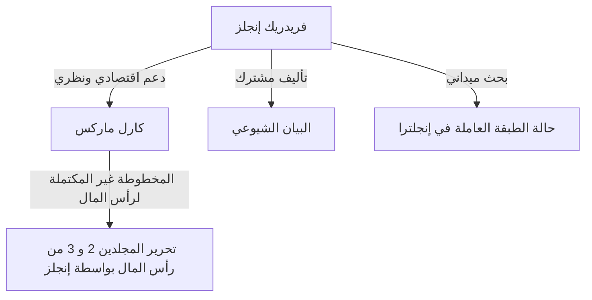

## مقدمة: الوجه الحقيقي للعملاق المخفي في ظل التاريخ

لا يوجد أحد لا يعرف اسم كارل ماركس. ومع ذلك، فإن حليفه الفكري، والذي استمر في دعم الأساس النظري والمادي لنقده للرأسمالية، "فريدريك إنجلز (Friedrich Engels)"، غالباً ما يختفي في ظل ماركس. لم يكن إنجلز مجرد راعٍ أو محرر. لقد كان هو نفسه مُنظِّراً بارزاً، وصحفياً، وقبل كل شيء، شخصية ذات مكانة فريدة جداً تبدو متناقضة: "رأسمالي وثوري في نفس الوقت".

في هذا المقال، سنتعمق في حياة إنجلز وفلسفته، لا سيما دوره الحاسم في تأسيس المادية التاريخية، والواقع الذي واجهه مع الطبقة العاملة في القرن التاسع عشر، من منظور تاريخي واقتصادي وفلسفي. تجسد حياته النور والظلام في فجر الرأسمالية الحديثة، ولا تزال أفكاره تسلط ضوءاً ساطعاً على فهم تناقضات المجتمع الحديث.

## الفصل الأول: عائلة برجوازية وتمرد الشباب

### 1. بصفته ابنًا لمالك مصنع غزل ثري
ولد فريدريك إنجلز في 28 نوفمبر 1820 في بارمن، مملكة بروسيا (ألمانيا الحالية). كان والده مالك مصنع غزل ثريًا وتقويًا صارمًا. وباعتباره طفلاً للطبقة البرجوازية، كان من المتوقع أن يسير إنجلز على خطى والده كرجل أعمال في المستقبل. ومع ذلك، سرعان ما بدأ في التمرد على السلطة الدينية والبيئة الأسرية الاستبدادية.

### 2. اللقاء مع الهيغليين الشباب
أُجبر إنجلز على ترك المدرسة الثانوية (الجيمنازيوم) وبدأ العمل كمتدرب في شركة تجارية، لكن قلبه كان يتجه دائمًا نحو الفلسفة والأدب. أثناء خدمته العسكرية في برلين، حضر محاضرات في جامعة برلين وانضم إلى الدائرة الراديكالية "للهيغليين الشباب". هنا تعلم تفسير ديالكتيك هيجل بشكل جذري واستخدامه كسلاح لانتقاد الدولة والدين القائمين.

## الفصل الثاني: واقع مانشستر — "حالة الطبقة العاملة في إنجلترا"

### 1. إلى مركز الثورة الصناعية
في عام 1842، ذهب إنجلز إلى مانشستر في إنجلترا للعمل في شركة إرمن وإنجلز، وهي شراكة لشركة والده. كانت مانشستر في ذلك الوقت تُعرف باسم "مصنع العالم" وكانت مدينة في طليعة الثورة الصناعية. ومع ذلك، فإن ما شاهده إنجلز هناك كان الواقع المأساوي الذي لا يمكن تصوره للطبقة العاملة خلف تراكم الثروة.

### 2. اللقاء مع ماري بيرنز واستكشاف الأحياء الفقيرة
خلال هذه الفترة، التقى بعاملة أيرلندية تُدعى ماري بيرنز وبنى معها علاقة استمرت مدى الحياة. بتوجيه منها، أخفى إنجلز هويته كابن لمالك مصنع وتوغل عميقًا في الأحياء السكنية (الأحياء الفقيرة) للعمال. بيئات معيشية غير صحية، ساعات عمل طويلة، عمالة الأطفال، وأمراض متفشية. لقد سجل هذا الواقع الجهنمي بعين صحفي بارد وغضب مشتعل.

### 3. ولادة الروبورتاج التاريخي
بناءً على هذا البحث الميداني، نُشر كتاب "حالة الطبقة العاملة في إنجلترا" في عام 1845. لم يكن هذا العمل مجرد كتاب اتهام، بل أصبح تحفة رائدة في علم الاجتماع والاقتصاد، كاشفاً عن الآلية التي يستغل بها النظام الرأسمالي العمال هيكلياً ويعيد إنتاج الفقر.

## الفصل الثالث: التحالف المصيري مع ماركس

### 1. لم الشمل في باريس والتوافق الفكري
في عام 1844، التقى إنجلز مرة أخرى بكارل ماركس في باريس. عندما التقيا من قبل، كان موقف ماركس بارداً، لكن هذه المرة كان الأمر مختلفاً. كان ماركس، الذي قرأ مقال إنجلز "مخطط نقد الاقتصاد السياسي"، معجباً بفهم إنجلز العميق للاقتصاد. تحدث الاثنان طوال الليل في مقهى في باريس وتأكدا من أن أفكارهما متطابقة تماماً. من هنا، بدأت شراكة فكرية قوية لا مثيل لها في التاريخ.

### 2. الدعم الاقتصادي و"الحياة المزدوجة"
كان ماركس منظراً لامعاً، لكنه كان يفتقر إلى مهارات الحياة وكان دائمًا في حالة فقر مدقع. قرر إنجلز أن يقبل بحياة "رجل أعمال برجوازي" تتناقض مع أيديولوجيته حتى يتمكن ماركس من التركيز على كتابة "رأس المال". عمل في شركة مانشستر واستمر في إرسال معظم دخله كنفقات معيشية لعائلة ماركس. لقد واصل هذه "الحياة المزدوجة" القاسية لما يقرب من 20 عامًا، حيث كان يتصرف كرأسمالي بارد خلال النهار ويكتب من أجل الثورة في الليل.

## الفصل الرابع: تأسيس المادية التاريخية والعمل المشترك

### 1. "الأيديولوجيا الألمانية" والمادية التاريخية
شارك ماركس وإنجلز في كتابة "الأيديولوجيا الألمانية"، وانتقدا بشدة مثالية الهيغليين الشباب. هنا أسسوا الأطروحة الأساسية للمادية التاريخية: "ليس وعي الناس هو الذي يحدد وجودهم، بل على العكس، وجودهم الاجتماعي هو الذي يحدد وعيهم". هذا الاكتشاف بأن القوة الدافعة وراء التاريخ ليست الروح أو الأفكار، بل أنماط الإنتاج المادي والصراع الطبقي، أحدث تحولاً نموذجياً في العلوم الاجتماعية.

### 2. صياغة "البيان الشيوعي"
في عام 1848، بينما كانت عواصف الثورة تجتاح جميع أنحاء أوروبا، نشر الاثنان "البيان الشيوعي". هذا الكتيب، الذي يبدأ بالجملة الافتتاحية الشهيرة "تاريخ كل مجتمع موجود حتى الآن هو تاريخ الصراعات الطبقية"، أعلن بقوة المهمة التاريخية للبروليتاريا (الطبقة العاملة) وأصبح برنامجًا للحركة الشيوعية.

## الفصل الخامس: اكتمال "رأس المال" وحياة إنجلز اللاحقة

### 1. وفاة ماركس وترتيب المخطوطات
في عام 1883، توفي ماركس بعد نشر المجلد الأول فقط من "رأس المال". ما تركه وراءه كان جبلاً من الملاحظات والمسودات غير المنظمة المكتوبة بخط يد سيء. تخلى إنجلز عن جميع أبحاثه الخاصة (مثل ديالكتيك الطبيعة) وكرس كل سنواته الأخيرة لفك تشفير وتحرير مخطوطات صديقه المفضل.

### 2. نشر المجلدين الثاني والثالث
أثناء مكافحته لضعف البصر، فهم إنجلز نية ماركس ونشر المجلد الثاني (1885) والمجلد الثالث (1894) من "رأس المال"، مع سد الفجوات في المنطق. إن النصف الأخير من "رأس المال" الذي نقرأه اليوم لم يكن ليوجد لولا أعمال التحرير المتفانية لإنجلز.

## الخاتمة: ما يطرحه إنجلز على العصر الحديث

كره فريدريك إنجلز نفاق الطبقة البرجوازية التي ينتمي إليها، وكرس حياته وثروته لتحرير البروليتاريا. حياته هي مثال نادر حيث تزامنت النظرية والممارسة، والفكر والعمل بمعجزة.

نحن نواجه اليوم أشكالاً جديدة من التناقضات الرأسمالية، مثل تطور الذكاء الاصطناعي وتقنيات الأتمتة، واتساع الفجوات بسبب العولمة. لا تزال آلية "الاستغلال الهيكلي" التي وجدها إنجلز في مانشستر في القرن التاسع عشر موجودة في مجتمعنا اليوم بأشكال مختلفة.

إن بصيرته العميقة وروح التضامن العاطفي مع محنة العمال لا تقتصر على كتب التاريخ. فهي لا تزال تتحدث إلينا اليوم كسلاح فكري قوي لتصور مجتمع أكثر عدلاً ومساواة.
