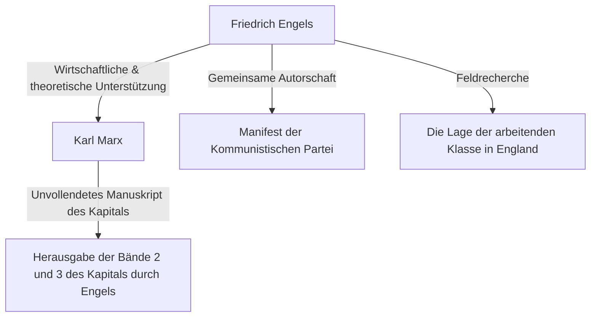

## Einleitung: Das wahre Gesicht des Giganten im Schatten der Geschichte

Es gibt wohl niemanden, der den Namen Karl Marx nicht kennt. Doch der Name seines intellektuellen Verbündeten, der die theoretische und physische Grundlage seiner Kapitalismuskritik kontinuierlich unterstützte, 'Friedrich Engels', bleibt oft im Schatten von Marx verborgen. Engels war nicht einfach nur ein Mäzen oder Redakteur. Er war selbst ein herausragender Theoretiker, Journalist und vor allem eine Person mit einer scheinbar widersprüchlichen, äußerst einzigartigen Position: "ein Kapitalist und gleichzeitig ein Revolutionär".

In diesem Artikel werden wir Engels' Leben und seine Philosophie, insbesondere seine entscheidende Rolle bei der Etablierung des historischen Materialismus sowie die Realität der Arbeiterklasse im 19. Jahrhundert, mit der er konfrontiert war, aus historischen, ökonomischen und philosophischen Perspektiven tiefgründig betrachten. Sein Leben verkörpert Licht und Schatten in der Frühzeit des modernen Kapitalismus, und seine Ideen strahlen auch heute noch ein starkes Licht bei der Entschlüsselung der Widersprüche der modernen Gesellschaft aus.

## Kapitel 1: Bürgerliches Elternhaus und jugendliche Rebellion

### 1. Als Sohn eines wohlhabenden Spinnereibesitzers
Am 28. November 1820 wurde Friedrich Engels in Barmen im Königreich Preußen (heute Deutschland) geboren. Sein Vater war ein wohlhabender Spinnereibesitzer und ein strenger Pietist. Als Kind des Bürgertums wurde von Engels erwartet, in die Fußstapfen seines Vaters als Geschäftsmann zu treten. Früh jedoch entwickelte er eine Abneigung gegen die religiöse Autorität und das autoritäre familiäre Umfeld.

### 2. Begegnung mit den Junghegelianern
Obwohl er gezwungen war, das Gymnasium vorzeitig zu verlassen und als Lehrling in einem Handelshaus zu arbeiten, galten seine Gedanken stets der Philosophie und Literatur. Während seines Militärdienstes in Berlin besuchte er Vorlesungen an der Universität Berlin und schloss sich dem radikalen Kreis der 'Junghegelianer' an. Hier lernte er, die Dialektik der Hegelschen Philosophie radikal zu interpretieren und als Waffe zur Kritik an Staat und Religion zu nutzen.

## Kapitel 2: Die Realität in Manchester — 'Die Lage der arbeitenden Klasse in England'

### 1. Ins Zentrum der industriellen Revolution
1842 reiste Engels nach Manchester, England, um in der Firma Ermen & Engels, an der sein Vater als Partner beteiligt war, zu arbeiten. Manchester wurde damals als die "Werkstatt der Welt" bezeichnet und war die führende Stadt der industriellen Revolution. Doch was Engels dort sah, war die unvorstellbar elende Realität der Arbeiterklasse, die sich hinter der Anhäufung von Reichtum verbarg.

### 2. Begegnung mit Mary Burns und Erkundung der Slums
In dieser Zeit lernte er die irische Arbeiterin Mary Burns kennen, mit der er eine lebenslange Beziehung aufbaute. Unter ihrer Führung wagte sich Engels, seine Identität als Sohn eines Fabrikbesitzers verbergend, tief in die Wohnviertel der Arbeiter (Slums) vor. Unhygienische Wohnverhältnisse, extrem lange Arbeitszeiten, Kinderarbeit, grassierende Epidemien. Er hielt diese höllische Realität mit den kühlen Augen eines Journalisten und mit brennender rechtschaffener Empörung fest.

### 3. Die Geburt der historischen Reportage
Basierend auf dieser Feldrecherche wurde 1845 'Die Lage der arbeitenden Klasse in England' veröffentlicht. Dieses Werk war nicht nur ein Buch der Anklage, sondern wurde zu einem bahnbrechenden Meisterwerk der Soziologie und Ökonomie, das den Mechanismus aufdeckte, wie das System des Kapitalismus die Arbeiter strukturell ausbeutet und Armut reproduziert.

## Kapitel 3: Die schicksalhafte Allianz mit Marx

### 1. Wiedersehen und Geistesverwandtschaft in Paris
1844 traf Engels Karl Marx in Paris wieder. Als sie sich zuvor einmal begegnet waren, war Marx eher kühl gewesen, doch dieses Mal war es anders. Marx hatte Engels' Beitrag "Umrisse zu einer Kritik der Nationalökonomie" gelesen und war tief beeindruckt von dessen tiefem Verständnis der Ökonomie. Die beiden unterhielten sich die ganze Nacht in einem Pariser Café und stellten fest, dass ihre Ideen völlig übereinstimmten. Von hier an begann eine in der Geschichte beispiellose, starke intellektuelle Zusammenarbeit.

### 2. Finanzielle Unterstützung und 'Doppelleben'
Marx war ein herausragender Theoretiker, aber er hatte fast keine Fähigkeiten, seinen Lebensunterhalt zu bestreiten, und lebte ständig in extremer Armut. Engels fasste den Entschluss, sich einem Leben als "bürgerlicher Geschäftsmann" zu fügen, das seiner eigenen Ideologie widersprach, damit Marx sich auf das Schreiben von 'Das Kapital' konzentrieren konnte. Er arbeitete im Handelsunternehmen in Manchester und schickte einen Großteil seines Einkommens als Lebensunterhalt an die Familie Marx. Dieses harte "Doppelleben", bei dem er sich tagsüber als kühler Kapitalist verhielt und nachts für die Revolution schrieb, führte er fast 20 Jahre lang fort.

## Kapitel 4: Etablierung des historischen Materialismus und gemeinsame Arbeit

### 1. 'Die deutsche Ideologie' und der historische Materialismus
Marx und Engels schrieben gemeinsam 'Die deutsche Ideologie' und kritisierten den Idealismus der Junghegelianer gründlich. Hier etablierten sie die Grundthese des historischen Materialismus: "Es ist nicht das Bewusstsein der Menschen, das ihr Sein, sondern umgekehrt ihr gesellschaftliches Sein, das ihr Bewusstsein bestimmt." Diese Entdeckung, dass die treibende Kraft der Geschichte nicht Geist oder Idee, sondern die materielle Produktionsweise und der Klassenkampf ist, brachte einen Paradigmenwechsel in den Sozialwissenschaften.

### 2. Der Entwurf des 'Manifests der Kommunistischen Partei'
1848, während Stürme der Revolution über ganz Europa fegten, veröffentlichten die beiden das 'Manifest der Kommunistischen Partei'. Diese Broschüre, die mit den berühmten Worten "Die Geschichte aller bisherigen Gesellschaft ist die Geschichte von Klassenkämpfen" beginnt, verkündete kraftvoll die historische Mission des Proletariats (der Arbeiterklasse) und wurde zum Programm der kommunistischen Bewegung.

## Kapitel 5: Vollendung von 'Das Kapital' und Engels' spätere Jahre

### 1. Marx' Tod und die Ordnung der Manuskripte
1883 verstarb Marx, nachdem er nur den ersten Band von 'Das Kapital' veröffentlicht hatte. Was er hinterließ, war ein Berg von umfangreichen, ungeordneten Notizen und Entwürfen, die mit unleserlicher Handschrift verfasst waren. Engels gab alle seine eigenen Forschungen (wie die Dialektik der Natur) auf und widmete den Rest seines Lebens der Entzifferung und Bearbeitung der Manuskripte seines besten Freundes.

### 2. Veröffentlichung von Band 2 und 3
Während er mit nachlassender Sehkraft kämpfte, erfasste Engels Marx' Absichten, füllte logische Lücken und veröffentlichte Band 2 (1885) und Band 3 (1894) von 'Das Kapital'. Die zweite Hälfte von 'Das Kapital', die wir heute lesen, hätte ohne Engels' aufopferungsvolle redaktionelle Arbeit nicht existieren können.

## Fazit: Was Engels der Gegenwart zu sagen hat

Friedrich Engels verabscheute die Heuchelei der Bourgeoisie, der er selbst angehörte, und widmete sein Leben und sein Vermögen der Befreiung des Proletariats. Sein Leben ist ein seltenes Beispiel dafür, wie Theorie und Praxis, Gedanke und Tat auf wundersame Weise übereinstimmen.

Wir stehen heute vor neuen Formen kapitalistischer Widersprüche, wie der Entwicklung von KI und Automatisierungstechnologien sowie der Ausweitung von Ungleichheit durch die Globalisierung. Der Mechanismus der "strukturellen Ausbeutung", den Engels im Manchester des 19. Jahrhunderts entdeckte, existiert in veränderter Form noch immer in unserer heutigen Gesellschaft.

Seine tiefen Einsichten und sein Geist leidenschaftlicher Solidarität mit der Not der Arbeiter bleiben nicht in den Geschichtsbüchern gefangen. Sie sprechen auch heute noch als mächtige intellektuelle Waffe zu uns, um eine gerechtere und gleichere Gesellschaft zu entwerfen.
