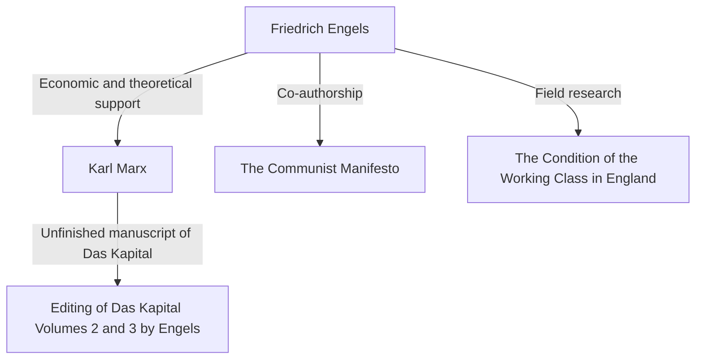

## Introduction: The True Face of a Giant Hidden in the Shadows of History

There is likely no one who does not know the name Karl Marx. However, his ideological ally, "Friedrich Engels," who continued to support the theoretical and physical foundation of his critique of capitalism, is often hidden in Marx's shadow. Engels was not merely a patron or editor. He himself was an outstanding theorist, a journalist, and above all, a figure with a seemingly contradictory and extremely unique position of being a "capitalist while also being a revolutionary."

In this article, we delve deeply into Engels' life and philosophy, particularly his decisive role in establishing historical materialism, and the reality of the 19th-century working class he faced, from historical, economic, and philosophical perspectives. His life embodies the light and shadow of the dawn of modern capitalism, and his thoughts still emit a strong light when interpreting the contradictions of modern society.

## Chapter 1: A Bourgeois Family and Youthful Rebellion

### 1. As the Son of a Wealthy Spinning Mill Owner
On November 28, 1820, Friedrich Engels was born in Barmen, Kingdom of Prussia (present-day Germany). His father was a wealthy spinning mill owner and a strict Pietist. As a child of the bourgeoisie, Engels was expected to succeed his father as a businessman in the future. However, he developed a rebellion against religious authority and the authoritarian family environment from an early age.

### 2. Encounter with the Young Hegelians
Engels was forced to drop out of the Gymnasium and began working as an apprentice at a trading firm, but his heart was always directed toward philosophy and literature. During his military service in Berlin, he attended lectures at the University of Berlin and joined the radical circle of the "Young Hegelians." Here, he learned to interpret Hegel's dialectic radically and use it as a weapon to critique the current state and religion.

## Chapter 2: The Reality of Manchester — "The Condition of the Working Class in England"

### 1. To the Center of the Industrial Revolution
In 1842, Engels went to Manchester, England, to work at Ermen & Engels, a firm co-owned by his father's company. Manchester at the time was known as the "workshop of the world" and was a city at the forefront of the Industrial Revolution. However, what Engels saw there was the unimaginable and miserable reality of the working class behind the accumulation of wealth.

### 2. Encounter with Mary Burns and Exploration of the Slums
During this period, he met Mary Burns, an Irish working-class woman, and built a lifelong relationship with her. Guided by her, Engels hid his identity as the son of a factory owner and stepped into the depths of the workers' residential areas (slums). Unsanitary living conditions, long working hours, child labor, and rampant epidemics. He recorded this hellish reality with the cold eye of a journalist and burning righteous indignation.

### 3. The Birth of Historical Reportage
Based on this field research, "The Condition of the Working Class in England" was published in 1845. This work became a pioneering masterpiece in sociology and economics, revealing not just as a book of accusation, but the mechanism by which the capitalist system structurally exploits workers and reproduces poverty.

## Chapter 3: The Fateful Alliance with Marx

### 1. Reunion in Paris and Hitting It Off
In 1844, Engels reunited with Karl Marx in Paris. Marx had been cold toward him when they previously met, but it was different this time. Having read the "Outlines of a Critique of Political Economy" contributed by Engels, Marx was impressed by Engels' deep understanding of economics. The two talked through the night at a Parisian cafe and confirmed that their thoughts were in complete agreement. From here began a strong intellectual cooperation unprecedented in history.

### 2. Economic Support and the "Double Life"
Marx was an excellent theorist, but he had almost no life skills and was constantly in extreme poverty. Engels resolved to settle for a life as a "bourgeois businessman," which was contrary to his own ideology, so that Marx could focus on writing "Das Kapital". He worked at the trading firm in Manchester and continued to send much of his income to support the Marx family's living expenses. He continued this harsh "double life"—acting as a cold-blooded capitalist during the day and writing for the revolution at night—for nearly 20 years.

## Chapter 4: The Establishment of Historical Materialism and Collaborative Work

### 1. "The German Ideology" and Historical Materialism
Marx and Engels co-authored "The German Ideology" and thoroughly criticized the idealism of the Young Hegelians. Here, they established the basic thesis of historical materialism: "It is not the consciousness of men that determines their existence, but their social existence that determines their consciousness." The discovery that the driving force moving history is not spirit or ideas, but material modes of production and class struggle, brought a paradigm shift to the social sciences.

### 2. Drafting of "The Communist Manifesto"
In 1848, amidst a storm of revolutions sweeping across Europe, the two published "The Communist Manifesto." Beginning with the famous opening phrase, "The history of all hitherto existing society is the history of class struggles," this pamphlet powerfully declared the historical mission of the proletariat (working class) and became the program of the communist movement.

## Chapter 5: The Completion of "Das Kapital" and Engels' Later Life

### 1. Marx's Death and Organizing the Posthumous Manuscripts
In 1883, Marx passed away with only the first volume of "Das Kapital" published. What remained was a mountain of voluminous, unorganized notebooks and drafts written in bad handwriting. Engels threw away all of his own research (such as the Dialectics of Nature) and devoted his entire later life to deciphering and editing his best friend's posthumous manuscripts.

### 2. Publication of Volumes 2 and 3
Fighting declining eyesight, Engels grasped Marx's intentions, filled in the logical gaps, and published Volume 2 (1885) and Volume 3 (1894) of "Das Kapital". The latter half of "Das Kapital" that we read today could not have existed without Engels' dedicated editing work.

## Conclusion: What Engels Asks of Us Today

Friedrich Engels hated the hypocrisy of the bourgeois class to which he belonged and devoted his life and fortune to the liberation of the proletariat. His life is a rare example where theory and practice, thought and action miraculously aligned.

Today, we face new forms of capitalist contradictions, such as the development of AI and automation technologies, and the expansion of inequality due to globalization. The mechanism of "structural exploitation" that Engels found in 19th-century Manchester still exists in our society in different forms.

The deep insights he left behind and his spirit of passionate solidarity with the plight of workers are not confined to history textbooks. They continue to speak to us today as a powerful intellectual weapon for envisioning a fairer and more equal society.
