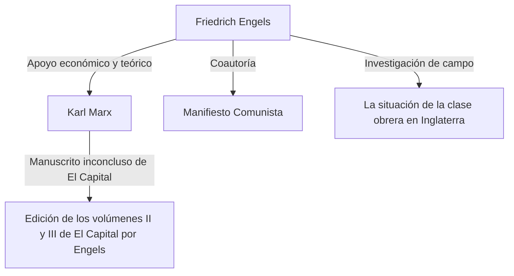

## Introducción: El verdadero rostro del gigante escondido a la sombra de la historia

Nadie desconoce el nombre de Karl Marx. Sin embargo, el nombre de su aliado ideológico, "Friedrich Engels", quien sostuvo de forma constante la base teórica y material de su crítica al capitalismo, a menudo queda oculto a la sombra de Marx. Engels no fue simplemente un mecenas o un editor. Él mismo fue un destacado teórico, periodista y, sobre todo, una figura con una posición extremadamente peculiar que parecía contradictoria: "un revolucionario siendo capitalista".

En este artículo, profundizaremos desde una perspectiva histórica, económica y filosófica en la vida y filosofía de Engels, especialmente en su papel decisivo en el establecimiento del materialismo histórico y en la realidad de la clase obrera del siglo XIX que él enfrentó. Su vida encarna las luces y sombras en los albores del capitalismo moderno, y su pensamiento sigue irradiando una fuerte luz al momento de descifrar las contradicciones de la sociedad contemporánea.

## Capítulo 1: La familia de la burguesía y la rebelión de juventud

### 1. Como hijo de un rico dueño de fábricas de hilados
El 28 de noviembre de 1820, en Barmen, Reino de Prusia (actual Alemania), nació Friedrich Engels. Su padre era un adinerado propietario de una fábrica textil y un estricto pietista. Como hijo privilegiado de la clase burguesa, se esperaba de Engels que sucediera a su padre como hombre de negocios en el futuro. Sin embargo, desde muy temprano comenzó a albergar un rechazo hacia la autoridad religiosa y el ambiente familiar autoritario.

### 2. El encuentro con los Jóvenes Hegelianos
Aunque fue obligado a abandonar el Gymnasium (escuela secundaria) y comenzó a trabajar como aprendiz en una firma comercial, el corazón de Engels siempre se inclinó hacia la filosofía y la literatura. Durante su servicio militar en Berlín, asistió a las clases de la Universidad de Berlín y se unió al círculo radical de los "Jóvenes Hegelianos". Aquí aprendió a interpretar radicalmente la dialéctica de la filosofía de Hegel y a utilizarla como un arma para criticar el Estado y la religión del statu quo.

## Capítulo 2: La realidad de Mánchester — "La situación de la clase obrera en Inglaterra"

### 1. Hacia el centro de la Revolución Industrial
En 1842, Engels viajó a Mánchester, Inglaterra, para trabajar en la empresa Ermen & Engels, donde la compañía de su padre era socia. Mánchester en aquella época era conocida como la "fábrica del mundo" y era la ciudad a la vanguardia de la Revolución Industrial. Sin embargo, lo que Engels presenció allí, detrás de la acumulación de riqueza, fue la realidad de una miseria inimaginable de la clase obrera.

### 2. El encuentro con Mary Burns y la exploración de los barrios marginales
Durante este período, conoció a Mary Burns, una trabajadora de ascendencia irlandesa con quien establecería una relación que duraría toda la vida. Guiado por ella, Engels ocultó su identidad como hijo del dueño de la fábrica y se adentró en las profundidades de los distritos residenciales de los trabajadores (barrios bajos o slums). Entornos de vida insalubres, largas horas de trabajo, trabajo infantil y epidemias rampantes. Él registró esta realidad infernal con el ojo frío de un periodista y con una indignación ardiente.

### 3. El nacimiento de un reportaje histórico
Basado en esta investigación de campo, en 1845 se publicó "La situación de la clase obrera en Inglaterra". Esta obra no se limitó a ser un mero libro de denuncia, sino que se convirtió en una obra maestra pionera de la sociología y la economía que reveló el mecanismo a través del cual el sistema capitalista explota estructuralmente a los trabajadores y reproduce la pobreza.

## Capítulo 3: La alianza fatídica con Marx

### 1. Reencuentro en París y afinidad
En 1844, Engels se reencontró con Karl Marx en París. Aunque Marx había tenido una actitud fría la primera vez que se conocieron, esta vez fue diferente. Marx había leído un "Esbozo de una crítica de la economía política" aportado por Engels, y quedó impresionado por su profunda comprensión de la economía. Los dos hablaron toda la noche en un café parisino, confirmando que sus ideas coincidían plenamente. A partir de aquí comenzó una relación de cooperación intelectual sólida, sin precedentes en la historia.

### 2. Apoyo económico y "Doble vida"
Marx fue un excelente teórico, pero carecía por completo de capacidad para ganarse la vida, estando siempre en un estado de extrema pobreza. Engels decidió resignarse a una vida como "empresario burgués", contrario a su propia ideología, para que Marx pudiera concentrarse en la redacción de "El Capital". Trabajó en la empresa de Mánchester y continuó enviando gran parte de sus ingresos como gastos de subsistencia para la familia Marx. Mantuvo esta dura "doble vida" durante casi 20 años: comportándose como un capitalista frío y calculador durante el día, y escribiendo para la revolución por la noche.

## Capítulo 4: El establecimiento del materialismo histórico y el trabajo conjunto

### 1. "La ideología alemana" y el materialismo histórico
Marx y Engels coescribieron "La ideología alemana", criticando a fondo el idealismo de los Jóvenes Hegelianos. Aquí establecieron la tesis fundamental del materialismo histórico: "No es la conciencia de los hombres la que determina su ser, sino por el contrario, es su ser social el que determina su conciencia". El descubrimiento de que la fuerza motriz de la historia no es el espíritu o los ideales, sino el modo de producción material y la lucha de clases, trajo un cambio de paradigma en las ciencias sociales.

### 2. La redacción del "Manifiesto Comunista"
En 1848, mientras las tormentas revolucionarias azotaban toda Europa, los dos presentaron al mundo el "Manifiesto Comunista". Este panfleto, que comienza con la famosa frase "La historia de todas las sociedades que han existido hasta ahora es la historia de la lucha de clases", declaró enérgicamente la misión histórica del proletariado (la clase obrera) y se convirtió en el programa del movimiento comunista.

## Capítulo 5: La finalización de "El Capital" y los últimos años de Engels

### 1. La muerte de Marx y la organización de los manuscritos póstumos
En 1883, Marx falleció habiendo publicado únicamente el primer volumen de "El Capital". Lo que dejó atrás fue una montaña de extensas notas no organizadas y borradores escritos con mala caligrafía. Engels abandonó todos sus propios estudios (como la Dialéctica de la Naturaleza) y dedicó todos sus últimos años a descifrar y editar los manuscritos póstumos de su mejor amigo.

### 2. Publicación de los volúmenes II y III
Luchando contra la pérdida de visión, Engels comprendió las intenciones de Marx y, llenando los vacíos lógicos, publicó el Volumen II (1885) y el Volumen III (1894) de "El Capital". La última parte de "El Capital" que leemos hoy no podría haber existido sin el dedicado trabajo de edición de Engels.

## Conclusión: Lo que Engels nos cuestiona hoy en día

Friedrich Engels odiaba la hipocresía de la clase burguesa a la que pertenecía y dedicó su vida y fortuna a la emancipación del proletariado. Su vida es un raro ejemplo en el que la teoría y la práctica, el pensamiento y la acción, coincidieron milagrosamente.

Hoy en día, nos enfrentamos a nuevas formas de contradicciones capitalistas, como el desarrollo de la inteligencia artificial, las tecnologías de automatización y la creciente desigualdad debida a la globalización. El mecanismo de "explotación estructural" que Engels descubrió en Mánchester en el siglo XIX todavía existe en nuestra sociedad bajo formas cambiadas.

Las profundas percepciones que dejó atrás y su espíritu de apasionada solidaridad con la difícil situación de los trabajadores no son algo que deba quedarse en los libros de texto de historia. Como una poderosa arma intelectual para concebir una sociedad más justa e igualitaria, continúan hablándonos hoy en día.
